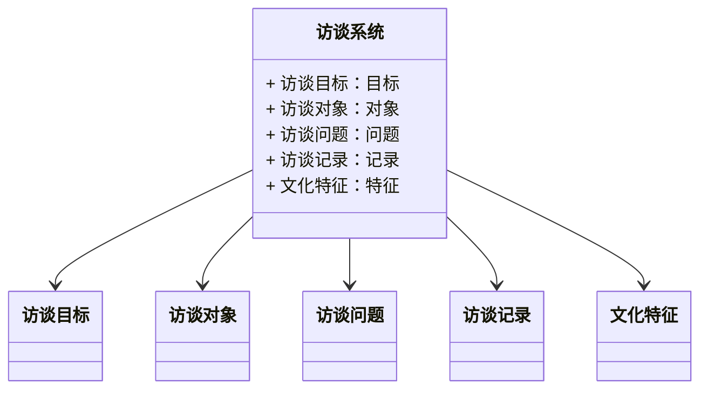
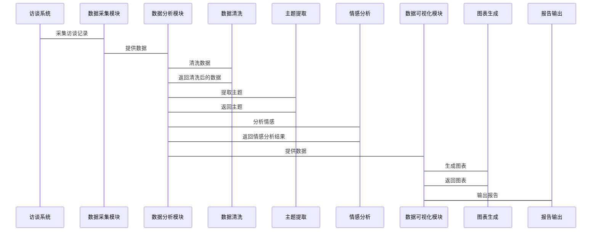

                 


# 费雪的管理层访谈技巧：洞察公司文化

> 关键词：管理层访谈，公司文化，费雪技巧，领导力，组织行为学，数据分析

> 摘要：本文深入探讨了费雪的管理层访谈技巧及其在洞察公司文化中的应用。通过分析访谈的核心概念、算法原理、系统架构和实际案例，详细阐述了如何通过有效的访谈手段揭示组织的深层文化特征，帮助领导者做出更明智的决策。

---

## 第1章: 管理层访谈的定义与背景

### 1.1 管理层访谈的定义
#### 1.1.1 访谈的定义与特点
- **定义**：管理层访谈是一种通过与公司高层管理人员进行一对一或小组访谈，以获取公司战略、管理风格、文化特征等信息的调研方法。
- **特点**：
  - 高效性：直接获取高层管理者的真实想法。
  - 深入性：通过深入对话挖掘公司文化的本质。
  - 互动性：访谈过程需要访谈者与被访谈者之间的高度互动。

#### 1.1.2 管理层访谈的独特性
- **独特性**：
  - 访谈对象的独特性：仅限于公司高层管理者。
  - 访谈内容的独特性：涉及公司战略、管理决策等关键问题。
  - 访谈方式的独特性：通常采用半结构化或非结构化访谈。

#### 1.1.3 费雪访谈技巧的核心要素
- **核心要素**：
  - 准备充分：提前制定访谈目标和提纲。
  - 技巧娴熟：掌握开放式提问、倾听与反馈等技巧。
  - 分析深入：通过访谈内容挖掘公司文化的深层特征。

### 1.2 访谈的目的与背景
#### 1.2.1 访谈的目的与意义
- **目的**：
  - 收集公司战略信息。
  - 了解公司管理风格。
  - 探讨公司文化特征。
- **意义**：
  - 为公司战略决策提供依据。
  - 评估公司管理团队的凝聚力。
  - 为公司文化建设提供方向。

#### 1.2.2 费雪访谈技巧的历史发展
- **历史发展**：
  - 起源于20世纪50年代的管理学研究。
  - 在20世纪80年代被系统化为一种管理调研方法。
  - 21世纪初，费雪提出了更具操作性的访谈技巧。

#### 1.2.3 访谈在现代管理中的应用
- **应用**：
  - 公司并购前的尽职调查。
  - 公司文化建设的评估与优化。
  - 高层管理者选拔与评估。

### 1.3 访谈的核心价值
#### 1.3.1 信息收集的准确性
- **准确性**：
  - 通过直接对话获取第一手信息。
  - 减少信息传递过程中的失真。

#### 1.3.2 关系建立的重要性
- **重要性**：
  - 建立信任关系是访谈成功的前提。
  - 良好的关系有助于获取更真实的信息。

#### 1.3.3 公司文化洞察的深度
- **深度**：
  - 通过访谈挖掘公司文化的深层特征。
  - 了解公司战略与文化的契合度。

### 1.4 本章小结
#### 1.4.1 本章内容回顾
- 本章介绍了管理层访谈的定义、特点、目的与背景，以及费雪访谈技巧的核心要素。
- 强调了访谈在现代管理中的重要性。

#### 1.4.2 下一章的展望
- 下一章将深入探讨费雪访谈技巧的核心理念，包括方法论、问题设计和深度分析等方面。

---

## 第2章: 费雪访谈技巧的核心理念

### 2.1 费雪访谈方法论
#### 2.1.1 费雪访谈的三步法
- **三步法**：
  1. **建立信任关系**：通过初步沟通建立信任。
  2. **深入探讨问题**：通过开放式提问深入探讨公司文化。
  3. **总结与反馈**：整理访谈内容并反馈给被访谈者。

#### 2.1.2 每一步的具体实施
- **建立信任关系**：
  - 提前做好访谈准备，展示专业性。
  - 以开放和友好的态度开始访谈。
- **深入探讨问题**：
  - 使用开放式问题引导对话。
  - 通过倾听和反馈进一步挖掘信息。
- **总结与反馈**：
  - 梳理访谈内容，确保准确性。
  - 及时反馈，增强信任关系。

#### 2.1.3 方法论的优缺点分析
- **优点**：
  - 结构清晰，操作性强。
  - 能够系统性地获取公司文化信息。
- **缺点**：
  - 需要较高的访谈技巧。
  - 时间成本较高。

### 2.2 费雪访谈的核心问题设计
#### 2.2.1 开放性问题的设计原则
- **设计原则**：
  - 问题应具有开放性，避免限制性回答。
  - 问题应具体明确，避免模糊不清。
  - 问题应具有引导性，帮助被访谈者深入思考。

#### 2.2.2 封闭性问题的应用场景
- **应用场景**：
  - 当需要明确答案时，使用封闭性问题。
  - 用于确认事实性问题。

#### 2.2.3 混合型问题的综合运用
- **综合运用**：
  - 根据访谈目标灵活运用开放式和封闭式问题。
  - 通过混合型问题引导被访谈者深入探讨问题。

### 2.3 费雪访谈的深度分析
#### 2.3.1 访谈内容的层次分析
- **层次分析**：
  - 表层：公司日常管理行为。
  - 中层：公司管理风格和决策机制。
  - 深层：公司核心价值观和文化理念。

#### 2.3.2 关键问题的识别技巧
- **识别技巧**：
  - 根据访谈目标确定关键问题。
  - 根据被访谈者的反应调整问题。

#### 2.3.3 数据的深度挖掘方法
- **挖掘方法**：
  - 通过多次访谈验证信息。
  - 使用数据分析技术提取规律。

### 2.4 本章小结
#### 2.4.1 本章内容回顾
- 本章介绍了费雪访谈方法论的三步法，探讨了核心问题的设计原则和应用场景。
- 强调了访谈内容的层次分析和数据深度挖掘的重要性。

#### 2.4.2 下一章的展望
- 下一章将详细介绍费雪访谈技巧的实施步骤，包括准备工作、过程技巧和结果分析。

---

## 第3章: 费雪访谈技巧的实施步骤

### 3.1 访谈前的准备工作
#### 3.1.1 明确访谈目标
- **目标明确**：
  - 确定访谈的主要目的。
  - 制定具体的访谈目标。

#### 3.1.2 设计访谈提纲
- **提纲设计**：
  - 根据访谈目标设计问题框架。
  - 确保问题的逻辑性和连贯性。

#### 3.1.3 选择合适的访谈对象
- **对象选择**：
  - 确定访谈对象的层次和职责。
  - 确保被访谈者具有代表性。

### 3.2 访谈过程中的技巧
#### 3.2.1 建立信任关系
- **信任建立**：
  - 通过初次沟通建立信任。
  - 展现专业性和亲和力。

#### 3.2.2 有效倾听与反馈
- **倾听技巧**：
  - 全神贯注地倾听。
  - 通过反馈确认理解的准确性。

#### 3.2.3 引导式提问的应用
- **引导式提问**：
  - 通过提问引导对话的方向。
  - 通过追问深入探讨问题。

### 3.3 访谈结果的分析与总结
#### 3.3.1 数据整理与分类
- **数据整理**：
  - 将访谈内容进行分类整理。
  - 确保数据的完整性和准确性。

#### 3.3.2 信息归纳与总结
- **信息归纳**：
  - 根据分类结果进行信息归纳。
  - 总结访谈的核心发现。

#### 3.3.3 结果反馈与应用
- **结果反馈**：
  - 将访谈结果反馈给被访谈者。
  - 根据反馈结果进行必要的调整。

### 3.4 本章小结
#### 3.4.1 本章内容回顾
- 本章详细介绍了费雪访谈技巧的实施步骤，包括准备工作、过程技巧和结果分析。
- 强调了信任建立和有效倾听在访谈过程中的重要性。

#### 3.4.2 下一章的展望
- 下一章将从系统分析与架构设计的角度，探讨如何将费雪访谈技巧应用于实际项目中。

---

## 第4章: 系统分析与架构设计

### 4.1 问题场景介绍
- **问题场景**：
  - 公司希望通过访谈高层管理者，了解公司文化特征。
  - 需要设计一个系统化的方法来分析访谈数据。

### 4.2 项目介绍
- **项目目标**：
  - 开发一套基于费雪访谈技巧的公司文化分析系统。
  - 提供一个结构化的框架，帮助管理者系统性地分析公司文化。

### 4.3 系统功能设计
#### 4.3.1 领域模型类图


#### 4.3.2 系统架构设计


### 4.4 系统接口设计
- **接口设计**：
  - 数据采集接口：从访谈记录中提取数据。
  - 数据分析接口：对数据进行清洗和主题提取。
  - 数据可视化接口：生成图表和报告。

### 4.5 系统交互设计
#### 4.5.1 交互流程


### 4.6 本章小结
#### 4.6.1 本章内容回顾
- 本章从系统分析与架构设计的角度，探讨了如何将费雪访谈技巧应用于公司文化分析。
- 提出了一个基于访谈系统的架构设计，包括数据采集、分析和可视化的模块。

#### 4.6.2 下一章的展望
- 下一章将通过项目实战，展示如何具体实施这套系统，并通过实际案例分析其效果。

---

## 第5章: 项目实战

### 5.1 环境安装与配置
- **环境要求**：
  - 操作系统：Windows 10 或更高版本，或 macOS 10.15 或更高版本。
  - Python 版本：Python 3.8 或更高版本。
  - 需要安装的库：`pandas`, `numpy`, `scikit-learn`, `matplotlib`.

### 5.2 系统核心实现源代码
#### 5.2.1 访谈数据分析代码
```python
import pandas as pd
from sklearn.feature_extraction.text import TfidfVectorizer
from sklearn.decomposition import NMF

# 加载访谈数据
data = pd.read_csv('interview.csv')

# 提取文本数据
text_data = data['content'].values

# 使用 TF-IDF 进行特征提取
vectorizer = TfidfVectorizer(max_features=100)
X = vectorizer.fit_transform(text_data)

# 使用 NMF 进行主题建模
nmf = NMF(n_components=5, random_state=42)
nmf.fit(X)

# 查看主题
components = nmf.components_
terms = vectorizer.get_feature_names()
for i in range(components.shape[0]):
    print(f"主题 {i+1}:")
    topic_terms = [terms[j] for j in range(components[i].shape[0]) if components[i][j] > 0.1]
    print(", ".join(topic_terms))
```

#### 5.2.2 情感分析代码
```python
from textblob import TextBlob
import matplotlib.pyplot as plt

# 加载访谈数据
data = pd.read_csv('interview.csv')

# 计算情感极性
sentiments = []
for content in data['content']:
    blob = TextBlob(content)
    sentiments.append(blob.sentiment.polarity)

# 绘制情感分布图
plt.hist(sentiments, bins=10, edgecolor='black', alpha=0.7)
plt.title('情感分布图')
plt.xlabel('情感极性')
plt.ylabel('频数')
plt.show()
```

### 5.3 代码应用解读与分析
#### 5.3.1 数据清洗与特征提取
- **数据清洗**：
  - 去除无关信息。
  - 处理缺失值。
- **特征提取**：
  - 使用 TF-IDF 进行特征提取。
  - 选择 top 100 个特征。

#### 5.3.2 主题建模与情感分析
- **主题建模**：
  - 使用 NMF 模型进行主题建模。
  - 提取每个主题的关键词。
- **情感分析**：
  - 使用 TextBlob 计算情感极性。
  - 绘制情感分布图。

### 5.4 实际案例分析
#### 5.4.1 案例背景
- **公司背景**：
  - 某科技公司，希望通过访谈高层管理者，了解公司文化特征。

#### 5.4.2 案例实施
- **实施步骤**：
  1. 数据采集：收集高层管理者的访谈记录。
  2. 数据清洗：去除无关信息，处理缺失值。
  3. 主题建模：提取公司文化的主题。
  4. 情感分析：分析访谈内容的情感极性。

#### 5.4.3 分析结果
- **主题分析结果**：
  - 主题 1：公司战略与愿景。
  - 主题 2：管理风格与决策机制。
  - 主题 3：公司文化与价值观。
- **情感分析结果**：
  - 情感极性主要集中在中性到略微正面。

### 5.5 项目小结
#### 5.5.1 项目总结
- 本项目通过具体实施费雪访谈技巧，成功地从高层管理者的访谈中提取了公司文化特征。
- 使用主题建模和情感分析技术，深入挖掘了访谈数据的价值。

#### 5.5.2 项目启示
- 访谈数据的系统化分析能够为公司文化建设提供科学依据。
- 结合数据分析技术，可以更深入地洞察公司文化特征。

---

## 第6章: 最佳实践与小结

### 6.1 最佳实践
#### 6.1.1 小结
- 本章总结了费雪访谈技巧在实践中的应用，强调了系统化分析的重要性。
- 提出了在实际应用中需要注意的关键点。

#### 6.1.2 注意事项
- **注意事项**：
  - 访谈前需充分准备。
  - 访谈中需保持专业性和亲和力。
  - 访谈后需及时总结和反馈。

#### 6.1.3 建议的进一步学习
- **学习方向**：
  - 深入学习主题建模和情感分析技术。
  - 探索更多数据分析工具和方法。

### 6.2 本章小结
#### 6.2.1 本章内容回顾
- 本章通过项目实战，展示了费雪访谈技巧在实际中的应用。
- 强调了系统化分析和数据分析技术在公司文化洞察中的重要性。

#### 6.2.2 总结与展望
- 总结：费雪访谈技巧是一种有效的公司文化洞察工具，结合数据分析技术，可以更深入地挖掘公司文化特征。
- 展望：未来可以进一步探索更多数据分析方法，提升公司文化洞察的准确性。

---

## 作者信息

作者：AI天才研究院/AI Genius Institute & 禅与计算机程序设计艺术/Zen And The Art of Computer Programming

