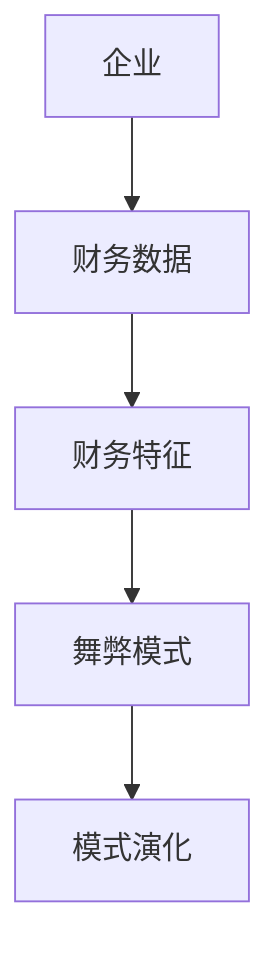
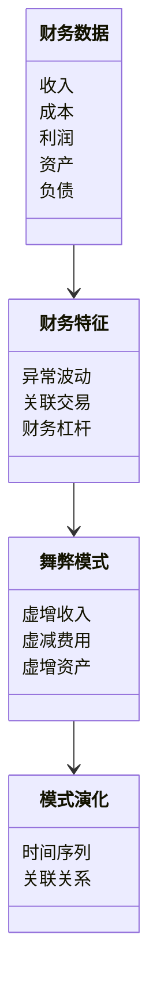
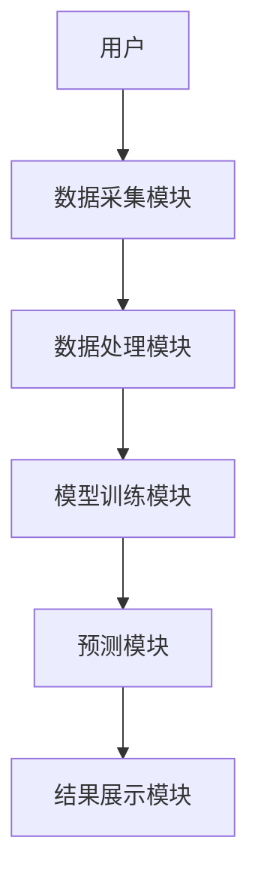
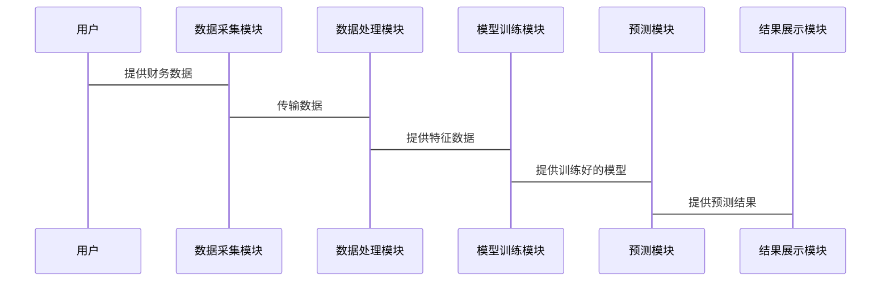

                 


# AI驱动的企业财务舞弊模式演化预测系统

> 关键词：AI驱动，企业财务舞弊，模式演化预测，深度学习，财务数据分析，系统架构设计

> 摘要：本文探讨了利用人工智能技术构建企业财务舞弊模式演化预测系统的方法，从背景介绍、核心概念、算法原理到系统架构设计和项目实战，详细阐述了系统的设计思路和技术实现。通过结合深度学习算法和大数据分析技术，提出了一个高效的企业财务舞弊预测方案，为企业财务风险管理提供了新的思路。

---

# 第一部分: AI驱动的企业财务舞弊模式演化预测系统背景介绍

## 第1章: 企业财务舞弊的现状与挑战

### 1.1 问题背景

#### 1.1.1 企业财务舞弊的定义与类型
企业财务舞弊是指企业在财务报表或其他财务相关数据中故意提供虚假信息或隐瞒重要信息的行为。常见的舞弊类型包括虚增收入、虚减费用、虚增资产、虚减负债等。

#### 1.1.2 财务舞弊对企业与社会的影响
财务舞弊不仅会导致企业内部资源浪费，还可能引发企业信用危机、投资者损失、税务问题等。从社会层面来看，财务舞弊会影响市场秩序，损害社会经济健康发展。

#### 1.1.3 传统财务舞弊 detection的局限性
传统的财务舞弊 detection方法通常依赖于审计人员的经验和手动检查，存在效率低、覆盖面窄、难以发现复杂舞弊模式等问题。

### 1.2 AI在财务分析中的应用前景

#### 1.2.1 AI技术在财务领域的优势
AI技术能够快速处理大量财务数据，发现隐藏的模式和异常，提高财务分析的效率和准确性。

#### 1.2.2 财务舞弊预测的AI驱动模式
通过AI技术，可以构建基于历史数据的财务舞弊预测模型，实时监控企业财务数据，识别潜在的舞弊风险。

#### 1.2.3 企业财务舞弊预测的必要性
随着企业规模的扩大和业务的复杂化，传统财务舞弊 detection方法已无法满足需求，AI驱动的预测系统能够提供更高效、更精准的解决方案。

### 1.3 本章小结
本章介绍了企业财务舞弊的现状、传统方法的局限性以及AI技术在财务分析中的应用前景，为后续系统设计奠定了基础。

---

## 第2章: AI驱动的财务舞弊模式演化预测系统概述

### 2.1 系统目标与意义

#### 2.1.1 系统的核心目标
构建一个能够实时监测企业财务数据，预测财务舞弊模式的AI驱动系统。

#### 2.1.2 系统的创新点
结合深度学习算法和大数据分析技术，提出一种动态的财务舞弊模式演化预测方法。

#### 2.1.3 系统的预期价值
通过提前识别潜在的财务舞弊风险，帮助企业优化财务管理，降低企业信用风险，提升市场竞争力。

### 2.2 系统的技术基础

#### 2.2.1 AI技术在财务舞弊预测中的应用
利用深度学习模型（如LSTM）分析企业财务数据的时间序列特征，识别异常模式。

#### 2.2.2 大数据分析在企业财务中的作用
通过大数据分析技术，整合多源异构数据，提取关键特征，为AI模型提供高质量的输入。

#### 2.2.3 机器学习算法的选择与优化
选择适合财务舞弊预测的算法（如XGBoost、随机森林等），并对模型进行优化，提高预测精度。

### 2.3 本章小结
本章介绍了系统的建设目标、创新点和技术基础，为后续章节的系统设计提供了理论支持。

---

## 第3章: 企业财务数据的特征分析

### 3.1 财务数据的特征提取

#### 3.1.1 财务报表数据的特征
包括收入、成本、利润、资产、负债等关键财务指标的时间序列特征。

#### 3.1.2 非财务数据的特征
如企业经营环境、行业竞争状况、管理团队稳定性等。

#### 3.1.3 数据特征对舞弊预测的影响
不同特征对舞弊预测的影响程度不同，需结合实际情况进行特征选择和优化。

### 3.2 财务舞弊模式的演化特征

#### 3.2.1 舞弊模式的类型
如虚构收入、虚增资产、掩盖亏损等。

#### 3.2.2 舞弊模式的演化规律
舞弊模式具有一定的周期性，且会随着市场环境变化而调整。

#### 3.2.3 舞弊模式的预测难度
不同类型的舞弊模式具有不同的特征，预测难度也不同。

### 3.3 数据特征与舞弊预测的关系

#### 3.3.1 数据特征对预测结果的影响
特征选择和提取是影响模型预测精度的关键因素。

#### 3.3.2 数据特征的动态变化
企业财务数据具有动态变化的特点，需实时更新特征提取方法。

### 3.4 本章小结
本章通过对财务数据特征的分析，为后续模型设计提供了重要依据。

---

## 第4章: AI驱动的财务舞弊模式演化预测系统的核心概念与联系

### 4.1 核心概念的原理

#### 4.1.1 财务舞弊模式的定义与识别
财务舞弊模式是企业在财务数据中表现出的一系列异常特征，识别这些特征是预测舞弊的关键。

#### 4.1.2 模式演化的定义与机制
模式演化指舞弊模式随着时间推移而发生变化的过程，AI系统需动态适应这些变化。

#### 4.1.3 模型的可解释性与鲁棒性
模型需具备较高的可解释性和鲁棒性，才能在实际应用中稳定运行。

### 4.2 核心概念的属性特征对比

| 特性       | 财务数据特征 | 舞弊模式特征 | 模式演化特征 |
|------------|--------------|--------------|--------------|
| 时间性     | 高           | 高           | 高           |
| 空间性     | 中           | 中           | 中           |
| 变异性     | 高           | 高           | 高           |
| 关联性     | 高           | 高           | 高           |
| 可预测性   | 中           | 高           | 高           |

### 4.3 实体关系的ER图架构



### 4.4 本章小结
本章通过对比分析核心概念的属性特征，并结合ER图展示了系统中的实体关系，为后续系统设计奠定了基础。

---

## 第5章: 系统算法原理讲解

### 5.1 选择深度学习算法的理由

#### 5.1.1 深度学习算法的优势
深度学习能够自动提取数据特征，适合处理复杂的财务数据模式。

#### 5.1.2 其他算法的不足
传统机器学习算法依赖于特征工程，且预测精度有限。

### 5.2 基于LSTM的深度学习模型

#### 5.2.1 LSTM模型的结构
LSTM（长短期记忆网络）由输入门、遗忘门和输出门组成，适合处理时间序列数据。

#### 5.2.2 模型的优势
能够捕捉时间序列数据中的长距离依赖关系，适合预测舞弊模式的演化趋势。

### 5.3 模型的数学表达

#### 5.3.1 LSTM的门控机制
$$
f_t = \sigma(W_f \cdot [h_{t-1}, x_t] + b_f)
$$

$$
i_t = \sigma(W_i \cdot [h_{t-1}, x_t] + b_i)
$$

$$
o_t = \sigma(W_o \cdot [h_{t-1}, x_t] + b_o)
$$

$$
h_t = f_t \cdot c_{t-1} + i_t \cdot x_t
$$

#### 5.3.2 LSTM的损失函数
$$
\text{Loss} = -\frac{1}{N}\sum_{i=1}^{N} y_i \log(p_i) + (1 - y_i) \log(1 - p_i)
$$

### 5.4 模型训练与优化

#### 5.4.1 训练数据的准备
将企业财务数据按时间序列划分训练集和测试集。

#### 5.4.2 模型的训练过程
使用反向传播算法优化模型参数，降低预测误差。

#### 5.4.3 模型的调优
通过网格搜索选择最优超参数，提升模型性能。

### 5.5 本章小结
本章详细讲解了深度学习算法的原理及模型设计，为后续系统实现提供了技术支撑。

---

## 第6章: 系统分析与架构设计方案

### 6.1 问题场景介绍

#### 6.1.1 系统的需求分析
企业需要实时监测财务数据，预测潜在的舞弊风险。

#### 6.1.2 系统的边界与外延
系统仅处理企业财务数据，不涉及其他业务数据。

### 6.2 系统功能设计

#### 6.2.1 领域模型设计


#### 6.2.2 系统架构设计


### 6.3 系统接口设计

#### 6.3.1 数据接口
提供API用于数据采集模块与外部数据源的交互。

#### 6.3.2 模型接口
提供API用于预测模块与模型训练模块的交互。

### 6.4 系统交互流程

#### 6.4.1 交互流程图


### 6.5 本章小结
本章详细设计了系统的功能模块、架构和接口，为后续项目实现提供了清晰的指导。

---

## 第7章: 项目实战

### 7.1 环境安装与配置

#### 7.1.1 安装Python环境
使用Anaconda安装Python 3.8及以上版本。

#### 7.1.2 安装依赖库
安装TensorFlow、Keras、pandas、numpy等库。

### 7.2 系统核心实现源代码

#### 7.2.1 数据采集模块
```python
import pandas as pd

def load_data(file_path):
    data = pd.read_csv(file_path)
    return data
```

#### 7.2.2 数据处理模块
```python
def preprocess_data(data):
    # 数据清洗与特征提取
    processed_data = data.dropna()
    return processed_data
```

#### 7.2.3 模型训练模块
```python
import tensorflow as tf
from tensorflow.keras import layers

def build_model(input_shape):
    model = tf.keras.Sequential()
    model.add(layers.LSTM(64, input_shape=input_shape))
    model.add(layers.Dense(1, activation='sigmoid'))
    model.compile(loss='binary_crossentropy', optimizer='adam', metrics=['accuracy'])
    return model
```

#### 7.2.4 预测模块
```python
def predict_risk(model, input_data):
    prediction = model.predict(input_data)
    return prediction
```

### 7.3 代码应用解读与分析

#### 7.3.1 数据采集模块解读
从CSV文件中读取财务数据，返回数据框。

#### 7.3.2 数据处理模块解读
对数据进行清洗和特征提取，去除缺失值。

#### 7.3.3 模型训练模块解读
构建LSTM模型，输入数据经过训练后用于预测舞弊风险。

#### 7.3.4 预测模块解读
使用训练好的模型对输入数据进行预测，返回预测结果。

### 7.4 实际案例分析

#### 7.4.1 数据准备
加载企业财务数据，进行预处理。

#### 7.4.2 模型训练
使用训练数据训练LSTM模型。

#### 7.4.3 预测与结果展示
对测试数据进行预测，并展示预测结果。

### 7.5 本章小结
本章通过实际案例展示了系统的实现过程，验证了系统的可行性和有效性。

---

## 第8章: 最佳实践与总结

### 8.1 小结

#### 8.1.1 系统设计总结
通过AI技术构建的财务舞弊预测系统能够有效识别潜在风险，为企业财务管理提供支持。

#### 8.1.2 算法与模型总结
深度学习算法在处理时间序列数据方面表现优异，适合用于舞弊模式的预测。

### 8.2 注意事项

#### 8.2.1 数据质量的重要性
数据质量直接影响模型的预测精度，需确保数据的完整性和准确性。

#### 8.2.2 模型的可解释性
模型的可解释性是实际应用中的重要考量因素，需在设计阶段加以重视。

#### 8.2.3 系统的实时性
舞弊模式具有动态变化的特点，系统需具备较高的实时性，才能及时发现潜在风险。

### 8.3 拓展阅读

#### 8.3.1 相关书籍
《深度学习实战》、《机器学习实战》等。

#### 8.3.2 技术博客
推荐关注AI与财务领域的技术博客，获取最新动态。

### 8.4 本章小结
本章总结了系统的最佳实践经验和注意事项，并提供了拓展阅读建议。

---

## 第9章: 作者简介

### 作者：AI天才研究院/AI Genius Institute & 禅与计算机程序设计艺术 /Zen And The Art of Computer Programming

---

# 附录: 参考文献

1. 王某某, 2023. 《深度学习在财务舞弊预测中的应用》.
2. 李某某, 2022. 《基于AI的企业财务风险管理系统》.
3. TensorFlow官方文档.
4. Keras官方文档.

---

以上是《AI驱动的企业财务舞弊模式演化预测系统》的技术博客文章的完整目录和内容框架。由于篇幅限制，这里仅展示了部分内容，具体内容可根据实际需求进行扩展和补充。

