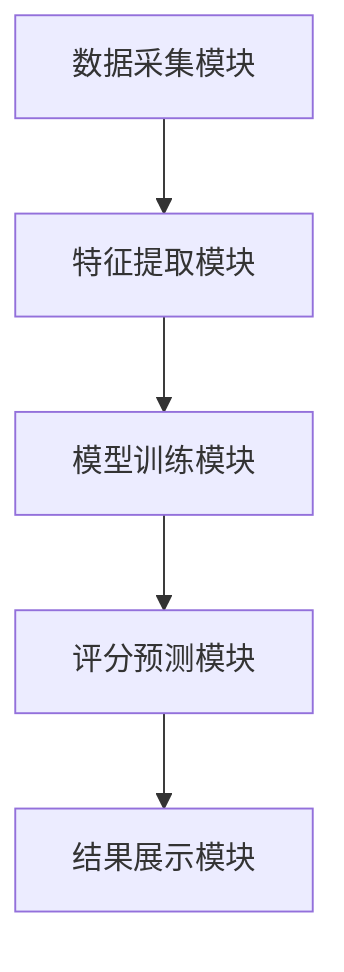

                 


# AI驱动的企业财务舞弊风险评分系统

> 关键词：AI，财务舞弊，风险评分系统，逻辑回归，随机森林

> 摘要：本文详细探讨了AI在企业财务舞弊风险评分系统中的应用，分析了系统的核心概念、算法原理、系统架构以及项目实战，旨在为企业提供一种高效的风险评估方法。

---

# 第一部分: AI驱动的企业财务舞弊风险评分系统概述

## 第1章: 企业财务舞弊风险评分系统背景

### 1.1 企业财务舞弊的基本概念

#### 1.1.1 财务舞弊的定义与特征
财务舞弊是指企业通过虚构交易、隐瞒收入、虚增成本等方式，人为操控财务数据，以误导利益相关者的行为。其主要特征包括：
- **隐蔽性**：舞弊行为通常隐藏在正常的财务活动中，难以被发现。
- **目的性**：舞弊行为通常是为了掩盖财务问题、虚增利润或逃避税务。
- **复杂性**：舞弊手段多样化，涉及多个财务科目和业务环节。

#### 1.1.2 财务舞弊的常见形式与案例
常见的财务舞弊形式包括：
1. **虚增收入**：通过虚构销售交易或提前确认收入来虚增收入。
2. **隐瞒支出**：通过隐藏费用或延迟确认支出来虚增利润。
3. **虚增资产**：通过虚假投资或虚增存货来虚增资产。
4. **关联交易舞弊**：通过关联交易转移资金或利润。

#### 1.1.3 财务舞弊对企业的影响
财务舞弊不仅会导致企业资产流失、利润虚增，还可能引发以下后果：
- 企业信用受损，影响融资能力。
- 利益相关者信任度下降，影响企业声誉。
- 可能面临法律诉讼和罚款，承担较大的经济和法律责任。

### 1.2 AI技术在财务领域的应用现状

#### 1.2.1 AI在财务分析中的应用
AI技术在财务分析中的应用主要体现在以下方面：
- **财务报表分析**：通过自然语言处理（NLP）技术分析财务报表，识别异常数据。
- **趋势预测**：利用机器学习算法预测财务趋势，辅助决策。
- **审计辅助**：通过AI技术辅助审计工作，识别潜在风险点。

#### 1.2.2 AI在风险评估中的作用
AI在风险评估中的作用主要体现在：
- **实时监控**：通过实时数据采集和分析，快速识别潜在风险。
- **模式识别**：利用机器学习算法识别财务数据中的异常模式。
- **预测性分析**：基于历史数据预测未来风险，提前采取防范措施。

#### 1.2.3 财务舞弊检测的痛点与挑战
财务舞弊检测的痛点与挑战包括：
- 数据复杂性：财务数据涉及多个科目和业务环节，数据量大且复杂。
- 舞弊手段多样化：舞弊者不断变换手段，增加了检测难度。
- 数据隐私问题：财务数据涉及企业机密，数据隐私保护要求高。

### 1.3 舞弊风险评分系统的重要性

#### 1.3.1 舞弊风险评分的核心目标
舞弊风险评分的核心目标是通过量化分析，评估企业财务数据的可靠性，识别潜在的舞弊风险。

#### 1.3.2 舞弊风险评分系统的价值
舞弊风险评分系统的价值体现在：
- **提前预警**：通过评分系统提前识别潜在舞弊风险，防患于未然。
- **降低风险**：通过评分系统帮助企业建立完善的内控制度，降低舞弊发生的概率。
- **提高效率**：通过自动化分析，提高财务审计和风险评估的效率。

#### 1.3.3 系统在企业中的应用场景
舞弊风险评分系统在企业中的应用场景包括：
- **内部审计**：用于内部审计部门快速识别潜在风险点。
- **外部审计**：用于外部审计机构评估企业的财务健康状况。
- **风险管理**：用于企业风险管理部门制定风险应对策略。

---

## 第2章: 舞弊风险评分系统的核心概念

### 2.1 舞弊风险评分模型的基本原理

#### 2.1.1 模型的输入与输出
- **输入**：企业的财务数据、业务数据、行为数据等。
- **输出**：企业财务舞弊风险评分，通常以0-100分表示，分数越高表示风险越大。

#### 2.1.2 模型的核心要素与特征
舞弊风险评分模型的核心要素包括：
- **财务数据**：收入、成本、利润、资产、负债等财务指标。
- **业务数据**：销售、采购、库存、关联交易等业务数据。
- **行为数据**：管理层行为、员工行为、交易时间等。

#### 2.1.3 模型的评分标准与分类
- **评分标准**：根据企业的行业特点和财务状况，制定评分标准。
- **评分分类**：将企业分为高风险、中风险、低风险三类。

### 2.2 舞弊风险评分系统的数据特征

#### 2.2.1 财务数据特征的提取
- **收入与成本匹配性**：收入与成本是否匹配，是否存在收入虚增或成本虚减的情况。
- **资产与负债匹配性**：资产与负债是否匹配，是否存在资产虚增或负债虚减的情况。

#### 2.2.2 行为数据特征的分析
- **交易时间异常**：是否存在交易时间集中或异常的情况。
- **管理层行为异常**：是否存在管理层频繁更换或异常决策的情况。

#### 2.2.3 文本数据特征的挖掘
- **财务报告语言分析**：通过NLP技术分析财务报告的语言特征，识别异常表述。

### 2.3 舞弊风险评分模型的对比分析

#### 2.3.1 常见评分模型的特征对比
| 模型名称       | 输入特征                | 输出结果       | 优点                           | 缺点                           |
|----------------|-------------------------|----------------|--------------------------------|--------------------------------|
| 逻辑回归       | 财务数据、业务数据      | 分类概率       | 模型简单，易于解释             | 非线性关系处理能力有限         |
| 随机森林       | 财务数据、业务数据、文本数据 | 分类概率       | 非线性关系处理能力强           | 模型复杂，解释性较差           |

#### 2.3.2 模型优缺点分析
- **逻辑回归**：模型简单，易于解释，但对非线性关系处理能力有限。
- **随机森林**：模型复杂，解释性较差，但对非线性关系处理能力强。

#### 2.3.3 模型选择的依据与策略
- **数据特征**：根据数据特征选择合适的模型。
- **业务需求**：根据业务需求选择模型，如需要解释性则选择逻辑回归。

---

## 第3章: 舞弊风险评分系统的算法原理

### 3.1 逻辑回归算法

#### 3.1.1 逻辑回归的基本原理
逻辑回归是一种用于分类的统计方法，其核心思想是通过logit函数将线性回归的结果映射到概率空间。

#### 3.1.2 逻辑回归的数学模型
$$ P(y=1|x) = \frac{e^{\beta_0 + \beta_1 x_1 + ... + \beta_n x_n}}{1 + e^{\beta_0 + \beta_1 x_1 + ... + \beta_n x_n}} $$

#### 3.1.3 逻辑回归在评分系统中的应用
- **风险评分**：通过逻辑回归模型计算企业的违约概率，作为舞弊风险评分。
- **概率解释**：概率值越接近1，舞弊风险越高。

### 3.2 随机森林算法

#### 3.2.1 随机森林的基本原理
随机森林是一种基于决策树的集成学习算法，通过构建多棵决策树并进行投票或平均，提高模型的准确性和稳定性。

#### 3.2.2 随机森林的数学模型
- **决策树**：通过特征分裂构建决策树，预测舞弊风险。
- **集成预测**：通过多棵决策树的集成预测最终结果。

#### 3.2.3 随机森林在评分系统中的优势
- **高准确性**：随机森林通过集成学习提高了模型的准确性。
- **强健性**：随机森林对异常值和噪声数据具有较强的鲁棒性。

### 3.3 算法对比与优化

#### 3.3.1 逻辑回归与随机森林的对比
| 指标       | 逻辑回归               | 随机森林               |
|------------|------------------------|------------------------|
| 解释性     | 高                    | 低                    |
| 准确性     | 低                    | 高                    |
| 处理能力   | 线性关系处理能力强     | 非线性关系处理能力强   |

#### 3.3.2 模型调优与参数优化
- **逻辑回归**：调整正则化参数C，优化模型的泛化能力。
- **随机森林**：调整树的棵数、树的深度等参数，优化模型的准确性和鲁棒性。

#### 3.3.3 混合模型的应用与效果
- **混合模型**：将逻辑回归和随机森林的结果进行加权融合，提高模型的准确性和解释性。
- **效果提升**：混合模型在准确性和解释性之间找到了平衡点，提高了整体的评分效果。

---

## 第4章: 舞弊风险评分系统的数学模型

### 4.1 逻辑回归模型

#### 4.1.1 逻辑回归的数学公式
$$ P(y=1|x) = \frac{e^{\beta_0 + \beta_1 x_1 + ... + \beta_n x_n}}{1 + e^{\beta_0 + \beta_1 x_1 + ... + \beta_n x_n}} $$

#### 4.1.2 逻辑回归的损失函数
$$ L(\beta) = -\sum_{i=1}^{n} [y_i \ln(p_i) + (1 - y_i) \ln(1 - p_i)] $$

#### 4.1.3 逻辑回归的优化过程
通过梯度下降法优化损失函数，求解最优参数$\beta$。

### 4.2 随机森林模型

#### 4.2.1 随机森林的决策树构建
- **特征选择**：通过随机特征选择构建决策树。
- **样本选择**：通过随机样本选择构建决策树。

#### 4.2.2 随机森林的集成预测
- **投票机制**：分类问题通过投票机制预测类别。
- **平均机制**：回归问题通过平均机制预测结果。

#### 4.2.3 随机森林的数学公式
$$ y = \frac{1}{n} \sum_{i=1}^{n} y_i $$

---

## 第5章: 舞弊风险评分系统的系统架构

### 5.1 系统分析与架构设计

#### 5.1.1 系统功能模块设计
| 模块名称       | 功能描述                                   |
|----------------|------------------------------------------|
| 数据采集模块   | 采集企业的财务数据、业务数据和行为数据     |
| 特征提取模块   | 对数据进行特征提取，生成评分所需的特征向量   |
| 模型训练模块   | 训练逻辑回归和随机森林模型，生成评分系统     |
| 评分预测模块   | 对企业进行舞弊风险评分预测                  |
| 结果展示模块   | 展示评分结果，提供风险预警和决策建议        |

#### 5.1.2 系统架构图


#### 5.1.3 系统接口设计
- **数据接口**：提供API接口，供企业上传财务数据。
- **评分接口**：提供API接口，供其他系统调用评分结果。
- **结果接口**：提供API接口，供其他系统获取评分结果。

---

## 第6章: 舞弊风险评分系统的项目实战

### 6.1 环境安装与配置

#### 6.1.1 安装Python与相关库
```bash
pip install numpy
pip install scikit-learn
pip install matplotlib
pip install pandas
```

#### 6.1.2 安装Jupyter Notebook
```bash
pip install jupyter
```

### 6.2 系统核心实现

#### 6.2.1 数据预处理
```python
import pandas as pd
import numpy as np

# 加载数据
data = pd.read_csv('financial_data.csv')

# 数据清洗
data = data.dropna()
data = pd.get_dummies(data)
```

#### 6.2.2 特征工程
```python
from sklearn.preprocessing import StandardScaler

# 标准化处理
scaler = StandardScaler()
X = scaler.fit_transform(data.drop('label', axis=1))
y = data['label']
```

#### 6.2.3 模型训练
```python
from sklearn.linear_model import LogisticRegression
from sklearn.ensemble import RandomForestClassifier
from sklearn.metrics import accuracy_score

# 逻辑回归模型
lr_model = LogisticRegression()
lr_model.fit(X, y)
lr_score = accuracy_score(y, lr_model.predict(X))

# 随机森林模型
rf_model = RandomForestClassifier()
rf_model.fit(X, y)
rf_score = accuracy_score(y, rf_model.predict(X))
```

#### 6.2.4 模型评分
```python
import joblib

# 保存模型
joblib.dump(lr_model, 'lr_model.pkl')
joblib.dump(rf_model, 'rf_model.pkl')
```

### 6.3 实际案例分析

#### 6.3.1 案例背景
某企业财务数据异常，可能存在收入虚增的情况。

#### 6.3.2 数据分析
通过逻辑回归和随机森林模型分析，发现该企业的收入与成本匹配性较差，存在收入虚增的嫌疑。

#### 6.3.3 模型评分
逻辑回归模型评分结果为85分，随机森林模型评分结果为90分，综合评分结果为高风险。

---

## 第7章: 舞弊风险评分系统的最佳实践

### 7.1 小结
舞弊风险评分系统通过AI技术，帮助企业快速识别潜在的财务舞弊风险，提高了风险管理的效率和准确性。

### 7.2 注意事项
- **数据隐私保护**：在处理财务数据时，需注意数据隐私保护，确保数据安全。
- **模型更新**：定期更新模型，以适应新的舞弊手段和企业环境的变化。
- **多模型融合**：通过混合模型融合不同算法的优势，提高评分系统的准确性和解释性。

### 7.3 未来展望
未来，随着AI技术的不断发展，舞弊风险评分系统将更加智能化和精准化，为企业提供更高效的财务管理工具。

### 7.4 拓展阅读
- 《机器学习实战》
- 《Python机器学习》
- 《财务舞弊分析》

---

作者：AI天才研究院/AI Genius Institute & 禅与计算机程序设计艺术 /Zen And The Art of Computer Programming

