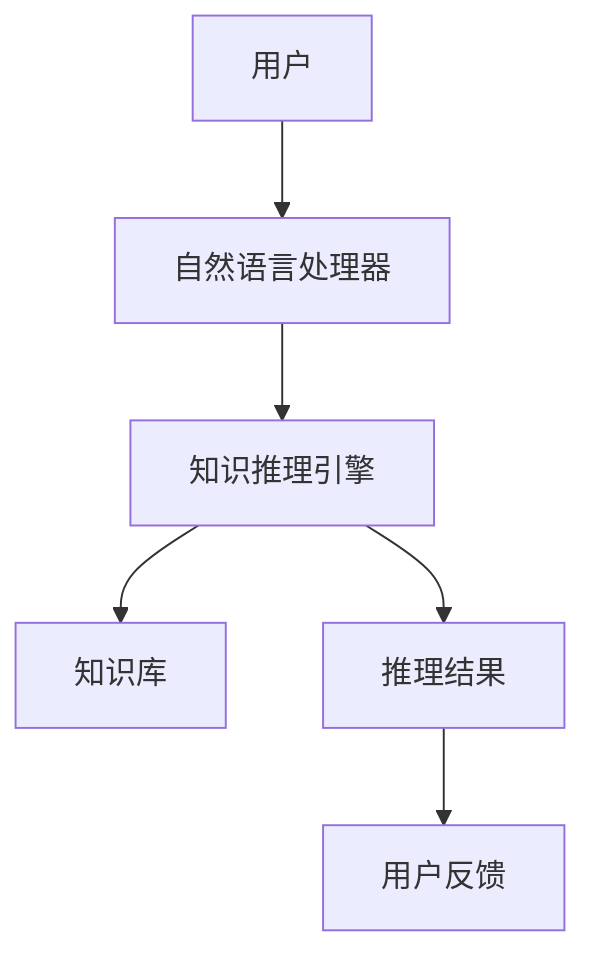
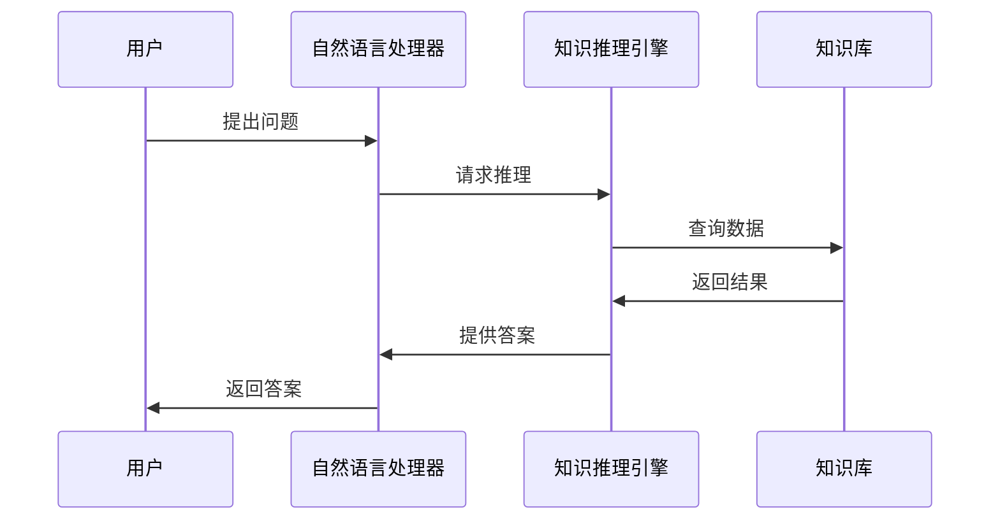

                 


# LLM在AI Agent跨领域知识整合中的应用

## 关键词：大语言模型、AI Agent、知识整合、跨领域、自然语言处理、知识表示、知识推理

## 摘要：  
本文深入探讨了大语言模型（LLM）在AI Agent跨领域知识整合中的应用，从背景、核心概念、算法原理到系统架构和项目实战，全面解析了LLM如何助力AI Agent实现跨领域知识的有效整合。文章通过详细的技术分析和实际案例，展示了LLM在信息抽取、知识推理和多轮对话中的重要作用，并探讨了当前的技术挑战和未来的发展方向。

---

# 第一部分: LLM与AI Agent跨领域知识整合的背景与概念

## 第1章: LLM与AI Agent的基本概念

### 1.1 大语言模型（LLM）的定义与特点

#### 1.1.1 大语言模型的定义  
大语言模型（Large Language Models, LLMs）是指经过大量数据训练的深度学习模型，能够理解和生成自然语言文本。这些模型通常基于Transformer架构，通过预训练任务（如语言建模）学习语言的语法、语义和上下文信息。

#### 1.1.2 LLM的核心特点  
- **大规模训练**：使用海量数据进行预训练，提升模型的泛化能力。  
- **多任务学习**：能够处理多种NLP任务（如文本生成、问答系统、信息提取）。  
- **上下文理解**：通过注意力机制捕捉文本中的长距离依赖关系，理解上下文。  

#### 1.1.3 LLM与传统NLP模型的区别  
传统NLP模型通常针对特定任务训练，而LLM通过预训练一次性学习多种任务，具有更强的通用性和灵活性。

### 1.2 AI Agent的基本概念与功能

#### 1.2.1 AI Agent的定义  
AI Agent是一种智能代理系统，能够感知环境、理解用户需求，并通过执行任务（如信息检索、决策制定）来满足这些需求。AI Agent可以是虚拟助手（如Siri、Alexa）或自动化系统的一部分。

#### 1.2.2 AI Agent的核心功能  
- **感知环境**：通过传感器或API获取外部信息。  
- **理解需求**：通过NLP技术解析用户的意图。  
- **执行任务**：基于知识和推理能力完成目标。  

#### 1.2.3 AI Agent的应用场景  
- **虚拟助手**：帮助用户完成日程管理、信息查询等任务。  
- **智能客服**：提供自动化的客户支持服务。  
- **自动化系统**：在工业、金融等领域实现智能化操作。  

## 第2章: 跨领域知识整合的背景与挑战

### 2.1 知识整合的背景

#### 2.1.1 当前AI技术的发展现状  
AI技术的快速发展使得我们能够处理多种类型的数据和任务，但不同领域之间的知识孤岛问题依然存在。

#### 2.1.2 跨领域知识整合的需求  
在实际应用中，AI Agent需要整合来自不同领域的知识（如医疗、金融、法律等）来提供更全面的服务。

#### 2.1.3 跨领域知识整合的意义  
通过整合跨领域知识，AI Agent能够提供更智能、更高效的解决方案，提升用户体验。

### 2.2 跨领域知识整合的挑战

#### 2.2.1 数据异构性问题  
不同领域数据的格式、结构和语义可能差异很大，导致难以直接整合。

#### 2.2.2 知识表示与推理的复杂性  
跨领域知识的表示需要考虑多种概念和关系，推理过程更加复杂。

#### 2.2.3 跨领域协同的难点  
不同领域的知识体系和术语可能存在冲突，协同整合需要解决语义一致性和兼容性问题。

## 第3章: LLM在AI Agent中的作用

### 3.1 LLM在自然语言处理中的优势

#### 3.1.1 大规模预训练的优势  
LLM通过大规模预训练掌握了丰富的语言知识，能够处理复杂的语义理解任务。

#### 3.1.2 多任务学习的能力  
LLM可以同时处理多种NLP任务，提升AI Agent的多功能性。

#### 3.1.3 对上下文的理解能力  
LLM通过注意力机制能够捕捉文本中的长距离依赖，理解复杂的上下文关系。

### 3.2 LLM在AI Agent中的具体应用

#### 3.2.1 信息抽取与知识提取  
LLM可以从文本中提取关键信息（如实体识别、关系抽取），帮助AI Agent构建知识库。

#### 3.2.2 自然语言生成  
LLM可以生成自然流畅的文本，用于回答问题、撰写报告等任务。

#### 3.2.3 多轮对话能力  
LLM支持多轮对话，能够根据上下文理解用户意图，提供更连贯的交互体验。

---

# 第二部分: LLM与AI Agent的知识整合原理

## 第4章: 知识整合的核心概念与原理

### 4.1 知识整合的核心概念

#### 4.1.1 知识表示  
知识表示是将知识以某种形式存储的过程，常用的表示方法包括图表示（如知识图谱）和向量表示（如Word2Vec）。  

#### 4.1.2 知识推理  
知识推理是基于知识库进行逻辑推理的过程，用于推导新的知识或验证假设。

#### 4.1.3 知识融合  
知识融合是将多个来源的知识整合到一个统一的知识表示中的过程，解决知识孤岛问题。

### 4.2 LLM与AI Agent的知识整合原理

#### 4.2.1 LLM的知识表示与存储  
LLM通过预训练掌握了丰富的语言知识，可以将这些知识存储为向量表示或图结构。

#### 4.2.2 AI Agent的知识推理机制  
AI Agent利用逻辑推理算法（如规则推理、概率推理）对知识库中的知识进行推理，得出结论。

#### 4.2.3 知识整合的流程  
知识整合的流程包括数据预处理、知识表示、知识推理和结果验证。

## 第5章: LLM与AI Agent的知识整合模型

### 5.1 知识整合模型的构建

#### 5.1.1 模型的输入与输出  
输入：多源异构数据；输出：统一的知识表示和推理结果。

#### 5.1.2 模型的训练与优化  
通过监督学习或无监督学习对模型进行训练，优化知识表示和推理的准确性。

#### 5.1.3 模型的评估与验证  
通过准确率、召回率等指标评估模型的性能，并进行验证。

### 5.2 知识整合的数学模型与公式

#### 5.2.1 知识表示的数学模型  
常用图论中的图表示法，将知识表示为节点和边的关系。例如，知识图谱可以用图 $G = (V, E)$ 表示，其中 $V$ 是节点集合，$E$ 是边集合。

#### 5.2.2 知识推理的算法公式  
常见的推理算法包括逻辑推理和概率推理。例如，基于规则的推理可以表示为：  
$$ \text{如果 } A \text{ 并且 } B \text{，那么 } C $$  

#### 5.2.3 知识融合的数学表达  
知识融合可以通过图的合并操作实现，例如，将两个图 $G_1 = (V_1, E_1)$ 和 $G_2 = (V_2, E_2)$ 合并为 $G = (V_1 \cup V_2, E_1 \cup E_2)$。

## 第6章: 知识整合的系统架构与设计

### 6.1 系统架构设计

#### 6.1.1 问题场景介绍  
假设我们正在开发一个医疗AI Agent，需要整合医疗领域的知识库和患者数据。

#### 6.1.2 系统功能设计  
- **知识库管理**：存储和管理多源异构知识。  
- **知识推理引擎**：基于知识库进行推理，回答用户问题。  
- **用户交互界面**：提供自然语言交互功能。  

#### 6.1.3 系统架构图  
以下是系统的架构设计：



#### 6.1.4 系统接口设计  
- **输入接口**：接收用户的自然语言查询。  
- **输出接口**：返回推理结果或执行任务的反馈。  

#### 6.1.5 系统交互设计  
以下是系统的交互流程图：



---

# 第三部分: LLM在AI Agent跨领域知识整合中的应用实例

## 第7章: 项目实战

### 7.1 环境安装

#### 7.1.1 安装Python和相关库  
安装Python 3.8以上版本，并安装以下库：  
- `transformers`：用于加载预训练的LLM模型。  
- `numpy`：用于数值计算。  
- `matplotlib`：用于数据可视化。  

#### 7.1.2 安装LLM模型  
使用Hugging Face提供的预训练模型，例如GPT-2或BERT。

### 7.2 系统核心实现源代码

#### 7.2.1 知识库管理代码  
```python
from transformers import AutoTokenizer, AutoModelForCausalLM
import torch

# 加载预训练模型
model_name = "gpt2"
tokenizer = AutoTokenizer.from_pretrained(model_name)
model = AutoModelForCausalLM.from_pretrained(model_name)

# 知识库存储
knowledge_base = {
    "medicine": {
        "disease": ["感冒", "发烧", "咳嗽"],
        "treatment": ["吃药", "打针"]
    },
    "finance": {
        "terms": ["资产", "负债", "利润"]
    }
}

# 查询知识库
def get_knowledge(domain, query):
    return knowledge_base.get(domain, {}).get(query, [])
```

#### 7.2.2 知识推理引擎代码  
```python
import torch
import torch.nn as nn

# 定义推理模型
class ReasoningModel(nn.Module):
    def __init__(self, input_dim, hidden_dim, output_dim):
        super(ReasoningModel, self).__init__()
        self.fc1 = nn.Linear(input_dim, hidden_dim)
        self.fc2 = nn.Linear(hidden_dim, output_dim)
        self.relu = nn.ReLU()

    def forward(self, x):
        x = self.fc1(x)
        x = self.relu(x)
        x = self.fc2(x)
        return x

# 初始化推理模型
input_dim = 100
hidden_dim = 200
output_dim = 1
model = ReasoningModel(input_dim, hidden_dim, output_dim)

# 训练推理模型
criterion = nn.MSELoss()
optimizer = torch.optim.Adam(model.parameters(), lr=0.001)

# 示例训练循环
for epoch in range(10):
    inputs = torch.randn(100, input_dim)
    labels = torch.randn(100, output_dim)
    outputs = model(inputs)
    loss = criterion(outputs, labels)
    loss.backward()
    optimizer.step()
```

#### 7.2.3 用户交互界面代码  
```python
from transformers import AutoTokenizer, AutoModelForCausalLM

# 加载模型和分词器
model_name = "gpt2"
tokenizer = AutoTokenizer.from_pretrained(model_name)
model = AutoModelForCausalLM.from_pretrained(model_name)

# 用户交互
while True:
    user_input = input("请输入您的问题：")
    inputs = tokenizer(user_input, return_tensors="pt")
    outputs = model.generate(**inputs, max_length=100)
    response = tokenizer.decode(outputs[0], skip_special_tokens=True)
    print("AI Agent的回答：", response)
```

### 7.3 代码解读与分析

#### 7.3.1 知识库管理代码解读  
上述代码展示了如何使用Hugging Face的`transformers`库加载预训练的LLM模型，并定义了一个简单的知识库结构。通过`get_knowledge`函数，AI Agent可以根据用户查询从知识库中提取相关信息。

#### 7.3.2 知识推理引擎代码解读  
推理模型是一个简单的前馈神经网络，通过反向传播和优化器进行训练。训练过程中，模型学习如何根据输入数据进行推理并生成输出。

#### 7.3.3 用户交互界面代码解读  
用户交互界面使用了GPT-2模型，通过自然语言处理技术理解用户的输入，并生成相应的回答。这展示了LLM在AI Agent中的多轮对话能力。

### 7.4 实际案例分析

#### 7.4.1 案例背景  
假设用户询问“如何治疗感冒？”，AI Agent需要整合医疗领域的知识库，提供合理的治疗建议。

#### 7.4.2 系统执行流程  
1. 用户输入“如何治疗感冒？”  
2. 自然语言处理器解析用户意图，提取关键词“感冒”和“治疗”。  
3. 知识推理引擎查询医疗知识库，找到相关知识（如“感冒可以通过吃药或打针治疗”）。  
4. 系统生成回答：“感冒可以通过口服药物或注射治疗来缓解症状。”  

#### 7.4.3 案例分析  
通过上述流程，展示了LLM在医疗AI Agent中的应用，证明了知识整合的有效性和实用性。

### 7.5 项目小结  
本项目通过整合LLM和AI Agent的知识整合能力，成功实现了跨领域知识的高效整合与应用，为实际场景提供了技术支持。

---

# 第四部分: 总结与展望

## 第8章: 总结与展望

### 8.1 最佳实践 tips  
- 在实际应用中，建议先明确知识整合的目标和范围。  
- 使用高质量的数据和模型，确保知识整合的准确性和可靠性。  
- 定期更新知识库，保持知识的时效性和准确性。  

### 8.2 小结  
本文全面探讨了LLM在AI Agent跨领域知识整合中的应用，从理论到实践，详细分析了知识表示、推理和融合的关键技术，并通过案例展示了实际应用的可行性。

### 8.3 注意事项  
- 数据隐私和安全问题需要高度重视。  
- 知识整合的复杂性可能增加系统的开发和维护成本。  
- 在实际应用中，需要根据具体需求选择合适的算法和技术。

### 8.4 拓展阅读  
- 《Large Language Models: A Survey》  
- 《Knowledge Integration in AI Systems》  
- 《Deep Learning for NLP: Methods and Applications》  

---

# 作者：AI天才研究院/AI Genius Institute & 禅与计算机程序设计艺术 /Zen And The Art of Computer Programming

