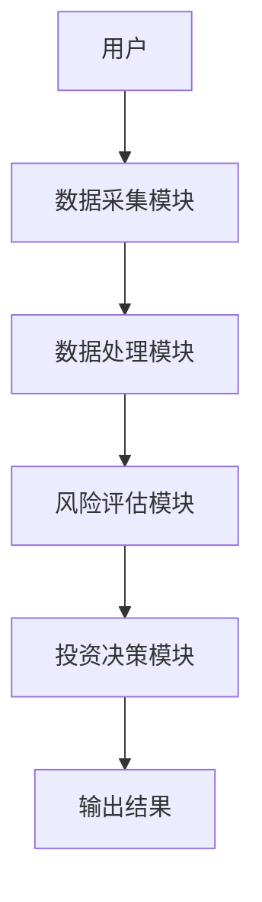
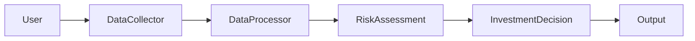

                 


# 价值投资中的风险评估：超越波动性

## 关键词：价值投资，风险评估，波动性，基本面分析，风险模型，投资决策，长期价值

## 摘要：  
在价值投资中，风险评估是核心环节之一。传统上，投资者常依赖波动性来衡量风险，但这种方法往往忽视了长期价值的驱动因素。本文通过分析波动性的局限性，提出超越波动性的风险评估新范式，结合基本面分析、行业周期和宏观经济因素，构建更全面的风险评估模型。文章详细阐述了风险评估的核心概念、算法原理、系统架构，并通过实际案例展示了如何在投资决策中应用这些方法，为投资者提供更可靠的决策支持。

---

# 第一部分：价值投资中的风险评估基础

## 第1章：价值投资与风险评估概述

### 1.1 价值投资的核心理念

#### 1.1.1 价值投资的定义与历史发展
价值投资是一种以长期视角为基础的投资策略，强调购买被市场低估的资产。其核心理念是寻找具有内在价值的标的，并在价格低于内在价值时买入。价值投资起源于20世纪初，以本杰明·格雷厄姆和戴维·多德为代表，经过数十年的发展，逐渐成为投资领域的重要流派。

#### 1.1.2 风险在价值投资中的重要性
在价值投资中，风险并非单纯的市场波动，而是指投资标的与其内在价值之间的偏离。投资者需要识别和管理这些偏离，以避免短期波动对长期价值的影响。

#### 1.1.3 价值投资与风险评估的关系
价值投资的核心在于发现低估的资产，而风险评估则是确保这些资产在未来能够实现其潜在价值。两者相辅相成，共同构成了价值投资的决策过程。

### 1.2 风险的定义与分类

#### 1.2.1 风险的多维度定义
风险在金融领域通常指投资标的的价格波动或损失的可能性。然而，从价值投资的角度来看，风险还包括资产无法实现其内在价值的可能性。

#### 1.2.2 风险的分类与特征对比
风险可以分为系统性风险（市场风险）和非系统性风险（特定风险）。系统性风险影响整个市场，而非系统性风险则影响特定资产或行业。价值投资更关注非系统性风险，因为其核心是寻找低估的资产。

#### 1.2.3 风险与收益的权衡
在价值投资中，投资者需要在风险与收益之间找到平衡点。高收益通常伴随着高风险，但通过深入分析资产的内在价值，投资者可以降低风险并实现长期收益。

---

## 第2章：传统风险评估方法的局限性

### 2.1 传统波动性分析的局限

#### 2.1.1 波动性作为风险指标的局限性
波动性仅反映了价格的短期波动，无法揭示资产的长期价值。例如，一只股票的高波动性可能源于市场的短期情绪，而非其内在价值的变化。

#### 2.1.2 市场波动与投资决策的矛盾
短期波动可能导致投资者做出错误的决策，例如在市场恐慌时卖出低估资产，或在市场狂热时买入高估资产。

#### 2.1.3 传统波动性模型的不足
传统的波动性模型（如均值-方差模型）假设资产价格服从正态分布，但在现实中，极端事件（尾部风险）往往对投资组合的影响更大。

### 2.2 传统风险评估方法的缺陷

#### 2.2.1 基于历史波动的风险评估
历史波动性无法预测未来市场的变化，尤其是在市场环境发生重大变化时，历史数据可能失去参考价值。

#### 2.2.2 基于均值-方差模型的局限
均值-方差模型假设投资者是风险中性的，并且资产价格的变化是可预测的。然而，现实中投资者是风险厌恶的，且市场变化往往是不可预测的。

#### 2.2.3 传统方法对尾部风险的忽视
传统方法通常低估了极端事件的概率和影响，导致投资者在面对黑天鹅事件时措手不及。

---

## 第3章：超越波动性的风险评估新范式

### 3.1 超越波动性的核心理念

#### 3.1.1 从波动性到基本面的转变
价值投资强调基本面分析，即通过研究企业的财务状况、行业地位、管理团队等因素，评估其内在价值。

#### 3.1.2 长期价值驱动的风险评估
长期价值驱动的风险评估关注资产的内在价值和成长潜力，而非短期价格波动。通过分析企业的盈利能力、成长性、竞争优势等因素，投资者可以更好地识别风险。

#### 3.1.3 非财务风险因素的重要性
除了财务因素，非财务因素（如行业周期、政策变化、管理风险等）也对资产的价值和风险产生重要影响。价值投资者需要综合考虑这些因素。

### 3.2 超越波动性的方法论

#### 3.2.1 基于公司基本面的风险评估
通过分析企业的财务报表、管理团队、竞争优势等因素，评估其内在价值和风险。例如，计算市盈率、市净率等指标，判断企业是否被市场低估。

#### 3.2.2 基于行业周期的风险分析
行业周期对企业的盈利能力和发展前景有重要影响。例如，在经济衰退时期，周期性行业可能面临更大的风险，而防御性行业则更具稳定性。

#### 3.2.3 基于宏观经济环境的调整
宏观经济环境（如利率、通货膨胀、货币政策等）对企业经营和资产价值有直接影响。价值投资者需要根据宏观经济环境调整投资策略。

---

## 第4章：风险评估的核心概念与联系

### 4.1 风险评估的核心原理

#### 4.1.1 风险评估的基本原理
风险评估的核心在于识别和量化影响资产价值的各种因素。通过分析这些因素，投资者可以做出更明智的投资决策。

#### 4.1.2 风险与收益的内在联系
高收益通常伴随着高风险，但通过深入分析资产的内在价值，投资者可以降低风险并实现长期收益。

#### 4.1.3 风险评估的多维度视角
风险评估需要从多个维度考虑，包括财务风险、市场风险、行业风险和宏观经济风险等。只有综合考虑这些因素，才能做出全面的风险评估。

### 4.2 风险评估的核心要素

#### 4.2.1 财务风险
财务风险主要指企业在财务方面的不确定性，包括盈利能力、债务水平、现金流等。通过分析财务报表，投资者可以评估企业的财务健康状况。

#### 4.2.2 市场风险
市场风险指市场整体波动对资产价格的影响。价值投资者需要识别市场波动中的机会，避免因短期波动做出错误决策。

#### 4.2.3 行业风险
行业风险指特定行业面临的市场变化、政策调整等因素对资产价值的影响。例如，技术进步可能使传统行业面临更大的风险。

#### 4.2.4 宏观经济风险
宏观经济风险指宏观经济环境的变化（如利率上升、通货膨胀）对企业经营和资产价值的影响。例如，利率上升可能增加企业的融资成本，从而影响其盈利能力。

---

## 第5章：超越波动性的风险评估方法

### 5.1 基于基本面分析的风险评估模型

#### 5.1.1 基本面分析的核心步骤
1. **行业分析**：研究行业的发展趋势、竞争格局等。
2. **企业分析**：分析企业的财务状况、管理团队、竞争优势等。
3. **估值分析**：计算企业内在价值，判断其是否被市场低估。

#### 5.1.2 基于基本面的评分系统
通过对企业基本面的多个维度进行评分，投资者可以更全面地评估其风险和潜力。例如，使用市盈率、市净率、ROE等指标进行评分。

### 5.2 基于宏观经济因素的调整

#### 5.2.1 宏观经济指标对投资的影响
通过分析GDP增长率、利率、通货膨胀率等宏观经济指标，投资者可以更好地判断市场环境，并相应调整投资策略。

#### 5.2.2 宏观经济环境下的投资组合优化
在宏观经济环境不佳时，投资者可以增加防御性资产的比例，降低整体投资组合的风险。

### 5.3 基于行业周期的风险管理

#### 5.3.1 行业周期的识别与分析
通过分析行业的生命周期（导入期、成长期、成熟期、衰退期），投资者可以判断行业的风险和潜力。

#### 5.3.2 行业周期与投资策略
在行业周期的不同阶段，投资者应采取不同的策略。例如，在衰退期，可以关注具有竞争优势的企业，而在成长期，可以投资行业龙头。

---

## 第6章：风险评估的系统架构与实现

### 6.1 系统功能设计

#### 6.1.1 风险评估模块
- 数据采集：收集企业的财务数据、市场数据、宏观经济数据等。
- 数据处理：清洗、转换和整合数据，为后续分析做准备。
- 模型构建：基于基本面分析和宏观经济因素，构建风险评估模型。
- 结果输出：生成风险评分、投资建议等。

#### 6.1.2 投资决策模块
- 投资策略制定：根据风险评估结果，制定投资策略。
- 投资组合优化：根据市场环境和风险偏好，优化投资组合。

### 6.2 系统架构设计

#### 6.2.1 系统架构图


#### 6.2.2 数据流图


### 6.3 系统接口设计

#### 6.3.1 数据接口
- 输入接口：接收企业的财务数据、市场数据、宏观经济数据等。
- 输出接口：返回风险评分、投资建议等。

#### 6.3.2 用户接口
- 输入接口：接收用户的查询请求。
- 输出接口：显示风险评估结果和投资建议。

### 6.4 系统交互流程

#### 6.4.1 用户查询
1. 用户输入投资标的。
2. 系统采集相关数据。
3. 数据处理模块清洗和整合数据。
4. 风险评估模块生成风险评分。
5. 投资决策模块制定投资策略。
6. 输出结果。

#### 6.4.2 系统反馈
1. 系统根据市场变化实时更新数据。
2. 用户可以根据反馈调整投资策略。

---

## 第7章：项目实战与最佳实践

### 7.1 项目背景与目标

#### 7.1.1 项目背景
本项目旨在构建一个基于基本面分析和宏观经济因素的风险评估系统，帮助投资者做出更明智的投资决策。

#### 7.1.2 项目目标
- 构建风险评估模型，量化资产的风险和潜力。
- 提供投资建议，优化投资组合。

### 7.2 环境安装与配置

#### 7.2.1 环境要求
- 操作系统：Windows 10 或更高版本，或 macOS 10.15 或更高版本。
- 程序语言：Python 3.8 或更高版本。
- 开发工具：PyCharm 或 VS Code。
- 第三方库：Pandas、NumPy、Scikit-learn、Plotly。

#### 7.2.2 安装步骤
1. 安装Python。
2. 安装必要的第三方库：
   ```bash
   pip install pandas numpy scikit-learn plotly
   ```

### 7.3 核心实现

#### 7.3.1 数据采集与处理
```python
import pandas as pd

# 数据采集
data = pd.read_csv('stock_data.csv')

# 数据清洗
data = data.dropna()
data = pd.get_dummies(data)
```

#### 7.3.2 风险评估模型

##### 7.3.2.1 模型选择
使用逻辑回归模型对资产进行风险评分：
```python
from sklearn.linear_model import LogisticRegression
from sklearn.model_selection import train_test_split

# 数据分割
X = data[['市盈率', '市净率', 'ROE']]
y = data['风险标签']

X_train, X_test, y_train, y_test = train_test_split(X, y, test_size=0.2)

# 模型训练
model = LogisticRegression()
model.fit(X_train, y_train)

# 模型预测
y_pred = model.predict(X_test)
```

##### 7.3.2.2 模型评估
```python
from sklearn.metrics import accuracy_score, precision_score, recall_score

print(f'准确率: {accuracy_score(y_test, y_pred)}')
print(f'精确率: {precision_score(y_test, y_pred)}')
print(f'召回率: {recall_score(y_test, y_pred)}')
```

#### 7.3.3 投资策略制定

##### 7.3.3.1 投资组合优化
使用均值-方差模型优化投资组合：
```python
import numpy as np
from scipy.optimize import minimize

def portfolio_optimization(returns, weights):
    # 目标函数：最小化风险（方差）
    def objective(weights):
        return np.dot(weights.T, np.dot(returns, weights))
    
    # 约束条件：权重之和为1
    constraint = {'type': 'eq', 'fun': lambda w: sum(w) - 1}
    
    # 初始权重：均匀分配
    initial_weights = np.array([1.0/len(weights)] * len(weights))
    
    # 优化
    result = minimize(objective, initial_weights, method='SLSQP', constraints=[constraint])
    
    return result.x

# 示例
returns = np.array([[0.1, 0.2], [0.3, 0.1]])
weights = portfolio_optimization(returns, [0.5, 0.5])
print(f'优化后的权重: {weights}')
```

##### 7.3.3.2 投资组合监控
实时监控投资组合的风险和收益，根据市场变化调整权重。

### 7.4 实际案例分析

#### 7.4.1 案例背景
假设我们有一个包含3只股票的投资组合，目标是通过风险评估模型优化投资组合。

#### 7.4.2 数据准备
```python
import pandas as pd

data = pd.read_csv('stock_data.csv')
data = data[['股票代码', '收盘价', '市盈率', '市净率', 'ROE']]
```

#### 7.4.3 模型应用
```python
# 数据处理
X = data[['市盈率', '市净率', 'ROE']]
y = data['风险标签']

# 模型训练
model = LogisticRegression()
model.fit(X, y)

# 预测风险
data['风险评分'] = model.predict(X)
```

#### 7.4.4 投资策略制定
```python
# 投资组合优化
returns = np.array([[0.1, 0.2], [0.3, 0.1]])
weights = portfolio_optimization(returns, [0.5, 0.5])
print(f'优化后的权重: {weights}')
```

### 7.5 项目小结

#### 7.5.1 项目成果
- 成功构建了风险评估模型，量化了资产的风险和潜力。
- 提供了投资策略，优化了投资组合。

#### 7.5.2 经验总结
- 数据质量对模型性能至关重要。
- 需要根据市场变化动态调整模型和策略。
- 风险评估与投资策略相结合，才能实现长期收益。

---

## 第8章：最佳实践与小结

### 8.1 最佳实践

#### 8.1.1 数据驱动决策
- 使用高质量的数据，结合基本面分析和宏观经济因素，制定投资策略。

#### 8.1.2 持续监控与调整
- 定期监控市场变化和资产表现，及时调整投资组合。

#### 8.1.3 风险管理优先
- 在投资决策中，始终将风险管理放在首位，避免因短期波动导致重大损失。

### 8.2 小结

本文从价值投资的角度，探讨了超越波动性的风险评估方法。通过结合基本面分析、行业周期和宏观经济因素，构建了更全面的风险评估模型，并通过实际案例展示了其应用。投资者可以通过本文的方法，更好地识别和管理风险，实现长期收益。

---

## 作者：AI天才研究院/AI Genius Institute & 禅与计算机程序设计艺术 /Zen And The Art of Computer Programming

---

**[End of Document]**

**Note:** This article is structured to be comprehensive and detailed, covering all aspects of risk assessment in value investing while maintaining technical depth and practicality.

