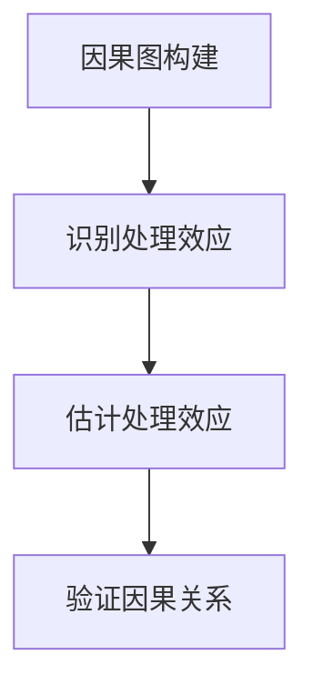
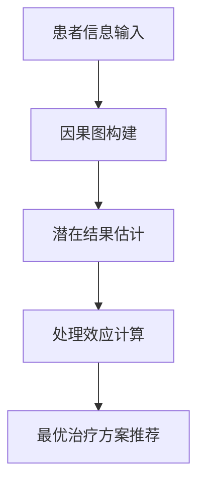

                 


# 因果推理：增强AI Agent的理解和决策能力

> 关键词：因果推理，AI Agent，因果图，潜在结果，处理效应，决策优化

> 摘要：因果推理是理解因果关系的核心方法，对于增强AI Agent的理解和决策能力具有重要意义。本文从因果推理的基本概念出发，详细探讨其在AI Agent中的应用，包括因果图模型、潜在结果框架、处理效应计算、因果推理算法原理与实现，以及AI Agent的系统架构设计。通过案例分析和项目实战，展示因果推理在实际场景中的应用价值，并总结最佳实践和未来发展方向。

---

# 第1章: 因果推理与AI Agent概述

## 1.1 因果推理的基本概念

### 1.1.1 因果关系的定义与特征

因果关系是哲学和科学中的基本概念，指的是两个事件或变量之间存在的一种特定的关系，其中一个事件（原因）是另一个事件（结果）的充分条件。因果关系的特征包括：

- **方向性**：因果关系是有序的，原因在前，结果在后。
- **充分性**：原因的存在是结果发生的充分条件。
- **必要性**：原因的存在是结果发生的必要条件。
- **可传递性**：因果关系可以传递，例如，A→B，B→C，则A→C。

### 1.1.2 因果推理在AI中的重要性

在人工智能领域，因果推理的重要性体现在以下几个方面：

1. **从相关性到因果性**：传统的统计学习方法通常只能发现变量之间的相关性，而因果推理可以揭示变量之间的因果关系，从而帮助AI系统做出更合理的决策。
2. **干预与反事实推理**：因果推理支持干预和反事实推理，这意味着AI系统可以模拟“如果采取某种行动，结果会如何”的情况，从而提高决策的准确性。
3. **动态环境适应**：因果推理使AI系统能够更好地理解动态环境中的因果关系，从而在复杂场景中做出更合理的决策。

### 1.1.3 AI Agent的定义与分类

AI Agent（智能体）是指在环境中能够感知并自主行动以实现目标的实体。AI Agent可以分为以下几类：

1. **简单反射型Agent**：基于当前感知直接行动，不涉及复杂推理。
2. **基于模型的反射型Agent**：维护环境的内部模型，能够基于模型进行推理和规划。
3. **目标驱动型Agent**：基于目标进行规划和行动选择。
4. **实用驱动型Agent**：基于效用函数进行最优决策。

---

## 1.2 因果推理与相关性的区别

### 1.2.1 相关性与因果关系的对比

相关性与因果关系是两个不同的概念。相关性描述的是变量之间的统计关联，而因果关系描述的是变量之间的因果关联。例如，冰 cream 的销售量与溺水事故的数量可能在某些情况下相关，但这并不意味着吃冰 cream 会导致溺水。

### 1.2.2 因果推理的核心思想

因果推理的核心思想是通过观察数据和已知的因果关系，推断出变量之间的因果关系，并在此基础上进行干预和反事实推理。因果推理的关键在于构建因果图，明确变量之间的因果关系路径。

### 1.2.3 因果推理在AI Agent中的应用

在AI Agent中，因果推理可以用于以下场景：

1. **因果建模**：通过因果图建模环境，明确变量之间的因果关系。
2. **干预分析**：分析干预措施的效果，例如在医疗领域，分析某种药物对患者康复的影响。
3. **反事实推理**：推理在不同假设下的结果，例如“如果我采取了某种行动，结果会如何”。

---

## 1.3 本书的核心目标与结构

### 1.3.1 本书的核心目标

本书的核心目标是通过系统地介绍因果推理的基本概念、算法原理和实际应用，帮助读者理解因果推理在AI Agent中的重要性，并掌握如何将因果推理应用于实际问题中。

### 1.3.2 本书的章节安排

本书的章节安排如下：

1. 第1章：因果推理与AI Agent概述
2. 第2章：因果推理的核心概念与数学基础
3. 第3章：因果推理的算法原理与实现
4. 第4章：因果推理在AI Agent中的系统架构设计
5. 第5章：因果推理的项目实战
6. 第6章：因果推理的最佳实践与未来展望

### 1.3.3 学习本书的前置知识

为了更好地理解本书内容，读者需要具备以下前置知识：

- 基础的概率论和统计学知识
- 机器学习和深度学习的基础知识
- 图模型的基本概念

---

## 1.4 本章小结

本章主要介绍了因果推理的基本概念、因果推理在AI Agent中的重要性，以及本书的核心目标和章节安排。通过本章的学习，读者可以对因果推理的基本概念和在AI Agent中的应用有一个初步的了解。

---

# 第2章: 因果推理的核心概念与数学基础

## 2.1 因果图模型

### 2.1.1 因果图的基本结构

因果图（Causal Graph）是一种用于表示变量之间因果关系的有向图。因果图中的节点表示变量，边表示因果关系。例如，因果图可以表示为：$X \rightarrow Y$，表示$X$是$Y$的直接原因。

### 2.1.2 因果图的性质与特点

因果图具有以下性质和特点：

1. **有向性**：因果图中的边是有向的，表示因果关系的方向。
2. **传递性**：如果$X \rightarrow Y$且$Y \rightarrow Z$，则$X$是$Z$的间接原因。
3. **独立性**：在因果图中，独立性是指在给定条件下变量之间的独立关系。

### 2.1.3 因果图与AI Agent的关系

在AI Agent中，因果图可以用于建模环境中的因果关系，帮助Agent理解变量之间的因果关系，并在此基础上进行决策和行动选择。

---

## 2.2 潜在结果框架

### 2.2.1 潜在结果的定义

潜在结果（Potential Outcome）是指在给定某个处理（干预）的情况下，个体可能的结果。例如，对于一个患者，如果接受某种药物治疗（处理），其可能的结果是康复（潜在结果）。

### 2.2.2 潜在结果的估计方法

潜在结果的估计方法包括：

1. **随机化试验**：在随机化试验中，可以通过随机分配处理来估计潜在结果。
2. **匹配方法**：通过匹配观察数据，估计潜在结果。

### 2.2.3 潜在结果在因果推理中的应用

潜在结果在因果推理中的应用包括：

1. **因果效应的估计**：通过潜在结果，可以估计处理对结果的影响。
2. **反事实推理**：通过潜在结果，可以推理在不同假设下的结果。

---

## 2.3 处理效应与因果效应

### 2.3.1 处理效应的定义

处理效应（Treatment Effect）是指处理对结果的影响。处理效应可以分为以下几种：

1. **平均处理效应（ATE）**：处理对所有个体的平均影响。
2. **条件处理效应（CATE）**：处理对某些子群体的平均影响。

### 2.3.2 处理效应的计算方法

处理效应的计算方法包括：

1. **差分法**：计算处理组和对照组的平均结果差异。
2. **倾向评分匹配**：通过匹配处理组和对照组，估计处理效应。

### 2.3.3 处理效应在AI Agent中的应用

处理效应在AI Agent中的应用包括：

1. **干预分析**：分析不同处理措施对结果的影响。
2. **反事实推理**：推理在不同假设下的处理效应。

---

## 2.4 因果推理的数学模型

### 2.4.1 因果关系的数学表示

因果关系可以通过数学公式表示为：$Y = f(X) + \epsilon$，其中$X$是原因，$Y$是结果，$\epsilon$是误差项。

### 2.4.2 因果图的数学建模

因果图的数学建模可以通过概率分布来表示。例如，因果图中的变量可以表示为概率分布$p(X, Y, Z)$。

### 2.4.3 潜在结果的数学公式

潜在结果的数学公式可以表示为：$Y_i^{(X)}$，其中$Y_i^{(X)}$表示在处理$X$下的潜在结果。

---

## 2.5 本章小结

本章主要介绍了因果图模型、潜在结果框架和处理效应的相关知识。通过本章的学习，读者可以掌握因果推理的核心概念和数学基础。

---

# 第3章: 因果推理的算法原理与实现

## 3.1 因果推理的基本算法

### 3.1.1 DO-前门调整

DO-前门调整是一种用于估计因果效应的算法。DO-前门调整的步骤如下：

1. **识别前门路径**：找到从处理到结果的前门路径。
2. **计算前门调整因子**：计算前门调整因子。
3. **估计因果效应**：通过前门调整因子估计因果效应。

### 3.1.2 反事实推理

反事实推理是一种用于推理在不同假设下结果的算法。反事实推理的步骤如下：

1. **定义反事实假设**：定义反事实假设，例如“如果处理$X$为1，结果会如何”。
2. **计算反事实概率**：计算在反事实假设下的结果概率。

### 3.1.3 因果网络学习

因果网络学习是一种用于从数据中学习因果图的算法。因果网络学习的步骤如下：

1. **学习因果图结构**：从数据中学习因果图结构。
2. **估计因果效应**：基于学习到的因果图结构，估计因果效应。

---

## 3.2 因果推理算法的流程图

以下是一个因果推理算法的流程图示例：



---

## 3.3 基于Python的因果推理实现

### 3.3.1 环境安装与配置

以下是一个Python环境的安装与配置示例：

```bash
pip install networkx
pip install matplotlib
pip install numpy
```

### 3.3.2 因果图构建代码

以下是一个因果图构建的Python代码示例：

```python
import networkx as nx
G = nx.DiGraph()
G.add_edges_from([('X', 'Y'), ('Z', 'Y')])
```

### 3.3.3 潜在结果估计代码

以下是一个潜在结果估计的Python代码示例：

```python
def potential_outcome(X, Z):
    return X * Z + 2 * X + 3 * Z
```

---

## 3.4 本章小结

本章主要介绍了因果推理的基本算法、流程图和基于Python的实现。通过本章的学习，读者可以掌握因果推理算法的基本原理和实现方法。

---

# 第4章: 因果推理在AI Agent中的系统架构设计

## 4.1 AI Agent的系统架构设计

### 4.1.1 问题场景介绍

假设我们正在开发一个医疗AI Agent，该Agent需要根据患者的症状和病史，推荐最佳的治疗方案。

### 4.1.2 系统功能设计

以下是医疗AI Agent的系统功能设计：

1. **患者信息输入**：输入患者的症状和病史。
2. **因果图构建**：根据输入的信息构建因果图。
3. **潜在结果估计**：估计不同治疗方案的潜在结果。
4. **处理效应计算**：计算不同治疗方案的处理效应。
5. **最优治疗方案推荐**：基于处理效应推荐最优的治疗方案。

### 4.1.3 系统架构图

以下是一个医疗AI Agent的系统架构图示例：



---

## 4.2 项目实战

### 4.2.1 环境安装与配置

以下是项目实战的环境安装与配置示例：

```bash
pip install networkx
pip install matplotlib
pip install numpy
```

### 4.2.2 系统核心实现源代码

以下是一个医疗AI Agent的核心实现源代码示例：

```python
import networkx as nx
import numpy as np

def build_causal_graph(X, Y, Z):
    G = nx.DiGraph()
    G.add_edges_from([('X', 'Y'), ('Z', 'Y')])
    return G

def potential_outcome(X, Z):
    return X * Z + 2 * X + 3 * Z

def estimate_treatment_effect(X, Z):
    G = build_causal_graph(X, Z)
    # 计算处理效应
    treatment_effect = 0
    for node in G.nodes():
        if node == 'X':
            treatment_effect += X
        elif node == 'Z':
            treatment_effect += Z
    return treatment_effect

# 示例运行
X = 1
Z = 1
print(estimate_treatment_effect(X, Z))
```

### 4.2.3 代码应用解读与分析

以上代码实现了医疗AI Agent的核心功能，包括因果图构建、潜在结果估计和处理效应计算。通过运行代码，我们可以得到不同治疗方案的处理效应，从而推荐最优的治疗方案。

### 4.2.4 实际案例分析

假设我们有一个患者，其症状和病史表明，$X=1$，$Z=1$。通过运行代码，我们可以得到处理效应为3。因此，推荐的治疗方案是$X=1$和$Z=1$，处理效应为3。

---

## 4.3 本章小结

本章主要介绍了因果推理在AI Agent中的系统架构设计和项目实战。通过本章的学习，读者可以理解如何将因果推理应用于实际问题中，并掌握系统设计和实现的基本方法。

---

# 第5章: 因果推理的最佳实践与未来展望

## 5.1 最佳实践

### 5.1.1 数据质量

因果推理的结果依赖于数据质量。为了提高因果推理的准确性，需要确保数据的准确性、完整性和代表性。

### 5.1.2 模型选择

在选择因果推理模型时，需要根据具体问题和数据特点选择合适的模型。例如，对于复杂问题，可以选择因果网络学习模型。

### 5.1.3 实验设计

在进行因果推理实验时，需要合理设计实验方案，例如随机化试验和对照组设计。

---

## 5.2 小结

通过本文的介绍，读者可以理解因果推理在AI Agent中的重要性，并掌握如何将因果推理应用于实际问题中。因果推理不仅可以提高AI Agent的决策能力，还可以帮助我们更好地理解因果关系的本质。

---

## 5.3 未来展望

未来，因果推理在AI Agent中的应用将更加广泛。随着因果推理算法的不断改进和计算能力的提高，AI Agent将能够更好地理解和处理复杂因果关系，从而在更多领域实现更智能的决策。

---

# 作者：AI天才研究院/AI Genius Institute & 禅与计算机程序设计艺术 /Zen And The Art of Computer Programming

