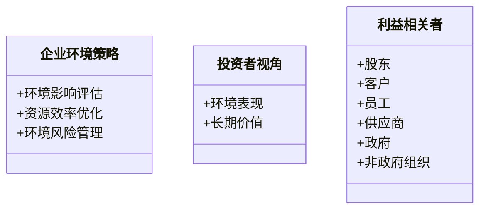

                 


# 彼得林奇如何看待公司的环境可持续性策略

## 关键词：彼得·林奇，环境可持续性，企业策略，投资决策，ESG评分模型，可持续发展

## 摘要：  
本文从彼得·林奇的投资视角，深入分析公司环境可持续性策略的重要性及其对长期投资价值的影响。通过核心概念、算法原理、系统架构及实际案例的详细讲解，揭示环境可持续性策略在企业运营和投资决策中的关键作用，并提供可操作的实施建议和最佳实践。

---

# 第一部分: 可持续发展与企业环境策略的背景

## 第1章: 可持续发展与企业环境策略概述

### 1.1 可持续发展的重要性

#### 1.1.1 可持续发展的定义与内涵  
可持续发展是指在满足当前需求的同时，不损害后代人满足其需求的能力。在企业层面，这意味着在追求利润的同时，关注环境保护、社会责任和经济效率的平衡。

#### 1.1.2 企业环境策略的核心目标  
企业环境策略的核心目标包括减少环境影响、优化资源利用、降低环境风险以及提升企业形象。

#### 1.1.3 可持续发展对企业的长期影响  
可持续发展不仅有助于企业规避环境风险，还能提升企业的竞争力和品牌价值，从而为企业创造长期的经济利益。

### 1.2 企业社会责任与环境策略

#### 1.2.1 企业社会责任（CSR）的定义  
企业社会责任是指企业在追求经济效益的同时，关注环境保护、员工福利、社区发展和消费者权益等方面的责任。

#### 1.2.2 环境策略在企业社会责任中的地位  
环境策略是企业履行社会责任的重要组成部分，体现了企业对环境保护的承诺。

#### 1.2.3 企业环境策略的多利益相关者视角  
企业环境策略需要考虑股东、客户、员工、供应商、政府和非政府组织等多方利益相关者的期望和需求。

### 1.3 投资者视角下的环境可持续性

#### 1.3.1 投资者对环境风险的关注  
投资者 increasingly recognize that environmental risks, such as climate change and resource scarcity, pose significant threats to企业价值。

#### 1.3.2 环境表现对投资决策的影响  
企业的环境表现直接影响投资者的决策，优秀的环境表现通常被视为企业具备较强的风险管理和长期发展潜力的体现。

#### 1.3.3 环境可持续性与企业长期价值的关系  
环境可持续性与企业长期价值密切相关，企业通过实施有效的环境策略可以提升其市场地位和抗风险能力。

### 1.4 本章小结  
本章从可持续发展的定义、企业环境策略的核心目标、环境策略在企业社会责任中的地位以及投资者视角下的环境可持续性等方面进行了详细阐述，为后续分析奠定了基础。

---

# 第二部分: 环境可持续性策略的核心概念与联系

## 第2章: 核心概念与联系

### 2.1 环境可持续性策略的核心要素

#### 2.1.1 环境影响评估  
环境影响评估是企业识别和量化其活动对环境影响的关键步骤。

#### 2.1.2 资源效率优化  
资源效率优化通过提高资源利用效率，减少浪费，降低环境负担。

#### 2.1.3 环境风险管理  
环境风险管理旨在识别、评估和应对企业可能面临的环境风险，确保企业稳健发展。

### 2.2 企业社会责任与环境策略的对比分析

#### 2.2.1 核心概念对比  
| 概念 | 定义 | 关注点 |
|------|------|--------|
| 环境策略 | 企业为减少环境影响而采取的措施 | 环境保护、资源利用 |
| 企业社会责任（CSR） | 企业在追求利润的同时，关注社会和环境责任 | 社会责任、员工福利、社区发展 |

#### 2.2.2 ER实体关系图  
```mermaid
erd
    root
        企业环境策略
            环境影响评估
            资源效率优化
            环境风险管理
        投资者视角
            环境表现
            长期价值
        利益相关者
            股东
            客户
            员工
            供应商
            政府
            非政府组织
```

### 2.3 环境可持续性与企业绩效的关联

#### 2.3.1 环境表现与财务绩效的关系  
研究表明，优秀的环境表现通常与较高的财务绩效相关，主要体现在品牌价值提升、成本降低和风险规避等方面。

#### 2.3.2 可持续发展对企业竞争力的影响  
可持续发展能力越强的企业，通常在市场上更具竞争力，能够吸引更多的客户和优秀人才。

#### 2.3.3 环境策略的长期收益与短期成本平衡  
企业需要在短期成本投入和长期收益之间找到平衡，通过合理的规划和资源配置，实现可持续发展。

### 2.4 本章小结  
本章通过对比分析环境策略和企业社会责任的核心概念，并结合ER实体关系图，揭示了环境可持续性策略在企业绩效和竞争力中的重要性。

---

# 第三部分: 环境可持续性策略的算法与数学模型

## 第3章: 环境可持续性评估的算法原理

### 3.1 ESG评分模型

#### 3.1.1 ESG评分模型的定义  
ESG评分模型是根据环境（E）、社会（S）和治理（G）三个维度对企业进行评分的模型。

#### 3.1.2 模型的输入与输出  
- **输入**：企业的环境表现、社会责任履行情况、治理结构等。
- **输出**：企业的ESG评分，通常以0-100分或A-F等级表示。

#### 3.1.3 模型的实现步骤  
1. 收集企业相关的环境、社会和治理数据。
2. 根据权重分配对各维度进行评分。
3. 综合各维度评分，得出最终ESG评分。

#### 3.1.4 代码示例  
```python
def calculate_esg_rating(environment_score, social_score, governance_score):
    # 权重分配，可根据具体需求调整
    weights = {'environment': 0.4, 'social': 0.3, 'governance': 0.3}
    total_score = environment_score * weights['environment'] + \
                   social_score * weights['social'] + \
                   governance_score * weights['governance']
    return round(total_score, 2)

# 示例数据
environment_score = 85
social_score = 75
governance_score = 80

rating = calculate_esg_rating(environment_score, social_score, governance_score)
print(f"ESG Rating: {rating}%")
```

### 3.2 投资组合优化算法

#### 3.2.1 投资组合优化的定义  
投资组合优化是指根据风险偏好和收益目标，选择最优资产组合以实现最大收益或最小风险。

#### 3.2.2 算法的数学模型  
$$ \text{目标函数：} \min \sum_{i=1}^{n} w_i^2 \sigma_i^2 $$
$$ \text{约束条件：} \sum_{i=1}^{n} w_i = 1, \quad w_i \geq 0 $$

其中，\( w_i \) 是资产 \( i \) 的权重，\( \sigma_i \) 是资产 \( i \) 的标准差。

#### 3.2.3 算法的实现流程  
1. 确定投资目标和风险偏好。
2. 收集相关资产的历史数据。
3. 计算各资产的收益率和风险。
4. 使用优化算法（如均值-方差优化）确定最优投资组合。

### 3.3 环境风险评估的数学模型

#### 3.3.1 环境风险评估的定义  
环境风险评估是指对企业面临的环境风险进行识别、量化和评估的过程。

#### 3.3.2 环境风险评估的数学公式  
$$ \text{环境风险指数} = \sum_{i=1}^{n} (R_i \times W_i) $$
其中，\( R_i \) 是风险因素的评分，\( W_i \) 是权重。

#### 3.3.3 案例分析  
假设某企业面临以下环境风险：
- 气候变化风险：评分80，权重0.4
- 资源枯竭风险：评分60，权重0.3
- 环境法规风险：评分70，权重0.3

环境风险指数 = (80 × 0.4) + (60 × 0.3) + (70 × 0.3) = 32 + 18 + 21 = 71

### 3.4 本章小结  
本章通过介绍ESG评分模型、投资组合优化算法和环境风险评估的数学模型，展示了如何将环境可持续性策略量化为可操作的决策工具。

---

# 第四部分: 系统分析与架构设计方案

## 第4章: 系统分析与架构设计

### 4.1 问题场景介绍

#### 4.1.1 企业环境策略的实施问题  
企业在实施环境策略时，常常面临数据收集困难、成本高昂、效果评估复杂等问题。

#### 4.1.2 投资者视角下的环境评估需求  
投资者需要可靠的环境数据和评估工具来支持投资决策。

#### 4.1.3 系统的目标与范围  
本系统旨在为企业和投资者提供一个高效、透明的环境可持续性评估平台。

### 4.2 系统功能设计

#### 4.2.1 领域模型  


#### 4.2.2 系统架构设计  


#### 4.2.3 接口设计与交互流程图  
```mermaid
sequenceDiagram
    投资者 --> 数据收集模块: 请求环境数据
    数据收集模块 --> 数据清洗器: 提供数据
    数据清洗器 --> ESG评分器: 传递清洗后的数据
    ESG评分器 -->抽取出环境评分
    投资者 -->抽取出ESG评分
```

### 4.3 本章小结  
本章通过系统分析与架构设计，展示了如何构建一个高效、透明的环境可持续性评估平台，以支持企业和投资者的决策需求。

---

# 第五部分: 项目实战

## 第5章: 项目实战

### 5.1 环境安装与配置

#### 5.1.1 安装Python与必要的库  
安装Python和Pandas、NumPy、Scipy等库。

#### 5.1.2 安装环境评估工具  
安装如ESG评分工具和投资组合优化工具。

### 5.2 系统核心实现源代码

#### 5.2.1 ESG评分器实现  
```python
import pandas as pd
import numpy as np

def calculate_esg_rating(environment, social, governance):
    weights = {'environment': 0.4, 'social': 0.3, 'governance': 0.3}
    total_score = environment * weights['environment'] + \
                   social * weights['social'] + \
                   governance * weights['governance']
    return round(total_score, 2)

# 示例数据
data = {
    '公司': ['A', 'B', 'C'],
    '环境': [85, 70, 90],
    '社会': [75, 80, 65],
    '治理': [80, 75, 90]
}

df = pd.DataFrame(data)
df['ESG评分'] = df.apply(lambda x: calculate_esg_rating(x['环境'], x['社会'], x['治理']), axis=1)
print(df)
```

#### 5.2.2 投资组合优化器实现  
```python
import numpy as np

def portfolio_optimization(returns, weights=None):
    n = len(returns)
    if weights is None:
        weights = np.ones(n) / n
    portfolio_return = np.dot(weights, returns)
    portfolio_risk = np.sqrt(np.dot(weights.T, np.dot(returns.cov(), weights)))
    return portfolio_return, portfolio_risk

# 示例数据
returns = np.array([0.1, 0.15, 0.08, 0.12])
portfolio_return, portfolio_risk = portfolio_optimization(returns)
print(f"组合收益率: {portfolio_return:.2%}")
print(f"组合风险: {portfolio_risk:.2%}")
```

### 5.3 代码应用解读与分析

#### 5.3.1 ESG评分器解读  
上述代码实现了基于权重的ESG评分计算，帮助企业量化环境表现。

#### 5.3.2 投资组合优化器解读  
该代码通过优化算法，帮助投资者找到风险与收益的最佳平衡点。

### 5.4 实际案例分析与详细讲解剖析  
以某行业为例，展示如何利用上述工具进行环境可持续性评估和投资决策优化。

### 5.5 项目小结  
本章通过实际代码实现，展示了如何将理论应用于实践，帮助企业和投资者有效实施环境可持续性策略。

---

# 第六部分: 最佳实践与总结

## 第6章: 最佳实践与总结

### 6.1 最佳实践 tips

#### 6.1.1 环境数据收集与管理  
确保环境数据的准确性和完整性，建立数据管理系统。

#### 6.1.2 投资者与企业的协同合作  
企业与投资者应加强沟通，共同推动环境可持续性。

#### 6.1.3 持续优化与创新  
定期评估环境策略的实施效果，及时调整和优化。

### 6.2 小结  
本文从彼得·林奇的投资视角，全面分析了环境可持续性策略对企业运营和投资决策的影响，并提供了可操作的实施建议和最佳实践。

### 6.3 注意事项  
企业在实施环境策略时，应结合自身特点和行业特点，制定切实可行的策略。

### 6.4 拓展阅读  
建议进一步阅读《投资学》、《环境经济学》等书籍，深入了解环境可持续性策略的经济学原理。

---

# 作者：AI天才研究院/AI Genius Institute & 禅与计算机程序设计艺术 /Zen And The Art of Computer Programming

