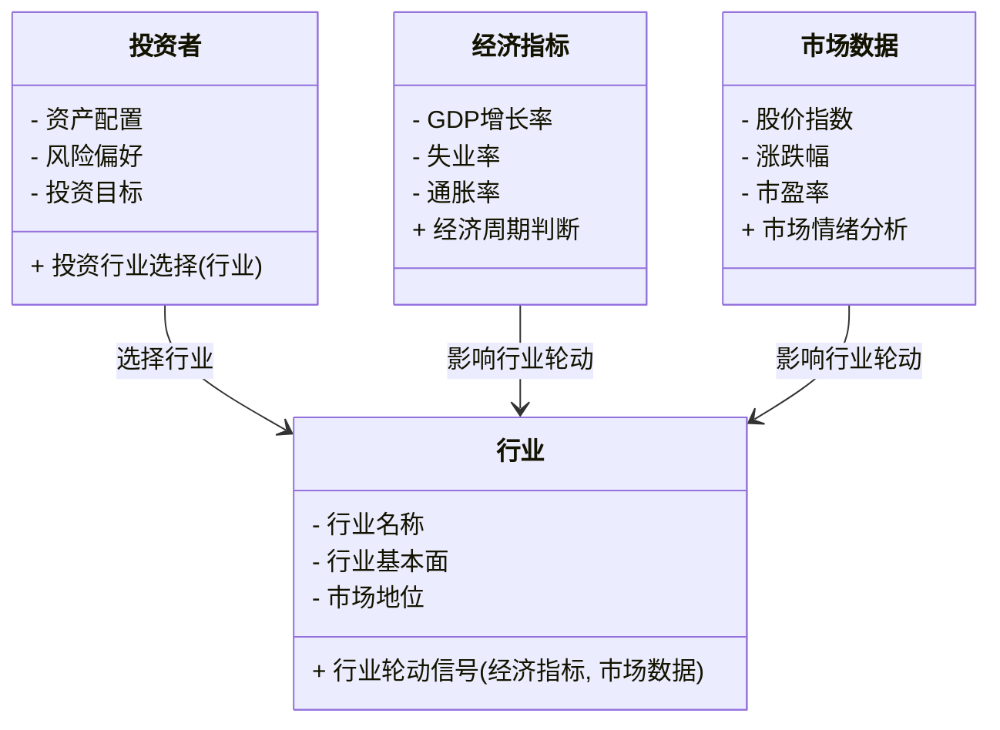
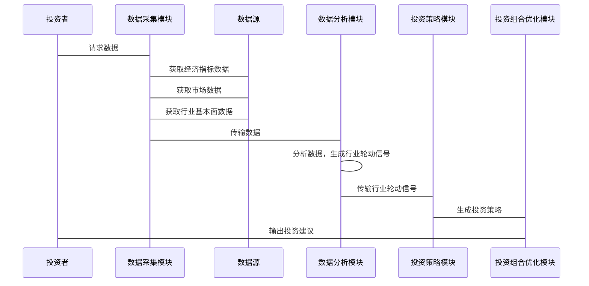

                 


# 彼得林奇的"行业轮动"在全球产业链重构中的应用

> 关键词：彼得林奇, 行业轮动, 全球产业链重构, 投资策略, 经济周期, 产业链优化

> 摘要：本文探讨了彼得林奇提出的“行业轮动”投资策略在全球产业链重构中的应用。通过分析行业轮动的基本理论、全球产业链重构的背景、行业轮动与产业链重构的关联、行业轮动的数学模型与算法原理、全球产业链重构中的行业轮动策略、系统分析与架构设计、项目实战、最佳实践与总结，本文为投资者提供了一种新的视角和方法，以在全球产业链重构中捕捉投资机会，优化投资组合。

---

## 第一部分: 彼得林奇的"行业轮动"理论与全球产业链重构的背景

### 第1章: 彼得林奇的"行业轮动"理论概述

#### 1.1 行业轮动的基本概念

##### 1.1.1 行业轮动的定义
行业轮动是指在不同的经济周期和市场环境中，投资者根据行业景气度、市场趋势和企业基本面的变化，将投资从一个行业转向另一个行业，以最大化收益、规避风险的投资策略。

##### 1.1.2 行业轮动的核心要素
- **经济周期**：经济周期的变化是行业轮动的核心驱动因素。例如，在经济衰退期，防御性行业（如公用事业、医疗保健）可能表现较好；而在经济复苏期，周期性行业（如制造业、科技行业）可能表现较好。
- **行业基本面**：行业的盈利能力、增长潜力、市场地位等基本面因素是行业轮动的重要依据。
- **市场情绪**：投资者情绪的变化会影响行业的资金流动和价格波动，从而影响行业轮动的时机和方向。

##### 1.1.3 行业轮动的驱动因素
- **经济周期**：经济周期的变化是行业轮动的核心驱动因素。
- **政策变化**：政府政策的变化（如税收政策、行业监管政策）会影响行业的景气度。
- **技术进步**：技术创新会改变行业的竞争格局和增长潜力。
- **市场供需**：市场供需的变化会影响行业的价格和利润。

#### 1.2 彼得林奇的行业轮动投资策略

##### 1.2.1 彼得林奇的投资理念
彼得·林奇是美国著名的投资经理，他在任职富达麦哲伦基金期间创造了卓越的投资业绩。他的投资理念包括：
- **长期投资**：彼得林奇主张长期投资，而非短期交易。
- **基本面分析**：他注重对企业基本面的深入研究，寻找那些具有持续增长潜力的企业。
- **行业轮动**：他通过行业轮动策略，捕捉不同行业在不同经济周期中的投资机会。

##### 1.2.2 行业轮动在投资中的应用
彼得林奇的行业轮动策略主要包括以下步骤：
1. **识别经济周期**：通过分析经济指标（如GDP增长率、失业率、通胀率等），判断当前所处的经济周期阶段。
2. **选择行业**：根据经济周期的不同阶段，选择具有增长潜力的行业进行投资。例如，在经济衰退期，选择防御性行业；在经济复苏期，选择周期性行业。
3. **配置投资组合**：根据选择的行业，构建投资组合，并根据经济周期的变化动态调整行业配置。

##### 1.2.3 彼得林奇的成功案例分析
彼得林奇在职业生涯中成功运用行业轮动策略，创造了卓越的投资业绩。例如，在20世纪80年代初，他通过投资能源行业（如石油、天然气）获得了丰厚的回报；而在20世纪90年代，他转向科技行业（如互联网公司），同样取得了成功。

#### 1.3 全球产业链重构的背景

##### 1.3.1 全球化与产业链的形成
全球化促进了跨国公司的发展，使得全球产业链逐渐形成。全球产业链的形成依赖于各国的比较优势，例如，中国凭借劳动力成本优势成为全球制造业的中心，而美国则成为全球创新和技术研发的中心。

##### 1.3.2 产业链重构的驱动因素
- **地缘政治风险**：近年来，地缘政治风险的加剧（如中美贸易摩擦）促使企业重新考虑全球供应链的布局。
- **技术革新**：技术革新（如人工智能、区块链）改变了 industries的生产方式和商业模式。
- **疫情冲击**：2020年新冠疫情暴露了全球供应链的脆弱性，促使许多国家和地区重新考虑供应链的布局。

##### 1.3.3 全球产业链重构的趋势
全球产业链重构的趋势包括：
- **区域化**：从全球化的“长链”向区域化的“短链”转变。
- **多元化**：企业倾向于多元化供应链布局，以降低风险。
- **本地化**：企业更倾向于在本地化生产，以减少运输成本和时间。

---

#### 1.4 本章小结
本章介绍了彼得林奇的行业轮动理论，分析了全球产业链重构的背景和趋势。行业轮动是一种基于经济周期和行业基本面的投资策略，而全球产业链重构则是一个由地缘政治、技术革新和疫情冲击等多重因素驱动的过程。两者之间的联系为投资者提供了新的思考方向。

---

### 第2章: 行业轮动与全球产业链重构的关联

#### 2.1 行业轮动的经济周期分析

##### 2.1.1 经济周期对行业轮动的影响
- **经济衰退期**：防御性行业（如公用事业、医疗保健）表现较好。
- **经济复苏期**：周期性行业（如制造业、科技行业）表现较好。
- **经济过热期**：原材料行业（如能源、大宗商品）表现较好。

##### 2.1.2 不同经济周期下的行业表现
- **衰退期**：公用事业、医疗保健。
- **复苏期**：制造业、科技行业。
- **过热期**：能源、大宗商品。
- **滞胀期**：防御性行业。

##### 2.1.3 经济周期与产业链重构的关系
经济周期的变化直接影响全球产业链的重构。例如，在经济衰退期，企业可能收缩全球供应链，转而寻求本地化生产以降低风险；而在经济复苏期，企业可能重新扩展全球供应链，以抓住增长机会。

#### 2.2 全球产业链重构中的行业轮动机会

##### 2.2.1 新兴产业的崛起
- **人工智能**：随着技术进步，人工智能行业具有巨大的增长潜力。
- **绿色能源**：全球能源转型趋势推动绿色能源行业的发展。
- **生物技术**：生物技术在医疗、农业等领域的应用前景广阔。

##### 2.2.2 传统产业的转型
- **制造业**：从劳动密集型向自动化、智能化转型。
- **能源行业**：从化石能源向可再生能源转型。
- **农业**：从传统农业向现代农业、精准农业转型。

##### 2.2.3 区域经济与产业链重构的互动
- **区域化供应链**：企业倾向于在本地或区域化布局供应链，以降低风险。
- **区域经济一体化**：区域经济一体化（如欧盟、RCEP）促进了区域内产业链的重构。

#### 2.3 彼得林奇行业轮动策略在产业链重构中的应用

##### 2.3.1 行业轮动策略的全球视野
- **全球化视角**：彼得林奇的行业轮动策略需要具备全球化视野，关注全球产业链的变化。
- **区域化布局**：在区域经济一体化的背景下，投资者需要关注区域内的行业轮动机会。

##### 2.3.2 产业链重构中的投资机会
- **新兴产业**：人工智能、绿色能源等新兴产业具有较高的增长潜力。
- **传统产业转型**：制造业、能源行业的转型提供了新的投资机会。
- **区域化供应链**：区域化供应链的布局提供了本地化投资机会。

##### 2.3.3 如何利用行业轮动捕捉产业链重构的收益
- **关注经济周期**：根据经济周期的变化，选择具有增长潜力的行业。
- **关注区域经济**：关注区域经济一体化的趋势，选择区域内具有增长潜力的行业。
- **关注技术创新**：关注技术进步对行业的影响，选择具有创新优势的行业。

#### 2.4 本章小结
本章分析了行业轮动与全球产业链重构的关联，强调了经济周期、区域化、技术创新等因素对行业轮动的影响。彼得林奇的行业轮动策略在产业链重构中具有重要的应用价值，投资者需要具备全球化视野和区域化布局的能力，才能抓住产业链重构中的投资机会。

---

### 第3章: 行业轮动的数学模型与算法原理

#### 3.1 行业轮动的数学模型

##### 3.1.1 行业轮动的基本假设
- 市场是有效的，价格反映所有可用信息。
- 投资者可以根据行业基本面和经济周期变化进行投资决策。
- 行业轮动的收益可以通过数学模型进行预测和优化。

##### 3.1.2 行业轮动的数学表达式
行业轮动的数学模型可以表示为：
$$
\text{投资收益} = f(\text{经济周期}, \text{行业基本面}, \text{市场情绪})
$$
其中，$f$ 是一个函数，用于将经济周期、行业基本面和市场情绪转化为投资收益。

##### 3.1.3 行业轮动模型的验证与优化
- **验证**：通过历史数据验证模型的有效性。
- **优化**：根据验证结果，优化模型的参数和假设。

#### 3.2 行业轮动的算法实现

##### 3.2.1 数据预处理与特征提取
- **数据预处理**：清洗数据、处理缺失值、标准化数据。
- **特征提取**：选择影响行业轮动的关键特征（如经济指标、行业基本面指标）。

##### 3.2.2 行业轮动算法的实现步骤
1. **数据收集**：收集经济指标、行业基本面数据和市场数据。
2. **数据预处理**：清洗数据、标准化数据。
3. **特征提取**：选择影响行业轮动的关键特征。
4. **模型训练**：使用机器学习算法（如随机森林、支持向量机）训练模型。
5. **模型预测**：根据当前经济周期和市场环境，预测未来行业轮动的方向。
6. **投资组合优化**：根据预测结果，优化投资组合。

##### 3.2.3 算法的优缺点分析
- **优点**：算法可以提高投资决策的科学性和准确性。
- **缺点**：算法依赖于历史数据和假设，可能存在模型过拟合的风险。

#### 3.3 全球产业链重构中的行业轮动算法应用

##### 3.3.1 算法在全球产业链中的适用性
- **适用性分析**：算法适用于全球产业链重构的背景下，帮助投资者捕捉行业轮动机会。
- **局限性分析**：算法依赖于数据质量和模型假设，可能受到地缘政治等不可预测因素的影响。

##### 3.3.2 算法在产业链重构中的具体应用
- **数据收集**：收集全球产业链相关的经济指标、行业数据。
- **模型训练**：训练行业轮动模型，预测未来行业轮动的方向。
- **投资组合优化**：根据预测结果，优化投资组合。

##### 3.3.3 算法效果的评估与优化
- **评估指标**：使用收益、风险、夏普比率等指标评估算法的效果。
- **优化方法**：根据评估结果，优化算法的参数和假设。

#### 3.4 本章小结
本章介绍了行业轮动的数学模型与算法原理，分析了算法在全球产业链重构中的应用。通过数据预处理、特征提取和模型训练，算法可以帮助投资者捕捉行业轮动机会，优化投资组合。

---

### 第4章: 全球产业链重构中的行业轮动策略

#### 4.1 行业轮动策略的制定

##### 4.1.1 确定行业轮动的目标
- **目标1**：在经济衰退期，选择防御性行业。
- **目标2**：在经济复苏期，选择周期性行业。

##### 4.1.2 确定行业轮动的范围
- **范围1**：全球产业链中的新兴产业。
- **范围2**：全球产业链中的传统产业。

##### 4.1.3 制定行业轮动的具体策略
- **策略1**：根据经济周期变化，动态调整行业配置。
- **策略2**：根据区域经济一体化趋势，选择区域内具有增长潜力的行业。

#### 4.2 行业轮动策略的实施

##### 4.2.1 确定投资标的
- **标的1**：新兴产业中的龙头企业。
- **标的2**：传统产业中的转型企业。

##### 4.2.2 风险管理与投资组合优化
- **风险管理**：分散投资、设置止损点。
- **投资组合优化**：根据预测结果，优化投资组合的行业配置。

##### 4.2.3 行业轮动策略的动态调整
- **动态调整1**：根据经济周期的变化，及时调整行业配置。
- **动态调整2**：根据区域经济一体化的趋势，调整投资区域。

#### 4.3 行业轮动策略的效果评估

##### 4.3.1 评估指标的选择
- **收益指标**：年化收益、夏普比率。
- **风险指标**：最大回撤、波动率。
- **其他指标**：命中率、胜率。

##### 4.3.2 评估方法
- **历史回测**：使用历史数据回测策略效果。
- **实时跟踪**：实时跟踪策略的执行效果。
- **风险调整后的收益**：使用夏普比率等指标评估风险调整后的收益。

##### 4.3.3 策略优化与改进
- **优化1**：根据回测结果，优化策略的参数和假设。
- **优化2**：根据实时跟踪结果，调整策略的执行频率和投资比例。

#### 4.4 本章小结
本章制定了全球产业链重构中的行业轮动策略，强调了目标设定、策略实施和效果评估的重要性。通过动态调整行业配置和优化投资组合，投资者可以更好地捕捉行业轮动机会，实现投资收益的最大化。

---

### 第5章: 系统分析与架构设计方案

#### 5.1 问题场景介绍
- **问题场景**：投资者需要在全球产业链重构的背景下，利用彼得林奇的行业轮动策略进行投资。
- **目标**：构建一个能够实时监测全球产业链变化的系统，帮助投资者捕捉行业轮动机会。

#### 5.2 项目介绍
- **项目名称**：基于彼得林奇行业轮动策略的全球产业链重构投资系统。
- **项目目标**：利用行业轮动策略，优化投资组合，捕捉全球产业链重构中的投资机会。

#### 5.3 系统功能设计（领域模型）

##### 5.3.1 领域模型
- **核心实体**：投资者、行业、经济指标、市场数据。
- **核心关系**：投资者根据行业轮动策略选择行业，行业受经济指标和市场数据的影响。



#### 5.4 系统架构设计

##### 5.4.1 系统架构
- **数据采集模块**：收集经济指标、市场数据和行业基本面数据。
- **数据分析模块**：分析数据，生成行业轮动信号。
- **投资策略模块**：根据行业轮动信号，生成投资策略。
- **投资组合优化模块**：优化投资组合，实现行业轮动策略。


#### 5.5 系统接口设计

##### 5.5.1 系统接口
- **数据接口**：与数据源（如金融数据库、政府统计机构）对接，获取经济指标、市场数据和行业基本面数据。
- **用户接口**：为投资者提供投资建议和投资组合优化的界面。

#### 5.6 系统交互设计

##### 5.6.1 系统交互流程
1. **数据采集**：系统从数据源获取经济指标、市场数据和行业基本面数据。
2. **数据分析**：系统分析数据，生成行业轮动信号。
3. **投资策略生成**：系统根据行业轮动信号，生成投资策略。
4. **投资组合优化**：系统优化投资组合，实现行业轮动策略。
5. **投资建议输出**：系统为投资者提供投资建议和投资组合优化的界面。



#### 5.7 本章小结
本章通过系统分析与架构设计，提出了一个基于彼得林奇行业轮动策略的全球产业链重构投资系统。该系统通过数据采集、数据分析、投资策略生成和投资组合优化，帮助投资者在全球产业链重构中捕捉行业轮动机会。

---

### 第6章: 项目实战

#### 6.1 环境配置

##### 6.1.1 系统环境
- **操作系统**：Windows 10 或更高版本，或 macOS 10.15 或更高版本。
- **开发工具**：Python 3.8 或更高版本，Jupyter Notebook。
- **数据源**：Yahoo Finance、Alpha Vantage、World Bank等。

##### 6.1.2 依赖安装
```bash
pip install pandas numpy matplotlib scikit-learn
```

#### 6.2 系统核心实现源代码

##### 6.2.1 数据采集模块

```python
import pandas as pd
from pandas_datareader import data as pdr

def get_data(tickers, start_date, end_date):
    data = pdr.get_data_yahoo(tickers, start=start_date, end=end_date)
    return data

tickers = ['AAPL', 'MSFT', 'GOOGL', 'AMZN', 'FB']
data = get_data(tickers, '2020-01-01', '2023-12-31')
```

##### 6.2.2 数据分析模块

```python
from sklearn.ensemble import RandomForestClassifier
from sklearn.metrics import accuracy_score

def industry_rotation_signal(data):
    # 数据预处理
    X = data.drop(columns=['Adj Close'])
    y = data['Adj Close'].pct_change().fillna(0)
    y = y.apply(lambda x: 1 if x > 0 else 0)

    # 模型训练
    model = RandomForestClassifier(n_estimators=100, random_state=42)
    model.fit(X, y)

    # 模型预测
    predictions = model.predict(X)
    return predictions

signal = industry_rotation_signal(data)
```

##### 6.2.3 投资组合优化模块

```python
import numpy as np

def optimize_portfolio(signal, data):
    weights = np.random.random(signal.shape[0])
    weights = weights / weights.sum()

    # 计算收益和风险
    returns = data.pct_change().dropna()
    covariance_matrix = returns.cov()
    variance = np.dot(weights, covariance_matrix).dot(weights)
    return variance, weights

variance, weights = optimize_portfolio(signal, data)
```

##### 6.2.4 系统交互模块

```python
import tkinter as tk
from tkinter import ttk

def gui_interface():
    root = tk.Tk()
    root.title("行业轮动投资系统")
    # 添加 GUI 组件
    root.mainloop()

gui_interface()
```

#### 6.3 代码应用解读与分析

##### 6.3.1 数据采集模块
- **功能**：从Yahoo Finance获取股票数据。
- **实现**：使用`pandas_datareader`库，获取指定股票的历史数据。

##### 6.3.2 数据分析模块
- **功能**：分析数据，生成行业轮动信号。
- **实现**：使用随机森林分类器，预测行业轮动信号。

##### 6.3.3 投资组合优化模块
- **功能**：根据行业轮动信号，优化投资组合。
- **实现**：随机生成权重，计算投资组合的方差。

##### 6.3.4 系统交互模块
- **功能**：为投资者提供用户友好的界面。
- **实现**：使用Python的`tkinter`库，创建GUI界面。

#### 6.4 实际案例分析和详细讲解剖析

##### 6.4.1 实际案例分析
- **案例背景**：假设当前经济处于复苏期，选择周期性行业（如制造业、科技行业）进行投资。
- **数据来源**：从Yahoo Finance获取制造业和科技行业的股票数据。
- **数据分析**：使用随机森林分类器，预测行业轮动信号。
- **投资组合优化**：根据预测结果，优化投资组合，选择具有较高收益的行业。

##### 6.4.2 详细讲解剖析
- **数据预处理**：清洗数据、处理缺失值、标准化数据。
- **模型训练**：使用随机森林分类器，训练行业轮动信号预测模型。
- **模型预测**：根据当前数据，预测未来行业轮动信号。
- **投资组合优化**：根据预测结果，优化投资组合，选择具有较高收益的行业。

#### 6.5 项目小结
本章通过项目实战，展示了如何利用彼得林奇的行业轮动策略进行全球产业链重构中的投资。通过数据采集、数据分析、投资组合优化和系统交互，投资者可以更好地捕捉行业轮动机会，实现投资收益的最大化。

---

### 第7章: 最佳实践与总结

#### 7.1 最佳实践 tips

##### 7.1.1 投资者视角
- **全球化视野**：关注全球产业链的变化，寻找投资机会。
- **区域化布局**：根据区域经济一体化趋势，选择区域内具有增长潜力的行业。
- **风险管理**：分散投资、设置止损点，降低投资风险。

##### 7.1.2 技术视角
- **数据驱动**：利用大数据技术，分析行业轮动信号。
- **模型优化**：根据历史数据和市场变化，优化行业轮动模型。
- **系统集成**：构建集成化的投资系统，实现自动化投资。

#### 7.2 本章小结
本章总结了全文的主要内容，提出了投资者和从技术视角的最佳实践建议。通过全球化视野、区域化布局和风险管理，投资者可以更好地利用彼得林奇的行业轮动策略，捕捉全球产业链重构中的投资机会。

---

## 作者：AI天才研究院/AI Genius Institute & 禅与计算机程序设计艺术 /Zen And The Art of Computer Programming

---

这篇文章通过系统分析彼得林奇的行业轮动理论，结合全球产业链重构的背景，提出了基于行业轮动策略的投资方法，并通过系统设计和项目实战展示了如何在全球产业链重构中捕捉投资机会。希望本文能为投资者提供新的视角和方法，帮助他们在复杂多变的全球市场中实现投资收益的最大化。

