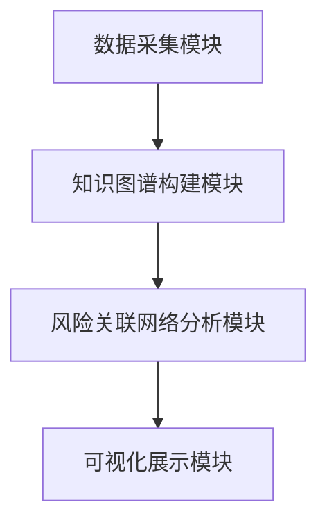

                 


# 构建基于知识图谱的金融风险关联网络可视化系统

> **关键词**：知识图谱、金融风险、关联网络、可视化系统、风险管理

> **摘要**：  
本文详细探讨了如何基于知识图谱构建金融风险关联网络可视化系统。文章从知识图谱和金融风险关联网络的基本概念出发，分析了其核心原理与构建方法，结合实际项目案例，详细阐述了系统架构设计、功能实现及优化策略。通过本文的讲解，读者可以掌握从数据准备到系统实现的完整流程，最终构建出一个高效、直观的金融风险关联网络可视化系统。

---

# 第一部分: 知识图谱与金融风险关联网络概述

---

## 第1章: 知识图谱与金融风险关联网络概述

### 1.1 知识图谱的基本概念

#### 1.1.1 知识图谱的定义与特点
知识图谱是一种用于表示实体及其关系的图形结构，能够将分散的数据组织成易于理解和查询的形式。其特点包括：
- **语义性**：通过实体和关系的描述，赋予数据语义。
- **结构化**：以图的形式组织数据，便于计算机处理。
- **动态性**：支持实时更新，能够反映数据的最新状态。

#### 1.1.2 知识图谱的构建流程
知识图谱的构建通常包括以下几个步骤：
1. 数据采集：从多种数据源（如文本、数据库）获取数据。
2. 数据清洗：去除噪声数据，确保数据质量。
3. 数据抽取：从数据中提取实体和关系。
4. 知识融合：将不同数据源中的知识进行整合，消除冲突。
5. 知识存储：将构建的知识图谱存储在图数据库中。
6. 知识推理：通过推理算法扩展知识图谱。

#### 1.1.3 知识图谱在金融领域的应用
在金融领域，知识图谱主要用于：
- **风险控制**：通过分析实体之间的关联关系，识别潜在风险。
- **欺诈检测**：利用图结构发现异常交易模式。
- **智能投顾**：基于知识图谱提供个性化的投资建议。

### 1.2 金融风险关联网络的概念

#### 1.2.1 金融风险的基本概念
金融风险是指在金融活动中可能发生的损失，主要包括市场风险、信用风险、操作风险等。

#### 1.2.2 风险关联网络的定义与特点
风险关联网络是指将金融风险事件、实体及其关系以图形形式表示的网络。其特点包括：
- **关联性**：能够展示风险事件之间的相互影响。
- **动态性**：能够实时反映风险变化。
- **可视化**：便于金融从业者直观理解风险分布。

#### 1.2.3 风险关联网络的构建方法
风险关联网络的构建通常包括以下几个步骤：
1. 数据采集：收集相关的金融数据。
2. 实体识别：识别出关键实体（如公司、个人）。
3. 关系抽取：抽取实体之间的关系。
4. 网络构建：将实体及其关系可视化为网络结构。
5. 风险分析：通过网络分析方法识别关键风险点。

### 1.3 可视化系统的基本原理

#### 1.3.1 可视化系统的定义与作用
可视化系统是指通过图形界面展示数据或信息的系统。其作用包括：
- 提供直观的数据显示。
- 帮助用户快速理解复杂数据。
- 支持决策制定。

#### 1.3.2 知识图谱可视化的核心技术
知识图谱可视化的核心技术包括：
- **图布局算法**：如层次布局、力导向布局。
- **交互技术**：如缩放、筛选、查询。
- **视觉化设计**：如颜色、形状、标签的设计。

#### 1.3.3 风险关联网络可视化的关键挑战
风险关联网络可视化的关键挑战包括：
- **数据复杂性**：金融数据通常复杂且关联性强。
- **实时性要求**：需要实时更新和展示。
- **用户交互性**：需要支持复杂的交互操作。

### 1.4 本章小结
本章介绍了知识图谱和金融风险关联网络的基本概念，并分析了其在金融领域的应用。通过本章的学习，读者可以理解知识图谱和风险关联网络的核心思想及其在金融风险管理中的重要作用。

---

# 第二部分: 知识图谱构建与分析

---

## 第2章: 知识图谱构建的核心概念与方法

### 2.1 知识图谱的核心概念

#### 2.1.1 实体与关系的定义
- **实体**：知识图谱中的基本单元，如“公司”、“个人”。
- **关系**：实体之间的关联，如“拥有”、“投资”。

#### 2.1.2 知识图谱的属性特征
知识图谱的属性特征包括：
- **实体类型**：如“公司”、“个人”。
- **关系类型**：如“拥有”、“投资”。
- **属性值**：如“公司成立时间”、“公司规模”。

#### 2.1.3 知识图谱的构建流程
知识图谱的构建流程包括：
1. 数据采集。
2. 数据清洗。
3. 数据抽取。
4. 知识融合。
5. 知识存储。
6. 知识推理。

### 2.2 知识图谱构建的主要方法

#### 2.2.1 基于规则的构建方法
基于规则的构建方法通过预定义的规则从数据中抽取实体和关系。例如，使用正则表达式从文本中提取公司名称和地址。

#### 2.2.2 基于机器学习的构建方法
基于机器学习的构建方法利用训练好的模型自动抽取实体和关系。例如，使用深度学习模型进行命名实体识别。

#### 2.2.3 混合构建方法
混合构建方法结合规则和机器学习的方法，根据场景选择合适的技术。例如，先使用规则提取部分实体，再用机器学习模型补充剩余实体。

### 2.3 知识图谱构建的挑战与解决方案

#### 2.3.1 数据质量对构建的影响
数据质量对知识图谱构建的影响包括：
- **数据不一致**：不同数据源中的实体可能有不同的表示。
- **数据缺失**：部分数据可能缺失或不完整。

#### 2.3.2 知识融合的难点与解决方案
知识融合的难点包括：
- **实体对齐**：不同数据源中的实体可能表示相同的对象。
- **关系冲突**：不同数据源中可能对同一关系有不同的描述。

#### 2.3.3 知识抽取的优化策略
知识抽取的优化策略包括：
- **使用高质量的数据源**：选择可靠的数据源进行抽取。
- **结合上下文信息**：利用上下文信息提高抽取的准确性。
- **使用多种抽取方法**：结合规则和机器学习方法提高抽取效果。

### 2.4 本章小结
本章详细讲解了知识图谱的核心概念和构建方法，并分析了构建过程中可能遇到的挑战及解决方案。通过本章的学习，读者可以掌握知识图谱的构建流程及其优化策略。

---

# 第三部分: 金融风险关联网络分析

---

## 第3章: 金融风险关联网络的核心原理

### 3.1 金融风险关联网络的构建原理

#### 3.1.1 风险节点的定义与选择
风险节点是指与金融风险相关的实体，如公司、个人、交易等。

#### 3.1.2 风险关系的建模方法
风险关系的建模方法包括：
- **直接关系**：如“公司A投资公司B”。
- **间接关系**：如“公司A通过公司B投资公司C”。

#### 3.1.3 风险网络的权重计算
风险网络的权重计算方法包括：
- **基于交易金额的权重**：权重与交易金额成正比。
- **基于时间的权重**：权重与交易时间相关。
- **基于关系强度的权重**：权重与关系强度相关。

### 3.2 金融风险关联网络的分析方法

#### 3.2.1 网络的中心性分析
中心性分析用于识别网络中的关键节点。常用的方法包括：
- **度中心性**：节点的度数越高，中心性越强。
- **介数中心性**：节点在网络中的桥梁作用越强，中心性越强。

#### 3.2.2 网络的聚类分析
聚类分析用于识别网络中的社区结构。常用的方法包括：
- **K-means聚类**：将节点分为K个社区。
- **Louvain算法**：基于模块度优化算法。

#### 3.2.3 网络的路径分析
路径分析用于识别网络中的关键路径。常用的方法包括：
- **最短路径分析**：找到节点之间的最短路径。
- **最长路径分析**：找到节点之间的最长路径。

### 3.3 风险关联网络的可视化方法

#### 3.3.1 可视化图表的选择
常用的可视化图表包括：
- **节点链接图**：展示节点之间的关系。
- **矩阵图**：展示节点之间的关系矩阵。
- **树状图**：展示层次结构。

#### 3.3.2 可视化布局的优化
可视化布局的优化方法包括：
- **层次布局**：将节点按层次排列。
- **力导向布局**：模拟物理力将节点自动排列。

#### 3.3.3 可视化交互的设计
可视化交互的设计包括：
- **缩放**：用户可以缩放视图。
- **筛选**：用户可以筛选特定类型的节点或关系。
- **查询**：用户可以查询节点的详细信息。

### 3.4 本章小结
本章详细讲解了金融风险关联网络的核心原理和分析方法，并探讨了其可视化方法。通过本章的学习，读者可以理解金融风险关联网络的构建和分析过程，并掌握其可视化技巧。

---

# 第四部分: 系统架构与实现

---

## 第4章: 系统架构设计

### 4.1 系统总体架构

#### 4.1.1 系统的功能模块划分
系统的主要功能模块包括：
1. **数据采集模块**：负责采集金融数据。
2. **知识图谱构建模块**：负责构建知识图谱。
3. **风险关联网络分析模块**：负责分析风险关联网络。
4. **可视化展示模块**：负责展示分析结果。

#### 4.1.2 系统的分层架构设计
系统的分层架构设计包括：
1. **数据层**：负责数据的存储和管理。
2. **逻辑层**：负责业务逻辑的实现。
3. **展示层**：负责用户界面的展示。

#### 4.1.3 系统的扩展性设计
系统的扩展性设计包括：
- **模块化设计**：各模块相对独立，便于扩展。
- **接口设计**：提供标准接口，便于与其他系统集成。

### 4.2 系统功能设计

#### 4.2.1 数据采集模块
数据采集模块负责从多种数据源（如数据库、API）采集金融数据。

#### 4.2.2 知识图谱构建模块
知识图谱构建模块负责将采集到的数据构建为知识图谱。

#### 4.2.3 风险关联网络分析模块
风险关联网络分析模块负责对知识图谱进行分析，识别风险关联网络。

#### 4.2.4 可视化展示模块
可视化展示模块负责将分析结果以图形形式展示给用户。

### 4.3 系统架构图
以下是系统的总体架构图：



### 4.4 本章小结
本章详细讲解了系统的总体架构设计和功能模块划分，并通过架构图展示了系统的整体结构。通过本章的学习，读者可以理解系统的整体设计思路。

---

# 第五部分: 项目实战与优化

---

## 第5章: 项目实战

### 5.1 环境搭建与数据准备

#### 5.1.1 开发环境搭建
开发环境包括：
- **操作系统**：Windows或Linux。
- **开发工具**：PyCharm、VS Code。
- **依赖库**：Python的网络库、数据处理库等。

#### 5.1.2 数据源选择
数据源包括：
- **公开数据集**：如金融公司数据、新闻数据。
- **API接口**：如金融数据API。

### 5.2 知识图谱构建与风险分析

#### 5.2.1 数据预处理
数据预处理包括：
- **清洗数据**：去除噪声数据。
- **转换格式**：将数据转换为适合构建知识图谱的格式。

#### 5.2.2 知识图谱构建
知识图谱构建代码示例：

```python
import networkx as nx

# 创建图
G = nx.Graph()

# 添加节点
G.add_nodes_from(["CompanyA", "CompanyB", "CompanyC"])

# 添加边
G.add_edges_from([("CompanyA", "CompanyB"), ("CompanyB", "CompanyC")])

# 展示图
nx.draw(G, with_labels=True, node_color="red", edge_color="blue")
plt.show()
```

#### 5.2.3 风险关联网络分析
风险关联网络分析代码示例：

```python
import nx

# 创建图
G = nx.Graph()

# 添加节点
G.add_nodes_from(["Risk1", "Risk2", "Risk3"])

# 添加边
G.add_edges_from([("Risk1", "Risk2"), ("Risk2", "Risk3")])

# 计算中心性
degree_cent = nx.degree_centrality(G)
print(degree_cent)
```

### 5.3 可视化展示与交互设计

#### 5.3.1 可视化界面设计
可视化界面设计包括：
- **布局设计**：如层次布局、力导向布局。
- **交互设计**：如缩放、筛选、查询。

#### 5.3.2 可视化工具选择
常用的可视化工具包括：
- **Gephi**：用于图的可视化和分析。
- **NetworkX**：用于图的构建和分析。
- **D3.js**：用于前端的可视化展示。

### 5.4 项目实战案例分析

#### 5.4.1 案例背景
假设我们有一个公司之间的投资关系数据，需要构建一个风险关联网络。

#### 5.4.2 数据准备
数据包括公司名称、投资关系等。

#### 5.4.3 系统实现
系统实现包括：
- 数据采集。
- 知识图谱构建。
- 风险关联网络分析。
- 可视化展示。

#### 5.4.4 实验结果与分析
实验结果包括：
- 风险关联网络的可视化图。
- 关键风险节点的识别。
- 风险关联网络的权重分布。

### 5.5 本章小结
本章通过一个实际案例展示了系统的构建过程，并分析了实验结果。通过本章的学习，读者可以掌握系统的实际应用方法。

---

## 第6章: 优化与扩展

### 6.1 系统优化策略

#### 6.1.1 数据优化
数据优化包括：
- **数据清洗**：去除噪声数据。
- **数据融合**：整合多源数据。
- **数据存储**：使用高效的存储结构。

#### 6.1.2 算法优化
算法优化包括：
- **算法选择**：选择高效的算法。
- **参数调优**：优化算法的参数。
- **并行计算**：利用并行计算加速算法。

#### 6.1.3 系统性能优化
系统性能优化包括：
- **缓存优化**：使用缓存技术减少重复计算。
- **分层设计**：将系统分层，提高系统的可扩展性。
- **负载均衡**：使用负载均衡技术提高系统的稳定性。

### 6.2 系统扩展方向

#### 6.2.1 功能扩展
功能扩展包括：
- **实时更新**：支持实时更新风险关联网络。
- **多语言支持**：支持多种语言的文本处理。
- **多维度分析**：支持多维度的金融风险分析。

#### 6.2.2 技术扩展
技术扩展包括：
- **分布式计算**：利用分布式计算技术处理大规模数据。
- **机器学习**：利用机器学习技术提高风险预测的准确性。
- **深度学习**：利用深度学习技术进行复杂模式的识别。

### 6.3 本章小结
本章探讨了系统的优化策略和扩展方向，为系统的进一步改进提供了参考。通过本章的学习，读者可以了解如何优化和扩展系统，以满足更复杂的需求。

---

# 结语

通过本文的详细讲解，读者可以掌握基于知识图谱构建金融风险关联网络可视化系统的完整流程。从知识图谱和风险关联网络的基本概念，到系统的构建、分析和可视化，再到系统的优化和扩展，本文为读者提供了全面的技术指导。未来，随着技术的不断发展，金融风险关联网络可视化系统将变得更加智能化和高效化，为金融风险管理提供更有力的支持。

---

**作者：AI天才研究院/AI Genius Institute & 禅与计算机程序设计艺术 /Zen And The Art of Computer Programming**

