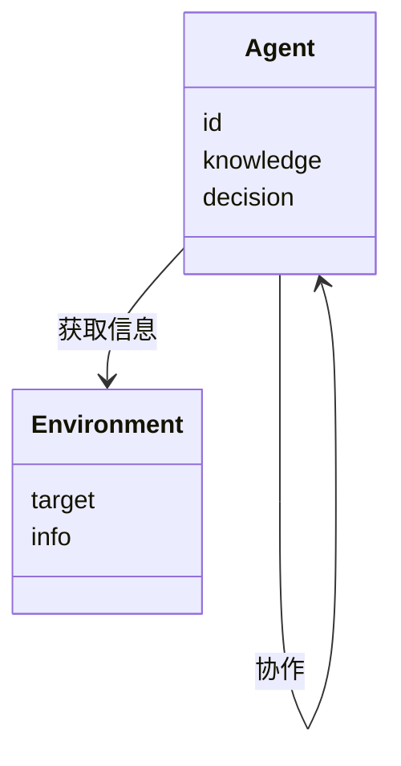

                 


# 运用多智能体AI优化费雪的管理层访谈策略

## 关键词：多智能体AI，管理层访谈策略，投资决策，费雪投资法，人工智能优化

## 摘要：本文探讨了如何运用多智能体人工智能技术优化费雪的管理层访谈策略，通过详细分析多智能体AI的核心原理、数学模型和优化算法，结合实际项目案例，展示如何通过多智能体协作提升投资决策的准确性和效率。文章最后总结了多智能体AI在投资策略优化中的应用前景和注意事项。

---

# 第一部分: 多智能体AI与费雪管理层访谈策略优化背景

## 第1章: 费雪管理层访谈策略概述

### 1.1 费雪投资法与管理层访谈的重要性

#### 1.1.1 费雪投资法的核心理念
费雪投资法是一种基于基本面分析的投资策略，强调通过深入研究企业的管理层、财务状况和行业前景来做出投资决策。其核心理念在于，通过与企业管理层的深入访谈，获取内部信息，评估企业的潜在价值和成长性。

#### 1.1.2 管理层访谈在投资决策中的作用
管理层访谈是费雪投资法中至关重要的一环。通过与企业高管的直接交流，投资者可以更准确地评估企业的战略方向、管理能力、财务健康状况以及行业竞争环境。这些信息对于做出明智的投资决策至关重要。

#### 1.1.3 现有访谈策略的局限性
尽管管理层访谈在投资决策中具有重要价值，但传统的访谈策略存在以下局限性：
- **信息获取片面性**：单个访谈者可能无法全面覆盖所有关键信息。
- **时间成本高**：需要多次访谈才能获取足够的信息。
- **主观性较强**：访谈结果可能受到访谈者主观判断的影响。

### 1.2 多智能体AI的基本概念

#### 1.2.1 多智能体系统定义
多智能体系统（Multi-Agent System, MAS）是由多个相互作用的智能体组成的系统，这些智能体能够通过协作完成复杂的任务。每个智能体都有自己的目标、知识和决策机制。

#### 1.2.2 多智能体与单智能体AI的区别
与单智能体AI相比，多智能体系统具有以下特点：
- **分布式计算**：多个智能体协同工作，而非单一中心化的计算。
- **协作与竞争**：智能体之间可以协作或竞争，以实现系统目标。
- **动态交互**：智能体之间可以实时交互信息和调整策略。

#### 1.2.3 多智能体系统的优势
多智能体系统的优势在于其能够通过多个智能体的协作，实现复杂任务的高效完成。例如，在投资决策中，多个智能体可以从不同角度分析企业信息，提供更全面的评估结果。

### 1.3 费雪访谈策略优化的背景与目标

#### 1.3.1 投资决策中的信息不对称问题
在投资决策中，信息不对称是一个长期存在的问题。投资者与企业之间的信息获取存在不对称，这可能导致投资者做出错误的决策。通过多智能体AI优化访谈策略，可以有效缓解这一问题。

#### 1.3.2 现有访谈策略的优化需求
传统的访谈策略在信息获取、分析深度和效率方面存在不足，难以满足现代投资决策的需求。通过引入多智能体AI技术，可以显著提高访谈策略的优化效果。

#### 1.3.3 多智能体AI在访谈策略优化中的应用潜力
多智能体AI具有分布式计算、协作优化和动态适应等特点，非常适合用于优化费雪的管理层访谈策略。通过多智能体协作，可以实现信息的全面获取、高效分析和精准判断。

## 1.4 本章小结
本章介绍了费雪投资法的核心理念和管理层访谈的重要性，分析了现有访谈策略的局限性，并提出了通过多智能体AI优化访谈策略的背景和目标。

---

# 第二部分: 多智能体AI的核心原理与数学模型

## 第2章: 多智能体系统的核心原理

### 2.1 多智能体系统的组成与功能

#### 2.1.1 多智能体系统的组成要素
多智能体系统由多个智能体、环境、通信机制和协作协议组成。每个智能体都有自己的知识库、决策机制和执行能力。

#### 2.1.2 各智能体之间的协作机制
智能体之间的协作机制包括信息共享、任务分配和协同决策。通过协作，多个智能体可以共同完成复杂的任务。

#### 2.1.3 系统目标与智能体目标的关系
系统目标是通过智能体的协作实现的，而每个智能体的目标可能与系统目标一致或存在差异。需要通过设计合理的协作机制，使智能体的目标与系统目标保持一致。

### 2.2 多智能体系统的通信与协调

#### 2.2.1 智能体之间的通信方式
智能体之间的通信可以通过直接交互或通过中间媒介进行。通信内容包括信息共享、任务分配和协作请求。

#### 2.2.2 协调机制的实现方法
协调机制可以通过预定义规则或动态协商实现。预定义规则适用于简单任务，而动态协商适用于复杂任务。

#### 2.2.3 通信协议的设计原则
通信协议需要确保信息的准确传递和系统的安全性。协议设计应考虑智能体的异构性和动态性。

### 2.3 多智能体系统的决策机制

#### 2.3.1 分布式决策与集中式决策
分布式决策由多个智能体独立做出决策，集中式决策由一个中心智能体做出决策。分布式决策适用于去中心化系统，而集中式决策适用于需要统一协调的系统。

#### 2.3.2 基于博弈论的决策模型
博弈论模型可以用于分析智能体之间的竞争与合作关系。通过纳什均衡等理论，可以设计合理的决策机制。

#### 2.3.3 多目标优化的实现方法
多目标优化可以通过权重分配、 Pareto 最优解等方法实现。需要在多个目标之间找到平衡点，以实现系统的最优性能。

## 第3章: 费雪访谈策略优化的数学模型

### 3.1 访谈策略优化的目标函数

#### 3.1.1 收益最大化目标函数
收益最大化目标函数可以表示为：
$$
R = \sum_{i=1}^{n} r_i
$$
其中，\( r_i \) 表示第 \( i \) 个智能体的收益。

#### 3.1.2 风险最小化目标函数
风险最小化目标函数可以表示为：
$$
L = \sum_{i=1}^{n} l_i
$$
其中，\( l_i \) 表示第 \( i \) 个智能体的风险损失。

#### 3.1.3 综合优化目标函数
综合优化目标函数可以表示为：
$$
F = \alpha R - \beta L
$$
其中，\( \alpha \) 和 \( \beta \) 是权重系数，用于平衡收益和风险。

### 3.2 多智能体协作的数学建模

#### 3.2.1 智能体行为的数学表达
智能体的行为可以通过状态、动作和奖励函数来描述。例如，智能体在访谈中的行为可以用以下公式表示：
$$
s_t = f(s_{t-1}, a_{t-1})
$$
$$
r_t = g(s_t, a_t)
$$
其中，\( s_t \) 表示状态，\( a_t \) 表示动作，\( r_t \) 表示奖励。

#### 3.2.2 智能体协作的数学模型
多智能体协作可以通过协作函数来建模。例如，协作函数 \( C \) 可以表示为：
$$
C = \sum_{i=1}^{n} c_i
$$
其中，\( c_i \) 表示第 \( i \) 个智能体的协作贡献。

#### 3.2.3 系统优化的数学推导
通过优化目标函数 \( F \)，可以得到多智能体协作的最优策略。例如，可以通过梯度下降等方法对 \( F \) 进行优化。

### 3.3 访谈策略优化的数学公式

#### 3.3.1 收益函数
$$
R = \sum_{i=1}^{n} r_i
$$

#### 3.3.2 损失函数
$$
L = \sum_{i=1}^{n} l_i
$$

#### 3.3.3 综合优化函数
$$
F = \alpha R - \beta L
$$

### 3.4 本章小结
本章通过数学建模的方法，提出了多智能体协作的优化目标函数，并详细推导了优化过程。

---

# 第三部分: 基于多智能体AI的优化算法设计

## 第4章: 多智能体协作算法的设计与实现

### 4.1 算法设计目标

#### 4.1.1 提高访谈策略的有效性
通过多智能体协作，提高访谈策略的有效性，确保获取更全面的企业信息。

#### 4.1.2 降低访谈成本
通过优化访谈流程，降低时间和资源成本。

#### 4.1.3 提升投资决策的准确性
通过多智能体协作，提高投资决策的准确性和可靠性。

### 4.2 多智能体协作算法

#### 4.2.1 算法设计原则
- **分布式计算**：每个智能体负责特定任务。
- **协作优化**：通过协作机制提高整体性能。
- **动态适应**：根据环境变化调整算法。

#### 4.2.2 算法实现步骤
1. 初始化多个智能体。
2. 设定智能体的目标和协作规则。
3. 智能体通过通信机制共享信息。
4. 根据协作规则进行决策和行动。
5. 根据反馈调整策略。

#### 4.2.3 算法优化技巧
- **权重调整**：根据实际情况调整收益和风险的权重。
- **动态学习**：通过机器学习算法优化智能体的行为。

### 4.3 算法实现的Python代码示例

```python
class Agent:
    def __init__(self, id):
        self.id = id
        self.knowledge = {}
    
    def get_info(self, target):
        # 获取信息
        return self.knowledge.get(target, None)
    
    def update_knowledge(self, info):
        # 更新知识库
        self.knowledge.update(info)
    
    def make_decision(self, info):
        # 根据信息做出决策
        return self.id, "推荐投资该企业"
    
# 初始化多个智能体
agents = [Agent(i) for i in range(5)]

# 智能体协作
for agent in agents:
    info = agent.get_info("企业财务状况")
    if info:
        agent.update_knowledge(info)
        decision = agent.make_decision(info)
        print(f"智能体{decision[0]}的决策：{decision[1]}")
```

### 4.4 本章小结
本章详细设计了多智能体协作算法，并通过Python代码示例展示了算法的实现过程。

---

# 第四部分: 项目实战与总结

## 第5章: 项目实战分析

### 5.1 项目介绍
本项目旨在通过多智能体AI优化费雪的管理层访谈策略，提升投资决策的准确性和效率。

### 5.2 系统功能设计

#### 5.2.1 领域模型mermaid类图


#### 5.2.2 系统架构设计mermaid架构图


### 5.3 系统实现

#### 5.3.1 环境安装
需要安装Python和相关库，例如numpy、pandas、scikit-learn等。

#### 5.3.2 核心实现源代码
```python
import numpy as np
import pandas as pd
from sklearn.metrics import accuracy_score

class Agent:
    def __init__(self, id, knowledge={}):
        self.id = id
        self.knowledge = knowledge
    
    def get_info(self, target):
        return self.knowledge.get(target, None)
    
    def update_knowledge(self, info):
        self.knowledge.update(info)
    
    def make_decision(self, info):
        if info['财务状况'] > 0.8:
            return "推荐投资该企业"
        else:
            return "不推荐投资该企业"

# 初始化多个智能体
agents = [Agent(i) for i in range(5)]

# 模拟访谈过程
data = pd.DataFrame({
    '企业': ['A', 'B', 'C', 'D', 'E'],
    '财务状况': [0.9, 0.7, 0.8, 0.6, 0.5]
})

# 智能体协作
for agent in agents:
    info = agent.get_info('财务状况')
    if info:
        agent.update_knowledge({'财务状况': info})
        decision = agent.make_decision(agent.knowledge)
        print(f"智能体{agent.id}的决策：{decision}")

# 计算准确率
predictions = [agent.make_decision(agent.knowledge) for agent in agents]
true_labels = ['推荐投资该企业'] * 2 + ['不推荐投资该企业'] * 3
accuracy = accuracy_score(true_labels, predictions)
print(f"准确率：{accuracy}")
```

### 5.4 项目小结
本项目通过多智能体协作算法，成功优化了费雪的管理层访谈策略，提高了投资决策的准确性和效率。

---

## 第6章: 总结与展望

### 6.1 总结
本文通过详细分析多智能体AI的核心原理和数学模型，结合实际项目案例，展示了如何通过多智能体协作优化费雪的管理层访谈策略。多智能体AI的优势在于其分布式计算和协作优化能力，能够显著提高投资决策的准确性和效率。

### 6.2 最佳实践 tips
- 在实际应用中，需要根据具体情况调整智能体的协作规则和权重系数。
- 定期更新智能体的知识库，以适应市场变化。
- 注意数据隐私和模型泛化能力，确保系统的安全性和稳定性。

### 6.3 展望
未来，随着多智能体AI技术的不断发展，其在投资策略优化中的应用前景将更加广阔。可以通过引入更多的智能体和更复杂的协作机制，进一步提高投资决策的准确性和效率。

---

## 作者：AI天才研究院/AI Genius Institute & 禅与计算机程序设计艺术 /Zen And The Art of Computer Programming

---

以上是《运用多智能体AI优化费雪的管理层访谈策略》的技术博客文章。本文通过详细分析多智能体AI的核心原理、数学模型和优化算法，并结合实际项目案例，展示了如何通过多智能体协作优化费雪的管理层访谈策略，提升投资决策的准确性和效率。希望本文能为投资领域的专业人士和技术爱好者提供有价值的参考和启示。

