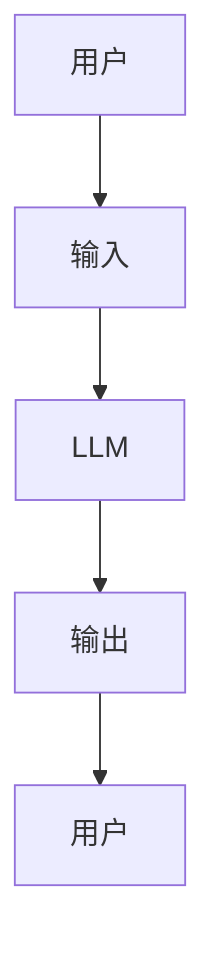
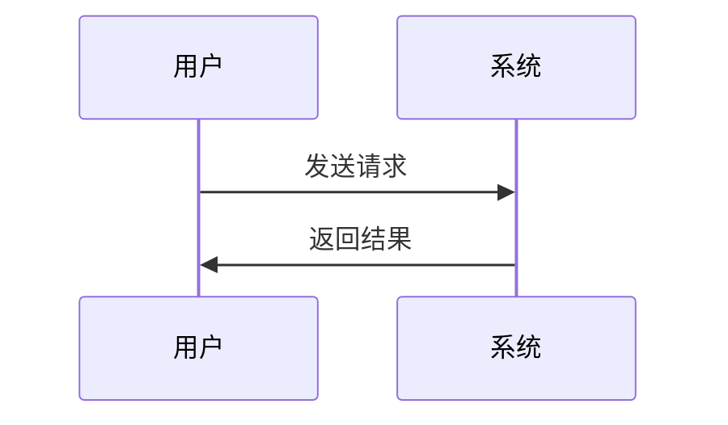

                 


# 选择合适的LLM大模型：对比与评估

> 关键词：大语言模型（LLM）、模型对比、评估指标、应用场景、选择策略

> 摘要：本文系统地探讨了选择合适的LLM大模型的关键步骤，从模型的核心原理、主流模型的对比分析，到实际的评估方法和系统设计，为读者提供了全面的指导。通过详细的技术分析和实际案例，帮助读者理解如何在不同场景下做出最佳选择。

---

# 第一章: 大语言模型（LLM）概述

## 1.1 LLM的基本概念

### 1.1.1 大语言模型的定义

大语言模型（Large Language Model，LLM）是指基于大量数据训练的深度学习模型，能够理解和生成人类语言。LLM的核心在于其规模，通常拥有 billions（十亿）级别的参数，使其具备强大的上下文理解和生成能力。

**关键点：**
- LLM通过大量数据学习语言的结构和模式。
- 参数规模直接影响模型的复杂度和能力。

### 1.1.2 LLM的核心特点

1. **参数规模大**：通过 billions 级别的参数，LLM能够捕捉复杂的语言模式。
2. **预训练**：在大规模通用数据上进行无监督预训练，减少对特定数据的依赖。
3. **微调**：根据特定任务或领域进行有监督微调，提升性能。

### 1.1.3 LLM与传统NLP模型的区别

| **维度** | **传统NLP模型** | **LLM** |
|----------|----------------|---------|
| 参数规模 | 小（百万级别） | 大（十亿级别） |
| 预训练数据 | 小 | 大 |
| 任务通用性 | 低 | 高 |

---

## 1.2 LLM的发展背景

### 1.2.1 AI技术的演进历程

- **规则驱动阶段**：基于专家知识的手工规则。
- **统计学习阶段**：基于特征工程的传统机器学习。
- **深度学习阶段**：基于神经网络的端到端学习。
- **大模型阶段**：基于海量数据和算力的深度学习模型。

### 1.2.2 大模型时代的到来

- 计算能力的提升：GPU和TPU的普及使得训练大规模模型成为可能。
- 数据量的爆炸式增长：互联网上的海量文本数据为模型训练提供了丰富的资源。
- 模型架构的创新：Transformer架构的引入显著提升了模型的性能。

### 1.2.3 企业级应用中的LLM

- **企业智能化转型**：LLM为企业的自动化和智能化提供了技术支持。
- **垂直领域应用**：LLM在金融、医疗、教育等领域的深度应用。

---

## 1.3 LLM的应用场景

### 1.3.1 自然语言处理任务

- **文本生成**：用于内容创作、自动回复等。
- **问答系统**：应用于智能客服、知识库问答。
- **机器翻译**：提升翻译准确率和流畅度。

### 1.3.2 企业智能化转型中的应用

- **流程自动化**：将LLM与企业流程结合，实现自动化处理。
- **决策支持**：通过LLM分析数据，辅助决策。

### 1.3.3 LLM对传统业务的颠覆性影响

- **效率提升**：LLM能够快速处理大量信息，提升业务效率。
- **成本降低**：自动化处理减少了人工成本。

---

## 1.4 选择合适的LLM的重要性

### 1.4.1 不同场景下的模型选择

- **通用任务**：选择通用性强的模型。
- **特定任务**：选择经过微调的特定模型。

### 1.4.2 模型性能与成本的平衡

- **性能优先**：选择参数规模大的模型，但成本较高。
- **成本优先**：选择参数规模较小的模型，但性能可能稍逊。

### 1.4.3 长期维护与优化

- **持续优化**：定期更新模型，适应业务需求变化。

---

## 1.5 本章小结

本章从基本概念、发展背景、应用场景等方面介绍了LLM，强调了选择合适模型的重要性。接下来的章节将深入探讨模型的核心原理和对比分析，为读者提供更全面的指导。

---

# 第二章: LLM的核心原理

## 2.1 大语言模型的训练目标

### 2.1.1 预训练目标

- **语言模型的损失函数**：LLM的目标是预测下一个词，损失函数用于衡量预测的准确性。
  $$ \text{损失函数} = -\sum_{i=1}^{n} \log P(w_i | w_{<i}) $$

### 2.1.2 监督信号的作用

- **有监督学习**：在特定任务上进行有标签数据的微调。
- **无监督学习**：在大规模未标注数据上进行预训练。

### 2.1.3 对齐人类偏好

- **偏好对齐**：通过人类反馈优化模型输出，使其更符合人类期望。

---

## 2.2 模型架构的特点

### 2.2.1 变压器（Transformer）架构

- **自注意力机制**：模型能够捕捉输入中的长距离依赖关系。

  ```mermaid
  graph LR
      A[输入序列] --> B[查询]
      B --> C[键]
      C --> D[值]
      E[注意力输出] <-- D
  ```

### 2.2.2 层次化注意力机制

- **多层堆叠**：通过多层Transformer提升模型的表达能力。

---

## 2.3 训练策略的优化

### 2.3.1 混合专家（Mixture-of-Experts）

- **模型并行**：将模型分成多个专家，每个专家处理部分输入。

  ```mermaid
  graph LR
      A[输入] --> B[专家1]
      A --> C[专家2]
      D[输出] <-- B, C
  ```

### 2.3.2 知识蒸馏技术

- **知识蒸馏**：将大模型的知识迁移到小模型，减少计算成本。

---

## 2.4 模型评估的数学公式

### 2.4.1 BLEU分数的计算公式

- **BLEU（Bilingual Evaluation Understudy）**：衡量生成文本的质量。

  $$ \text{BLEU} = \exp\left(\text{precision}_n \times \text{brevity}_p\right) $$

### 2.4.2 ROUGE指标的定义

- **ROUGE（Recall-Oriented Understudy for Gourmet’s Evaluation）**：基于召回率的评估指标。

---

# 第三章: 主流LLM模型对比分析

## 3.1 GPT系列模型

### 3.1.1 GPT-3的架构与参数

- GPT-3拥有175 billion参数，是目前最著名的LLM之一。

### 3.1.2 GPT-4的改进与创新

- 支持多模态输入，提升生成能力。

### 3.1.3 GPT系列的开源实现

- 开源模型如llama系列，降低使用门槛。

---

## 3.2 其他主流模型

### 3.2.1 PaLM（Pathways Large Language Model）

- 由Meta开发，参数规模达67 billion。

### 3.2.2 LLAMA（开源模型）

- Meta开源的70+ billion参数模型。

### 3.2.3 T5系列模型

- 采用文本到文本的架构，参数规模从 billions 到 trillion。

---

## 3.3 模型对比分析

### 3.3.1 参数规模对比

| 模型 | 参数规模（亿） |
|------|---------------|
| GPT-3 | 175            |
| PaLM | 67             |
| LLaMA | 70+            |

### 3.3.2 训练成本对比

| 模型 | 训练成本（百万美元） |
|------|-------------------|
| GPT-3 | 100+             |
| LLaMA | 50+              |

### 3.3.3 性能对比

| 模型 | 生成能力 | 微调能力 |
|------|----------|----------|
| GPT-3 | 强        | 需微调   |
| LLaMA | 中        | 易微调   |

---

## 3.4 本章小结

通过对主流模型的对比分析，读者可以更好地理解不同模型的特点和适用场景。接下来的章节将探讨模型的评估方法和系统设计。

---

# 第四章: LLM模型的评估与选择方法

## 4.1 定性评估

### 4.1.1 模型生成能力的评估

- 通过生成文本的质量、连贯性和相关性进行评估。

### 4.1.2 模型推理

- 评估模型在复杂任务中的推理能力。

---

## 4.2 定量评估

### 4.2.1 BLEU分数

- 使用BLEU分数衡量生成文本的质量。

### 4.2.2 ROUGE指标

- 使用ROUGE指标评估召回率。

---

## 4.3 实际案例分析

### 4.3.1 案例1：文本生成任务

- 使用GPT-3和LLaMA分别生成文本，对比生成质量。

### 4.3.2 案例2：问答系统任务

- 对比不同模型在问答任务中的表现。

---

## 4.4 本章小结

定量评估和定性评估的结合能够更全面地评估模型性能。接下来的章节将探讨系统设计和项目实战。

---

# 第五章: 系统分析与架构设计方案

## 5.1 项目介绍

### 5.1.1 项目背景

- 开发一个基于LLM的智能客服系统。

### 5.1.2 项目目标

- 实现高效的问答功能，提升用户体验。

---

## 5.2 系统功能设计

### 5.2.1 领域模型（ER图）



### 5.2.2 系统架构设计


---

## 5.3 系统接口设计

### 5.3.1 接口1：输入接口

- 接收用户的输入请求。

### 5.3.2 接口2：输出接口

- 返回生成的文本或结果。

---

## 5.4 系统交互设计

### 5.4.1 交互流程



---

## 5.5 本章小结

通过系统设计和架构分析，读者可以理解如何将LLM应用于实际项目中。接下来的章节将探讨项目实战和最佳实践。

---

# 第六章: 项目实战

## 6.1 环境安装

### 6.1.1 安装Python

- 使用Anaconda安装Python 3.9+。

### 6.1.2 安装依赖库

- 使用pip安装必要的库，如transformers、torch等。

---

## 6.2 系统核心实现

### 6.2.1 加载模型

```python
from transformers import AutoTokenizer, AutoModelForCausalLM
model_name = "gpt2-large"
tokenizer = AutoTokenizer.from_pretrained(model_name)
model = AutoModelForCausalLM.from_pretrained(model_name)
```

### 6.2.2 生成文本

```python
def generate_text(prompt, max_length=50):
    inputs = tokenizer.encode(prompt, return_tensors="pt")
    outputs = model.generate(inputs, max_length=max_length)
    return tokenizer.decode(outputs[0], skip_special_tokens=True)
```

---

## 6.3 案例分析

### 6.3.1 案例1：文本生成

- 使用GPT-2生成一段新闻标题。

### 6.3.2 案例2：问答系统

- 使用LLM回答用户的问题。

---

## 6.4 项目小结

通过项目实战，读者可以掌握如何在实际中应用LLM模型。接下来的章节将总结全书内容。

---

# 第七章: 最佳实践与小结

## 7.1 总结全书内容

- 从模型选择到系统设计，全面介绍了LLM的应用方法。

## 7.2 选型建议

- 根据具体任务选择合适的模型，平衡性能与成本。

## 7.3 未来趋势

- 更多开源模型的出现，模型的轻量化和高效推理。

---

## 7.4 最佳实践 Tips

1. **选择模型前明确需求**：了解任务需求，选择合适的模型。
2. **关注模型的维护成本**：长期维护和优化需要投入资源。
3. **结合实际场景进行微调**：提升模型在特定领域的表现。

---

## 7.5 本章小结

本文从多个角度探讨了选择合适的LLM大模型的方法，为读者提供了实用的指导。未来，随着技术的进步，选择模型的方法将更加多样化。

---

# 附录: 工具与资源

## 附录A: LLM工具列表

| 工具名称 | 描述 | 链接 |
|----------|------|------|
| Hugging Face | 开源模型库 | https://huggingface.co/ |
| OpenAI API | 提供多种LLM服务 | https://openai.com/ |

## 附录B: 数据集

| 数据集名称 | 描述 | 链接 |
|------------|------|------|
| Common Crawl | 巨量网络文本数据集 | https://commoncrawl.org/ |

## 附录C: 参考文献

1. Brown, T. B., et al. "Language models are few-shot learners." arXiv preprint arXiv:1909.08719 (2019).
2. Vaswani, A., et al. "Attention is all you need." arXiv preprint arXiv:1706.03798 (2017).

---

# 作者

作者：AI天才研究院/AI Genius Institute & 禅与计算机程序设计艺术 /Zen And The Art of Computer Programming

---

希望这篇文章能够为您提供有价值的信息和启发，帮助您更好地理解和应用大语言模型。如果需要更深入的讨论或技术支持，请随时联系。

