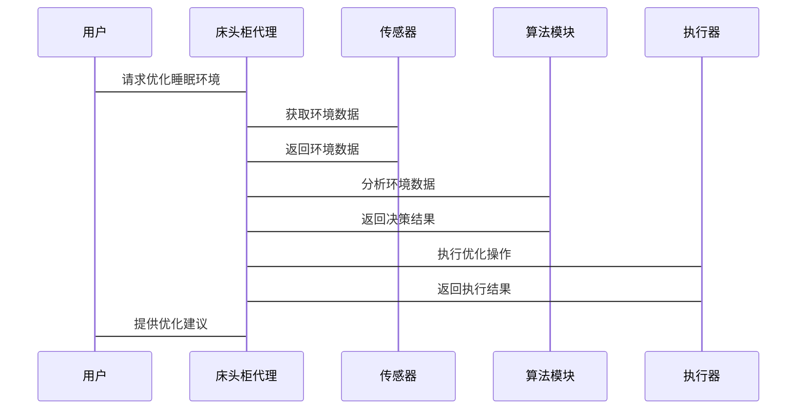

                 


# AI Agent在智能床头柜中的睡眠环境优化

> 关键词：AI Agent, 智能床头柜, 睡眠环境优化, 机器学习, 系统架构

> 摘要：本文深入探讨了AI Agent在智能床头柜中的应用，重点分析了其在睡眠环境优化中的核心作用。通过详细讲解AI Agent的基本原理、算法实现、系统架构设计以及实际项目案例，本文为读者提供了从理论到实践的全面指导。我们还比较了不同AI Agent的优缺点，并通过具体的实现步骤展示了如何利用AI技术提升睡眠质量。

---

# 第一部分: AI Agent与智能床头柜概述

## 第1章: AI Agent的基本概念

### 1.1 AI Agent的定义与特点

#### 1.1.1 AI Agent的定义
AI Agent（人工智能代理）是指能够感知环境、做出决策并执行操作的智能实体。它通过传感器获取数据，利用算法进行分析，并通过执行器与环境交互。

#### 1.1.2 AI Agent的核心特点
- **自主性**：能够在没有外部干预的情况下运行。
- **反应性**：能够实时感知环境变化并做出响应。
- **学习能力**：通过数据和经验不断优化自身的决策能力。
- **适应性**：能够根据环境变化调整自身行为。

#### 1.1.3 AI Agent与传统自动化的区别
| 特性       | 传统自动化                     | AI Agent                      |
|------------|-------------------------------|----------------------------|
| 感知能力   | 无或有限                      | 强大                          |
| 决策能力   | 基于预设规则                  | 基于学习和动态调整            |
| 自适应性   | 较低                          | 较高                          |

### 1.2 智能床头柜的发展现状

#### 1.2.1 智能床头柜的定义
智能床头柜是一种集成了多种智能设备的家具，能够通过传感器和AI技术感知用户的睡眠环境，并通过执行器优化睡眠条件。

#### 1.2.2 智能床头柜的功能特点
- **环境监测**：实时监测温度、湿度、光照、噪声等环境参数。
- **个性化调节**：根据用户的睡眠习惯和偏好，自动调节环境参数。
- **健康数据分析**：通过分析用户的睡眠数据，提供健康建议。

#### 1.2.3 智能床头柜的市场现状
- **市场需求增长**：随着人们对健康生活的重视，智能床头柜市场逐渐扩大。
- **技术进步推动**：AI和物联网技术的发展为智能床头柜的功能提升提供了技术支持。
- **竞争格局**：市场上已有多种品牌和产品，竞争较为激烈。

---

## 第2章: 睡眠环境优化的重要性

### 2.1 睡眠健康的重要性

#### 2.1.1 睡眠对健康的影响
- **身体健康**：良好的睡眠有助于免疫系统功能的提升。
- **心理健康**：睡眠不足会导致焦虑、抑郁等问题。
- **认知功能**：睡眠对学习、记忆和创造力有重要影响。

#### 2.1.2 现代人睡眠问题的现状
- **睡眠质量下降**：许多人在现代社会面临失眠、浅睡眠等问题。
- **环境因素**：噪音、光线、温度等环境因素影响睡眠质量。
- **生活方式变化**：电子设备的普及和不规律的生活节奏影响睡眠。

#### 2.1.3 优化睡眠环境的意义
- **提升睡眠质量**：通过优化环境参数，帮助用户获得更好的睡眠。
- **促进健康**：良好的睡眠有助于整体健康状况的提升。
- **提高生活质量**：通过智能化调节，使用户感受到更舒适的生活环境。

### 2.2 睡眠环境优化的核心要素

#### 2.2.1 光线调节
- **背景介绍**：光线对人的生物钟有重要影响，特别是在睡前使用电子设备会导致蓝光抑制褪黑激素的分泌。
- **优化策略**：使用智能灯具，根据用户的睡眠周期调节光线强度和色温。

#### 2.2.2 温度控制
- **背景介绍**：人体的体温调节与睡眠质量密切相关，适宜的温度有助于深度睡眠的实现。
- **优化策略**：通过智能温控系统，实时调节房间温度，确保最佳睡眠环境。

#### 2.2.3 噪声管理
- **背景介绍**：噪声是影响睡眠质量的重要因素，尤其是高频噪声对人的睡眠干扰更大。
- **优化策略**：使用智能降噪设备，根据环境噪声实时调节降噪模式。

#### 2.2.4 空气质量优化
- **背景介绍**：空气质量差会导致呼吸不畅，影响睡眠质量。
- **优化策略**：通过智能空气净化器，实时监测并调节空气中的PM2.5、甲醛等污染物浓度。

---

# 第二部分: AI Agent在智能床头柜中的核心概念

## 第3章: AI Agent的基本原理

### 3.1 AI Agent的感知能力

#### 3.1.1 感知技术的实现
- **传感器类型**：
  - 温度传感器：用于测量环境温度。
  - 光线传感器：用于测量环境光线强度。
  - 噪声传感器：用于测量环境噪声水平。
  - 空气质量传感器：用于测量空气中的污染物浓度。

#### 3.1.2 数据采集与处理
- **数据采集流程**：
  1. 传感器采集环境数据。
  2. 数据预处理：去除噪声，提取有用特征。
  3. 数据存储：将处理后的数据存储到数据库中。

#### 3.1.3 数据分析技术
- **常用技术**：
  - 时间序列分析：分析环境数据的变化趋势。
  - 统计分析：找出环境数据中的异常值和规律。

### 3.2 AI Agent的决策机制

#### 3.2.1 决策算法的分类
| 算法类型       | 描述                       | 适用场景                     |
|----------------|----------------------------|------------------------------|
| 基于规则的算法 | 根据预设规则做出决策       | 环境条件简单，规则明确的情况 |
| 机器学习算法   | 通过训练数据学习决策模式   | 环境条件复杂，规则不明确的情况 |
| 强化学习算法   | 通过与环境的交互不断优化决策 | 需要动态调整的复杂环境       |

#### 3.2.2 基于规则的决策
- **工作原理**：
  1. 传感器采集环境数据。
  2. 将数据与预设规则进行匹配。
  3. 根据匹配结果执行相应的操作。
- **优缺点**：
  - 优点：实现简单，规则清晰。
  - 缺点：难以应对复杂多变的环境。

#### 3.2.3 基于机器学习的决策
- **工作原理**：
  1. 传感器采集环境数据。
  2. 数据经过预处理后输入到训练好的模型中。
  3. 模型输出决策结果。
- **优缺点**：
  - 优点：能够处理复杂环境，适应性强。
  - 缺点：实现复杂，需要大量的训练数据。

### 3.3 AI Agent的执行能力

#### 3.3.1 执行机构的类型
- **灯光调节**：通过智能灯具调节光线强度和色温。
- **温度调节**：通过空调或电热器调节房间温度。
- **噪声控制**：通过智能耳机或降噪设备减少环境噪声。

#### 3.3.2 执行指令的优化
- **优化策略**：
  - 根据用户的睡眠周期调整执行指令的强度和时间。
  - 结合用户的个性化需求，动态调整执行策略。

#### 3.3.3 执行结果的反馈
- **反馈机制**：
  - 通过传感器实时监测执行效果。
  - 根据反馈结果调整下一步操作。

---

## 第4章: AI Agent与智能床头柜的结合

### 4.1 智能床头柜的功能扩展

#### 4.1.1 睡眠环境监测
- **功能实现**：
  - 实时监测并记录环境数据。
  - 通过图表或报告的形式展示环境数据。

#### 4.1.2 睡眠质量分析
- **分析方法**：
  - 基于环境数据和用户的睡眠数据，分析睡眠质量。
  - 使用机器学习算法预测睡眠阶段（浅睡、深睡、觉醒）。

#### 4.1.3 睡眠优化建议
- **建议生成**：
  - 根据分析结果，生成个性化的睡眠优化建议。
  - 例如：调整室温、降低噪声、优化光线等。

### 4.2 AI Agent在床头柜中的具体应用

#### 4.2.1 睡眠环境的实时优化
- **应用场景**：
  - 根据实时环境数据，动态调整床头柜的执行机构。
  - 例如：当检测到室内温度过高时，自动启动空调降温。

#### 4.2.2 用户行为分析与个性化优化
- **行为分析**：
  - 分析用户的睡眠习惯和偏好。
  - 根据分析结果，制定个性化的睡眠优化方案。
- **个性化优化**：
  - 根据用户的睡眠周期调整床头柜的执行策略。

#### 4.2.3 多设备协同优化
- **协同机制**：
  - 通过物联网技术，实现床头柜与其他智能家居设备的协同工作。
  - 例如：床头柜检测到噪声过大时，联动智能耳机播放白噪音降低噪声水平。

---

# 第三部分: 算法原理与系统架构

## 第5章: AI Agent的核心算法

### 5.1 强化学习算法

#### 5.1.1 强化学习的基本原理
- **定义**：强化学习是一种通过试错方法，学习策略以最大化预期收益的算法。
- **基本要素**：
  - 状态（State）：环境的当前情况。
  - 动作（Action）：代理可以采取的行动。
  - 奖励（Reward）：执行动作后获得的反馈。

#### 5.1.2 强化学习的应用场景
- **睡眠优化中的应用**：
  - 状态：当前环境参数（温度、光线、噪声等）。
  - 动作：调整床头柜的执行机构。
  - 奖励：睡眠质量的提升。

#### 5.1.3 强化学习算法的实现步骤
1. 初始化：设置初始状态和参数。
2. 与环境交互：根据当前状态选择动作。
3. 获取反馈：根据动作执行后的结果获得奖励。
4. 更新策略：根据奖励调整策略，优化动作选择。

### 5.2 监督学习算法

#### 5.2.1 监督学习的基本原理
- **定义**：监督学习是一种通过训练数据学习函数映射关系的算法。
- **应用场景**：
  - 睡眠质量预测：根据环境数据和睡眠数据，预测睡眠质量。

#### 5.2.2 监督学习的实现步骤
1. 数据准备：收集环境数据和睡眠数据。
2. 数据预处理：清洗数据，提取特征。
3. 模型训练：使用训练数据训练模型。
4. 模型评估：验证模型的准确性和可靠性。
5. 模型部署：将模型部署到床头柜中，进行睡眠质量预测。

### 5.3 无监督学习算法

#### 5.3.1 无监督学习的基本原理
- **定义**：无监督学习是一种通过发现数据中的内在结构来学习的算法。
- **应用场景**：
  - 环境异常检测：发现环境中的异常情况（例如突发电源中断）。

#### 5.3.2 无监督学习的实现步骤
1. 数据准备：收集环境数据。
2. 数据预处理：清洗数据，提取特征。
3. 模型训练：使用无监督学习算法发现数据中的内在结构。
4. 模型评估：验证模型的异常检测能力。
5. 模型部署：将模型部署到床头柜中，实时监控环境异常。

---

## 第6章: 系统架构设计

### 6.1 系统功能设计

#### 6.1.1 领域模型（ER图）
```mermaid
erDiagram
    user {
        <属性>
        用户ID : integer
        用户名称 : string
        睡眠数据 : float
        环境数据 : float
    }
    bedstand {
        <属性>
        床头柜ID : integer
        环境传感器 : string
        执行机构 : string
        状态 : string
    }
    environment_sensor {
        <属性>
        传感器ID : integer
        传感器类型 : string
        传感器值 : float
    }
    actuator {
        <属性>
        执行机构ID : integer
        执行机构类型 : string
        执行状态 : string
    }
    user -- environment_sensor : 使用
    user -- actuator : 使用
    bedstand -- environment_sensor : 集成
    bedstand -- actuator : 集成
```

#### 6.1.2 系统架构（架构图）


### 6.2 系统接口设计

#### 6.2.1 传感器接口
- **输入接口**：接收传感器的环境数据。
- **输出接口**：向传感器发送配置命令。

#### 6.2.2 执行器接口
- **输入接口**：接收控制命令。
- **输出接口**：执行控制命令并反馈执行结果。

#### 6.2.3 网络接口
- **输入接口**：接收来自其他设备的信号。
- **输出接口**：向其他设备发送控制信号。

### 6.3 系统交互设计

#### 6.3.1 系统交互流程（序列图）


---

## 第7章: 项目实战

### 7.1 环境安装

#### 7.1.1 硬件安装
- **步骤**：
  1. 安装床头柜及其配套传感器和执行器。
  2. 连接床头柜到智能家居网络。
  3. 配置床头柜的初始设置。

#### 7.1.2 软件安装
- **步骤**：
  1. 安装床头柜代理的软件。
  2. 配置传感器和执行器的驱动程序。
  3. 初始化数据库和算法模块。

### 7.2 核心代码实现

#### 7.2.1 强化学习算法实现
```python
class BedsideCabinetAgent:
    def __init__(self):
        self.state = {}
        self.reward = 0
        self.action = None

    def receive_state(self, state):
        self.state = state

    def choose_action(self):
        # 根据当前状态选择动作
        pass

    def update_policy(self, reward):
        # 根据奖励更新策略
        pass
```

#### 7.2.2 睡眠质量预测模型实现
```python
import tensorflow as tf
from tensorflow.keras import layers

model = tf.keras.Sequential([
    layers.Dense(64, activation='relu'),
    layers.Dense(1, activation='sigmoid')
])

model.compile(optimizer='adam', loss='binary_crossentropy', metrics=['accuracy'])
```

### 7.3 系统测试与优化

#### 7.3.1 系统测试
- **测试步骤**：
  1. 初始化测试环境。
  2. 模拟不同环境条件，测试床头柜的响应。
  3. 记录测试结果，分析系统性能。

#### 7.3.2 系统优化
- **优化策略**：
  - 根据测试结果，优化算法参数。
  - 改进系统架构，提高系统的稳定性和响应速度。

### 7.4 实际案例分析

#### 7.4.1 案例背景
- **用户信息**：
  - 年龄：30岁
  - 性别：男
  - 睡眠问题：经常熬夜，睡眠质量差。

#### 7.4.2 系统优化过程
- **步骤**：
  1. 采集用户的睡眠数据和环境数据。
  2. 分析数据，发现用户的睡眠问题与环境噪声和光线有关。
  3. 调整床头柜的降噪模式和光线调节模式。
  4. 监测优化效果，根据反馈进一步调整优化策略。

#### 7.4.3 优化结果
- **结果**：
  - 用户的睡眠时间提高了1小时。
  - 睡眠深度有所改善，用户感觉精力充沛。

---

## 第8章: 总结与展望

### 8.1 全文总结
- **核心内容回顾**：
  - AI Agent在智能床头柜中的应用。
  - 睡眠环境优化的重要性。
  - 算法原理与系统架构设计。
  - 项目实战与案例分析。

### 8.2 未来展望
- **技术发展**：
  - 更先进的AI算法（如深度强化学习）的应用。
  - 多模态数据的融合分析。
- **应用场景扩展**：
  - 应用于更多智能家居设备，提升整体生活质量。
  - 结合医疗健康，提供个性化的健康解决方案。

### 8.3 最佳实践 Tips
- **选择传感器时，确保其精度和稳定性**。
- **在部署系统前，进行充分的测试和优化**。
- **根据用户需求，动态调整优化策略**。

---

作者：AI天才研究院/AI Genius Institute & 禅与计算机程序设计艺术 /Zen And The Art of Computer Programming

