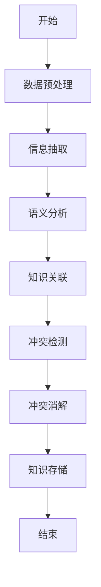
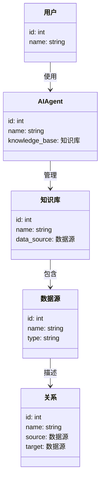
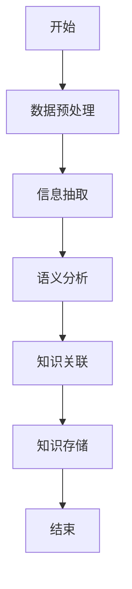

                 


# AI Agent的知识融合：整合多源异构信息

## 关键词：AI Agent, 知识融合, 多源异构信息, 信息整合, 知识图谱

## 摘要：  
AI Agent的知识融合是整合多源异构信息的核心技术，旨在将来自不同来源、格式多样、语义复杂的信息有效地整合起来，形成统一的、可理解的知识表示。本文系统地介绍了知识融合的背景、核心概念、算法原理、系统架构设计以及实际项目实现。通过多源信息的特征分析、知识图谱的构建方法、算法实现和系统设计，深入探讨了AI Agent在知识融合中的应用，为解决实际问题提供了理论基础和实践指导。

---

## 第一部分: 背景介绍与问题背景

### 第1章: 背景介绍与问题背景

#### 1.1 问题背景
##### 1.1.1 多源异构信息的定义与特点
多源异构信息指的是来自不同数据源、格式多样、语义复杂且可能存在冲突的信息。其特点包括多样性、异构性、冗余性、不一致性以及语义复杂性。

##### 1.1.2 知识融合的必要性与挑战
知识融合的必要性在于解决多源信息的异构性和不一致性问题，提升信息的准确性和可用性。其主要挑战包括数据的异构性、语义理解的难度、数据冗余和冲突的处理以及计算复杂性。

##### 1.1.3 当前技术的局限性与改进方向
当前技术在多源信息的整合中存在以下问题：信息抽取的不准确性、语义理解的局限性、知识表示的不统一、融合算法的效率问题。改进方向包括优化信息抽取和语义理解技术、统一知识表示方法、提升融合算法的效率。

#### 1.2 问题描述
##### 1.2.1 多源信息的异构性问题
多源信息的异构性问题主要体现在数据格式、语义表示和知识结构的差异性上。例如，文本数据、结构化数据和非结构化数据的整合问题。

##### 1.2.2 知识融合的目标与核心任务
知识融合的目标是将多源异构信息整合为统一、一致、可理解的知识表示。其核心任务包括信息抽取、语义分析、知识关联、冲突检测与消解。

##### 1.2.3 现实场景中的典型问题
在现实场景中，多源异构信息的整合问题广泛存在于智能问答系统、知识图谱构建、数据集成等领域。例如，整合来自不同数据库、文本文件和网络资源的信息。

#### 1.3 问题解决方法
##### 1.3.1 知识融合的基本思路
知识融合的基本思路包括信息抽取、语义分析、知识关联和冲突消解。信息抽取是从多源数据中提取结构化信息，语义分析是对信息进行语义理解，知识关联是建立信息之间的联系，冲突消解是解决信息冲突。

##### 1.3.2 多源信息的整合策略
多源信息的整合策略包括基于规则的方法、基于统计的方法、基于学习的方法以及混合方法。基于规则的方法通过预定义规则进行信息匹配，基于统计的方法通过概率模型进行信息融合，基于学习的方法利用机器学习模型进行自动学习。

##### 1.3.3 知识图谱构建与应用
知识图谱的构建是知识融合的重要应用，其主要步骤包括数据采集、信息抽取、语义分析、知识关联和知识存储。知识图谱的应用包括智能搜索、语义理解、推荐系统等。

#### 1.4 边界与外延
##### 1.4.1 知识融合的边界条件
知识融合的边界条件包括数据源的可获取性、信息的可提取性、语义理解的准确性以及计算资源的限制。这些条件决定了知识融合的可行性和效果。

##### 1.4.2 相关概念的对比与区分
知识融合与数据集成、信息抽取、知识表示等相关概念存在区别与联系。数据集成关注数据的物理整合，信息抽取关注信息的结构化表示，知识表示关注知识的语义建模。

##### 1.4.3 技术的适用范围与限制
知识融合技术适用于需要整合多源异构信息的场景，如智能问答、知识图谱构建等。其限制主要体现在数据质量、计算复杂性和语义理解的准确性。

#### 1.5 核心概念结构
##### 1.5.1 知识融合的核心要素
知识融合的核心要素包括信息抽取、语义分析、知识关联和冲突消解。这些要素共同构成了知识融合的基本框架。

##### 1.5.2 多源信息的特征分析
多源信息的特征包括数据格式的多样性、语义的复杂性、数据的冗余性和冲突性。这些特征影响知识融合的方法和效果。

##### 1.5.3 知识融合的流程框架
知识融合的流程框架包括信息抽取、语义分析、知识关联、冲突检测与消解以及知识存储与应用。这些步骤构成了知识融合的基本流程。

---

## 第二部分: 核心概念与联系

### 第2章: 核心概念与联系

#### 2.1 知识融合的原理
##### 2.1.1 知识表示的基本方法
知识表示的基本方法包括概念表示、关系表示和语义网络表示。概念表示通过实体和属性描述知识，关系表示通过关系和角色描述知识，语义网络表示通过节点和边描述知识。

##### 2.1.2 知识关联的构建方式
知识关联的构建方式包括基于规则的关联构建、基于统计的关联构建和基于学习的关联构建。基于规则的关联构建通过预定义规则进行关联，基于统计的关联构建通过概率模型进行关联，基于学习的关联构建通过机器学习模型进行自动关联。

##### 2.1.3 知识融合的数学模型
知识融合的数学模型包括基于图的表示学习、基于注意力机制的融合方法和基于符号逻辑的融合方法。这些模型通过数学方法描述知识的关联和冲突。

#### 2.2 核心概念的属性对比
##### 2.2.1 多源信息的特征对比表
以下是一个多源信息特征对比表：

| 特征维度 | 文本数据 | 结构化数据 | 非结构化数据 |
|----------|----------|------------|--------------|
| 数据格式 | 文本      | 表格        | 图像、音频等  |
| 语义复杂性 | 高       | 中         | 中            |
| 数据冗余性 | 高       | 低         | 高            |
| 数据冲突性 | 明显     | 明显       | 隐含          |

##### 2.2.2 异构数据的类型与特点
异构数据的类型包括文本、结构化数据和非结构化数据。文本数据具有语义复杂性，结构化数据具有规则性和可查询性，非结构化数据具有多样性和难以处理性。

##### 2.2.3 知识融合的指标与评价标准
知识融合的指标包括准确率、召回率、F1值、语义相似度和冲突率。这些指标用于评估知识融合的效果和质量。

#### 2.3 ER实体关系图
##### 2.3.1 实体与关系的定义
实体是知识图谱中的基本单元，表示现实世界中的事物或概念。关系是实体之间的关联，描述实体之间的联系。

##### 2.3.2 实体关系图的构建
以下是一个简单的实体关系图示例：

```mermaid
er
    actor: 用户
    agent: AI Agent
    knowledge_base: 知识库
    source: 数据源
    relation: 关系
    property: 属性

    actor -|> agent: 使用
    agent -|> knowledge_base: 管理
    knowledge_base -|> source: 包含
    source -|> relation: 描述
    relation -|> property: 包含
```

---

## 第三部分: 算法原理讲解

### 第3章: 算法原理讲解

#### 3.1 算法实现与流程
##### 3.1.1 算法选择与优化
知识融合算法的选择与优化需要考虑数据规模、计算效率和语义准确性。常见的算法包括基于规则的匹配算法、基于学习的匹配算法和混合算法。

##### 3.1.2 算法实现步骤
知识融合的算法实现步骤包括数据预处理、信息抽取、语义分析、知识关联和冲突检测与消解。

##### 3.1.3 算法流程图
以下是一个知识融合算法的流程图：



#### 3.2 算法优化与实现
##### 3.2.1 信息抽取算法
信息抽取算法包括基于规则的抽取和基于模型的抽取。以下是一个基于规则的抽取示例代码：

```python
def extract_info(text, pattern):
    import re
    matches = re.finditer(pattern, text)
    extracted = []
    for match in matches:
        extracted.append(match.group())
    return extracted
```

##### 3.2.2 语义分析算法
语义分析算法包括词袋模型、TF-IDF和BERT模型。以下是一个使用BERT模型进行语义分析的示例代码：

```python
from transformers import BertTokenizer, BertModel

def semantic_analysis(text):
    tokenizer = BertTokenizer.from_pretrained('bert-base-uncased')
    model = BertModel.from_pretrained('bert-base-uncased')
    inputs = tokenizer(text, return_tensors='np')
    outputs = model(**inputs)
    return outputs.last_hidden_state
```

##### 3.2.3 知识关联算法
知识关联算法包括基于图的关联和基于学习的关联。以下是一个基于图的关联算法示例代码：

```python
def create_graph(edges):
    from networkx import Graph
    g = Graph()
    g.add_edges_from(edges)
    return g
```

#### 3.3 算法原理的数学模型
##### 3.3.1 基于图的表示学习
基于图的表示学习模型通过图的节点和边表示知识的关联。其数学模型可以表示为：

$$
X = A \cdot X + \epsilon
$$

其中，\(X\) 是节点的表示，\(A\) 是图的邻接矩阵，\(\epsilon\) 是噪声。

##### 3.3.2 基于注意力机制的融合方法
基于注意力机制的融合方法通过加权平均的方式整合多源信息。其数学模型可以表示为：

$$
y = \sum_{i=1}^{n} \alpha_i x_i
$$

其中，\(\alpha_i\) 是第\(i\)个源的注意力权重，\(x_i\) 是第\(i\)个源的信息。

##### 3.3.3 基于符号逻辑的融合方法
基于符号逻辑的融合方法通过符号逻辑规则进行知识的关联和冲突消解。其数学模型可以表示为：

$$
\text{如果 } p \text{ 和 } q \text{ 都为真，则 } r \text{ 为真。}
$$

其中，\(p\) 和 \(q\) 是前提，\(r\) 是结论。

---

## 第四部分: 系统分析与架构设计

### 第4章: 系统分析与架构设计

#### 4.1 系统分析
##### 4.1.1 问题场景介绍
知识融合系统的应用场景包括智能问答、知识图谱构建、数据集成等。以下是一个典型的智能问答场景：

```mermaid
sequenceDiagram
    actor 用户 -> agent: 查询问题
    agent -> knowledge_base: 查询知识库
    knowledge_base -> source: 获取数据
    source -> agent: 返回结果
    agent -> 用户: 返回答案
```

##### 4.1.2 项目介绍
本项目旨在开发一个基于AI Agent的知识融合系统，整合多源异构信息，构建知识图谱，支持智能问答和决策。

#### 4.2 系统功能设计
##### 4.2.1 领域模型设计
领域模型设计包括用户、AI Agent、知识库、数据源和关系。以下是一个领域模型的类图：



##### 4.2.2 系统架构设计
系统架构设计包括数据采集层、数据处理层、知识融合层和应用层。以下是一个系统架构图：


##### 4.2.3 系统接口设计
系统接口设计包括数据接口、知识库接口和应用接口。数据接口负责数据的输入输出，知识库接口负责知识的存储和查询，应用接口负责与用户交互。

##### 4.2.4 系统交互流程
系统交互流程包括用户请求、数据采集、数据处理、知识融合和结果返回。以下是一个系统交互流程图：

```mermaid
sequenceDiagram
    actor 用户 -> agent: 发起请求
    agent -> knowledge_base: 查询知识库
    knowledge_base -> dataSource: 获取数据
    dataSource -> processor: 数据处理
    processor -> fusion: 知识融合
    fusion -> agent: 返回结果
    agent -> 用户: 返回答案
```

---

## 第五部分: 项目实战

### 第5章: 项目实战

#### 5.1 环境安装与配置
##### 5.1.1 开发环境要求
开发环境要求包括Python 3.6及以上版本、Jupyter Notebook、Git和虚拟环境。以下是安装命令：

```bash
pip install python
pip install jupyter
pip install git
pip install virtualenv
```

##### 5.1.2 依赖库安装
依赖库包括Numpy、Pandas、Networkx、Transformers和Plotly。以下是安装命令：

```bash
pip install numpy pandas networkx transformers plotly
```

#### 5.2 系统核心实现
##### 5.2.1 核心代码实现
以下是知识融合系统的核心代码实现：

```python
import networkx as nx
from transformers import BertTokenizer, BertModel

def extract_info(text, pattern):
    import re
    matches = re.finditer(pattern, text)
    extracted = []
    for match in matches:
        extracted.append(match.group())
    return extracted

def semantic_analysis(text):
    tokenizer = BertTokenizer.from_pretrained('bert-base-uncased')
    model = BertModel.from_pretrained('bert-base-uncased')
    inputs = tokenizer(text, return_tensors='np')
    outputs = model(**inputs)
    return outputs.last_hidden_state

def create_graph(edges):
    g = nx.Graph()
    g.add_edges_from(edges)
    return g
```

##### 5.2.2 代码解读与分析
核心代码实现包括信息抽取、语义分析和知识图谱构建。信息抽取通过正则表达式提取文本中的关键信息，语义分析使用BERT模型进行语义表示，知识图谱构建通过Networkx库构建图结构。

##### 5.2.3 代码实现的流程
代码实现的流程包括数据预处理、信息抽取、语义分析、知识关联和知识存储。以下是代码流程图：



#### 5.3 实际案例分析
##### 5.3.1 案例背景
案例背景是一个智能问答系统，整合多源异构信息，构建知识图谱，支持用户的智能查询。

##### 5.3.2 案例实现
以下是智能问答系统的实现步骤：

1. 数据采集：从多个数据源获取相关数据。
2. 信息抽取：提取文本中的关键信息。
3. 语义分析：使用BERT模型进行语义表示。
4. 知识关联：构建知识图谱。
5. 智能问答：基于知识图谱进行问答。

##### 5.3.3 案例分析与总结
案例分析表明，知识融合技术能够有效整合多源异构信息，构建统一的知识表示，提升智能问答系统的准确性和效率。

---

## 第六部分: 最佳实践与总结

### 第6章: 最佳实践与总结

#### 6.1 最佳实践
##### 6.1.1 数据预处理的技巧
数据预处理的技巧包括数据清洗、数据标准化和数据增强。数据清洗用于去除噪声，数据标准化用于统一数据格式，数据增强用于提升数据质量。

##### 6.1.2 知识融合的优化方法
知识融合的优化方法包括优化信息抽取算法、改进语义分析模型和提升知识关联算法的效率。

##### 6.1.3 系统设计的注意事项
系统设计的注意事项包括系统的可扩展性、系统的可维护性和系统的安全性。系统的可扩展性要求能够适应数据规模的扩展，系统的可维护性要求能够方便地进行功能扩展和维护，系统的安全性要求能够防止数据泄露和攻击。

#### 6.2 小结
知识融合是整合多源异构信息的核心技术，其在智能问答、知识图谱构建等领域具有广泛的应用。通过多源信息的特征分析、知识图谱的构建方法、算法实现和系统设计，可以有效提升知识融合的效果和效率。

#### 6.3 注意事项
在知识融合的实践中，需要注意数据质量、计算复杂性和语义理解的准确性。数据质量直接影响融合效果，计算复杂性影响系统的效率，语义理解的准确性影响系统的准确性。

#### 6.4 拓展阅读
拓展阅读包括阅读相关论文、参加学术会议和参与开源项目。以下是推荐的论文和书籍：

- 《Knowledge Fusion: A Survey》
- 《Graph Neural Networks: A Review》
- 《Deep Learning for NLP》

---

## 作者：AI天才研究院/AI Genius Institute & 禅与计算机程序设计艺术 /Zen And The Art of Computer Programming

