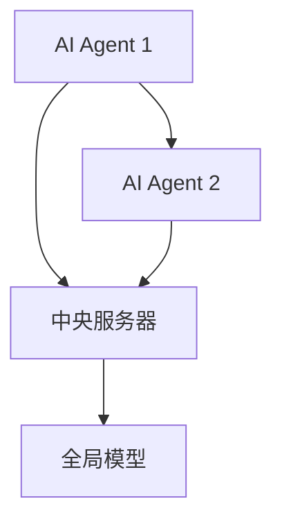

                 


# AI Agent的隐私保护联邦学习：数据不出本地的协作训练

> 关键词：AI Agent，联邦学习，隐私保护，数据安全，协作训练，分布式计算，机器学习

> 摘要：  
在人工智能和机器学习领域，数据隐私和安全问题日益重要。为了在不共享原始数据的情况下进行协作训练，AI Agent与联邦学习的结合提供了一种创新的解决方案。本文详细探讨AI Agent在隐私保护联邦学习中的应用，分析其核心原理、算法机制、系统架构以及实际案例，为读者提供全面的技术解析。

---

# 第1章: 联邦学习与AI Agent概述

## 1.1 联邦学习的基本概念
### 1.1.1 联邦学习的定义与特点
- 联邦学习（Federated Learning）是一种分布式机器学习技术，允许多个参与方在不共享原始数据的情况下共同训练模型。
- 特点：数据本地化、模型参数同步、隐私保护、去中心化。

### 1.1.2 联邦学习的核心原理
- 分布式数据：数据分布在不同的设备或服务器上。
- 模型聚合：通过通信协议将各设备的模型参数进行聚合，形成全局模型。

### 1.1.3 联邦学习与传统数据共享的区别
- 数据不集中：避免数据泄露风险。
- 隐私保护：通过加密和差分隐私技术确保数据安全。

## 1.2 AI Agent的定义与特性
### 1.2.1 AI Agent的基本概念
- AI Agent：具有感知环境和自主决策能力的智能体，能够执行特定任务。
- 特性：自主性、反应性、目标导向。

### 1.2.2 AI Agent的核心属性
- 感知环境：通过传感器或数据输入获取信息。
- 决策与执行：基于感知信息做出决策并执行操作。

### 1.2.3 AI Agent在联邦学习中的角色
- 数据提供者：AI Agent拥有本地数据，参与模型训练。
- 模型协作者：AI Agent与其他设备协作，共同优化模型。

## 1.3 联邦学习与AI Agent的结合
### 1.3.1 联邦学习中AI Agent的应用场景
- 分布式环境：多个AI Agent协作训练模型。
- 数据隐私保护：AI Agent确保数据不出本地。

### 1.3.2 AI Agent如何实现数据不出本地的协作
- 本地训练：AI Agent在本地设备上进行模型训练。
- 参数同步：通过通信协议将模型参数发送到中央服务器或协调者。

### 1.3.3 联邦学习与AI Agent结合的优势
- 数据安全：数据无需离开本地设备。
- 分布式计算：提高计算能力和资源利用率。

## 1.4 本章小结
- 联邦学习是一种分布式机器学习技术，AI Agent在其中扮演数据提供者和模型协作者的角色。
- 通过AI Agent，联邦学习能够在保护数据隐私的前提下实现协作训练。

---

# 第2章: 隐私保护联邦学习的核心概念

## 2.1 数据隐私与安全的挑战
### 2.1.1 数据隐私的重要性
- 避免数据泄露：防止敏感信息被未经授权的第三方获取。
- 符合法规：如GDPR等数据保护法规的要求。

### 2.1.2 数据泄露的风险与影响
- 个人隐私泄露：可能导致身份盗窃或其他安全问题。
- 企业损失：数据泄露可能引发法律诉讼和经济损失。

### 2.1.3 数据不出本地的必要性
- 遵守数据隐私法规：确保数据不被传输到其他地方。
- 保护用户信任：增强用户对系统的信任。

## 2.2 联邦学习的隐私保护机制
### 2.2.1 数据加密与匿名化
- 数据加密：在传输过程中对数据进行加密，确保数据安全。
- 数据匿名化：通过匿名化技术去除数据中的敏感信息。

### 2.2.2 差分隐私与同态加密
- 差分隐私：在数据中添加噪声，使得查询结果无法推断出具体个体信息。
- 同态加密：允许在加密数据上进行计算，结果仍保持加密状态。

### 2.2.3 联邦学习中的隐私保护策略
- 定期模型更新：通过频繁更新模型参数，减少数据泄露风险。
- 限制通信次数：减少数据传输次数，降低被截获的可能性。

## 2.3 AI Agent在隐私保护中的作用
### 2.3.1 AI Agent如何确保数据不出本地
- 本地训练：AI Agent在本地设备上进行模型训练，数据不外传。
- 参数同步：仅传输模型参数，不传输原始数据。

### 2.3.2 AI Agent的隐私保护机制
- 数据加密：AI Agent在本地加密数据，确保数据传输过程中的安全性。
- 隐私过滤：AI Agent在本地对数据进行匿名化处理，去除敏感信息。

### 2.3.3 AI Agent与联邦学习的结合
- 数据不出本地：AI Agent确保数据不离开本地设备。
- 模型协作：AI Agent与其他设备协作，共同优化模型。

## 2.4 本章小结
- 联邦学习需要依赖隐私保护机制来确保数据安全。
- AI Agent通过本地训练和参数同步，实现数据不出本地的协作训练。

---

# 第3章: 联邦学习的算法原理

## 3.1 联邦学习的算法框架
### 3.1.1 联邦平均（FedAvg）算法
- 定义：FedAvg是一种经典的联邦学习算法，通过平均各设备的模型参数来更新全局模型。
- 步骤：
  1. 中央服务器将初始模型参数分发给各设备。
  2. 各设备在本地数据上训练模型，更新参数。
  3. 各设备将更新后的模型参数上传到中央服务器。
  4. 中央服务器将所有设备的模型参数进行平均，更新全局模型。

### 3.1.2 联邦直方（FedMax）算法
- 定义：FedMax是一种基于直方图压缩的联邦学习算法，适用于分类任务。
- 步骤：
  1. 各设备在本地数据上训练模型，生成概率分布。
  2. 将概率分布压缩成直方图形式，减少数据传输量。
  3. 中央服务器将各设备的直方图进行聚合，更新全局模型。

### 3.1.3 联邦学习的数学模型
- 全局模型：$ \theta = \frac{1}{n}\sum_{i=1}^n \theta_i $，其中$\theta_i$是第i个设备的模型参数，$n$是设备总数。

## 3.2 AI Agent的协作训练算法
### 3.2.1 分布式优化算法
- 分布式优化：通过并行计算和参数同步，实现全局模型的优化。
- AI Agent在本地进行梯度下降，更新模型参数。

### 3.2.2 联邦学习中的同步与异步更新
- 同步更新：所有设备同时更新模型参数，确保一致性。
- 异步更新：设备可以在不同时间更新模型参数，提高效率。

### 3.2.3 AI Agent的本地训练与全局聚合
- 本地训练：AI Agent在本地数据上训练模型，生成更新后的参数。
- 全局聚合：中央服务器将各设备的模型参数进行聚合，更新全局模型。

## 3.3 联邦学习的收敛性分析
### 3.3.1 联邦学习的收敛条件
- 数据分布：数据分布应满足一定的相似性，确保模型收敛。
- 通信频率：通信次数足够多，确保参数同步。

### 3.3.2 联邦学习的收敛速度
- 收敛速度与设备数量、通信频率、数据分布等因素相关。
- 算法优化：通过改进算法，提高收敛速度。

### 3.3.3 联邦学习的鲁棒性分析
- 鲁棒性：算法在面对数据异质性时的性能表现。
- 数据异质性：不同设备的数据分布可能不同，影响模型收敛。

## 3.4 本章小结
- 联邦学习的算法框架包括FedAvg和FedMax等，各有优缺点。
- AI Agent在本地训练和全局聚合中起着关键作用。
- 联邦学习的收敛性和鲁棒性需要进一步研究和优化。

---

# 第4章: 联邦学习的数学模型与公式

## 4.1 联邦学习的基本数学模型
### 4.1.1 联邦学习的目标函数
- 损失函数：$ L(\theta) = \frac{1}{n}\sum_{i=1}^n L_i(\theta) $，其中$L_i$是第i个设备的损失函数。
- 正则化项：$ \lambda \Omega(\theta) $，用于防止过拟合。

### 4.1.2 联邦学习的损失函数
- 分类任务：交叉熵损失函数。
- 回归任务：均方误差损失函数。

### 4.1.3 联邦学习的优化目标
- 最小化全局损失函数：$ \min_{\theta} \frac{1}{n}\sum_{i=1}^n L_i(\theta) + \lambda \Omega(\theta) $。

## 4.2 AI Agent的协作训练模型
### 4.2.1 分布式优化的数学表达
- 本地优化：$ \theta_i^{new} = \theta_i - \eta \nabla L_i(\theta_i) $，其中$\eta$是学习率。
- 全局聚合：$ \theta = \frac{1}{n}\sum_{i=1}^n \theta_i^{new} $。

### 4.2.2 联邦学习的聚合公式
- 加权平均：$ \theta = \sum_{i=1}^n w_i \theta_i $，其中$w_i$是第i个设备的权重。

### 4.2.3 联邦学习的数学推导
- 使用梯度下降方法，推导出参数更新公式。
- 通过数学推导，证明算法的收敛性。

## 4.3 联邦学习的数学公式
### 4.3.1 联邦平均（FedAvg）公式
$$ \theta_{new} = \frac{1}{n}\sum_{i=1}^n \theta_i $$

### 4.3.2 联邦直方（FedMax）公式
$$ H_{new} = \sum_{i=1}^n H_i $$

### 4.3.3 联邦学习的收敛性证明
- 使用数学归纳法，证明算法在一定条件下收敛。

## 4.4 本章小结
- 联邦学习的数学模型是算法的核心，通过数学推导可以证明算法的收敛性和有效性。

---

# 第5章: 系统分析与架构设计方案

## 5.1 系统应用场景
### 5.1.1 联邦学习的应用场景
- 多设备协作：智能家居、移动设备等。
- 数据孤岛：不同机构拥有独立数据，无法共享。

### 5.1.2 AI Agent的应用场景
- 智能助手：如智能手机、智能音箱等。
- 物联网：设备协作完成特定任务。

## 5.2 系统功能设计
### 5.2.1 系统功能模块
- 数据预处理：清洗和归一化数据。
- 模型训练：本地训练和参数同步。
- 通信协议：数据和参数传输的协议。

### 5.2.2 系统功能流程
1. 数据预处理：AI Agent对本地数据进行清洗和归一化。
2. 模型训练：AI Agent在本地数据上训练模型，生成更新后的参数。
3. 参数同步：AI Agent将更新后的参数上传到中央服务器。
4. 全局聚合：中央服务器将各设备的模型参数进行聚合，更新全局模型。

## 5.3 系统架构设计
### 5.3.1 系统架构图


### 5.3.2 系统通信协议
- 数据传输：使用加密协议，确保数据安全。
- 参数同步：使用联邦学习协议，确保参数同步的正确性。

## 5.4 系统接口设计
### 5.4.1 系统接口
- 数据接口：AI Agent与本地数据源的接口。
- 参数接口：AI Agent与中央服务器的接口。

### 5.4.2 系统交互流程
1. AI Agent向中央服务器请求模型参数。
2. AI Agent在本地训练模型，生成更新后的参数。
3. AI Agent将更新后的参数上传到中央服务器。
4. 中央服务器将所有设备的参数进行聚合，更新全局模型。

## 5.5 本章小结
- 系统架构设计是实现联邦学习的关键，需要考虑数据预处理、模型训练和参数同步等多个方面。

---

# 第6章: 项目实战

## 6.1 环境搭建
### 6.1.1 环境要求
- 操作系统：Linux/Windows/MacOS。
- 依赖库：Python、TensorFlow、Keras等。

### 6.1.2 环境配置
- 安装必要的Python库：`pip install tensorflow keras numpy`。

## 6.2 系统核心实现
### 6.2.1 核心代码
```python
import tensorflow as tf
from tensorflow.keras import layers

# 定义模型
model = tf.keras.Sequential([
    layers.Dense(64, activation='relu'),
    layers.Dense(10, activation='softmax')
])

# 编译模型
model.compile(optimizer='adam', loss='sparse_categorical_crossentropy', metrics=['accuracy'])

# 本地训练
model.fit(x_train, y_train, epochs=1, batch_size=32)

# 获取更新后的参数
weights = model.get_weights()
```

### 6.2.2 代码解读与分析
- 定义模型：使用Keras构建一个简单的神经网络模型。
- 编译模型：选择优化器和损失函数。
- 本地训练：在本地数据上训练模型，生成更新后的参数。

## 6.3 实际案例分析
### 6.3.1 案例背景
- 数据来源：多个设备的本地数据。
- 任务：分类任务，如图像分类。

### 6.3.2 案例实现
- 实现一个简单的图像分类任务，使用FedAvg算法进行模型训练。
- 代码实现：
  ```python
  # 中央服务器接收各设备的参数
  def aggregate(weights_list):
      return tf.reduce_mean(weights_list, axis=0)
  
  # 联邦学习流程
  global_weights = initialize_global_weights()
  for _ in range(num_rounds):
      for agent in agents:
          # 下载全局模型参数
          agent.model.set_weights(global_weights)
          # 本地训练
          agent.model.fit(agent.x_train, agent.y_train, epochs=1, batch_size=32)
          # 获取更新后的参数
          updated_weights = agent.model.get_weights()
          # 上传参数到中央服务器
          weights_list.append(updated_weights)
      # 聚合参数
      global_weights = aggregate(weights_list)
  ```

### 6.3.3 案例分析与总结
- 通过案例分析，验证联邦学习算法的有效性。
- 总结实现过程中遇到的问题及解决方案。

## 6.4 本章小结
- 项目实战部分通过具体实现，帮助读者理解联邦学习的算法和系统设计。

---

# 第7章: 最佳实践与总结

## 7.1 最佳实践
### 7.1.1 小结
- 联邦学习是一种有效的数据隐私保护技术。
- AI Agent在联邦学习中的作用不可忽视。

### 7.1.2 注意事项
- 数据预处理：确保数据质量和一致性。
- 参数同步：保证通信的高效性和安全性。
- 模型优化：通过算法优化提高模型性能。

### 7.1.3 拓展阅读
- 推荐阅读《联邦学习：隐私保护下的分布式机器学习》。
- 参考论文：Google的FedAvg算法论文。

## 7.2 本章总结
- 联邦学习与AI Agent的结合为数据隐私保护提供了新的解决方案。
- 通过本文的讲解，读者可以深入了解联邦学习的原理和实现方法。

---

# 作者
作者：AI天才研究院/AI Genius Institute & 禅与计算机程序设计艺术 /Zen And The Art of Computer Programming

---

以上是《AI Agent的隐私保护联邦学习：数据不出本地的协作训练》的技术博客文章的完整目录大纲和内容。

