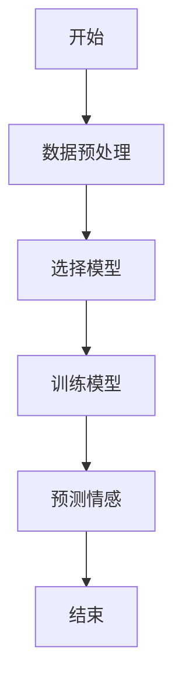
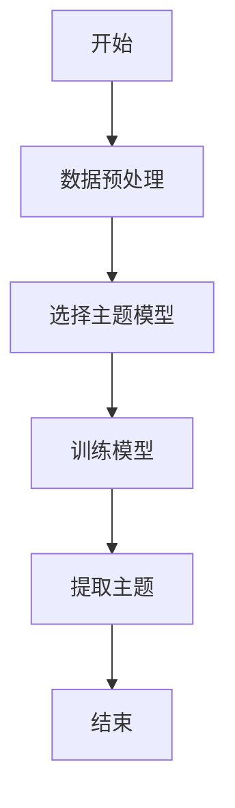
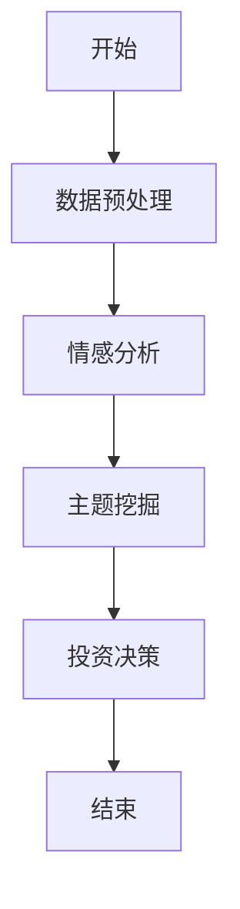
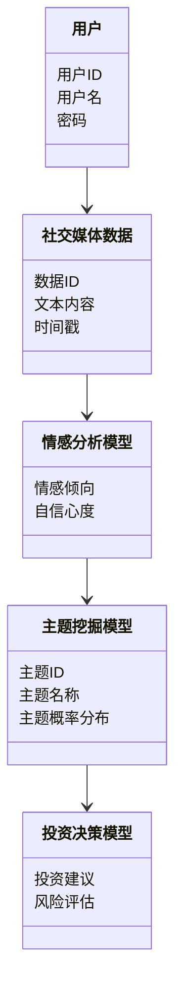
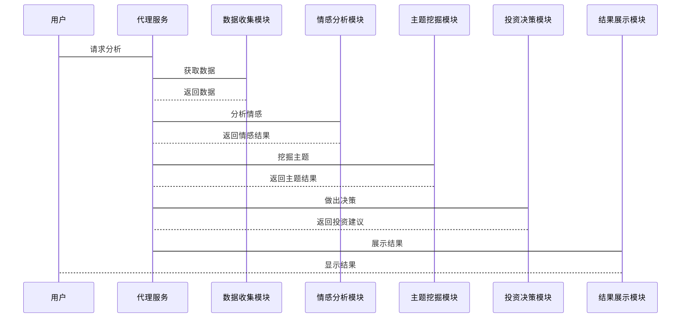

                 


# AI agents辅助价值投资者进行社交媒体分析

> 关键词：AI代理，社交媒体分析，价值投资，自然语言处理，情感分析，投资决策，数据挖掘

> 摘要：本文探讨了AI代理如何辅助价值投资者通过社交媒体分析进行投资决策。从AI代理的核心概念到社交媒体分析的关键技术，再到具体的算法原理和系统架构设计，本文详细分析了AI代理在社交媒体分析中的应用，并通过实际案例展示了其在价值投资中的潜力。

---

## 第1章 AI代理与社交媒体分析概述

### 1.1 AI代理的核心概念

#### 1.1.1 AI代理的定义与特点

- **定义**：AI代理（Artificial Intelligence Agents）是能够感知环境、自主决策并执行任务的智能实体。它们通过数据输入、分析和推理，提供决策支持或自动化操作。
- **特点**：
  - **自主性**：无需外部干预，自主完成任务。
  - **反应性**：能够实时感知环境变化并做出响应。
  - **学习能力**：通过数据和反馈不断优化性能。
  - **可扩展性**：适用于多种场景和规模。

#### 1.1.2 社交媒体分析的定义与作用

- **定义**：社交媒体分析是通过收集和分析社交媒体上的数据，提取有价值的信息，用于商业决策或研究。
- **作用**：
  - **情绪分析**：识别公众对特定话题的情感倾向。
  - **主题挖掘**：发现社交媒体上的主要讨论主题。
  - **趋势预测**：通过分析历史数据预测未来趋势。

#### 1.1.3 AI代理在价值投资中的应用背景

- **背景**：价值投资依赖于对市场、公司和经济趋势的深入分析。社交媒体作为信息的重要来源，为投资者提供了实时动态。然而，社交媒体数据量大、复杂，人工分析效率低下，AI代理成为理想的辅助工具。
- **优势**：
  - **实时性**：快速处理和分析社交媒体数据。
  - **准确性**：通过算法提高分析的准确性。
  - **高效性**：自动化处理大量数据，节省时间和成本。

---

### 1.2 价值投资与社交媒体分析的关系

#### 1.2.1 价值投资的基本原理

- **定义**：价值投资是一种投资策略，强调以低于内在价值的价格购买优质资产。
- **核心思想**：寻找市场低估的公司，长期持有，等待价值回归。

#### 1.2.2 社交媒体对投资决策的影响

- **影响**：
  - **情绪影响**：社交媒体上的舆论可以影响市场情绪，进而影响资产价格。
  - **信息获取**：社交媒体提供了实时的市场动态和公司新闻。
  - **投资者行为**：社交媒体上的信息可以影响投资者的决策行为。

#### 1.2.3 AI代理在社交媒体分析中的优势

- **优势**：
  - **自动化**：AI代理可以自动收集和分析社交媒体数据。
  - **深度分析**：利用自然语言处理技术，提取深层次的信息。
  - **实时监控**：持续监控社交媒体，及时发现潜在机会或风险。

---

### 1.3 本书的核心目标与内容框架

#### 1.3.1 本书的核心目标

- **目标**：探讨AI代理如何辅助价值投资者进行社交媒体分析，提供理论基础、算法原理和实际案例。

#### 1.3.2 本书的主要内容框架

- **第1章**：介绍AI代理和社交媒体分析的基本概念。
- **第2章**：分析AI代理与社交媒体分析的核心技术。
- **第3章**：讲解AI代理辅助价值投资的算法原理。
- **第4章**：探讨数学模型和公式。
- **第5章**：设计系统架构。
- **第6章**：项目实战。
- **第7章**：总结与展望。

#### 1.3.3 本书的读者群体

- **读者**：投资者、数据科学家、技术开发者，对AI代理和社交媒体分析感兴趣的人士。

---

### 1.4 本章小结

- 本章介绍了AI代理和社交媒体分析的基本概念，分析了它们在价值投资中的作用和优势，为后续章节奠定了基础。

---

## 第2章 AI代理与社交媒体分析的核心技术

### 2.1 AI代理的核心原理

#### 2.1.1 AI代理的基本工作流程

- **流程**：
  1. 数据收集：从社交媒体获取数据。
  2. 数据预处理：清洗和转换数据。
  3. 情感分析：识别文本的情感倾向。
  4. 主题挖掘：发现主要讨论主题。
  5. 投资决策：基于分析结果做出决策。

#### 2.1.2 代理的智能性与自主性

- **智能性**：通过机器学习模型实现智能分析。
- **自主性**：无需人工干预，自动执行任务。

#### 2.1.3 代理与人类投资者的交互方式

- **交互方式**：
  - **文本交互**：通过自然语言处理与人类对话。
  - **数据可视化**：以图表形式展示分析结果。
  - **反馈机制**：根据用户反馈优化分析结果。

---

### 2.2 社交媒体分析的关键技术

#### 2.2.1 数据收集与预处理

- **数据收集**：
  - 使用API从社交媒体平台获取数据。
  - 收集文本、用户信息和互动数据。
- **数据预处理**：
  - 清洗数据，去除噪声。
  - 转换数据格式，便于后续分析。

#### 2.2.2 自然语言处理技术

- **自然语言处理（NLP）**：
  - 分词：将文本分割成词语或短语。
  - 去除停用词：移除常见词汇，如“的”、“是”等。
  - 词干提取：将词语还原到其基本形式。

#### 2.2.3 情感分析与主题挖掘

- **情感分析**：
  - 判断文本的情感倾向，如正面、负面或中性。
  - 使用词袋模型或深度学习模型实现。
- **主题挖掘**：
  - 识别文本的主要主题。
  - 使用聚类或主题模型（如LDA）实现。

---

### 2.3 AI代理与社交媒体分析的结合模型

#### 2.3.1 数据流模型

- **数据流模型**：
  - 数据从社交媒体流向代理，经过处理后，生成分析结果。

#### 2.3.2 代理行为模型

- **代理行为模型**：
  - 代理根据分析结果做出决策或提供建议。

#### 2.3.3 投资决策模型

- **投资决策模型**：
  - 结合情感分析和主题挖掘结果，做出投资决策。

---

### 2.4 核心概念对比分析

#### 2.4.1 AI代理与传统数据分析工具的对比

- **对比**：
  - **传统工具**：依赖人工操作，效率低。
  - **AI代理**：自动化处理，效率高。

#### 2.4.2 不同社交媒体分析方法的优缺点

- **优缺点**：
  - **情感分析**：优点是快速识别情感倾向，缺点是可能不够准确。
  - **主题挖掘**：优点是发现潜在主题，缺点是计算复杂。

#### 2.4.3 代理在投资决策中的角色定位

- **角色**：
  - **辅助决策**：AI代理提供数据支持，最终决策由人类投资者做出。

---

### 2.5 本章小结

- 本章详细介绍了AI代理与社交媒体分析的核心技术，分析了它们的结合模型和优缺点，为后续章节奠定了技术基础。

---

## 第3章 AI代理辅助价值投资的算法原理

### 3.1 情感分析算法

#### 3.1.1 基于词袋模型的情感分析

- **词袋模型**：
  - 将文本表示为词语的集合，不考虑顺序。
  - 使用机器学习模型（如SVM）进行分类。

#### 3.1.2 基于深度学习的情感分析

- **深度学习模型**：
  - 使用循环神经网络（RNN）或 transformer 模型（如BERT）进行情感分析。

#### 3.1.3 情感分析的优化方法

- **优化方法**：
  - 使用预训练模型（如GPT）进行微调。
  - 结合上下文信息，提高准确性。

---

### 3.2 主题挖掘算法

#### 3.2.1 基于聚类的主题挖掘

- **聚类算法**：
  - 使用K-means或DBSCAN算法，将相似的文本聚类。

#### 3.2.2 基于主题模型的主题挖掘

- **主题模型**：
  - 使用Latent Dirichlet Allocation (LDA) 模型，发现主题分布。

#### 3.2.3 主题挖掘的可解释性问题

- **可解释性**：
  - 主题模型通常不可解释，需要进一步分析。

---

### 3.3 投资决策算法

#### 3.3.1 基于规则的投资决策

- **规则驱动决策**：
  - 根据预设规则（如“如果情感倾向为负面，卖出股票”）做出决策。

#### 3.3.2 基于机器学习的投资决策

- **机器学习模型**：
  - 使用随机森林或梯度提升树（如XGBoost）进行分类或回归。

#### 3.3.3 投资决策的动态调整方法

- **动态调整**：
  - 根据市场变化和新数据，实时调整模型参数。

---

### 3.4 算法流程图

#### 3.4.1 情感分析流程图



#### 3.4.2 主题挖掘流程图



#### 3.4.3 投资决策流程图



---

### 3.5 本章小结

- 本章详细讲解了AI代理辅助价值投资的算法原理，包括情感分析、主题挖掘和投资决策的算法流程，为后续章节的系统设计和项目实战奠定了基础。

---

## 第4章 数学模型与公式解析

### 4.1 情感分析的数学模型

#### 4.1.1 词袋模型的数学表达

- **词袋模型**：
  - 文本表示为一个向量，每个元素表示一个词的出现与否。
  - 向量维度为词表大小，元素值为0或1。

#### 4.1.2 词嵌入模型的数学表达

- **词嵌入**：
  - 使用词嵌入模型（如Word2Vec）将词映射到低维空间。
  - 每个词表示为一个向量，维度远小于词表大小。

#### 4.1.3 深度学习模型的数学表达

- **深度学习模型**：
  - 使用神经网络模型（如LSTM）进行情感分类。
  - 模型通过多层神经网络提取特征，最后输出情感类别。

---

### 4.2 主题挖掘的数学模型

#### 4.2.1 聚类算法的数学表达

- **聚类算法**：
  - 使用距离度量（如余弦相似度）计算文本之间的相似性。
  - 使用聚类算法（如K-means）将相似文本分组。

#### 4.2.2 主题模型的数学表达

- **主题模型**：
  - 使用LDA模型，假设每篇文档由多个主题组成，每个主题由多个词语组成。
  - 模型通过概率分布描述主题和词语的关系。

#### 4.2.3 主题概率分布的计算

- **主题概率分布**：
  - 使用Dirichlet分布描述主题在文档中的概率分布。
  - 使用Gibbs采样方法进行模型训练。

---

### 4.3 投资决策的数学模型

#### 4.3.1 基于回归的投资决策模型

- **回归模型**：
  - 使用线性回归模型预测股票价格。
  - 使用最小二乘法优化模型参数。

#### 4.3.2 基于分类的投资决策模型

- **分类模型**：
  - 使用逻辑回归或SVM进行股票涨跌分类。
  - 使用交叉验证优化模型参数。

#### 4.3.3 基于强化学习的投资决策模型

- **强化学习模型**：
  - 使用Q-learning算法，通过奖励机制优化投资策略。
  - 状态空间包括市场数据和当前资产组合。

---

### 4.4 本章小结

- 本章详细推导了AI代理辅助价值投资的数学模型，包括情感分析、主题挖掘和投资决策的数学表达，为后续章节的系统设计和项目实战提供了理论支持。

---

## 第5章 系统架构与设计

### 5.1 问题场景介绍

- **问题场景**：
  - 投资者需要实时监控社交媒体上的信息，获取市场动态和公司新闻。
  - 通过分析社交媒体数据，辅助投资决策。

### 5.2 项目介绍

- **项目名称**：
  - “AI代理辅助价值投资社交媒体分析系统”。
- **项目目标**：
  - 开发一个基于AI代理的社交媒体分析系统，辅助价值投资者进行投资决策。

### 5.3 系统功能设计

#### 5.3.1 领域模型



---

#### 5.3.2 系统架构设计


---

#### 5.3.3 系统接口设计

- **接口定义**：
  - 数据收集模块提供API，供代理服务调用。
  - 情感分析模块提供API，供主题挖掘模块调用。
  - 投资决策模块提供API，供结果展示模块调用。

#### 5.3.4 系统交互设计



---

### 5.4 本章小结

- 本章详细设计了AI代理辅助价值投资社交媒体分析系统的架构，包括功能模块、接口设计和系统交互流程，为后续章节的项目实现奠定了基础。

---

## 第6章 项目实战

### 6.1 环境安装与配置

- **环境要求**：
  - Python 3.8+
  - 安装必要的库：numpy、pandas、scikit-learn、spacy、transformers。
- **安装步骤**：
  ```bash
  pip install numpy pandas scikit-learn spacy transformers
  ```

### 6.2 系统核心实现

#### 6.2.1 数据收集模块

- **代码实现**：
  ```python
  import requests
  from bs4 import BeautifulSoup

  def get_social_media_data(url):
      response = requests.get(url)
      soup = BeautifulSoup(response.text, 'html.parser')
      data = []
      for item in soup.find_all('div', class_='tweet'):
          content = item.find('p').text
          timestamp = item.find('span', class_='time').text
          data.append({'content': content, 'timestamp': timestamp})
      return data
  ```

#### 6.2.2 情感分析模块

- **代码实现**：
  ```python
  from transformers import pipeline

  sentiment_analyzer = pipeline('sentiment-analysis')

  def analyze_sentiment(text):
      result = sentiment_analyzer(text)
      return result[0]['label'], result[0]['score']
  ```

#### 6.2.3 主题挖掘模块

- **代码实现**：
  ```python
  from sklearn.decomposition import LatentDirichletAllocation

  def perform_topic_modeling(X, n_topics=5):
      lda = LatentDirichletAllocation(n_components=n_topics, random_state=0)
      lda.fit(X)
      return lda
  ```

#### 6.2.4 投资决策模块

- **代码实现**：
  ```python
  from sklearn.ensemble import RandomForestClassifier

  def train_investment_model(X_train, y_train):
      model = RandomForestClassifier(n_estimators=100, random_state=0)
      model.fit(X_train, y_train)
      return model
  ```

---

### 6.3 代码应用解读与分析

- **代码解读**：
  - 数据收集模块从指定URL获取社交媒体数据。
  - 情感分析模块使用预训练模型进行情感分类。
  - 主题挖掘模块使用LDA模型发现主题。
  - 投资决策模块使用随机森林模型进行分类。

### 6.4 实际案例分析与详细讲解

- **案例分析**：
  - 数据收集：从Twitter获取某公司的最新推文。
  - 情感分析：分析推文的情感倾向。
  - 主题挖掘：发现推文的主要讨论主题。
  - 投资决策：基于分析结果，给出买入、卖出或持有建议。

### 6.5 项目小结

- **总结**：
  - 通过项目实战，验证了AI代理辅助价值投资社交媒体分析系统的可行性。
  - 展示了如何将理论应用于实际，提供了可参考的代码和实现步骤。

---

## 第7章 总结与展望

### 7.1 本章总结

- **总结**：
  - AI代理在社交媒体分析中的应用为价值投资者提供了强大的工具。
  - 通过自动化数据处理、深度分析和智能决策，AI代理显著提高了投资效率和准确性。

### 7.2 未来展望

- **技术发展**：
  - 更加智能化的AI代理，具备自适应学习能力。
  - 结合区块链技术，提高数据安全性和可信度。
- **应用场景**：
  - 更广泛的应用，如实时市场监控、风险预警等。
  - 跨平台集成，与其他投资工具无缝对接。

### 7.3 最佳实践 tips

- **数据隐私**：注意保护用户数据隐私，遵守相关法律法规。
- **模型优化**：定期更新模型，保持分析结果的准确性。
- **人机结合**：AI代理辅助决策，最终决策由人类投资者做出。

### 7.4 本章小结

- 本章总结了全文，展望了AI代理辅助社交媒体分析的未来发展方向，并给出了最佳实践的建议。

---

## 作者：AI天才研究院/AI Genius Institute & 禅与计算机程序设计艺术 /Zen And The Art of Computer Programming

---

以上是《AI agents辅助价值投资者进行社交媒体分析》的技术博客文章的完整目录大纲和部分内容。由于篇幅限制，这里仅展示了部分章节的内容，完整的文章需要根据上述大纲逐步展开，确保每一部分都详细且逻辑清晰。

