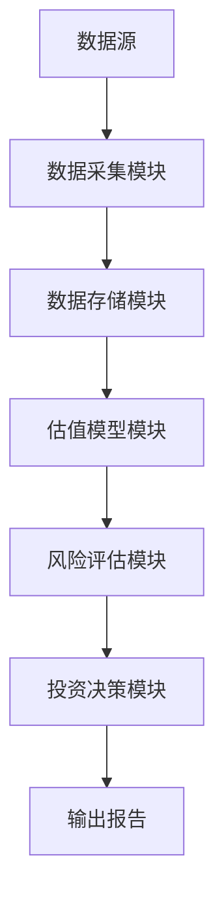

                 


# 价值投资在不同市场环境下的应用

---

## 关键词
- 价值投资
- 市场环境
- 数学模型
- 投资策略
- 风险评估
- 项目实战

---

## 摘要
本书系统地探讨了价值投资在不同市场环境下的应用，从理论基础到数学模型，再到实际案例，全面解析了如何在不同市场环境中灵活运用价值投资策略。通过详细的数学公式、算法流程图和系统架构图，结合实际案例分析，本书为读者提供了一套科学、系统的价值投资方法论。书中不仅介绍了价值投资的核心概念和原理，还深入分析了牛市、熊市和震荡市下的投资策略，并通过项目实战展示了如何将理论应用于实际投资中。此外，本书还探讨了价值投资的风险评估和系统化方法，为读者提供了全面的视角和实用的工具。

---

# 第1章: 价值投资的核心概念

## 1.1 价值投资的定义与背景

### 1.1.1 价值投资的定义
- 价值投资是一种以低于公平价值的价格购买优质企业的投资策略。
- 其核心理念是寻找市场低估的公司，长期持有以实现超额收益。

### 1.1.2 价值投资的历史发展
- 价值投资的起源可以追溯到本杰明·格雷厄姆和戴维·多德的理论。
- 20世纪30年代，格雷厄姆提出了“安全边际”概念，奠定了价值投资的基础。
- 后期，巴菲特等人将价值投资理论进一步发扬光大。

### 1.1.3 价值投资的核心理念
- 价格与价值的分离：市场价格波动，而内在价值稳定。
- 安全边际：买入价格低于内在价值，以降低风险。
- 长期持有：通过时间复利效应实现财富增长。

---

## 1.2 价值投资的基本原理

### 1.2.1 市场有效性的分析
- 市场有效性是指市场价格反映所有可获得信息的程度。
- 弱有效市场：价格反映历史信息，存在套利机会。
- 强有效市场：价格反映所有信息，无法通过分析获得超额收益。

### 1.2.2 价值与价格的差异
- 内在价值：基于企业基本面的合理估值。
- 市场价格：受情绪、市场波动等因素影响。
- 价值投资者寻找价格与价值的错配机会。

### 1.2.3 安全边际的概念
- 安全边际=内在价值-市场价格。
- 通过建立安全边际，降低投资风险。

---

## 1.3 价值投资与其他投资策略的对比

### 1.3.1 股票投资的主要策略概述
- 股票投资策略可以分为价值投资、成长投资、趋势投资等。
- 每种策略有其优缺点，适用于不同的市场环境。

### 1.3.2 价值投资与成长投资的区别
- 价值投资注重低估值，成长投资注重高成长。
- 价值投资者寻找被市场低估的企业，成长投资者寻找高增长潜力的企业。

### 1.3.3 价值投资与趋势投资的对比
- 趋势投资依赖于价格趋势，而价值投资依赖于内在价值。
- 趋势投资适合短期操作，价值投资适合长期持有。

---

## 1.4 价值投资的核心要素

### 1.4.1 企业基本面分析的重要性
- 企业基本面包括收入、利润、资产负债表等。
- 通过基本面分析，识别企业的竞争优势和风险。

### 1.4.2 财务报表分析的关键指标
- 利润表：收入、利润、毛利率等。
- 资产负债表：资产、负债、所有者权益。
- 现金流量表：经营活动、投资活动、筹资活动的现金流。

### 1.4.3 行业分析与竞争优势评估
- 行业分析：行业生命周期、竞争结构、政策影响等。
- 企业竞争优势：成本优势、技术优势、品牌优势等。

---

## 1.5 本章小结
- 价值投资是一种以内在价值为基础，寻找价格低估企业的投资策略。
- 与其他投资策略相比，价值投资注重长期持有和安全边际。
- 企业基本面分析和行业分析是价值投资的核心要素。

---

# 第2章: 价值投资的数学模型与分析方法

## 2.1 市场环境的量化分析

### 2.1.1 市场周期的识别方法
- 市场周期分为牛市、熊市、震荡市等。
- 通过技术指标（如RSI、MACD）和市场估值指标（如PE、PB）识别市场周期。

### 2.1.2 市场情绪的量化指标
- 市场情绪可以通过成交量、资金流动、投资者情绪指数等指标量化。
- 过度乐观的市场情绪可能预示市场顶部，反之亦然。

### 2.1.3 市场波动性的分析模型
- 波动率：标准差或方差衡量市场波动性。
- VaR模型：风险价值模型，用于衡量市场波动风险。

---

## 2.2 企业价值的评估模型

### 2.2.1 DCF模型的原理与应用
- DCF（Discounted Cash Flow）模型：通过折现未来现金流计算企业内在价值。
- 公式：
  $$DCF = \sum_{t=1}^{n} \frac{CF_t}{(1 + r)^t} + \frac{TV}{(1 + r)^n}$$
- 其中，$CF_t$为第t年的现金流，$r$为折现率，$TV$为终值。

### 2.2.2 市盈率与市净率的分析
- 市盈率（PE）：$PE = \frac{Price}{Earnings}$
- 市净率（PB）：$PB = \frac{Price}{Book\ Value}$
- 通过比较PE和PB与行业平均水平，判断企业估值是否合理。

### 2.2.3 企业生命周期与估值方法
- 初创期企业：高增长，DCF模型适用。
- 成熟期企业：稳定增长，市盈率和市净率适用。
- 衰退期企业：现金流为负，需谨慎评估。

---

## 2.3 价值投资的数学公式与模型

### 2.3.1 DCF模型的公式推导
- 假设企业未来5年的现金流分别为100、120、140、160、180万元，折现率为10%。
- 计算现值：
  $$PV = \sum_{t=1}^{5} \frac{CF_t}{(1 + 0.1)^t}$$
- 终值假设为200万元，计算终值现值：
  $$TV_{PV} = \frac{200}{(1 + 0.1)^5}$$
- 内在价值=PV + TV_{PV}

### 2.3.2 市盈率与市净率的计算公式
- 市盈率=股价/每股收益
- 市净率=股价/每股净资产

---

## 2.4 价值投资的风险评估模型

### 2.4.1 风险调整后的价值评估
- 使用风险调整折现率（WACC）进行DCF模型调整。
- WACC=权重*（成本+税盾）+权益成本

### 2.4.2 马科维茨投资组合理论的应用
- 通过优化组合，降低整体风险。
- 理论基础：投资组合的收益与风险可以通过调整资产配置实现最优。

### 2.4.3 风险与收益的平衡策略
- 使用夏普比率衡量风险调整后的收益。
- 夏普比率=（组合收益-无风险收益）/组合收益的标准差

---

## 2.5 本章小结
- 价值投资需要结合数学模型和市场环境进行分析。
- DCF模型、市盈率、市净率等工具帮助评估企业内在价值。
- 风险评估模型如夏普比率和WACC有助于优化投资组合。

---

# 第3章: 不同市场环境下的投资策略

## 3.1 牛市环境下的价值投资策略

### 3.1.1 牛市的特征与风险
- 市场情绪高涨，股价可能偏离内在价值。
- 风险：市场泡沫破裂，股价大幅下跌。

### 3.1.2 价值投资在牛市中的应用
- 选择估值合理的企业，避免追高。
- 分批建仓，分散风险。

### 3.1.3 高估值企业的识别与应对
- 通过PE、PB等指标识别高估值企业。
- 对于高估值企业，减少持仓或暂时规避。

---

## 3.2 熊市环境下的价值投资策略

### 3.2.1 熊市的特征与机会
- 市场情绪低落，股价可能低于内在价值。
- 机会：寻找被市场错杀的优质企业。

### 3.2.2 价值投资在熊市中的优势
- 低估值企业可能被市场忽视，提供投资机会。
- 熊市中安全边际更大，投资风险较低。

### 3.2.3 低估值企业的筛选与投资
- 通过筛选低PE、低PB的企业，寻找投资标的。
- 增加持仓，布局长期收益。

---

## 3.3 震荡市环境下的价值投资策略

### 3.3.1 震荡市的特征与挑战
- 市场波动剧烈，价格难以预测。
- 投资者情绪不稳定，容易受到市场影响。

### 3.3.2 价值投资在震荡市中的策略调整
- 保持冷静，坚持基本面分析。
- 适当调整仓位，降低波动风险。
- 寻找估值稳定的企业，减少短期波动影响。

---

## 3.4 本章小结
- 不同市场环境下，价值投资策略需要灵活调整。
- 牛市中注重估值，熊市中寻找低估企业，震荡市中保持定力。

---

# 第4章: 价值投资的系统化方法

## 4.1 投资策略的设计与优化

### 4.1.1 投资目标的设定
- 确定投资目标（如保本、稳健收益、高收益）。
- 根据目标选择合适的投资策略。

### 4.1.2 投资组合的构建
- 根据市场环境和投资目标，合理配置资产。
- 通过分散投资降低风险。

### 4.1.3 投资策略的优化
- 定期评估投资组合的表现。
- 根据市场变化调整策略。

---

## 4.2 风险控制与管理

### 4.2.1 风险评估与预警
- 使用VaR模型、夏普比率等工具评估投资风险。
- 设置止损点，控制单次投资损失。

### 4.2.2 风险分散策略
- 通过多样化投资降低非系统性风险。
- 合理配置不同行业的资产。

### 4.2.3 风险应对措施
- 当市场风险过高时，减少高风险资产的持仓。
- 保持充足的现金储备，应对市场波动。

---

## 4.3 投资组合的管理与调整

### 4.3.1 定期复盘与评估
- 每季度或每半年评估投资组合的表现。
- 分析收益来源和风险敞口。

### 4.3.2 动态调整策略
- 根据市场变化和企业基本面调整持仓。
- 优化资产配置，提高组合收益。

### 4.3.3 长期与短期策略的结合
- 短期策略应对市场波动，长期策略实现财富增长。
- 平衡短期收益与长期目标。

---

## 4.4 本章小结
- 价值投资需要系统化的策略设计和风险控制。
- 定期复盘和动态调整是保持投资组合健康的关键。

---

# 第5章: 价值投资的项目实战

## 5.1 环境安装与数据准备

### 5.1.1 投资分析工具的安装
- 安装Excel、Python等数据分析工具。
- 使用第三方库（如pandas、numpy）进行数据分析。

### 5.1.2 数据源的获取
- 从股票交易所获取历史数据。
- 使用金融数据API（如Yahoo Finance）获取实时数据。

### 5.1.3 数据清洗与预处理
- 处理缺失值、异常值。
- 标准化数据格式，方便后续分析。

---

## 5.2 核心算法实现

### 5.2.1 DCF模型的Python实现
```python
import numpy as np

def calculate_dcf(cash_flows, discount_rate, terminal_value):
    present_value = 0
    for t in range(len(cash_flows)):
        present_value += cash_flows[t] / (1 + discount_rate) ** t
    present_value += terminal_value / (1 + discount_rate) ** len(cash_flows)
    return present_value

# 示例数据
cash_flows = [100, 120, 140, 160, 180]
discount_rate = 0.1
terminal_value = 200

dcf_value = calculate_dcf(cash_flows, discount_rate, terminal_value)
print("DCF Value:", dcf_value)
```

### 5.2.2 市盈率与市净率的计算
```python
def calculate_pe(stock_price, earnings_per_share):
    return stock_price / earnings_per_share

def calculate_pb(stock_price, book_value_per_share):
    return stock_price / book_value_per_share

stock_price = 100
earnings_per_share = 10
book_value_per_share = 20

pe_ratio = calculate_pe(stock_price, earnings_per_share)
pb_ratio = calculate_pb(stock_price, book_value_per_share)

print("PE Ratio:", pe_ratio)
print("PB Ratio:", pb_ratio)
```

---

## 5.3 案例分析与结果解读

### 5.3.1 案例背景介绍
- 某制造企业，历史数据完整，财务状况良好。

### 5.3.2 数据分析与建模
- 使用DCF模型计算企业内在价值。
- 对比市盈率和市净率与行业平均水平。

### 5.3.3 投资决策建议
- 如果DCF价值显著高于市场价格，建议买入。
- 如果市盈率和市净率低于行业平均水平，建议关注。

---

## 5.4 本章小结
- 通过项目实战，掌握了价值投资策略的具体实现方法。
- 数据分析工具和数学模型的应用，提高了投资决策的科学性。

---

# 第6章: 价值投资的系统架构与实现

## 6.1 价值投资系统的总体架构

### 6.1.1 系统功能模块
- 数据采集模块：获取企业基本面数据和市场数据。
- 估值模型模块：计算DCF、PE、PB等指标。
- 风险评估模块：评估投资组合风险。
- 投资决策模块：根据分析结果制定投资策略。

### 6.1.2 系统架构图


---

## 6.2 价值投资系统的详细设计

### 6.2.1 数据采集模块
- 数据来源：股票交易所、金融API。
- 数据类型：股价、成交量、财务报表数据。

### 6.2.2 估值模型模块
- DCF模型：计算内在价值。
- 市盈率、市净率：比较市场估值。

### 6.2.3 风险评估模块
- 使用夏普比率评估投资组合风险。
- 设置止损点，控制投资风险。

---

## 6.3 系统实现与接口设计

### 6.3.1 系统实现
- 使用Python编写数据分析模块。
- 使用Excel或数据库存储数据。

### 6.3.2 接口设计
- 数据接口：与金融API对接。
- 报告接口：生成投资报告。

---

## 6.4 本章小结
- 价值投资系统的构建需要模块化设计和功能实现。
- 系统架构图和功能模块设计为投资决策提供了科学依据。

---

# 第7章: 总结与展望

## 7.1 总结

### 7.1.1 价值投资的核心理念
- 寻找低估企业，长期持有，实现超额收益。
- 通过安全边际降低投资风险。

### 7.1.2 价值投资的系统化方法
- 结合数学模型和市场环境，制定投资策略。
- 定期评估和动态调整投资组合。

---

## 7.2 展望

### 7.2.1 未来研究方向
- 结合人工智能技术，优化价值投资模型。
- 探索大数据在价值投资中的应用。

### 7.2.2 对读者的建议
- 深入学习价值投资理论，提升分析能力。
- 结合实际市场环境，灵活运用投资策略。

---

## 作者

作者：AI天才研究院/AI Genius Institute & 禅与计算机程序设计艺术 /Zen And The Art of Computer Programming

---

这本书通过系统的理论分析、数学模型和实际案例，全面解析了价值投资在不同市场环境下的应用。希望读者能够通过本书，掌握价值投资的核心理念和实践方法，实现稳健的投资收益。

