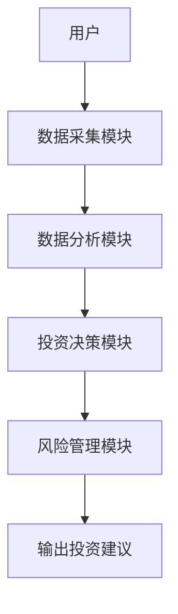
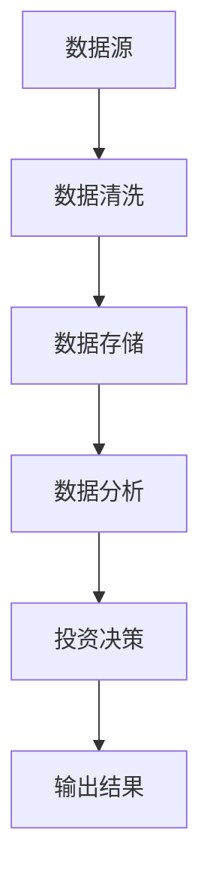
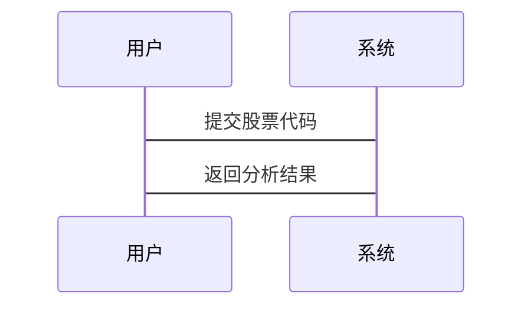

                 


# 如何利用特价股票策略进行价值投资教育

> 关键词：价值投资，特价股票策略，投资教育，股票分析，风险管理

> 摘要：本文探讨了如何利用特价股票策略进行价值投资教育，通过分析特价股票的定义、特点、价值投资的核心理念以及系统设计，结合实际案例，详细讲解了如何在教育中应用特价股票策略，帮助投资者实现长期稳定的收益。

---

# 第一部分: 特价股票策略与价值投资教育的背景与基础

## 第1章: 特价股票策略的定义与特点

### 1.1 特价股票的定义

#### 1.1.1 特价股票的定义与范围

特价股票是指在市场低迷或公司遇到短期困难时，股票价格被市场低估，但其内在价值高于当前市场价格的股票。这些股票通常具有较高的安全边际，适合长期投资。

- **定义**：特价股票 = 市场价格 < 内在价值
- **范围**：通常出现在市场恐慌、经济衰退或行业低迷时期

#### 1.1.2 特价股票的特点与优势

- **特点**：
  - 价格低廉：相对于内在价值，价格被市场低估。
  - 高安全边际：内在价值与市场价格之间的差距较大，降低了投资风险。
  - 优质企业：通常为行业龙头或具有竞争优势的企业。

- **优势**：
  - 风险较低：市场低估提供了较高的安全边际。
  - 收益稳定：长期持有优质企业，内在价值增长带来稳定收益。

#### 1.1.3 特价股票与普通股票的区别

| 属性       | 特价股票                     | 普通股票                     |
|------------|------------------------------|------------------------------|
| 价格       | 低于内在价值                 | 接近或高于内在价值           |
| 风险       | 较低                         | 较高                         |
| 投资策略   | 长期持有，等待价值回归         | 短期交易或趋势投资           |

### 1.2 价值投资的基本概念

#### 1.2.1 价值投资的定义与核心理念

- **定义**：价值投资是一种投资策略，通过深入分析企业的内在价值，选择市场价格低于内在价值的股票进行长期投资。
- **核心理念**：
  - 以合理价格购买优质企业。
  - 长期持有，分享企业成长。
  - 价值回归：市场价格最终会回归其内在价值。

#### 1.2.2 价值投资与投机的对比

| 属性       | 价值投资                     | 投机                         |
|------------|------------------------------|------------------------------|
| 标准       | 内在价值                     | 市场情绪或短期趋势           |
| 时间框架   | 长期                         | 短期                         |
| 风险       | 较低                         | 较高                         |

#### 1.2.3 价值投资的长期性与稳定性

- 长期性：价值投资强调长期持有，避免频繁交易。
- 稳定性：通过选择优质企业，降低投资波动性。

---

## 第2章: 特价股票策略的背景与意义

### 2.1 特价股票策略的背景

#### 2.1.1 特价股票策略的历史发展

- **起源**：20世纪初，本杰明·格雷厄姆提出“廉价购买”策略。
- **发展**：20世纪30年代经济大萧条期间，格雷厄姆的学生沃伦·巴菲特继承并发展了这一理念。

#### 2.1.2 特价股票策略在现代投资中的地位

- 现代投资组合理论（MPT）为价值投资提供了理论基础。
- 特价股票策略是价值投资的重要组成部分。

#### 2.1.3 特价股票策略的市场环境分析

- **市场周期**：经济周期波动导致股票价格波动，为特价股票策略提供机会。
- **市场情绪**：市场恐慌时，投资者可能抛售股票，导致价格低于内在价值。

### 2.2 特价股票策略的意义

#### 2.2.1 特价股票策略对投资者的价值

- **低成本进入**：以较低价格购买优质企业，降低初始投资成本。
- **安全边际**：较高的安全边际降低了投资风险。
- **长期收益**：长期持有优质企业，分享其成长收益。

#### 2.2.2 特价股票策略在价值投资教育中的作用

- **教育工具**：特价股票策略是价值投资教育的重要工具，帮助投资者理解内在价值与市场价格的关系。
- **实践指导**：通过实际案例分析，教育投资者如何识别和选择特价股票。

#### 2.2.3 特价股票策略对市场的积极影响

- **价值发现**：帮助市场发现被低估的企业，促进资源合理配置。
- **市场稳定**：长期投资者的介入有助于市场的稳定，减少短期波动。

---

# 第二部分: 价值投资的核心理念与分析方法

## 第3章: 价值投资的核心理念

### 3.1 价值投资的核心要素

#### 3.1.1 企业内在价值的定义与计算

- **定义**：企业内在价值是基于其未来现金流的现值，反映了企业的实际价值。
- **计算方法**：
  - 自由现金流折现模型（DCF）：$$ \text{内在价值} = \sum_{t=1}^{n} \frac{\text{现金流}}{(1 + r)^t} $$
  - 市盈率（P/E）：$$ \text{内在价值} = \text{每股收益} \times \text{合理市盈率} $$

#### 3.1.2 市场价格与内在价值的关系

- **关系**：市场价格围绕内在价值波动，长期来看，市场价格会回归内在价值。
- **策略**：买入时市场价格低于内在价值，持有至价格回归。

#### 3.1.3 安全边际的概念与重要性

- **定义**：安全边际 = 内在价值 - 市场价格。
- **重要性**：安全边际越高，投资风险越小。

### 3.2 价值投资的关键原则

#### 3.2.1 长期投资与耐心持有

- **长期投资**：避免频繁交易，降低交易成本和心理压力。
- **耐心持有**：等待市场回归内在价值，不因短期波动而放弃。

#### 3.2.2 选择优质企业的重要性

- **优质企业**：具有竞争优势、良好管理和稳定现金流。
- **竞争优势**：低成本、技术壁垒、品牌优势等。

#### 3.2.3 分散投资与风险控制

- **分散投资**：避免过度集中，降低单一股票风险。
- **风险控制**：设定止损点，控制最大亏损幅度。

---

## 第4章: 价值投资的分析方法

### 4.1 基本面分析的核心步骤

#### 4.1.1 财务报表分析方法

- **利润表**：分析收入、成本和利润。
- **资产负债表**：评估资产、负债和所有者权益。
- **现金流量表**：了解企业现金流状况。

#### 4.1.2 市盈率与市净率的计算与应用

- **市盈率（P/E）**：$$ \text{P/E} = \frac{\text{股价}}{\text{每股收益}} $$
- **市净率（P/B）**：$$ \text{P/B} = \frac{\text{股价}}{\text{每股净资产}} $$
- **应用**：通过比较P/E和P/B，评估股票是否被低估。

#### 4.1.3 企业盈利能力与成长性的评估

- **盈利能力**：ROE（净资产收益率）、ROA（资产收益率）。
- **成长性**：收入增长率、净利润增长率。

### 4.2 行业分析与企业竞争优势

#### 4.2.1 行业分析的步骤与方法

- **行业生命周期**：幼稚期、成长期、成熟期、衰退期。
- **行业趋势**：技术进步、政策变化、市场需求。

#### 4.2.2 企业竞争优势的识别与评估

- **成本优势**：生产成本低于竞争对手。
- **技术优势**：拥有独特的技术或专利。
- **品牌优势**：知名品牌具有较高的客户忠诚度。

#### 4.2.3 行业周期与企业发展的关系

- **周期性波动**：行业周期性影响企业业绩。
- **应对策略**：在行业低谷时寻找机会。

---

# 第三部分: 特价股票策略的系统设计与实现

## 第5章: 特价股票策略的系统架构

### 5.1 系统功能模块设计

#### 5.1.1 数据采集模块

- **功能**：采集股票价格、财务数据、行业信息等。
- **工具**：网络爬虫、API接口。

#### 5.1.2 数据分析模块

- **功能**：计算内在价值、评估安全边际、识别特价股票。
- **工具**：Python（pandas、numpy）、Excel。

#### 5.1.3 投资决策模块

- **功能**：根据分析结果，生成投资建议。
- **工具**：决策树、规则引擎。

#### 5.1.4 风险管理模块

- **功能**：评估风险、制定止损策略。
- **工具**：VaR模型、Monte Carlo模拟。

### 5.2 系统架构设计

#### 5.2.1 系统架构图



#### 5.2.2 数据流图



### 5.3 系统接口设计

#### 5.3.1 API接口

- **输入**：股票代码、时间范围。
- **输出**：股价数据、财务数据。

#### 5.3.2 数据库设计

- **表结构**：
  ```mermaid
  graph TD
      User --> Database
      Database --> Table1[股票信息]
      Database --> Table2[财务数据]
      Database --> Table3[投资建议]
  ```

### 5.4 系统交互设计

#### 5.4.1 交互流程图



---

## 第6章: 投资系统的核心实现

### 6.1 数据采集与清洗

#### 6.1.1 数据来源

- **API接口**：从金融数据供应商获取实时数据。
- **网络爬虫**：爬取公开数据。

#### 6.1.2 数据清洗

- **处理缺失值**：使用均值、中位数填充。
- **去除异常值**：通过Z-score方法检测异常值。

### 6.2 数据分析与评估

#### 6.2.1 内在价值计算

- **代码实现**：
  ```python
  def calculate_intrinsic_value(eps, pe_ratio):
      return eps * pe_ratio
  ```

- **应用**：
  ```python
  eps = 5
  pe_ratio = 10
  intrinsic_value = calculate_intrinsic_value(eps, pe_ratio)
  print(intrinsic_value)  # 输出 50
  ```

#### 6.2.2 安全边际评估

- **公式**：
  $$ \text{安全边际} = \text{内在价值} - \text{市场价格} $$
- **应用**：
  ```python
  intrinsic_value = 50
  market_price = 30
  margin_of_safety = intrinsic_value - market_price
  print(margin_of_safety)  # 输出 20
  ```

### 6.3 投资决策与风险管理

#### 6.3.1 投资决策模型

- **决策规则**：
  - 市场价格 < 内在价值
  - 安全边际 > 20%
  - 企业具备竞争优势

#### 6.3.2 风险管理策略

- **止损机制**：
  $$ \text{止损价} = \text{买入价} \times (1 - \text{止损比例}) $$
  - 例如：买入价 = 30，止损比例 = 10%，止损价 = 27。

- **分散投资**：将资金分配到多个股票，降低风险。

---

## 第7章: 项目实战与案例分析

### 7.1 实战环境搭建

#### 7.1.1 环境安装

- **工具**：Python、Jupyter Notebook、Pandas、NumPy。
- **数据源**：Yahoo Finance API。

#### 7.1.2 核心代码实现

```python
import pandas as pd
import requests

def get_stock_data(ticker, start_date, end_date):
    url = f"https://query1.finance.yahoo.com/ws/v1/finance/quote/{ticker}"
    params = {
        'start': start_date,
        'end': end_date,
        'format': 'json',
        'symbols': ticker
    }
    response = requests.get(url, params=params)
    data = response.json()
    return pd.DataFrame(data['quoteResponse']['result'][0]['historical'])

# 示例
stock_data = get_stock_data('AAPL', '2020-01-01', '2023-12-31')
print(stock_data.head())
```

### 7.2 实战案例分析

#### 7.2.1 案例背景

- **公司**：苹果（AAPL）
- **时间**：2020年新冠疫情初期
- **股价**：2020年3月，苹果股价因市场恐慌下跌至每股200美元以下。

#### 7.2.2 分析过程

- **财务数据**：
  - 2019年收入：394.32亿美元
  - 净利润：115.96亿美元
  - 每股收益（EPS）：2.45美元

- **估值**：
  - 合理市盈率：15倍
  - 内在价值：$$ 2.45 \times 15 = 36.75 $$
  - 市场价格：200美元以下。

- **决策**：
  - 股价远低于内在价值，具备投资价值。
  - 安全边际：$$ 36.75 - 20 = 16.75 $$，安全边际较高。

#### 7.2.3 投资建议

- **买入时机**：市场恐慌时介入。
- **持有策略**：长期持有，等待股价回归内在价值。

#### 7.2.4 实战总结

- **收益**：长期持有苹果股票，股价回升至每股100美元以上，实现翻倍收益。
- **经验**：在市场恐慌时，特价股票策略能够提供较高的安全边际和潜在收益。

---

## 第8章: 总结与展望

### 8.1 总结

- **核心观点**：
  - 特价股票策略是价值投资的重要工具。
  - 通过分析企业内在价值和市场价格，选择被低估的股票进行长期投资。
  - 投资教育的关键在于理解和应用价值投资的基本原理。

- **成果**：
  - 设计了一个基于特价股票策略的投资系统。
  - 通过实际案例分析，验证了策略的有效性。

### 8.2 展望

- **技术进步**：
  - 利用大数据和人工智能技术，提升数据分析和预测能力。
  - 开发自动化投资系统，实现智能化投资决策。

- **教育发展**：
  - 推广价值投资理念，培养更多理性投资者。
  - 开发在线教育平台，提供个性化投资教育服务。

---

# 作者：AI天才研究院/AI Genius Institute & 禅与计算机程序设计艺术 /Zen And The Art of Computer Programming

---

这篇文章详细讲解了如何利用特价股票策略进行价值投资教育，通过系统的分析和实际案例，帮助投资者掌握价值投资的核心理念和实战技巧。希望对读者在投资教育和实践中提供有价值的参考和指导。

