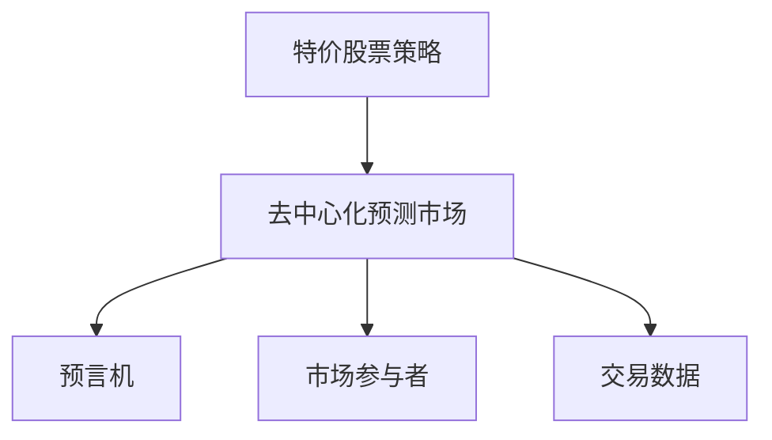
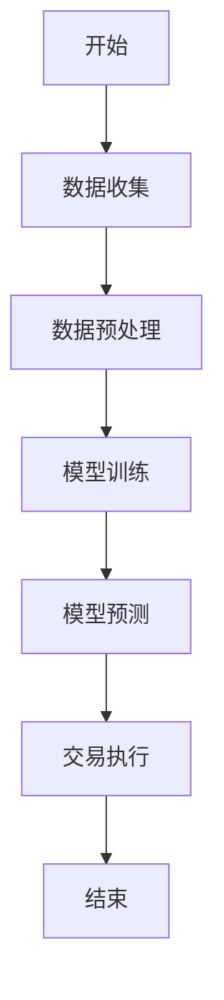
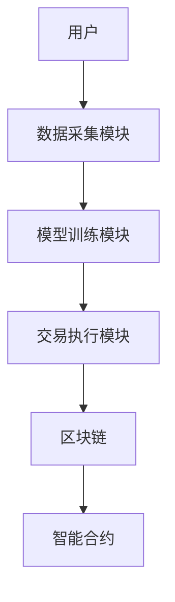
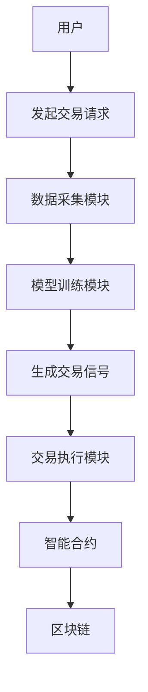

                 


# 如何将特价股票策略融入去中心化预测市场投资

> 关键词：特价股票策略，去中心化预测市场，投资策略，区块链，价格预测，机器学习

> 摘要：本文探讨了如何将特价股票策略与去中心化预测市场相结合，通过分析其核心概念、算法原理、系统架构和项目实战，为投资者提供一套高效的投资策略。文章结合区块链技术和机器学习模型，详细阐述了如何在去中心化预测市场中应用特价股票策略，优化投资回报。

---

## 第一部分：背景介绍

### 第1章：特价股票策略与去中心化预测市场的背景

#### 1.1 特价股票策略的定义与特点
- **1.1.1 特价股票策略的定义**：特价股票策略是指在特定市场条件下，以低于当前市场价格购买股票的投资策略，通常基于市场波动、公司基本面或技术分析。
- **1.1.2 特价股票策略的核心特点**：
  - 灵活性：能够在市场波动中快速调整投资组合。
  - 高效性：通过算法快速识别低价股票。
  - 风险控制：通过预测模型降低投资风险。
- **1.1.3 特价股票策略在投资中的作用**：
  - 抓住短期市场机会。
  - 优化投资组合的回报率。
  - 提高资金利用率。

#### 1.2 去中心化预测市场的定义与特点
- **1.2.1 去中心化预测市场的定义**：去中心化预测市场是一种基于区块链技术的市场，允许参与者通过智能合约进行预测和交易，无需中心化机构的干预。
- **1.2.2 去中心化预测市场的特点**：
  - 去中心化：利用区块链技术，避免单点故障。
  - 透明性：所有交易记录在区块链上，可追溯且不可篡改。
  - 公平性：参与者平等，无中心化机构干预。
- **1.2.3 去中心化预测市场与传统预测市场的区别**：
  - 传统预测市场依赖中心化机构，存在信任风险。
  - 去中心化预测市场利用区块链技术，提高透明度和公平性。

#### 1.3 特价股票策略融入去中心化预测市场的意义
- **1.3.1 提高投资效率的潜力**：通过去中心化市场的实时数据和算法预测，快速识别特价股票机会。
- **1.3.2 去中心化市场的优势**：利用区块链技术的透明性和公平性，减少信息不对称。
- **1.3.3 特价股票策略与去中心化市场的结合点**：
  - 数据源的整合：利用区块链上的实时数据，优化价格预测模型。
  - 交易执行的优化：通过智能合约快速执行特价交易。

#### 1.4 本章小结
本章介绍了特价股票策略和去中心化预测市场的定义、特点及其结合的意义，为后续分析奠定了基础。

---

## 第二部分：核心概念与联系

### 第2章：特价股票策略与去中心化预测市场的核心概念与联系

#### 2.1 特价股票策略的核心原理
- **2.1.1 价格预测模型**：
  - 基于技术分析和基本面分析的预测模型。
  - 使用机器学习算法（如线性回归、随机森林）预测股票价格。
- **2.1.2 市场波动分析**：
  - 利用历史数据识别市场波动模式。
  - 通过波动性指标（如VIX指数）预测市场风险。
- **2.1.3 交易时机的选择**：
  - 基于价格预测模型确定最佳买入时机。
  - 结合市场波动性调整交易策略。

#### 2.2 去中心化预测市场的核心机制
- **2.2.1 去中心化预言机的作用**：
  - 提供实时市场数据，确保预测交易的准确性。
  - 通过区块链技术实现数据的可信性和不可篡改性。
- **2.2.2 市场参与者的激励机制**：
  - 通过代币奖励激励参与者提供准确的预测数据。
  - 基于博弈论设计激励机制，确保市场的公平性和活跃性。
- **2.2.3 去中心化市场的透明性与公平性**：
  - 所有交易记录在区块链上，确保透明可追溯。
  - 通过智能合约实现自动化的交易执行和结算。

#### 2.3 特价股票策略与去中心化预测市场的关联性分析
- **2.3.1 数据流的整合**：
  - 利用去中心化市场的实时数据优化价格预测模型。
  - 通过数据流分析识别市场波动的潜在机会。
- **2.3.2 价格预测的准确性**：
  - 结合去中心化市场的数据源，提高价格预测的准确性。
  - 通过多源数据融合，增强预测模型的鲁棒性。
- **2.3.3 交易策略的优化**：
  - 基于去中心化市场的透明性和公平性，优化交易策略。
  - 通过智能合约实现快速的特价交易执行。

#### 2.4 核心概念对比表格
| 特性                | 特价股票策略                        | 去中心化预测市场                  |
|---------------------|------------------------------------|------------------------------------|
| 数据源              | 市场价格、历史数据、技术指标      | 区块链上的实时数据、智能合约      |
| 核心机制            | 价格预测模型、市场波动分析        | 去中心化预言机、智能合约执行      |
| 优势                | 快速识别低价股票、优化投资组合    | 透明性、公平性、去中心化           |
| 应用场景            | 短期投资、市场波动机会捕捉        | 市场预测、去中心化交易、智能合约   |

#### 2.5 实体关系图（Mermaid）


#### 2.6 本章小结
本章分析了特价股票策略和去中心化预测市场的核心概念及其关联性，为后续的算法设计和系统实现提供了理论基础。

---

## 第三部分：算法原理

### 第3章：特价股票策略融入去中心化预测市场的算法原理

#### 3.1 算法原理概述
- **3.1.1 基于机器学习的价格预测模型**：
  - 使用回归算法（如线性回归、支持向量回归）预测股票价格。
  - 通过神经网络模型（如LSTM）捕捉时间序列数据中的复杂模式。
- **3.1.2 基于区块链的去中心化交易机制**：
  - 利用智能合约实现自动化的交易执行和结算。
  - 通过区块链技术确保交易的透明性和不可篡改性。
- **3.1.3 算法的高效性与准确性**：
  - 通过优化算法结构提高计算效率。
  - 通过多源数据融合提高预测模型的准确性。

#### 3.2 算法流程图（Mermaid）


#### 3.3 算法实现细节
- **数据预处理**：
  - 清洗数据，去除异常值和缺失值。
  - 标准化数据，确保模型训练的稳定性。
- **模型训练**：
  - 使用训练数据训练价格预测模型。
  - 通过交叉验证优化模型参数。
- **模型预测**：
  - 使用训练好的模型预测股票价格。
  - 结合市场波动性指标调整预测结果。
- **交易执行**：
  - 基于预测结果和市场数据执行交易。
  - 通过智能合约实现自动化的交易执行和结算。

#### 3.4 数学模型与公式
- **线性回归模型**：
  $$ y = \beta_0 + \beta_1 x + \epsilon $$
  其中，$y$ 是预测的股票价格，$x$ 是自变量（如历史价格、市场指数），$\beta_0$ 和 $\beta_1$ 是模型参数，$\epsilon$ 是误差项。
- **LSTM模型**：
  使用长短期记忆网络捕捉时间序列数据中的复杂模式：
  $$ f(t) = \text{LSTM}(f(t-1), x_t) $$

#### 3.5 实际案例分析
- **案例1**：某科技股的价格预测与交易。
  - 数据来源：区块链上的实时市场数据。
  - 预测结果：预测未来一周内价格将下跌。
  - 交易策略：在预测价格低点买入，价格回升时卖出。

#### 3.6 本章小结
本章详细讲解了如何将特价股票策略融入去中心化预测市场的算法原理，通过机器学习模型和区块链技术实现高效的交易策略。

---

## 第四部分：系统分析与架构设计

### 第4章：系统分析与架构设计

#### 4.1 项目介绍
- **项目目标**：将特价股票策略与去中心化预测市场相结合，开发一套高效的交易系统。
- **项目范围**：包括数据收集、模型训练、交易执行等模块。
- **项目利益相关者**：投资者、开发人员、市场参与者。

#### 4.2 系统功能设计
- **功能模块**：
  - 数据采集模块：从区块链上获取实时市场数据。
  - 模型训练模块：基于机器学习算法训练价格预测模型。
  - 交易执行模块：通过智能合约实现自动化的交易执行。
- **功能流程**：
  1. 数据采集模块获取实时市场数据。
  2. 模型训练模块基于历史数据训练价格预测模型。
  3. 交易执行模块根据预测结果执行交易。

#### 4.3 系统架构设计（Mermaid）


#### 4.4 接口设计
- **API接口**：
  - 数据接口：从区块链获取实时市场数据。
  - 模型接口：调用机器学习模型进行价格预测。
  - 交易接口：通过智能合约执行交易指令。

#### 4.5 系统交互流程图（Mermaid）


#### 4.6 本章小结
本章详细描述了系统的功能设计、架构设计和接口设计，为后续的项目实现奠定了基础。

---

## 第五部分：项目实战

### 第5章：项目实战

#### 5.1 环境安装
- **安装依赖**：
  - 安装Python和相关库（如numpy、pandas、scikit-learn）。
  - 安装区块链开发工具（如Solidity、Web3.js）。
- **安装步骤**：
  1. 安装Python 3.8及以上版本。
  2. 安装必要的Python库：
     ```bash
     pip install numpy pandas scikit-learn
     ```
  3. 安装Solidity和Web3.js：
     ```bash
     npm install web3 solc
     ```

#### 5.2 核心代码实现
- **数据采集模块**：
  ```python
  import web3
  from web3 import Web3

  w3 = Web3(Web3.HTTPProvider('http://localhost:8545'))
  # 获取区块链上的实时数据
  def get_market_data():
      contract_address = '0x...contractAddress...'
      abi = [...]  # 合约ABI
      contract = w3.eth.contract(contract_address, abi=abi)
      return contract.functions.getPriceData().call()
  ```

- **模型训练模块**：
  ```python
  from sklearn.linear_model import LinearRegression

  def train_model(data):
      X = data['price_history'].values.reshape(-1, 1)
      y = data['target_price'].values
      model = LinearRegression()
      model.fit(X, y)
      return model
  ```

- **交易执行模块**：
  ```python
  def execute_trade(model, data):
      predicted_price = model.predict(data['current_price'].values.reshape(-1, 1))
      if predicted_price > data['current_price']:
          # 发起买入交易
          contract.functions.buy().transact()
      else:
          # 发起卖出交易
          contract.functions.sell().transact()
  ```

#### 5.3 案例分析
- **案例1**：
  - 数据来源：区块链上的实时市场数据。
  - 预测结果：预测未来一天内股票价格将上涨。
  - 交易策略：在当前价格买入，价格上升后卖出。
- **案例2**：
  - 数据来源：历史价格数据和市场波动指标。
  - 预测结果：预测未来一周内股票价格将下跌。
  - 交易策略：在当前价格卖出，价格下降后买入。

#### 5.4 本章小结
本章通过实际案例展示了如何将特价股票策略融入去中心化预测市场的具体实现，详细讲解了环境安装、核心代码实现和案例分析。

---

## 第六部分：最佳实践与小结

### 第6章：最佳实践、小结、注意事项与拓展阅读

#### 6.1 最佳实践
- **数据源的选择**：
  - 确保数据来源的多样性和可靠性。
  - 定期更新数据源，避免数据偏差。
- **模型优化**：
  - 定期重新训练模型，适应市场变化。
  - 引入更多的机器学习算法（如随机森林、XGBoost）提高预测准确性。
- **风险管理**：
  - 设置止损点，避免过度亏损。
  - 定期评估投资组合的风险敞口，调整投资策略。

#### 6.2 小结
本文详细探讨了如何将特价股票策略融入去中心化预测市场，通过理论分析、算法设计和项目实现，为投资者提供了一套高效的投资策略。文章结合区块链技术和机器学习算法，详细讲解了系统的实现细节和实际案例，为读者提供了丰富的理论和实践知识。

#### 6.3 注意事项
- **数据隐私**：
  - 注意保护投资者的隐私数据。
  - 遵守相关法律法规，确保数据的合法使用。
- **市场风险**：
  - 市场波动可能导致预测结果的偏差。
  - 需要结合多种因素进行综合判断，避免单一依赖模型预测。

#### 6.4 拓展阅读
- **推荐书籍**：
  - 《Blockchain Basics: A Non-Technical Guide to Understanding Blockchain》
  - 《Machine Learning: A Probabilistic Perspective》
- **推荐博客**：
  - 加密货币与区块链技术博客
  - 机器学习与金融分析博客

#### 6.5 本章小结
本章总结了本文的主要内容，提出了最佳实践建议，并提供了拓展阅读的方向，帮助读者进一步深入学习相关知识。

---

## 作者信息

作者：AI天才研究院/AI Genius Institute & 禅与计算机程序设计艺术 /Zen And The Art of Computer Programming

---

以上是《如何将特价股票策略融入去中心化预测市场投资》的完整目录大纲，涵盖了从背景介绍到项目实战的各个方面，结合了区块链技术和机器学习算法，为读者提供了一套全面的投资策略。

