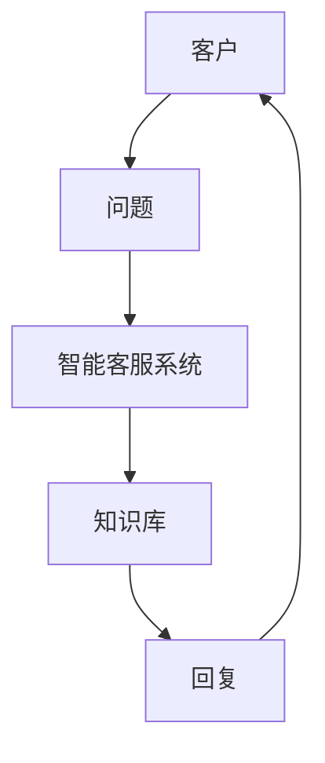
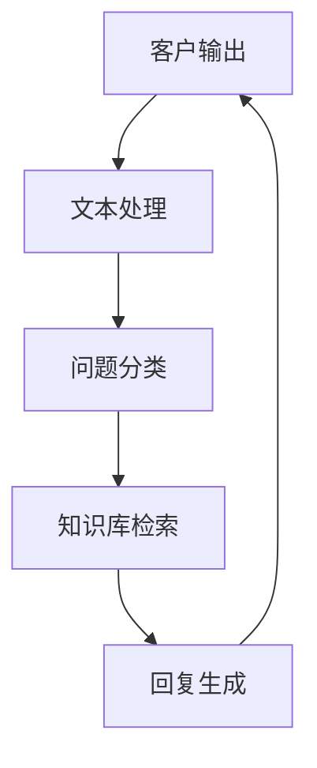
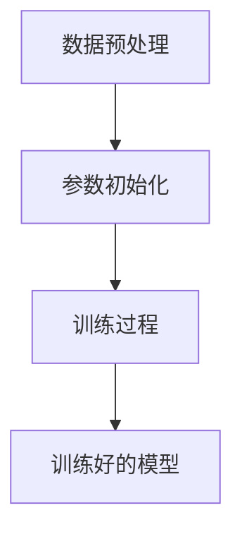
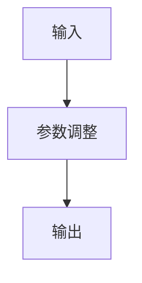
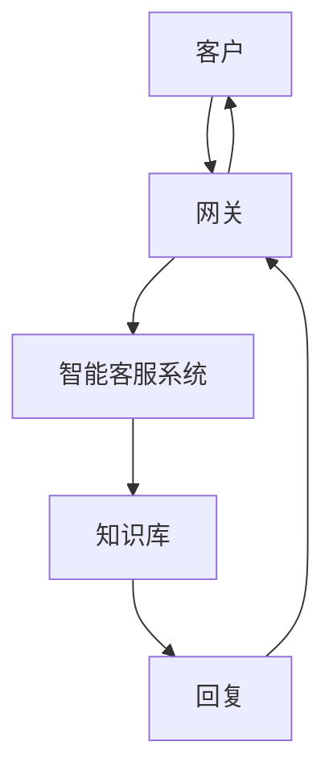

                 


# 智能客户服务AI Agent：LLM驱动的全天候支持系统

> **关键词：** 智能客服、LLM、AI Agent、大语言模型、24/7支持系统  
> **摘要：** 本文深入探讨了LLM（大语言模型）在智能客户服务中的应用，详细介绍了智能客户服务AI Agent的核心概念、算法原理、系统架构、项目实战及最佳实践。通过分析传统客户服务的痛点与挑战，结合大语言模型的技术优势，本文为构建高效、智能的全天候支持系统提供了全面的技术指导。

---

## 第一部分：背景介绍与核心概念

### 第1章：智能客户服务AI Agent的背景与问题背景

#### 1.1 问题背景

##### 1.1.1 传统客户服务的痛点与挑战
传统客户服务模式依赖人工坐席，存在以下痛点：
- **响应时间长**：人工坐席数量有限，难以满足大量客户需求，导致客户等待时间长。
- **服务质量不稳定**：员工情绪波动、培训不足等因素会影响服务质量。
- **成本高昂**：人工坐席需要大量培训和管理，企业面临高昂的人力成本。

##### 1.1.2 智能化客户服务的需求与趋势
随着人工智能技术的快速发展，企业对智能化客户服务的需求日益增长：
- **7×24小时全天候支持**：通过自动化系统实现无休服务。
- **高效问题解决**：利用AI快速定位和解决问题，提升客户满意度。
- **个性化服务**：基于客户数据提供定制化服务体验。

##### 1.1.3 LLM在智能客服中的应用价值
大语言模型（LLM）在智能客服中的应用价值主要体现在：
- **自然语言理解**：能够准确理解客户的意图和情感。
- **多轮对话能力**：支持复杂的上下文交互，提供连贯的对话体验。
- **知识库整合**：能够快速检索和整合企业知识库中的信息。

#### 1.2 问题描述

##### 1.2.1 客户服务的定义与分类
客户服务是指企业为客户提供支持和帮助的过程，主要分为以下几类：
- **售前咨询**：客户在购买前的问题解答。
- **售后支持**：客户在购买后的技术支持和问题解决。
- **投诉处理**：客户对产品或服务的不满处理。

##### 1.2.2 智能客服的核心问题与目标
智能客服的核心问题是如何通过自动化技术实现高效、智能的客户支持。其目标包括：
- **快速响应**：缩短客户等待时间，提升客户满意度。
- **精准理解**：准确理解客户需求，提供个性化解决方案。
- **持续优化**：通过数据反馈不断优化服务流程和模型。

##### 1.2.3 LLM驱动的智能客服系统的特点
LLM驱动的智能客服系统具有以下特点：
- **智能化**：基于大语言模型，能够理解和生成自然语言。
- **全天候运行**：支持7×24小时不间断服务。
- **可扩展性**：能够轻松扩展以支持大量客户请求。

#### 1.3 问题解决与边界

##### 1.3.1 LLM驱动的智能客服解决方案
LLM驱动的智能客服解决方案包括：
- **问题识别与分类**：通过自然语言处理技术识别客户问题类型。
- **知识库检索**：基于问题关键词快速检索相关知识库内容。
- **对话生成**：根据检索结果生成自然流畅的回复。

##### 1.3.2 系统的边界与外延
系统的边界包括：
- **输入范围**：支持文本、语音等多种输入形式。
- **输出范围**：提供文本、链接、图片等多种输出形式。
- **处理范围**：支持FAQ解答、技术支持、投诉处理等多种场景。

##### 1.3.3 核心要素与组成结构
智能客服系统的组成结构包括：
- **客户交互界面**：包括网页、移动端等。
- **大语言模型**：负责理解和生成文本。
- **知识库**：存储产品信息、常见问题解答等。
- **反馈机制**：收集客户反馈以优化系统。

#### 1.4 核心概念与联系

##### 1.4.1 核心概念的定义与属性
- **大语言模型（LLM）**：基于深度学习的自然语言处理模型，能够理解和生成自然语言。
- **智能客服系统**：基于LLM的自动化客户服务系统，提供全天候支持。

##### 1.4.2 核心概念的对比分析（表格形式）

| 概念         | 定义                                                                 | 特性               |
|--------------|----------------------------------------------------------------------|--------------------|
| LLM          | 深度学习驱动的自然语言处理模型                                         | 高精度、强上下文理解能力 |
| 智能客服系统 | 基于LLM的自动化客户服务系统                                           | 全天候、智能化、可扩展 |

##### 1.4.3 实体关系图（ER图）
以下是系统的核心实体关系图：



---

## 第二部分：核心概念与原理

### 第2章：LLM驱动的智能客服系统原理

#### 2.1 核心概念原理

##### 2.1.1 大语言模型的基本原理
大语言模型的基本原理包括：
- **预训练**：通过大量数据预训练模型参数。
- **微调**：根据特定任务调整模型参数。
- **生成式推理**：基于输入生成输出。

##### 2.1.2 智能客服的核心算法与流程
智能客服的核心算法流程如下：



##### 2.1.3 系统的输入输出关系
系统的输入输出关系如下：
- **输入**：客户的问题或请求。
- **输出**：系统生成的回复或解决方案。

#### 2.2 核心概念的属性与特征对比

##### 2.2.1 对比表格（使用Markdown表格形式）

| 概念         | 输入形式 | 输出形式 | 处理能力 |
|--------------|----------|----------|----------|
| LLM          | 文本      | 文本      | 高精度、强上下文理解 |
| 智能客服系统 | 文本/语音 | 文本/链接 | 全天候、多场景支持 |

#### 2.3 实体关系图（ER图）
以下是系统的实体关系图：


---

## 第三部分：算法原理与数学模型

### 第3章：LLM驱动的智能客服算法原理

#### 3.1 算法原理

##### 3.1.1 模型训练过程
模型训练过程包括以下步骤：



##### 3.1.2 推理过程
推理过程包括以下步骤：



#### 3.2 数学模型与公式

##### 3.2.1 模型训练的数学公式
模型训练的目标是最小化损失函数：

$$ L = \sum_{i=1}^{n} (y_i - \hat{y}_i)^2 $$

##### 3.2.2 推理过程的数学公式
推理过程中的生成概率计算公式为：

$$ P(y|x) = \frac{1}{Z} \exp(x^T y) $$

其中，\( Z \) 是归一化因子。

#### 3.3 算法实现与代码示例

##### 3.3.1 环境安装与配置
安装必要的库：

```bash
pip install transformers
```

##### 3.3.2 核心代码实现（使用Python代码示例）

```python
from transformers import pipeline

# 加载预训练模型
model = pipeline("text-generation")

# 定义问题分类函数
def classify_question(question):
    return model(question)[0]['label']

# 定义知识库检索函数
def search_knowledge_base(question):
    # 模拟知识库检索
    return "常见问题解答"

# 定义回复生成函数
def generate_response(question):
    response = model(question)[0]['generated_text']
    return response

# 主函数
def main():
    question = input("请输入您的问题：")
    print("分类结果：", classify_question(question))
    print("检索结果：", search_knowledge_base(question))
    print("回复生成：", generate_response(question))

if __name__ == "__main__":
    main()
```

---

## 第四部分：系统分析与架构设计

### 第4章：智能客服系统的系统分析

#### 4.1 问题场景介绍

##### 4.1.1 客户服务的典型场景
典型场景包括：
- **售前咨询**：客户询问产品信息。
- **售后支持**：客户报告问题并寻求解决方案。
- **投诉处理**：客户对产品或服务提出不满。

##### 4.1.2 系统的目标与需求
系统的目标包括：
- **快速响应**：秒级响应客户需求。
- **准确理解**：准确识别客户意图。
- **高效处理**：快速检索知识库并生成回复。

#### 4.2 系统功能设计

##### 4.2.1 领域模型设计
领域模型设计如下：


#### 4.3 系统架构设计

##### 4.3.1 系统架构图



#### 4.4 系统接口设计

##### 4.4.1 接口定义
接口定义如下：
- **输入接口**：客户输入问题。
- **输出接口**：系统生成回复。

##### 4.4.2 交互流程


---

## 第五部分：项目实战

### 第5章：智能客服系统的项目实战

#### 5.1 环境安装与配置

##### 5.1.1 安装必要的库
安装以下库：

```bash
pip install transformers
pip install requests
```

#### 5.2 系统核心实现源代码

##### 5.2.1 核心代码实现（使用Python代码示例）

```python
from transformers import pipeline
import requests

# 加载预训练模型
model = pipeline("text-generation")

# 定义问题分类函数
def classify_question(question):
    return model(question)[0]['label']

# 定义知识库检索函数
def search_knowledge_base(question):
    # 模拟知识库检索
    return "常见问题解答"

# 定义回复生成函数
def generate_response(question):
    response = model(question)[0]['generated_text']
    return response

# 主函数
def main():
    while True:
        question = input("请输入您的问题：")
        if question == '退出':
            break
        print("分类结果：", classify_question(question))
        print("检索结果：", search_knowledge_base(question))
        print("回复生成：", generate_response(question))

if __name__ == "__main__":
    main()
```

#### 5.3 代码应用解读与分析

##### 5.3.1 代码结构
代码结构如下：
- **模型加载**：使用预训练模型。
- **函数定义**：包括问题分类、知识库检索和回复生成。
- **主函数**：实现用户与系统的交互。

##### 5.3.2 代码实现的细节
代码实现细节包括：
- **模型加载**：使用`transformers`库加载预训练模型。
- **问题分类**：通过模型生成分类结果。
- **知识库检索**：模拟知识库检索过程。
- **回复生成**：基于问题生成回复。

#### 5.4 实际案例分析与详细讲解剖析

##### 5.4.1 案例分析
案例分析如下：
1. **客户输入**：客户输入“产品如何购买？”。
2. **问题分类**：分类为“售前咨询”。
3. **知识库检索**：检索到“购买流程说明”。
4. **回复生成**：生成回复“您可以访问我们的官方网站进行购买。”。

##### 5.4.2 详细讲解
详细讲解包括：
- **问题分类**：系统通过自然语言处理技术准确分类客户问题。
- **知识库检索**：系统快速检索相关知识库内容。
- **回复生成**：系统基于检索结果生成自然流畅的回复。

#### 5.5 项目小结

##### 5.5.1 项目总结
通过本项目，我们实现了基于LLM的智能客服系统，能够高效、智能地处理客户请求。

##### 5.5.2 项目经验
项目经验包括：
- **技术选型**：选择合适的模型和工具。
- **系统优化**：通过反馈机制不断优化系统性能。
- **团队协作**：团队协作是项目成功的关键。

---

## 第六部分：最佳实践与小结

### 第6章：智能客服系统的最佳实践

#### 6.1 最佳实践 Tips

##### 6.1.1 系统优化
系统优化建议包括：
- **模型调优**：通过微调模型提升性能。
- **知识库管理**：定期更新和维护知识库内容。
- **用户反馈**：收集用户反馈以优化系统。

##### 6.1.2 代码优化
代码优化建议包括：
- **模块化设计**：将功能模块化，便于维护和扩展。
- **性能优化**：通过并行处理提升系统性能。
- **错误处理**：添加错误处理机制，提升系统稳定性。

#### 6.2 小结

##### 6.2.1 全文总结
本文详细介绍了LLM驱动的智能客服系统的背景、核心概念、算法原理、系统架构和项目实战。通过实际案例分析，我们展示了如何利用大语言模型构建高效的智能客服系统。

##### 6.2.2 总结与展望
未来，随着大语言模型技术的不断发展，智能客服系统将更加智能化和个性化。我们期待通过技术创新，为企业和客户提供更优质的服务体验。

#### 6.3 注意事项

##### 6.3.1 系统安全
系统安全注意事项包括：
- **数据隐私**：保护客户数据隐私。
- **系统安全**：防止系统遭受网络攻击。

##### 6.3.2 系统维护
系统维护建议包括：
- **定期更新**：定期更新系统和模型。
- **监控与日志**：实时监控系统运行状态，记录日志以便排查问题。

#### 6.4 拓展阅读

##### 6.4.1 相关技术
相关技术包括：
- **自然语言处理**：研究如何让计算机理解和生成自然语言。
- **大语言模型**：研究如何训练和应用大语言模型。

##### 6.4.2 智能客服系统
智能客服系统相关研究包括：
- **多轮对话**：研究如何实现更自然的多轮对话。
- **情感分析**：研究如何通过情感分析提升服务质量。

---

## 作者信息

**作者：** AI天才研究院/AI Genius Institute & 禅与计算机程序设计艺术/Zen And The Art of Computer Programming

---

**结语：** 通过本文的详细讲解，我们希望读者能够深入理解LLM驱动的智能客服系统的原理和实现方法。未来，随着技术的不断进步，智能客服系统将为企业和客户提供更加高效、智能的服务体验。

