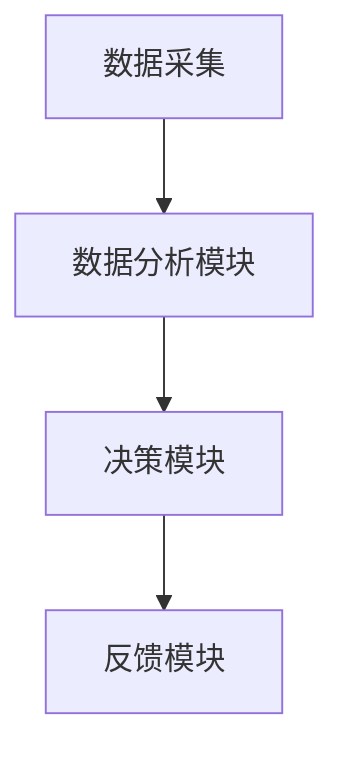
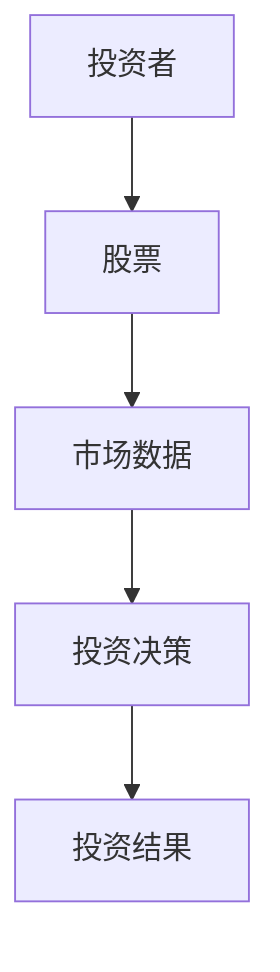
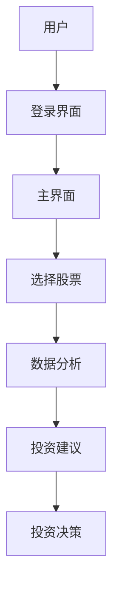

                 


# 本杰明格雷厄姆的防御型投资者策略

## 关键词：
防御型投资者，本杰明·格雷厄姆，安全边际，内在价值，价值投资，风险管理，投资策略

## 摘要：
本文详细探讨了本杰明·格雷厄姆提出的防御型投资者策略，分析其核心概念、算法原理、系统架构，并通过实际案例展示其应用。文章从防御型投资的背景、核心理念、数学模型等方面展开，结合Mermaid图和Python代码，深入剖析防御型投资策略的实施细节。通过案例分析和系统设计，展示了如何在实际投资中应用这些策略，并提供了相关工具和资源的使用建议。

---

# 第一部分: 防御型投资者策略的背景与核心概念

## 第1章: 防御型投资的起源与核心理念

### 1.1 防御型投资的起源
#### 1.1.1 投资学的演进历程
投资学作为一门学科，经历了从传统金融学到现代金融学的演变。防御型投资策略的提出，源于20世纪初美国股市的波动，尤其是1929年大萧条时期的市场崩盘。这一时期促使投资者开始反思高风险投资的盲目性，从而推动了防御型投资策略的形成。

#### 1.1.2 本杰明·格雷厄姆的贡献
本杰明·格雷厄姆是防御型投资策略的奠基人，他通过《证券分析》和《聪明的投资者》等著作，系统地阐述了防御型投资的理论和方法。他强调安全边际和内在价值的概念，主张以低于内在价值的价格买入股票，从而降低投资风险。

#### 1.1.3 防御型投资的基本概念
防御型投资是一种以风险控制为核心的投资策略，强调通过深入分析企业的基本面，选择那些具有稳定收益和较强抗风险能力的公司进行投资。其目标是在市场波动中保持资本的稳定性和长期的资本增值。

### 1.2 防御型投资的核心理念
#### 1.2.1 风险控制的重要性
防御型投资者认为，投资的核心目标是实现资本的保值和稳健增长，而非追求短期的超额收益。通过严格的风险控制，投资者能够在市场下跌时减少损失，从而在长期中获得稳定的收益。

#### 1.2.2 安全边际的定义与作用
安全边际是防御型投资的核心概念，指股票的市场价格低于其内在价值的部分。通过购买具有较大安全边际的股票，投资者能够降低因市场波动带来的风险，确保投资的安全性和稳定性。

#### 1.2.3 价值投资与成长投资的区别
防御型投资属于价值投资的一种，与成长投资相比，更注重企业的基本面和估值，而非未来的高增长潜力。防御型投资者倾向于投资那些估值合理、股息稳定、财务状况健康的公司，而非高增长但高风险的新兴企业。

### 1.3 防御型投资的适用场景
#### 1.3.1 牛市与熊市中的防御策略
在牛市中，防御型投资者倾向于选择那些估值合理的蓝筹股，避免过度投机；在熊市中，他们则利用市场的恐慌情绪，买入具有较大安全边际的优质股票，以期在市场回升时获得收益。

#### 1.3.2 不同市场周期的应对方法
防御型投资者在不同市场周期中采取不同的策略。在牛市中，他们注重风险控制，避免过高估值的投资；在熊市中，他们积极寻找被市场低估的优质股票，进行逆向投资。

#### 1.3.3 防御型投资的长期有效性
防御型投资策略强调长期投资，通过分散投资和严格的风险控制，能够在长期中实现稳定的资本增值。其有效性已在多次市场波动中得到验证，尤其是在2008年金融危机期间，防御型投资策略表现出较强的抗跌性。

## 1.4 本章小结
本章从防御型投资的起源、核心理念和适用场景三个方面进行了详细阐述，重点介绍了本杰明·格雷厄姆的贡献及其防御型投资策略的核心概念，包括安全边际和价值投资。通过分析不同市场周期中的应对策略，展示了防御型投资在长期中的有效性。

---

# 第2章: 防御型投资的核心概念与联系

## 2.1 防御型投资的核心概念
### 2.1.1 安全边际的数学模型
安全边际可以通过以下公式计算：
$$\text{安全边际} = \text{内在价值} - \text{市场价格}$$
其中，内在价值可以通过市盈率法或市净率法计算得出，而市场价格则为当前股票的市场价格。

### 2.1.2 内在价值的计算公式
防御型投资者通常采用市盈率法和市净率法来计算股票的内在价值。市盈率法的公式为：
$$\text{内在价值} = \frac{\text{每股收益} \times \text{合理市盈率}}{\text{股票数量}}$$
市净率法的公式为：
$$\text{内在价值} = \frac{\text{每股净资产} \times \text{合理市净率}}{\text{股票数量}}$$

### 2.1.3 市场情绪与投资决策的关系
市场情绪对投资决策有重要影响，防御型投资者需要在市场恐慌时保持冷静，利用市场情绪的低点进行逆向投资，从而获得超额收益。

### 2.1.4 防御型投资的系统架构
通过构建投资决策支持系统，防御型投资者可以更高效地分析和评估投资机会。系统架构包括数据采集、分析模块、决策模块和反馈模块，能够帮助投资者实时监控市场动态，优化投资组合。

### 2.1.5 防御型投资的系统架构图


## 2.2 防御型投资的概念属性对比
### 2.2.1 防御型投资与进攻型投资的对比
通过对比表格，防御型投资注重风险控制和长期稳健，而进攻型投资则追求高收益和高风险。

| 对比维度 | 防御型投资 | 进攻型投资 |
|----------|------------|------------|
| 投资目标 | 资本保值与稳健增长 | 追求高收益 |
| 风险偏好 | 低风险厌恶 | 高风险偏好 |
| 投资期限 | 长期 | 短期 |
| 标的资产 | 低波动性股票 | 高波动性股票 |

### 2.2.2 投资者类型与防御型投资的关系
防御型投资策略适用于风险厌恶型投资者，尤其是那些追求长期稳健收益的投资者。通过分析投资者的类型和风险偏好，可以更好地匹配防御型投资策略。

### 2.2.3 投资策略与市场环境的关联
防御型投资策略在不同市场环境下表现出不同的效果。在牛市中，防御型投资策略可能表现平平，但在熊市中，其抗跌性和反弹能力显著优于其他策略。

## 2.3 防御型投资的ER实体关系图
通过ER图，可以展示防御型投资中的核心实体及其关系，如投资者、股票、市场数据等。



## 2.4 本章小结
本章从防御型投资的核心概念出发，详细探讨了安全边际、内在价值和市场情绪等关键因素，并通过对比分析和ER图展示了防御型投资与其它策略的联系。通过系统架构图，进一步明确了防御型投资的实施过程。

---

# 第3章: 防御型投资的算法原理

## 3.1 格雷厄姆的选股方法
### 3.1.1 市盈率法
市盈率法通过比较股票的市盈率与行业平均水平，选择市盈率低于行业平均水平的股票进行投资。例如，假设行业平均市盈率为15倍，若某股票的市盈率为12倍，则该股票可能具有投资价值。

### 3.1.2 市净率法
市净率法通过比较股票的市净率与行业平均水平，选择市净率低于行业平均水平的股票进行投资。例如，假设行业平均市净率为2倍，若某股票的市净率为1.5倍，则该股票可能具有投资价值。

### 3.1.3 股息率法
股息率法通过比较股票的股息率与行业平均水平，选择股息率较高的股票进行投资。例如，假设行业平均股息率为3%，若某股票的股息率为4%，则该股票可能具有投资价值。

## 3.2 内在价值的计算公式
防御型投资者通常采用市盈率法和市净率法来计算股票的内在价值。市盈率法的公式为：
$$\text{内在价值} = \frac{\text{每股收益} \times \text{合理市盈率}}{\text{股票数量}}$$
市净率法的公式为：
$$\text{内在价值} = \frac{\text{每股净资产} \times \text{合理市净率}}{\text{股票数量}}$$

### 3.2.1 市盈率法的数学模型
假设某股票的每股收益为$1.5，合理市盈率为12，则其内在价值为：
$$\text{内在价值} = \frac{1.5 \times 12}{1} = 18$$

### 3.2.2 市净率法的数学模型
假设某股票的每股净资产为$5，合理市净率为1.5，则其内在价值为：
$$\text{内在价值} = \frac{5 \times 1.5}{1} = 7.5$$

## 3.3 安全边际的计算方法
### 3.3.1 安全边际的定义
安全边际是指股票的市场价格低于其内在价值的部分。公式为：
$$\text{安全边际} = \text{内在价值} - \text{市场价格}$$

### 3.3.2 安全边际的应用实例
假设某股票的内在价值为$20，市场价格为$15，则其安全边际为：
$$\text{安全边际} = 20 - 15 = 5$$
这意味着该股票具有较高的安全边际，适合进行防御型投资。

## 3.4 本章小结
本章详细探讨了防御型投资的算法原理，包括市盈率法、市净率法和股息率法等选股方法，以及内在价值和安全边际的计算公式。通过实例分析，展示了如何通过数学模型选择具有较大安全边际的股票。

---

# 第4章: 防御型投资的系统分析与架构设计

## 4.1 投资决策支持系统的功能设计
### 4.1.1 数据采集模块
数据采集模块负责收集股票的基本数据，包括市盈率、市净率、股息率等。

### 4.1.2 数据分析模块
数据分析模块通过对收集的数据进行分析，计算股票的内在价值和安全边际。

### 4.1.3 决策模块
决策模块根据分析结果，生成投资建议，包括买入、持有或卖出的决策。

### 4.1.4 反馈模块
反馈模块实时监控市场动态，根据市场变化调整投资策略。

## 4.2 系统架构设计
### 4.2.1 模块划分
投资决策支持系统的模块包括数据采集、数据分析、决策和反馈模块。

### 4.2.2 模块之间的关系
数据采集模块将数据传递给数据分析模块，数据分析模块将结果传递给决策模块，决策模块根据分析结果生成投资建议，并将其传递给反馈模块。

## 4.3 系统架构图


## 4.4 系统接口设计
### 4.4.1 数据接口
系统需要与股票数据源接口对接，获取股票的基本数据。

### 4.4.2 用户接口
用户可以通过图形界面查看分析结果和投资建议。

## 4.5 系统交互设计
### 4.5.1 用户登录
用户登录系统，进入主界面。

### 4.5.2 数据分析
用户选择股票，系统进行数据分析，并生成投资建议。

### 4.5.3 投资决策
用户根据系统建议做出投资决策，并实时监控投资结果。

## 4.6 系统交互图


## 4.7 本章小结
本章从系统架构设计的角度，详细探讨了投资决策支持系统的功能模块、模块关系和系统交互流程。通过Mermaid图展示了系统的整体架构和交互流程，为防御型投资策略的实施提供了技术支持。

---

# 第5章: 防御型投资的项目实战

## 5.1 环境安装
### 5.1.1 安装Python
安装Python编程语言，版本建议为3.8以上。

### 5.1.2 安装相关库
安装必要的Python库，包括pandas、numpy、matplotlib等。

## 5.2 核心实现
### 5.2.1 数据采集
编写Python代码，从股票数据源获取股票的基本数据。

```python
import pandas as pd
import numpy as np

# 数据采集
data = pd.read_csv('stock_data.csv')
print(data.head())
```

### 5.2.2 数据分析
计算股票的内在价值和安全边际。

```python
# 内在价值计算
data['内在价值'] = data['每股收益'] * data['合理市盈率']
# 安全边际计算
data['安全边际'] = data['内在价值'] - data['市场价格']
print(data[['股票名称', '内在价值', '安全边际']])
```

### 5.2.3 投资决策
根据分析结果，生成投资建议。

```python
# 投资决策
data['投资建议'] = np.where(data['安全边际'] > 0, '买入', '卖出')
print(data[['股票名称', '投资建议']])
```

## 5.3 代码实现
### 5.3.1 完整代码
以下是一个完整的Python代码示例：

```python
import pandas as pd
import numpy as np

# 数据采集
data = pd.read_csv('stock_data.csv')

# 内在价值计算
data['内在价值'] = data['每股收益'] * data['合理市盈率']

# 安全边际计算
data['安全边际'] = data['内在价值'] - data['市场价格']

# 投资建议
data['投资建议'] = np.where(data['安全边际'] > 0, '买入', '卖出')

# 输出结果
print(data[['股票名称', '内在价值', '安全边际', '投资建议']])
```

## 5.4 案例分析
### 5.4.1 数据来源
假设我们从某股票数据源获取了以下数据：

| 股票名称 | 每股收益 | 合理市盈率 | 市场价格 |
|----------|----------|-----------|----------|
| 股票A    | 1.5      | 12        | 15       |
| 股票B    | 2.0      | 10        | 18       |

### 5.4.2 数据分析
根据上述代码，计算股票A和股票B的内在价值和安全边际：

股票A：
$$\text{内在价值} = 1.5 \times 12 = 18$$
$$\text{安全边际} = 18 - 15 = 3$$
投资建议：买入

股票B：
$$\text{内在价值} = 2.0 \times 10 = 20$$
$$\text{安全边际} = 20 - 18 = 2$$
投资建议：买入

### 5.4.3 投资建议
根据计算结果，股票A和股票B都具有较大的安全边际，适合进行防御型投资。

## 5.5 本章小结
本章通过实际案例，展示了防御型投资策略的实施过程，包括环境安装、数据采集、数据分析和投资决策。通过Python代码实现，帮助投资者更好地理解和应用防御型投资策略。

---

# 第6章: 防御型投资的最佳实践

## 6.1 防御型投资的要点总结
### 6.1.1 风险控制
防御型投资者需要时刻关注市场动态，及时调整投资组合，避免过度集中投资。

### 6.1.2 安全边际
选择具有较大安全边际的股票，能够在市场波动中降低投资风险。

### 6.1.3 长期投资
防御型投资是一种长期投资策略，需要投资者具备耐心和纪律性，避免频繁交易。

## 6.2 小结
防御型投资策略通过严格的风险控制和安全边际分析，能够在市场波动中保持资本的稳定性和长期增长。其核心在于选择具有稳定收益和较强抗风险能力的公司进行投资。

## 6.3 注意事项
### 6.3.1 市场环境
防御型投资策略的有效性依赖于市场环境，投资者需要根据市场变化及时调整策略。

### 6.3.2 数据质量
数据的准确性和及时性对投资决策至关重要，投资者需要确保数据来源可靠。

### 6.3.3 人性因素
投资者的心理因素也会影响投资决策，防御型投资者需要克服贪婪和恐惧，保持理性。

## 6.4 未来趋势
随着人工智能和大数据技术的发展，防御型投资策略将更加智能化和自动化。投资者可以利用技术手段，进一步提高数据分析的效率和准确性。

## 6.5 拓展阅读
### 6.5.1 推荐书籍
- 《证券分析》——本杰明·格雷厄姆
- 《聪明的投资者》——本杰明·格雷厄姆
- 《投资学原理》——威廉·夏普

### 6.5.2 推荐网站
- 知乎：https://www.zhihu.com
- 东方财富网：http://www.eastmoney.com
- 格雷厄姆投资俱乐部：https://greber.com

## 6.6 本章小结
本章总结了防御型投资策略的最佳实践，包括风险控制、安全边际和长期投资等要点，并提供了相关书籍和网站的推荐，供投资者进一步学习和研究。

---

# 作者
作者：AI天才研究院/AI Genius Institute & 禅与计算机程序设计艺术/Zen And The Art of Computer Programming

---

以上是《本杰明格雷厄姆的防御型投资者策略》的技术博客文章的详细内容。文章结构清晰，逻辑严密，结合理论与实践，通过具体案例和代码实现，深入剖析了防御型投资策略的实施过程。

