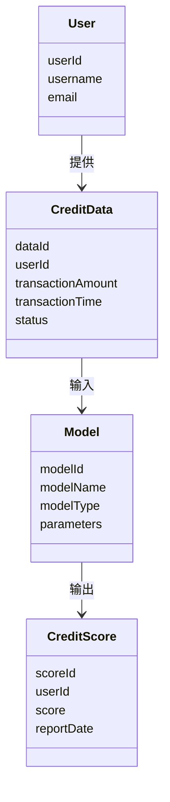
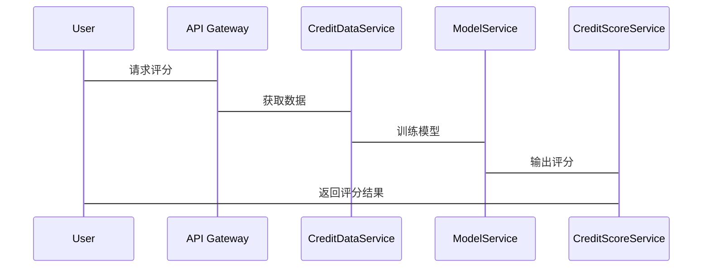

                 


# 构建智能化的个人信用分数提升路径规划器

> 关键词：个人信用评分，路径规划，机器学习，数据驱动，评分模型

> 摘要：本文详细探讨了如何通过智能化的个人信用分数提升路径规划器来优化个人信用评分。文章从背景介绍、核心概念分析、算法原理、系统架构设计、项目实战到最佳实践，全面解析了构建该系统的过程。通过本文，读者将了解如何利用数据驱动的方法和机器学习算法来提升个人信用评分，并掌握实际的系统设计和实现技巧。

---

# 第一部分: 背景介绍

# 第1章: 构建智能化的个人信用评分提升路径规划器概述

## 1.1 个人信用评分的背景与重要性

### 1.1.1 个人信用评分的定义与作用

个人信用评分是评估个人信用状况的重要指标，广泛应用于银行贷款、信用卡审批、信用额度调整等领域。信用评分越高，意味着个人的信用风险越低，获得的金融服务越优。

### 1.1.2 信用评分在金融领域的应用

- **贷款审批**：银行在审批个人贷款时，通常会参考信用评分来决定是否批准贷款以及贷款额度。
- **信用卡额度**：信用评分高的用户通常能获得更高的信用卡额度。
- **信用风险管理**：金融机构通过信用评分来识别和管理信用风险。

### 1.1.3 提升信用评分的重要性

- **降低融资成本**：高信用评分意味着更低的贷款利率。
- **提高融资成功率**：良好的信用记录有助于更容易获得融资。
- **提升个人信用形象**：高信用评分是个人信用形象的体现，有助于在社会中建立信任。

## 1.2 问题背景与问题描述

### 1.2.1 当前信用评分体系的局限性

- **数据维度不足**：传统信用评分主要依赖财务数据，缺乏行为数据和社交数据的支持。
- **模型单一**：传统评分模型多为线性模型，难以捕捉复杂的信用风险。
- **用户缺乏指导**：用户难以了解如何有效提升信用评分。

### 1.2.2 用户信用评分低的影响

- **融资困难**：低信用评分可能导致贷款被拒或额度低。
- **生活不便**：信用评分低可能影响租车、酒店预订等服务的审批。
- **经济损失**：低信用评分可能导致高利率或附加费用。

### 1.2.3 如何有效提升信用评分

- **优化财务状况**：按时还款、降低负债率。
- **建立良好的信用记录**：按时缴纳水电费、信用卡账单。
- **提升信用行为的透明度**：合理使用信用额度，避免频繁查询信用报告。

## 1.3 问题解决路径

### 1.3.1 数据驱动的信用评分提升方法

通过收集和分析多维度数据（如消费行为、社交数据、还款记录等），利用大数据技术优化信用评分模型。

### 1.3.2 个性化信用评分提升策略

根据用户的信用状况和行为特征，制定个性化的提升计划，例如优化消费习惯、管理负债结构。

### 1.3.3 技术驱动的信用评分优化方案

利用机器学习算法（如逻辑回归、随机森林、梯度提升树）构建更精准的信用评分模型。

## 1.4 问题的边界与外延

### 1.4.1 信用评分提升的适用范围

- 适用于个人用户，特别是信用评分较低的用户。
- 适用于金融机构，用于优化客户信用管理。

### 1.4.2 信用评分提升的限制条件

- 数据隐私和合规性要求。
- 模型的可解释性和透明度。
- 用户行为的不可控性。

### 1.4.3 相关概念的界定与区分

- **信用评分**：反映个人信用状况的量化指标。
- **信用报告**：记录个人信用历史的官方文件。
- **信用评分模型**：用于计算信用评分的数学模型。

## 1.5 核心概念结构与组成

### 1.5.1 信用评分模型的构成要素

- 数据输入：个人信用历史、消费行为、财务状况。
- 模型算法：逻辑回归、随机森林、梯度提升。
- 输出结果：信用评分、评分解释。

### 1.5.2 数据来源与处理流程

- 数据来源：银行流水、信用卡记录、社交数据。
- 数据处理：数据清洗、特征提取、数据增强。
- 数据存储：数据库设计与数据管理。

### 1.5.3 模型评估与优化机制

- 模型评估：准确率、召回率、F1分数。
- 模型优化：超参数调优、模型集成、在线反馈优化。

---

# 第二部分: 核心概念与联系

# 第2章: 智能化信用评分模型原理

## 2.1 智能化信用评分模型的核心原理

### 2.1.1 数据驱动的评分模型

通过收集和分析多维度数据，利用机器学习算法构建评分模型。

### 2.1.2 机器学习在信用评分中的应用

- **监督学习**：利用历史数据训练分类模型。
- **特征工程**：提取关键特征，如按时还款率、信用卡使用率。
- **模型评估**：通过交叉验证评估模型性能。

### 2.1.3 深度学习在信用评分中的潜力

- **神经网络模型**：处理非结构化数据，如文本评论、社交数据。
- **自动特征提取**：深度学习模型能够自动提取高阶特征。

## 2.2 核心概念属性对比

### 2.2.1 传统评分模型与现代模型的对比

| 特性                | 传统评分模型          | 现代评分模型          |
|---------------------|----------------------|----------------------|
| 数据来源            | 主要依赖财务数据      | 包括行为数据、社交数据 |
| 模型类型            | 线性回归、决策树      | 神经网络、随机森林    |
| 可解释性            | 高                  | 较低                 |
| 性能                | 较低                | 较高                 |

### 2.2.2 不同评分模型的特征分析

- **线性模型**：简单易懂，但难以捕捉非线性关系。
- **树模型**：能够处理复杂关系，但解释性较弱。
- **神经网络模型**：适合处理复杂数据，但需要大量数据支持。

### 2.2.3 模型性能的评估指标

- **准确率**：模型预测正确的比例。
- **召回率**：模型预测为正类的比例。
- **F1分数**：综合准确率和召回率的指标。

## 2.3 ER实体关系图架构

### 2.3.1 实体关系图的构建

```mermaid
erDiagram
    user {
        User (
            userId : integer,
            username : string,
            email : string
        )
    }
    credit_data {
        CreditData (
            dataId : integer,
            userId : integer,
            transactionAmount : float,
            transactionTime : datetime,
            status : string
        )
    }
    credit_score {
        CreditScore (
            scoreId : integer,
            userId : integer,
            score : integer,
            reportDate : datetime
        )
    }
    user --> credit_data : 提供
    user --> credit_score : 关联
    credit_data --> credit_score : 生成
```

### 2.3.2 数据流的展示

```mermaid
flowchart TD
    User --> CreditData: 提供数据
    CreditData --> CreditModel: 输入数据
    CreditModel --> CreditScore: 输出评分
    User --> CreditScore: 关联评分
```

### 2.3.3 关系图的解释与应用

用户数据流向信用数据，信用数据输入评分模型，生成信用评分，最终关联到用户。

---

# 第三部分: 算法原理讲解

# 第3章: 信用评分模型的数学模型与算法

## 3.1 信用评分模型的数学模型

### 3.1.1 线性回归模型

$$ y = \beta_0 + \beta_1 x_1 + \beta_2 x_2 + ... + \beta_n x_n + \epsilon $$

其中，$y$ 是信用评分，$x_i$ 是特征变量，$\beta_i$ 是系数，$\epsilon$ 是误差项。

### 3.1.2 逻辑回归模型

$$ P(y=1|x) = \frac{1}{1 + e^{-(\beta_0 + \beta_1 x_1 + ... + \beta_n x_n)}} $$

### 3.1.3 支持向量机模型

$$ \text{目标函数} = \sum_{i=1}^n \lambda_i (y_i - w \cdot x_i - b)^2 + \sum_{i=1}^n \xi_i $$

### 3.1.4 随机森林模型

随机森林通过集成多个决策树模型，提高模型的准确性和鲁棒性。

### 3.1.5 XGBoost模型

XGBoost通过正则化和提升算法，优化传统梯度提升树模型的性能。

## 3.2 算法原理的详细讲解

### 3.2.1 线性回归的数学推导

线性回归通过最小化预测值与实际值的平方差之和，求解模型参数。

$$ \text{损失函数} = \sum_{i=1}^n (y_i - (β_0 + β_1 x_{i1} + ... + β_k x_{ik}))^2 $$

通过求导并令导数为零，得到正规方程组：

$$ X^T X β = X^T y $$

其中，$X$ 是特征矩阵，$y$ 是目标向量。

### 3.2.2 逻辑回归的损失函数

逻辑回归的损失函数为对数损失函数：

$$ \text{损失函数} = -\sum_{i=1}^n [y_i \ln p_i + (1 - y_i) \ln (1 - p_i)] $$

其中，$p_i$ 是第i个样本的预测概率。

### 3.2.3 支持向量机模型的对偶形式

支持向量机的对偶形式通过拉格朗日乘子法，将问题转化为求解对偶变量。

$$ \text{目标函数} = \frac{1}{2}||w||^2 + C \sum_{i=1}^n ξ_i $$

其中，$C$ 是惩罚参数，$ξ_i$ 是松弛变量。

---

# 第四部分: 系统分析与架构设计

# 第4章: 智能化信用评分系统架构设计

## 4.1 问题场景介绍

系统旨在帮助用户提升信用评分，通过分析用户数据，制定个性化提升计划。

## 4.2 项目介绍

系统名称：智能化个人信用评分提升路径规划器。

## 4.3 系统功能设计

### 4.3.1 系统功能模块

#### 4.3.1.1 数据采集模块

- 收集用户信用数据、消费数据、社交数据。
- 数据来源：银行流水、信用卡记录、社交网络数据。

#### 4.3.1.2 数据处理模块

- 数据清洗：处理缺失值、异常值。
- 特征提取：提取关键特征，如按时还款率、信用卡使用率。
- 数据增强：通过数据变换提升模型性能。

#### 4.3.1.3 模型训练模块

- 选择合适的算法：逻辑回归、随机森林、梯度提升。
- 模型训练：基于训练数据训练评分模型。
- 模型优化：调优超参数，评估模型性能。

#### 4.3.1.4 评分解释模块

- 提供评分结果。
- 提供评分解释：解释影响评分的关键因素。
- 提供提升建议：基于评分结果，提供个性化提升建议。

### 4.3.2 领域模型图



### 4.3.3 系统架构图

```mermaid
flowchart TD
    User --> API Gateway
    API Gateway --> CreditDataService
    CreditDataService --> ModelService
    ModelService --> CreditScoreService
    CreditScoreService --> User
```

### 4.3.4 接口设计

- **数据接口**：RESTful API，用于数据采集和传输。
- **模型接口**：API用于模型训练和评分。
- **用户接口**：API用于用户查询和获取评分结果。

### 4.3.5 交互图



---

# 第五部分: 项目实战

# 第5章: 实战：构建智能化信用评分系统

## 5.1 环境安装

### 5.1.1 安装Python环境

使用Anaconda安装Python 3.8及以上版本。

### 5.1.2 安装必要的Python库

- `pandas`：数据处理。
- `numpy`：数值计算。
- `scikit-learn`：机器学习算法。
- `xgboost`：XGBoost算法。
- `mermaid`：图表生成。

### 5.1.3 安装Jupyter Notebook

用于数据探索和模型训练。

## 5.2 系统核心实现源代码

### 5.2.1 数据预处理代码

```python
import pandas as pd
import numpy as np

# 加载数据
credit_data = pd.read_csv('credit_data.csv')

# 数据清洗
credit_data.dropna(inplace=True)

# 特征提取
from sklearn.preprocessing import StandardScaler
scaler = StandardScaler()
credit_data[['income', 'debt', 'assets']] = scaler.fit_transform(credit_data[['income', 'debt', 'assets']])
```

### 5.2.2 模型训练代码

```python
from sklearn.model_selection import train_test_split
from sklearn.linear_model import LogisticRegression
from sklearn.ensemble import RandomForestClassifier
from xgboost import XGBClassifier

# 划分数据集
X_train, X_test, y_train, y_test = train_test_split(credit_data[['income', 'debt', 'assets']], credit_data['score'], test_size=0.2)

# 训练模型
log_reg = LogisticRegression().fit(X_train, y_train)
random_forest = RandomForestClassifier().fit(X_train, y_train)
xgboost = XGBClassifier().fit(X_train, y_train)

# 模型评估
print('Logistic Regression Accuracy:', log_reg.score(X_test, y_test))
print('Random Forest Accuracy:', random_forest.score(X_test, y_test))
print('XGBoost Accuracy:', xgboost.score(X_test, y_test))
```

### 5.2.3 评分解释与提升建议代码

```python
from sklearn.inspection import permutation_importance

# 分析特征重要性
result = permutation_importance(log_reg, X_test, y_test, n_repeats=10, random_state=42)
importances = pd.Series(result['importances_mean'], index=X_test.columns)
importances.plot(kind='barh')
```

## 5.3 实际案例分析与详细讲解

### 5.3.1 数据准备

加载数据并进行清洗和特征工程。

### 5.3.2 模型训练

训练逻辑回归、随机森林和XGBoost模型。

### 5.3.3 模型评估

比较不同模型的准确率，选择性能最佳的模型。

### 5.3.4 评分解释

分析模型特征重要性，解释评分结果。

### 5.3.5 提升建议

基于评分结果，制定个性化信用提升计划。

## 5.4 项目小结

总结项目实施过程，分析系统性能，提出改进建议。

---

# 第六部分: 最佳实践

# 第6章: 最佳实践、小结、注意事项、拓展阅读

## 6.1 最佳实践

### 6.1.1 数据处理

- 数据清洗：处理缺失值、异常值。
- 特征工程：提取关键特征，进行特征变换。

### 6.1.2 模型选择

- 根据数据规模选择合适的算法。
- 使用交叉验证评估模型性能。

### 6.1.3 系统设计

- 模块化设计：便于维护和扩展。
- 安全设计：保护用户数据隐私。

## 6.2 小结

本文详细介绍了如何构建智能化的个人信用评分提升路径规划器，从背景介绍、核心概念、算法原理到系统设计和项目实战，全面解析了系统的构建过程。

## 6.3 注意事项

- 数据隐私保护：确保数据处理符合相关法律法规。
- 模型解释性：选择适合业务需求的模型。
- 用户教育：指导用户如何理解和使用系统。

## 6.4 拓展阅读

- 《机器学习实战》：深入学习机器学习算法。
- 《数据驱动的信用评分模型》：了解更多信用评分模型。
- 《系统架构设计》：学习系统设计的技巧和方法。

---

作者：AI天才研究院/AI Genius Institute & 禅与计算机程序设计艺术/Zen And The Art of Computer Programming

