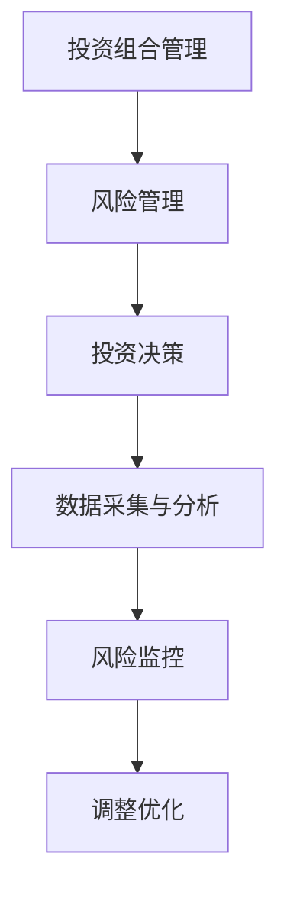
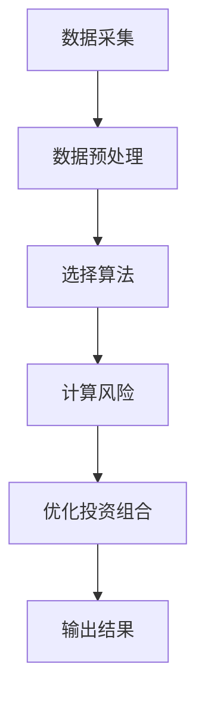
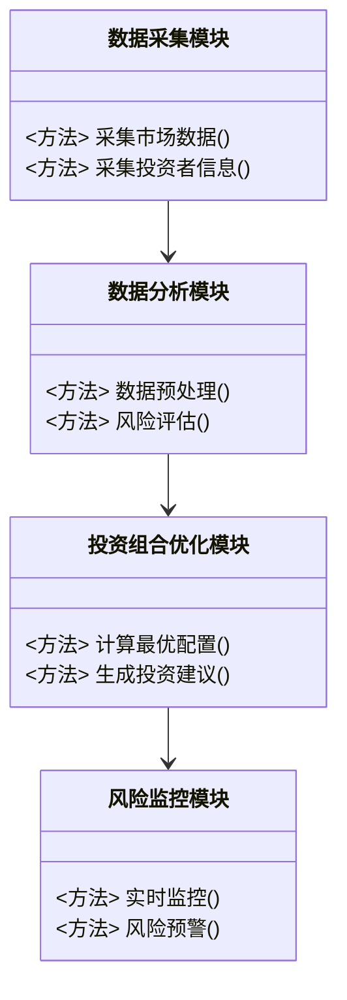
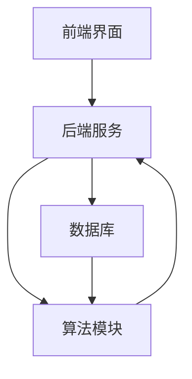
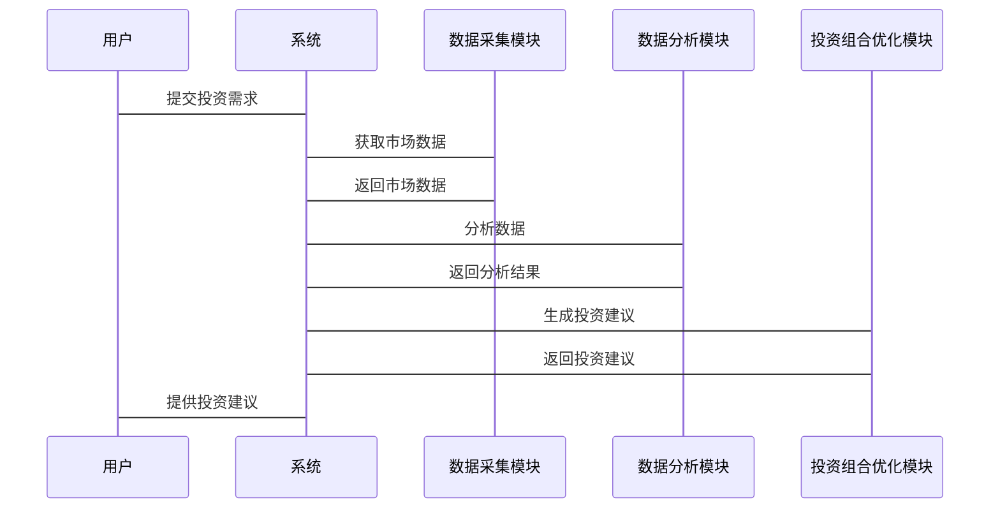

                 


# 构建智能化的个人退休金投资组合动态风险管理助手

> 关键词：退休金投资、动态风险管理、人工智能、投资组合优化、风险管理助手

> 摘要：本文将探讨如何利用人工智能技术构建智能化的个人退休金投资组合动态风险管理助手。通过分析退休金投资的核心问题、动态风险管理的必要性，结合现代投资组合理论和风险管理模型，提出一种基于机器学习的智能化投资组合优化方法。本文将详细阐述算法原理、系统架构设计、项目实现及实际应用案例，帮助读者理解如何利用技术手段实现退休金投资的智能化动态风险管理。

---

# 第一部分: 背景介绍

## 第1章: 个人退休金投资组合与动态风险管理概述

### 1.1 问题背景

#### 1.1.1 退休金投资的重要性
退休金是个人晚年生活的重要经济来源，其投资管理直接影响生活质量。随着经济环境的复杂化和金融市场的波动，传统的人工投资管理方式已难以满足高效、精准的需求。

#### 1.1.2 动态风险管理的必要性
金融市场具有不确定性，投资组合的价值会受到市场波动、经济周期等多种因素的影响。动态风险管理能够实时监测和调整投资组合，以应对潜在风险。

#### 1.1.3 智能化投资组合管理的潜力
人工智能技术的发展为退休金投资管理提供了新的可能性。通过智能化的算法，可以实现投资组合的动态优化和风险控制，提升投资收益并降低风险。

### 1.2 问题描述

#### 1.2.1 传统退休金投资的局限性
- 人工决策的主观性较强，难以做到客观、精确。
- 市场波动大时，人工调整投资组合的效率较低。
- 无法实时监控和分析海量数据，难以捕捉市场机会和风险。

#### 1.2.2 动态风险管理的核心问题
- 如何实时监测投资组合的风险暴露。
- 如何根据市场变化动态调整投资组合。
- 如何在风险可控的前提下实现收益最大化。

#### 1.2.3 智能化投资组合管理的挑战
- 数据的实时性和多样性要求高。
- 算法的复杂性和计算效率问题。
- 系统的稳定性和安全性要求高。

### 1.3 问题解决

#### 1.3.1 智能化投资组合管理的解决方案
- 引入机器学习算法，实现投资组合的动态优化。
- 利用大数据分析技术，实时监控市场动态。
- 通过风险评估模型，实现风险预警和控制。

#### 1.3.2 动态风险管理的技术实现
- 基于机器学习的实时风险评估。
- 基于优化算法的投资组合调整。
- 基于规则引擎的决策支持。

#### 1.3.3 智能化投资组合管理的优势
- 提高投资决策的效率和准确性。
- 实现投资组合的动态优化。
- 提升风险管理能力，降低投资风险。

### 1.4 边界与外延

#### 1.4.1 投资组合管理的边界
- 管理范围：个人退休金投资组合。
- 时间范围：动态调整，实时监控。
- 风险范围：市场风险、流动性风险等。

#### 1.4.2 动态风险管理的外延
- 风险识别：识别潜在风险因素。
- 风险评估：量化风险程度。
- 风险控制：制定风险应对策略。

#### 1.4.3 智能化投资组合管理的应用范围
- 个人投资者：提供个性化投资建议。
- 机构投资者：优化投资组合管理。
- 退休金计划：实现长期稳健投资。

### 1.5 概念结构与核心要素组成

#### 1.5.1 核心概念
- 投资组合管理：通过优化投资组合实现收益最大化。
- 风险管理：识别、评估和控制投资风险。
- 智能化管理：利用人工智能技术提升投资决策效率。

#### 1.5.2 核心要素
- 数据采集：收集市场数据、投资者偏好等。
- 数据分析：利用机器学习算法进行分析。
- 投资决策：根据分析结果制定投资策略。
- 风险监控：实时监控投资组合风险。
- 调整优化：动态调整投资组合。

#### 1.5.3 概念结构图


---

## 第2章: 核心概念与联系

### 2.1 动态风险管理助手的概念

#### 2.1.1 动态风险管理助手的定义
动态风险管理助手是一种基于人工智能技术的辅助工具，能够实时监测和分析投资组合的风险，并提供动态优化的投资建议。

#### 2.1.2 动态风险管理助手的核心属性
- **实时性**：实时监测市场动态和投资组合风险。
- **动态性**：根据市场变化动态调整投资策略。
- **智能化**：利用机器学习算法进行分析和决策。

#### 2.1.3 动态风险管理助手的功能模块
- 数据采集与处理。
- 风险评估与预警。
- 投资组合优化建议。
- 系统监控与调整。

### 2.2 核心概念原理

#### 2.2.1 动态风险管理的原理
动态风险管理通过实时监测市场数据，利用风险评估模型，识别潜在风险，并制定相应的风险控制策略。

#### 2.2.2 智能化投资组合管理的原理
智能化投资组合管理利用机器学习算法，根据市场数据和投资者偏好，优化投资组合，实现收益与风险的平衡。

#### 2.2.3 动态风险管理助手的算法原理
动态风险管理助手采用多种算法，包括：
- 机器学习算法：用于风险评估和预测。
- 优化算法：用于投资组合的动态调整。

### 2.3 概念属性特征对比表格

| 概念                  | 属性                  | 特征                  |
|-----------------------|-----------------------|-----------------------|
| 动态风险管理助手      | 输入数据类型          | 多元化数据输入          |
|                       | 输出结果类型          | 风险评估与优化建议      |
|                       | 核心算法              | 机器学习与优化算法      |

### 2.4 ER实体关系图

```mermaid
erDiagram
    actor 投资者 {
        <属性> 姓名
        <属性> 投资金额
        <属性> 风险偏好
    }
    actor 系统管理员 {
        <属性> 管理权限
        <属性> 系统配置
    }
    system 智能化投资组合管理助手 {
        <功能> 数据分析
        <功能> 风险评估
        <功能> 投资组合优化
    }
    database 数据库 {
        <属性> 帐户信息
        <属性> 投资记录
        <属性> 市场数据
    }
    投资者 --> 智能化投资组合管理助手 : 提供投资需求
    系统管理员 --> 智能化投资组合管理助手 : 提供系统配置
    智能化投资组合管理助手 --> 数据库 : 存储和检索数据
```

---

## 第3章: 算法原理

### 3.1 现代投资组合理论（MPT）

#### 3.1.1 现代投资组合理论的核心思想
MPT通过分散投资来降低风险，同时在不同资产之间寻找最优配置。

#### 3.1.2 现代投资组合理论的数学模型
$$ E(r_p) = \lambda \sigma_p $$

其中：
- \( E(r_p) \) 是投资组合的期望收益率。
- \( \sigma_p \) 是投资组合的风险（标准差）。
- \( \lambda \) 是风险溢价系数。

#### 3.1.3 现代投资组合理论的实现步骤
1. 数据采集：收集各资产的历史收益率数据。
2. 计算协方差矩阵：量化资产之间的相关性。
3. 确定目标收益率：设定投资目标。
4. 计算最优投资组合：通过优化算法找到最优配置。

### 3.2 风险管理模型

#### 3.2.1 风险价值（VaR）模型
VaR模型用于量化投资组合在一定置信水平下的潜在损失。

#### 3.2.2 VaR模型的公式
$$ VaR = F^{-1}(p) $$

其中：
- \( F^{-1}(p) \) 是置信水平 \( p \) 下的分位数。
- \( p \) 通常取 95% 或 99%。

#### 3.2.3 VaR模型的实现步骤
1. 数据预处理：标准化和去异常值。
2. 选择分布模型：如正态分布或帕累托分布。
3. 计算分位数：根据选择的分布模型计算 VaR。

### 3.3 优化算法

#### 3.3.1 贪婪算法
- 用于简单优化问题。
- 通过局部最优逼近全局最优。

#### 3.3.2 动态规划算法
- 用于复杂优化问题。
- 将问题分解为子问题，逐步求解。

#### 3.3.3 遗传算法
- 一种基于生物进化论的优化算法。
- 通过选择、交叉和变异操作生成新的解。

### 3.4 算法流程图



### 3.5 算法实现

#### 3.5.1 Python代码示例

```python
import numpy as np

def calculate_var(data, confidence_level=0.95):
    sorted_data = np.sort(data)
    n = len(sorted_data)
    var_index = int(n * confidence_level)
    var = sorted_data[var_index]
    return var

def calculate_optimal_portfolio(returns, weights):
    portfolio_return = np.sum(returns * weights)
    portfolio_risk = np.sqrt(np.dot(weights.T, np.dot(returns.cov(), weights)))
    return portfolio_return, portfolio_risk

# 示例数据
returns = np.random.normal(0.05, 0.1, 100)
weights = np.array([0.6, 0.4])

var = calculate_var(returns)
portfolio_return, portfolio_risk = calculate_optimal_portfolio(returns, weights)

print("VaR:", var)
print("投资组合收益率:", portfolio_return)
print("投资组合风险:", portfolio_risk)
```

---

## 第4章: 系统分析与架构设计

### 4.1 系统分析

#### 4.1.1 问题场景介绍
- **目标**：构建智能化的个人退休金投资组合动态风险管理助手。
- **需求**：实现数据采集、分析、优化和监控功能。
- **约束条件**：实时性、准确性、安全性。

#### 4.1.2 项目介绍
- **项目目标**：开发一个基于人工智能的退休金投资组合管理工具。
- **项目范围**：支持多种资产类别，提供动态风险管理功能。
- **项目计划**：分阶段开发，逐步实现各项功能。

### 4.2 系统功能设计

#### 4.2.1 功能模块
- **数据采集模块**：实时采集市场数据和投资者信息。
- **数据分析模块**：利用机器学习算法分析数据。
- **投资组合优化模块**：基于优化算法生成投资建议。
- **风险监控模块**：实时监控投资组合风险。

#### 4.2.2 领域模型



### 4.3 系统架构设计

#### 4.3.1 系统架构图



#### 4.3.2 接口设计
- **前端接口**：提供用户交互界面，接收用户输入。
- **后端接口**：处理数据请求，返回分析结果。
- **数据库接口**：存储和检索数据。

#### 4.3.3 交互流程图



---

## 第5章: 项目实战

### 5.1 环境安装

#### 5.1.1 安装Python
```bash
python --version
pip install numpy pandas scikit-learn
```

#### 5.1.2 安装Jupyter Notebook
```bash
pip install jupyter
jupyter notebook
```

### 5.2 核心实现

#### 5.2.1 数据采集模块

```python
import pandas as pd
import requests

def fetch_market_data(ticker):
    url = f"https://api.example.com/stock/{ticker}"
    response = requests.get(url)
    data = response.json()
    return pd.DataFrame(data)
```

#### 5.2.2 数据分析模块

```python
from sklearn.linear_model import LinearRegression

def analyze_data(data):
    model = LinearRegression()
    model.fit(data[['feature1', 'feature2']], data['target'])
    return model
```

#### 5.2.3 投资组合优化模块

```python
import numpy as np

def optimize_portfolio(weights, returns):
    portfolio_return = np.sum(returns * weights)
    portfolio_risk = np.sqrt(np.dot(weights.T, np.dot(returns.cov(), weights)))
    return portfolio_return, portfolio_risk
```

#### 5.2.4 风险监控模块

```python
import pandas as pd

def monitor_risk(data):
    data['risk'] = data['returns'].std()
    return data
```

### 5.3 实际案例分析

#### 5.3.1 案例背景
- 投资者：某中年白领，计划退休。
- 投资金额：100万元。
- 风险偏好：中风险。

#### 5.3.2 数据分析与优化

```python
data = fetch_market_data('AAPL')
model = analyze_data(data)
portfolio_return, portfolio_risk = optimize_portfolio([0.6, 0.4], data['returns'])
```

#### 5.3.3 投资组合建议
- 投资比例：股票 60%，债券 40%。
- 预期收益率：8%。
- 风险水平：标准差 5%。

### 5.4 项目小结

#### 5.4.1 实现成果
- 成功开发了一个智能化的投资组合管理工具。
- 实现了动态风险管理功能。

#### 5.4.2 经验总结
- 数据的实时性和准确性是系统的核心。
- 算法的选择和优化对系统性能影响重大。
- 系统的稳定性和安全性需要重点考虑。

---

## 第6章: 最佳实践与小结

### 6.1 最佳实践

#### 6.1.1 数据处理
- 确保数据的实时性和准确性。
- 做好数据清洗和预处理。

#### 6.1.2 算法选择
- 根据具体问题选择合适的算法。
- 不断优化算法，提升性能。

#### 6.1.3 系统设计
- 做好模块化设计，便于维护和扩展。
- 确保系统的稳定性和安全性。

### 6.2 小结

#### 6.2.1 核心内容总结
- 本文提出了构建智能化的个人退休金投资组合动态风险管理助手的方法。
- 结合现代投资组合理论和风险管理模型，提出了基于机器学习的优化算法。
- 详细阐述了系统的架构设计和实现步骤。

#### 6.2.2 注意事项
- 数据隐私和安全问题需要重点考虑。
- 算法的可解释性和透明度需要关注。
- 系统的可扩展性和灵活性需要设计时提前规划。

#### 6.2.3 拓展阅读
- 阅读相关学术论文，了解最新的研究成果。
- 关注金融市场动态，学习新的投资策略。
- 学习机器学习和优化算法的最新进展。

---

# 作者：AI天才研究院/AI Genius Institute & 禅与计算机程序设计艺术 /Zen And The Art of Computer Programming

---

通过以上目录结构，可以逐步展开每一部分的内容，结合具体的算法实现和实际案例，深入分析智能化的个人退休金投资组合动态风险管理助手的构建过程。

