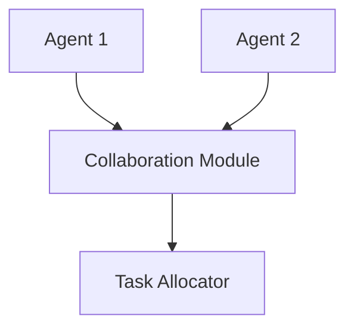
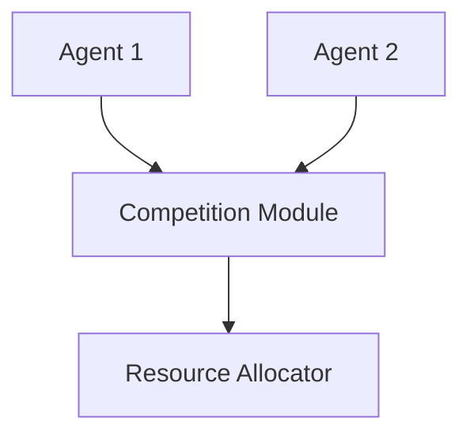
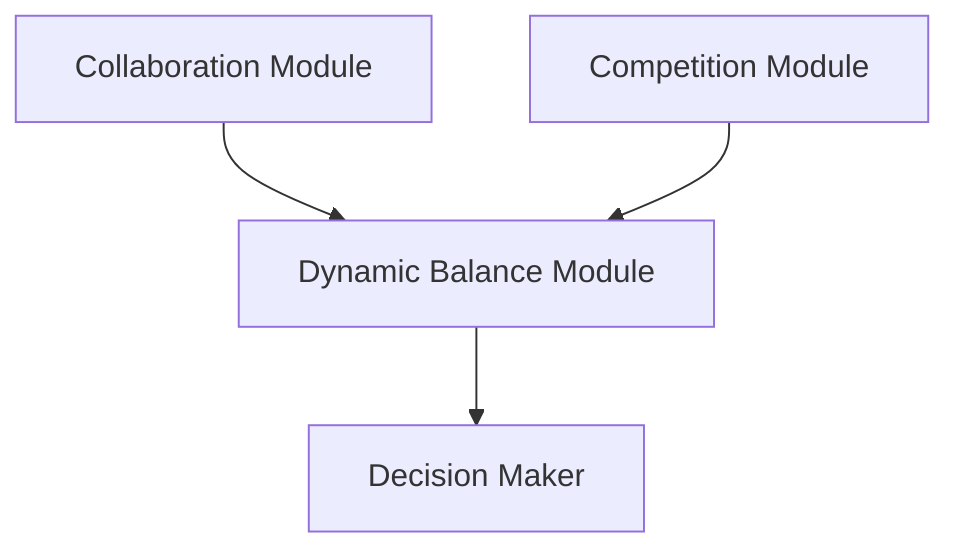
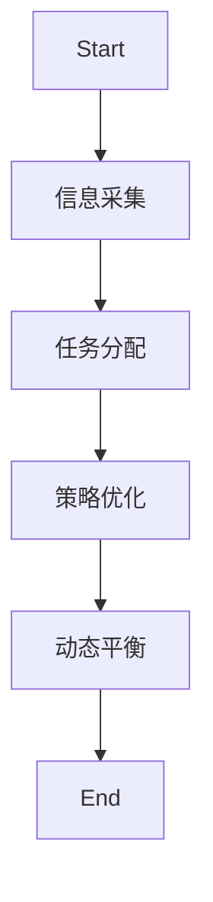

                 


# AI Agent的多Agent协作与竞争学习系统

> 关键词：AI Agent、多Agent系统、协作学习、竞争学习、动态平衡、系统架构

> 摘要：本文深入探讨了AI Agent在多Agent协作与竞争学习系统中的应用，从基本概念到系统架构设计，结合数学模型和实际案例，详细分析了协作与竞争学习的实现机制，并通过项目实战展示了系统的实际应用。

---

# 第1章: AI Agent的基本概念与应用

## 1.1 AI Agent的定义与特点

### 1.1.1 AI Agent的定义

AI Agent（人工智能代理）是指在计算机系统中能够感知环境并采取行动以实现目标的实体。AI Agent可以是软件程序、机器人或其他智能系统，其核心目标是通过与环境的交互来完成特定任务。

### 1.1.2 AI Agent的核心特点

- **自主性**：AI Agent能够在没有外部干预的情况下独立运作。
- **反应性**：能够感知环境并实时做出反应。
- **目标导向**：所有的行动都是为了实现特定的目标。
- **社交能力**：能够与其他Agent或人类进行有效通信和协作。

### 1.1.3 AI Agent与传统AI的区别

传统AI主要依赖预定义的规则和数据进行任务处理，而AI Agent具有更强的自主性和适应性，能够在动态环境中进行实时决策和调整。

---

## 1.2 多Agent系统的基本概念

### 1.2.1 多Agent系统的定义

多Agent系统是由多个相互作用的AI Agent组成的分布式系统，这些Agent通过协作和竞争共同完成复杂的任务。

### 1.2.2 多Agent系统的特点

- **分布式**：多个Agent分布在不同的节点上，各自独立运行。
- **协作性**：Agent之间能够通过通信和协调完成共同目标。
- **竞争性**：在某些情况下，Agent之间可能会存在竞争关系。
- **动态性**：系统能够根据环境的变化进行动态调整。

### 1.2.3 多Agent系统的应用场景

- 智能交通管理
- 自动化生产系统
- 机器人协作任务
- 网络安全防护

---

## 1.3 协作与竞争学习的基本概念

### 1.3.1 协作学习的定义

协作学习是指多个AI Agent通过共享信息和资源，共同完成一个复杂任务的过程。

### 1.3.2 竞争学习的定义

竞争学习是指多个AI Agent在相同的资源或目标下，通过竞争的方式优化自身策略的过程。

### 1.3.3 协作与竞争学习的对比

| 特性 | 协作学习 | 竞争学习 |
|------|----------|----------|
| 目标 | 共同完成任务 | 优化自身策略 |
| 信息共享 | 高 | 低 |
| 竞争性 | 低 | 高 |

---

## 1.4 本章小结

本章介绍了AI Agent的基本概念、多Agent系统的定义和特点，以及协作与竞争学习的基本概念和对比。通过这些基础内容的讲解，为后续章节的深入分析奠定了基础。

---

# 第2章: 多Agent协作与竞争学习的核心原理

## 2.1 多Agent协作的原理

### 2.1.1 协作的基本机制

协作机制包括任务分配、信息共享和协调同步三个主要步骤。

### 2.1.2 协作中的信息传递

通过通信模块实现Agent之间的信息传递，确保每个Agent能够获取必要的信息以完成任务。

### 2.1.3 协作中的任务分配

任务分配算法根据每个Agent的能力和当前状态，动态分配任务，确保资源的最优利用。

---

## 2.2 多Agent竞争的原理

### 2.2.1 竞争的基本机制

竞争机制通过策略选择和资源争夺实现，每个Agent通过优化自身策略来提高竞争力。

### 2.2.2 竞争中的策略选择

基于博弈论的策略选择模型，Agent能够根据环境反馈动态调整策略。

### 2.2.3 竞争中的资源分配

资源分配算法根据竞争结果，动态调整资源分配，确保系统的高效运行。

---

## 2.3 协作与竞争的动态平衡

### 2.3.1 协作与竞争的权衡

在实际应用中，需要在协作和竞争之间找到平衡点，以最大化系统的整体性能。

### 2.3.2 动态平衡的实现方法

通过反馈机制和自适应算法，动态调整协作与竞争的比例，确保系统的稳定运行。

### 2.3.3 动态平衡的优化策略

结合博弈论和多目标优化算法，实现协作与竞争的动态平衡。

---

## 2.4 本章小结

本章详细讲解了协作与竞争学习的核心原理，包括协作和竞争的基本机制，以及如何在实际应用中实现协作与竞争的动态平衡。

---

# 第3章: 多Agent协作与竞争学习的数学模型与算法

## 3.1 协作学习的数学模型

### 3.1.1 协作学习的数学表达

协作学习的数学模型可以用图论表示，每个Agent之间的协作关系可以用图的边表示。

$$
C = \sum_{i=1}^{n} \sum_{j=1}^{n} w_{ij}
$$

其中，$w_{ij}$表示Agent $i$和Agent $j$之间的协作权重。

### 3.1.2 协作学习的算法实现

以下是协作学习的算法实现流程：

```python
def collaborative_learning_agents(agents):
    for agent in agents:
        agent.receive_information()
        agent.update_strategy()
    return agents
```

### 3.1.3 协作学习的案例分析

通过一个简单的任务分配案例，展示协作学习的实现过程。

---

## 3.2 竞争学习的数学模型

### 3.2.1 竞争学习的数学表达

竞争学习的数学模型可以用博弈论中的纳什均衡概念来描述。

$$
Nash \ equilibrium = \{s_i\}_{i=1}^{n}
$$

其中，$s_i$表示第$i$个Agent的策略。

### 3.2.2 竞争学习的算法实现

以下是竞争学习的算法实现流程：

```python
def competitive_learning_agents(agents):
    for agent in agents:
        agent.receive_feedback()
        agent.update_policy()
    return agents
```

### 3.2.3 竞争学习的案例分析

通过一个资源分配案例，展示竞争学习的实现过程。

---

## 3.3 协作与竞争结合的数学模型

### 3.3.1 协作与竞争结合的数学表达

协作与竞争结合的数学模型可以用多目标优化问题来描述。

$$
\min_{x} \max(f(x), g(x))
$$

其中，$f(x)$表示协作目标，$g(x)$表示竞争目标。

### 3.3.2 协作与竞争结合的算法实现

以下是协作与竞争结合的算法实现流程：

```python
def collaborative_competitive_agents(agents):
    for agent in agents:
        agent.receive_collaboration_info()
        agent.receive_competition_info()
        agent.update_policy()
    return agents
```

### 3.3.3 协作与竞争结合的案例分析

通过一个复杂的任务分配案例，展示协作与竞争结合的实现过程。

---

## 3.4 本章小结

本章通过数学模型和算法实现，详细讲解了协作与竞争学习的实现机制，并通过案例分析展示了理论的应用。

---

# 第4章: 多Agent协作与竞争学习的系统架构设计

## 4.1 系统架构概述

### 4.1.1 系统架构的组成

多Agent协作与竞争学习系统主要由以下几个部分组成：

1. **Agent通信模块**：负责Agent之间的信息传递。
2. **任务分配模块**：负责任务的动态分配。
3. **策略优化模块**：负责策略的优化和调整。
4. **动态平衡模块**：负责协作与竞争的动态平衡。

### 4.1.2 系统架构的层次划分

- **感知层**：负责环境感知和信息收集。
- **决策层**：负责任务分配和策略优化。
- **执行层**：负责具体任务的执行和反馈。

### 4.1.3 系统架构的设计原则

- **模块化设计**：确保每个模块独立且易于扩展。
- **高可用性**：确保系统在部分模块故障时仍能正常运行。
- **可扩展性**：确保系统能够轻松添加新的Agent或任务。

---

## 4.2 协作与竞争学习的模块设计

### 4.2.1 协作模块设计

协作模块负责Agent之间的信息共享和任务分配。



### 4.2.2 竞争模块设计

竞争模块负责Agent之间的策略优化和资源分配。



### 4.2.3 动态平衡模块设计

动态平衡模块负责协作与竞争的动态平衡。



---

## 4.3 系统接口设计

### 4.3.1 系统接口的定义

- **`receive_info()`**：接收外部信息。
- **`send_info()`**：发送内部信息。
- **`update_policy()`**：更新策略。

### 4.3.2 系统接口的实现

通过定义接口类，确保系统模块之间的通信简洁高效。

```python
class AgentInterface:
    def receive_info(self, info):
        pass

    def send_info(self):
        pass

    def update_policy(self):
        pass
```

### 4.3.3 系统接口的测试

通过单元测试确保接口的正确性和稳定性。

---

## 4.4 本章小结

本章通过系统架构设计和模块化设计，详细讲解了多Agent协作与竞争学习系统的实现方法，并通过Mermaid流程图和Python代码展示了系统的具体设计。

---

# 第5章: 多Agent协作与竞争学习的项目实战

## 5.1 项目背景与目标

### 5.1.1 项目背景

本项目旨在设计一个多Agent协作与竞争学习系统，用于解决复杂的任务分配问题。

### 5.1.2 项目目标

- 实现多Agent协作与竞争学习的核心功能。
- 通过实际案例验证系统的可行性和高效性。

---

## 5.2 系统功能设计

### 5.2.1 功能模块划分

- **信息采集模块**：负责环境信息的采集。
- **任务分配模块**：负责任务的动态分配。
- **策略优化模块**：负责策略的优化和调整。
- **动态平衡模块**：负责协作与竞争的动态平衡。

### 5.2.2 功能流程设计



---

## 5.3 系统实现

### 5.3.1 环境安装

需要安装以下工具和库：

- Python 3.8+
- Mermaid
- matplotlib
- numpy

### 5.3.2 核心代码实现

以下是协作与竞争学习系统的Python实现代码：

```python
class Agent:
    def __init__(self, id):
        self.id = id
        self.strategy = 0
        self.info = None

    def receive_info(self, info):
        self.info = info

    def update_policy(self):
        if self.info:
            self.strategy += 1

def collaborative_learning_agents(agents):
    for agent in agents:
        agent.receive_info("collaboration info")
        agent.update_policy()
    return agents

def competitive_learning_agents(agents):
    for agent in agents:
        agent.receive_info("competition info")
        agent.update_policy()
    return agents
```

### 5.3.3 代码解读与分析

- **`Agent`类**：定义了Agent的基本属性和方法。
- **`collaborative_learning_agents`函数**：实现了协作学习的过程。
- **`competitive_learning_agents`函数**：实现了竞争学习的过程。

---

## 5.4 实际案例分析

通过一个简单的任务分配案例，展示系统的实际应用。

### 5.4.1 案例背景

假设我们有三个Agent需要完成一个复杂任务，任务需要通过协作和竞争来优化完成效率。

### 5.4.2 案例实现

```python
agents = [Agent(1), Agent(2), Agent(3)]
collaborative_learning_agents(agents)
competitive_learning_agents(agents)
```

### 5.4.3 案例分析

通过协作学习，Agent之间共享信息，优化策略；通过竞争学习，Agent之间相互竞争，进一步提升系统性能。

---

## 5.5 本章小结

本章通过项目实战，详细讲解了多Agent协作与竞争学习系统的实现过程，并通过实际案例验证了系统的可行性和高效性。

---

# 第6章: 总结与展望

## 6.1 总结

本文深入探讨了AI Agent在多Agent协作与竞争学习系统中的应用，从基本概念到系统架构设计，结合数学模型和实际案例，详细分析了协作与竞争学习的实现机制。

## 6.2 展望

未来的研究方向包括：

- 更高效的协作与竞争算法设计。
- 更智能的动态平衡机制优化。
- 更广泛的应用场景探索。

---

# 作者：AI天才研究院/AI Genius Institute & 禅与计算机程序设计艺术 /Zen And The Art of Computer Programming

---

以上是《AI Agent的多Agent协作与竞争学习系统》的完整目录和内容概述。通过系统化的讲解和实际案例分析，本文为读者提供了全面的理论知识和实践指导。

