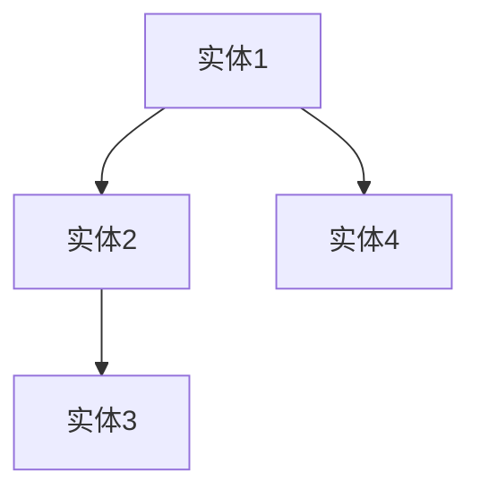

                 


# 基于图谱的AI Agent知识推理与问答

## 关键词：
- 图谱
- AI Agent
- 知识推理
- 问答系统
- 知识图谱
- 人工智能
- 自然语言处理

## 摘要：
本文详细探讨了基于图谱的AI Agent知识推理与问答系统的设计与实现。首先介绍了图谱和AI Agent的基本概念及其在知识推理与问答中的应用。接着深入分析了图谱的构建、知识表示与推理算法，重点阐述了基于图谱的推理方法及其在问答系统中的应用。然后从系统架构设计、接口设计、优化等方面详细讲解了AI Agent的知识推理与问答系统的实现。最后通过一个具体的项目实战案例，展示了如何基于图谱构建一个完整的知识推理与问答系统，并对系统进行优化与测试。本文还探讨了相关技术的最新进展与未来发展趋势。

---

# 第1章 基于图谱的AI Agent概述

## 1.1 问题背景

### 1.1.1 知识推理与问答的背景
知识推理是指通过已有的知识库或图谱，推导出新的事实或关系的过程。问答系统则是通过自然语言处理技术，理解用户的问题并从知识库中提取相关信息，生成准确的答案。随着人工智能技术的快速发展，知识推理与问答系统在教育、医疗、金融等领域发挥着越来越重要的作用。

### 1.1.2 图谱技术在知识推理中的作用
图谱是一种以图结构形式表示知识的技术，能够有效地表示实体之间的复杂关系。基于图谱的知识推理可以通过遍历图谱中的节点和边，找到实体之间的关系，从而推导出新的知识。图谱技术的引入使得知识推理更加高效和准确。

### 1.1.3 AI Agent在问答系统中的应用
AI Agent是一种能够自主感知环境并执行任务的智能体。在问答系统中，AI Agent可以通过分析用户的问题，结合知识库中的信息，生成准确的答案。AI Agent还可以通过学习和优化，不断提升问答系统的性能。

## 1.2 核心概念与定义

### 1.2.1 图谱的定义与特点
图谱是一种以图结构形式表示知识的技术，由节点和边组成。节点代表实体，边代表实体之间的关系。图谱具有以下特点：
1. **语义丰富**：能够表示实体之间的复杂关系。
2. **可扩展性**：可以方便地添加新的实体和关系。
3. **高效查询**：通过图谱遍历算法，可以快速查询实体之间的关系。

### 1.2.2 AI Agent的定义与功能
AI Agent是一种智能体，能够感知环境、执行任务并做出决策。AI Agent在问答系统中的主要功能包括：
1. **问题理解**：理解用户的问题意图。
2. **知识检索**：从知识库中检索相关信息。
3. **推理与生成**：根据检索到的信息进行推理，生成准确的答案。

### 1.2.3 知识推理与问答的定义
知识推理是指通过已有的知识库，推导出新的知识的过程。问答系统是一种人机交互系统，通过自然语言处理技术，理解用户的问题并生成准确的答案。

## 1.3 技术特点与优势

### 1.3.1 图谱技术的特点
1. **语义表示**：图谱能够通过节点和边表示实体及其关系，语义丰富。
2. **高效查询**：通过图谱遍历算法，可以高效地查询实体之间的关系。
3. **可扩展性**：图谱可以方便地扩展新的实体和关系。

### 1.3.2 AI Agent的优势
1. **自主性**：AI Agent能够自主感知环境并执行任务。
2. **智能性**：AI Agent能够通过学习和优化，不断提升性能。
3. **适应性**：AI Agent能够适应不同的环境和任务需求。

### 1.3.3 知识推理与问答的结合
1. **高效推理**：基于图谱的知识推理能够高效地推导出新的知识。
2. **准确回答**：结合AI Agent的问答系统能够生成准确的答案。
3. **智能交互**：基于图谱的AI Agent问答系统能够实现智能交互，提升用户体验。

## 1.4 主流模型与应用

### 1.4.1 图谱构建工具
1. **Neo4j**：一种基于图数据库的图谱构建工具。
2. **Ubergraph**：一种基于图结构的知识图谱构建工具。
3. **RDF4J**：一种基于RDF（Resource Description Framework）的图谱构建工具。

### 1.4.2 知识推理模型
1. **符号逻辑推理**：基于符号逻辑的推理方法。
2. **概率推理**：基于概率论的推理方法。
3. **图谱推理**：基于图谱结构的推理方法。

### 1.4.3 AI Agent问答系统
1. **基于规则的问答系统**：通过预定义的规则生成答案。
2. **基于检索的问答系统**：通过检索知识库生成答案。
3. **基于生成的问答系统**：通过生成模型生成答案。

## 1.5 本章小结
本章介绍了基于图谱的AI Agent知识推理与问答系统的基本概念、技术特点和主流模型。图谱技术能够有效地表示知识，AI Agent能够自主感知环境并执行任务，两者结合能够实现高效的知识推理与准确的问答。

---

# 第2章 图谱基础与知识表示

## 2.1 图谱的概念与构建

### 2.1.1 图谱的基本概念
图谱是一种以图结构形式表示知识的技术，由节点和边组成。节点代表实体，边代表实体之间的关系。图谱能够表示实体之间的复杂关系，语义丰富。

### 2.1.2 图谱的构建方法
图谱的构建方法包括：
1. **数据抽取**：从结构化数据中抽取实体和关系。
2. **数据融合**：将多个数据源中的实体和关系进行融合。
3. **数据存储**：将实体和关系存储在图数据库中。

### 2.1.3 图谱的存储与管理
图谱的存储与管理可以使用图数据库，如Neo4j、Neo5j等。图数据库能够高效地存储和查询图谱数据。

## 2.2 知识表示与图谱的关系

### 2.2.1 知识表示的基本形式
知识表示的基本形式包括：
1. **符号表示**：通过符号表示实体和关系。
2. **语义网络**：通过语义网络表示知识。
3. **图谱表示**：通过图谱表示知识。

### 2.2.2 图谱在知识表示中的作用
图谱能够通过节点和边表示实体及其关系，语义丰富。图谱的构建和存储能够为知识推理提供高效的支持。

### 2.2.3 图谱的扩展与应用
图谱的扩展与应用包括：
1. **实体扩展**：添加新的实体和关系。
2. **语义扩展**：通过语义分析扩展图谱。
3. **应用扩展**：将图谱应用于不同的领域。

## 2.3 图谱的属性与实体关系

### 2.3.1 实体的定义与分类
实体是指现实世界中的具体事物，可以分为人物、组织、地点、事件等类别。

### 2.3.2 关系的定义与类型
关系是指实体之间的联系，可以分为父子关系、并列关系、包含关系等类型。

### 2.3.3 图谱的实体关系图
通过Mermaid图可以清晰地展示图谱的实体关系。例如：



## 2.4 本章小结
本章介绍了图谱的基本概念、构建方法和知识表示。图谱能够有效地表示实体之间的关系，为知识推理提供了高效的支持。

---

# 第3章 知识推理与问答的核心算法

## 3.1 知识推理算法概述

### 3.1.1 符号逻辑推理
符号逻辑推理是一种基于符号逻辑的推理方法。例如：


符号逻辑推理可以通过规则生成答案。

### 3.1.2 概率推理
概率推理是一种基于概率论的推理方法。例如：

$$P(A|B) = \frac{P(B|A)P(A)}{P(B)}$$

概率推理可以通过贝叶斯网络进行。

### 3.1.3 图谱推理
图谱推理是一种基于图谱结构的推理方法。例如：


图谱推理可以通过图谱遍历算法进行。

## 3.2 基于图谱的推理算法

### 3.2.1 图谱遍历算法
图谱遍历算法包括深度优先搜索（DFS）和广度优先搜索（BFS）。例如：


### 3.2.2 最短路径算法
最短路径算法可以用于找到两个实体之间的最短路径。例如：

$$d(A, B) = \text{最短路径长度}$$

### 3.2.3 最大似然推理
最大似然推理是一种基于概率论的推理方法。例如：

$$P(A|B) = \frac{P(B|A)P(A)}{P(B)}$$

## 3.3 基于AI Agent的问答系统

### 3.3.1 问题理解与解析
问题理解与解析是问答系统的第一步。例如：

```python
def understand_question(question):
    # 分析问题并生成解析结果
    return result
```

### 3.3.2 知识检索与推理
知识检索与推理是问答系统的第二步。例如：

```python
def retrieve_and_reason(question, knowledge_base):
    # 从知识库中检索相关信息并进行推理
    return answer
```

### 3.3.3 结果生成与优化
结果生成与优化是问答系统的第三步。例如：

```python
def generate_answer(answer):
    # 生成最终答案并优化
    return optimized_answer
```

## 3.4 本章小结
本章介绍了知识推理与问答的核心算法，包括符号逻辑推理、概率推理和图谱推理。基于图谱的推理算法能够高效地进行知识推理，为问答系统提供了强有力的支持。

---

# 第4章 系统分析与架构设计

## 4.1 系统需求分析

### 4.1.1 功能需求
功能需求包括：
1. **知识库构建**：构建基于图谱的知识库。
2. **知识检索**：从知识库中检索相关信息。
3. **知识推理**：通过推理算法生成答案。
4. **问答交互**：实现人机交互问答功能。

### 4.1.2 性能需求
性能需求包括：
1. **查询效率**：快速响应用户查询。
2. **推理速度**：高效进行知识推理。
3. **扩展性**：支持大规模知识库扩展。

### 4.1.3 用户需求
用户需求包括：
1. **准确性**：生成准确的答案。
2. **响应速度**：快速响应用户查询。
3. **易用性**：用户友好的交互界面。

## 4.2 系统架构设计

### 4.2.1 分层架构
分层架构包括：
1. **数据层**：存储知识库数据。
2. **业务逻辑层**：处理业务逻辑。
3. **表示层**：与用户交互。

### 4.2.2 组件化架构
组件化架构包括：
1. **知识库组件**：负责知识库的构建和存储。
2. **推理组件**：负责知识推理。
3. **问答组件**：负责问答交互。

### 4.2.3 微服务架构
微服务架构包括：
1. **知识库服务**：提供知识库接口。
2. **推理服务**：提供推理接口。
3. **问答服务**：提供问答接口。

## 4.3 系统接口设计

### 4.3.1 API接口定义
API接口定义包括：
1. **GET /knowledgeBase**：获取知识库数据。
2. **POST /reasoning**：提交推理任务。
3. **POST /questionAnswering**：提交问答任务。

### 4.3.2 数据格式规范
数据格式规范包括：
1. **JSON格式**：知识库数据以JSON格式存储。
2. **GraphQL格式**：知识检索和推理接口使用GraphQL格式。

### 4.3.3 接口调用流程
接口调用流程包括：
1. **发起请求**：用户发起请求。
2. **处理请求**：系统处理请求。
3. **返回结果**：系统返回结果。

## 4.4 系统交互设计

### 4.4.1 用户交互流程
用户交互流程包括：
1. **用户提问**：用户提出问题。
2. **系统解析**：系统解析问题。
3. **知识检索**：系统检索相关信息。
4. **知识推理**：系统进行推理。
5. **生成答案**：系统生成答案。
6. **返回答案**：系统返回答案。

### 4.4.2 系统内部交互
系统内部交互包括：
1. **知识库调用**：推理组件调用知识库接口。
2. **推理调用**：问答组件调用推理接口。
3. **结果返回**：推理组件返回推理结果。

### 4.4.3 异常处理机制
异常处理机制包括：
1. **错误检测**：检测请求中的错误。
2. **错误处理**：处理检测到的错误。
3. **反馈用户**：将错误信息反馈给用户。

## 4.5 本章小结
本章介绍了系统的需求分析和架构设计，包括分层架构、组件化架构和微服务架构。系统接口设计和交互设计也进行了详细说明，为后续的系统实现提供了指导。

---

# 第5章 项目实战与实现

## 5.1 环境配置与安装

### 5.1.1 开发环境搭建
开发环境包括：
1. **操作系统**：建议使用Linux或MacOS。
2. **编程语言**：建议使用Python。
3. **图数据库**：建议使用Neo4j。

### 5.1.2 依赖库安装
依赖库安装包括：
1. **Neo4j**：图数据库。
2. **PythonNeo4j**：Python连接Neo4j的库。
3. **networkx**：图结构分析库。

### 5.1.3 数据集准备
数据集准备包括：
1. **知识库数据**：构建基于图谱的知识库。
2. **问答数据**：准备问答对数据。

## 5.2 系统核心实现

### 5.2.1 知识库构建
知识库构建包括：
1. **数据抽取**：从结构化数据中抽取实体和关系。
2. **数据融合**：将多个数据源中的实体和关系进行融合。
3. **数据存储**：将实体和关系存储在图数据库中。

### 5.2.2 知识检索
知识检索包括：
1. **查询解析**：解析用户的查询。
2. **图谱遍历**：通过图谱遍历算法找到相关实体。
3. **结果筛选**：筛选出最相关的实体和关系。

### 5.2.3 知识推理
知识推理包括：
1. **推理规则定义**：定义推理规则。
2. **推理算法实现**：实现图谱遍历算法。
3. **推理结果生成**：生成推理结果。

### 5.2.4 问答交互
问答交互包括：
1. **问题解析**：解析用户的问题。
2. **知识检索**：从知识库中检索相关信息。
3. **推理与生成**：通过推理生成答案。
4. **结果返回**：将答案返回给用户。

## 5.3 代码实现与解读

### 5.3.1 知识库构建代码
```python
from neo4j import GraphDatabase
from neo4j.exceptions import ServiceUnavailable

class KnowledgeBase:
    def __init__(self, uri, user, password):
        self.driver = GraphDatabase.driver(uri, auth=(user, password))
    
    def close(self):
        self.driver.close()
    
    def create_entity(self, entity_type, entity_name):
        with self.driver.session() as session:
            session.run("CREATE (n:%s {name: '%s'})" % (entity_type, entity_name))
    
    def create_relation(self, entity1, relation, entity2):
        with self.driver.session() as session:
            session.run("MATCH (a), (b) WHERE a.name = '%s' AND b.name = '%s' CREATE (a)-[r:%s]->(b)" % (entity1, entity2, relation))
```

### 5.3.2 推理算法实现代码
```python
def shortest_path(A, B, graph):
    visited = set()
    queue = [(A, [A])]
    while queue:
        node, path = queue.pop(0)
        if node == B:
            return path
        if node in visited:
            continue
        visited.add(node)
        for neighbor in graph[node]:
            if neighbor not in visited:
                queue.append((neighbor, path + [neighbor]))
    return None
```

### 5.3.3 问答交互代码
```python
def ask(question, knowledge_base):
    entities = extract_entities(question)
    relations = extract_relations(question)
    path = knowledge_base.find_relation_path(entities[0], relations[0], entities[1])
    if path:
        return generate_answer(path)
    else:
        return "抱歉，无法找到相关答案。"
```

## 5.4 项目小结
本章通过一个具体的项目实战，详细讲解了基于图谱的AI Agent知识推理与问答系统的实现。从环境配置到代码实现，从知识库构建到问答交互，全面展示了系统的实现过程。

---

# 第6章 高级主题与未来趋势

## 6.1 图谱与AI Agent的结合

### 6.1.1 图谱的可解释性
图谱的可解释性是指图谱能够清晰地表示实体之间的关系，使得推理过程易于解释。

### 6.1.2 AI Agent的自主性
AI Agent的自主性是指AI Agent能够自主感知环境并执行任务，无需人工干预。

## 6.2 多模态图谱与问答系统

### 6.2.1 多模态图谱
多模态图谱是指同时包含文本、图像、语音等多种模态数据的图谱。

### 6.2.2 多模态问答系统
多模态问答系统是指能够处理多种模态数据的问答系统，例如图像问答、语音问答等。

## 6.3 图谱的分布式与可扩展性

### 6.3.1 分布式图谱
分布式图谱是指将图谱数据分布存储在多个节点上，通过分布式计算进行推理。

### 6.3.2 图谱的可扩展性
图谱的可扩展性是指图谱能够方便地扩展新的实体和关系。

## 6.4 伦理与安全问题

### 6.4.1 数据隐私
数据隐私是指保护用户的隐私数据不被滥用。

### 6.4.2 算法透明性
算法透明性是指算法的运行过程透明，能够被用户理解和监督。

## 6.5 本章小结
本章探讨了图谱与AI Agent结合的高级主题，包括图谱的可解释性、多模态图谱、分布式图谱以及伦理与安全问题。未来，随着技术的不断发展，基于图谱的AI Agent知识推理与问答系统将更加智能化和人性化。

---

# 结语

基于图谱的AI Agent知识推理与问答系统是一种结合了图谱技术与人工智能技术的先进系统。通过图谱技术，系统能够高效地表示和推理知识；通过AI Agent技术，系统能够自主感知环境并执行任务。本文详细探讨了基于图谱的AI Agent知识推理与问答系统的实现，从理论到实践，从基础到高级，全面展示了系统的实现过程和未来发展趋势。

---

# 作者：AI天才研究院/AI Genius Institute & 禅与计算机程序设计艺术 /Zen And The Art of Computer Programming

