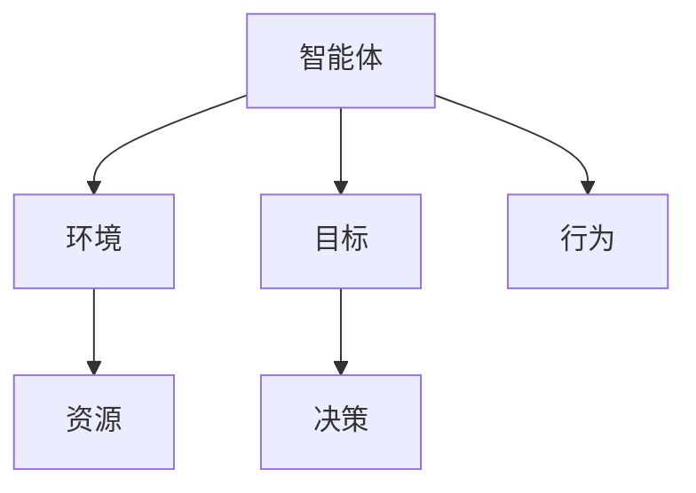
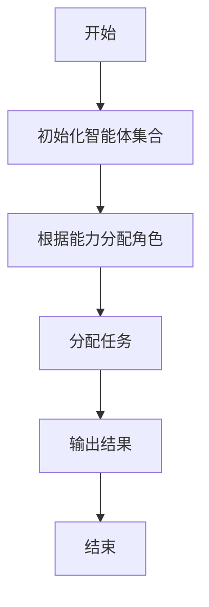
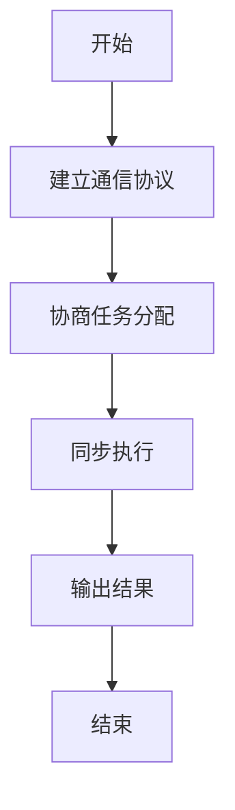
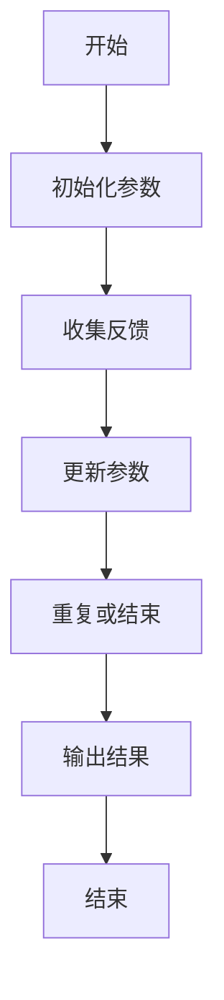
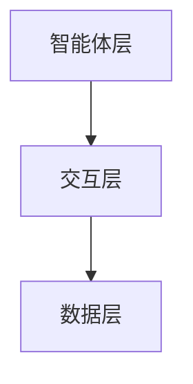
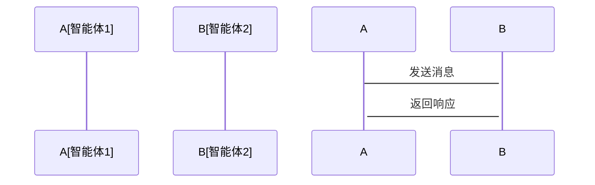

                 


# 多智能体系统分析全球经济联系

> **关键词**: 多智能体系统, 经济建模, 全球经济联系, 复杂系统分析, 人工智能, 经济预测, 系统架构设计  
> **摘要**: 本文通过多智能体系统（MAS）的视角，分析全球经济联系的复杂性，探讨如何利用MAS建模方法进行经济分析。文章从MAS的基本概念出发，详细阐述其在经济建模中的应用，结合具体的算法和数学模型，分析全球经济联系的动态变化。最后，通过实际案例展示MAS在经济预测和政策制定中的潜力。

---

## 第一部分: 多智能体系统与全球经济联系的背景介绍

### 第1章: 多智能体系统与全球经济联系概述

#### 1.1 多智能体系统的基本概念
##### 1.1.1 多智能体系统的定义
多智能体系统（Multi-Agent System, MAS）是由多个智能体（Agent）组成的复杂系统，这些智能体能够通过交互和协作完成特定目标。每个智能体都有一定的自主性，能够感知环境、做出决策并采取行动。

##### 1.1.2 多智能体系统的特征
- **分布性**：智能体独立运行，分布在网络中。
- **交互性**：智能体之间通过通信进行交互。
- **协作性**：智能体通过协作完成共同目标。
- **动态性**：系统状态随智能体行为变化而动态调整。

##### 1.1.3 多智能体系统与传统经济模型的区别
传统经济模型通常基于假设和均衡分析，而MAS能够模拟现实经济中的复杂互动，更贴近实际经济运行。

#### 1.2 全球经济联系的复杂性
##### 1.2.1 全球经济系统的定义
全球经济系统是由各国、企业和个人等经济主体组成的复杂网络，这些主体通过贸易、投资和金融市场相互联系。

##### 1.2.2 经济主体之间的关系
经济主体之间的关系包括竞争、合作、交易等，这些关系构成了全球经济的复杂性。

##### 1.2.3 全球经济联系的复杂性与挑战
全球经济联系涉及众多利益相关者，其复杂性使得传统模型难以全面捕捉所有变量之间的关系。

#### 1.3 多智能体系统在经济分析中的应用
##### 1.3.1 多智能体系统在经济建模中的优势
MAS能够模拟经济主体的微观行为，捕捉系统动态，提供更精准的经济预测。

##### 1.3.2 全球经济联系的多智能体建模思路
通过MAS建模，可以将全球经济主体分解为多个智能体，模拟它们之间的互动和影响。

##### 1.3.3 多智能体系统分析的现实意义
MAS为全球经济分析提供了新的工具和方法，有助于理解复杂的经济现象和制定有效的政策。

#### 1.4 本章小结
本章介绍了多智能体系统的基本概念和全球经济联系的复杂性，阐述了MAS在经济分析中的优势和应用。

---

## 第二部分: 多智能体系统的核心概念与联系

### 第2章: 多智能体系统的原理与特征

#### 2.1 多智能体系统的原理
##### 2.1.1 智能体的基本构成
智能体由感知、决策、行动三个部分组成，能够独立完成任务。

##### 2.1.2 智能体的环境与交互机制
智能体通过传感器感知环境，通过通信模块与其他智能体交互。

##### 2.1.3 智能体的决策与行为规则
智能体基于自身目标和环境信息，制定决策并采取行动。

#### 2.2 多智能体系统的特征对比
##### 2.2.1 多智能体系统与单智能体系统的对比
| 特性 | 单智能体系统 | 多智能体系统 |
|------|--------------|--------------|
| 独立性 | 高度集中     | 分散         |
| 交互性 | 无           | 高           |

##### 2.2.2 多智能体系统的属性特征
- **自主性**：智能体能够自主决策。
- **反应性**：智能体能够实时感知环境并做出反应。
- **协作性**：智能体之间能够协作完成任务。

##### 2.2.3 多智能体系统的复杂性分析
MAS的复杂性来源于智能体数量的多、行为的多样性和交互的频繁性。

#### 2.3 多智能体系统的ER实体关系图


#### 2.4 本章小结
本章详细讲解了多智能体系统的原理和特征，并通过ER图展示了MAS的核心构成。

---

## 第三部分: 多智能体系统的算法原理

### 第3章: 多智能体系统的算法与实现

#### 3.1 多智能体系统中的主体选择算法
##### 3.1.1 主体选择算法的定义
主体选择算法用于确定MAS中智能体的角色和任务分配。

##### 3.1.2 主体选择算法的实现步骤
1. 初始化智能体集合。
2. 根据智能体的能力和目标分配角色。
3. 确定任务分配方案。
4. 输出结果。

##### 3.1.3 主体选择算法的流程图


##### 3.1.4 主体选择算法的Python实现
```python
class Agent:
    def __init__(self, id, capability):
        self.id = id
        self.capability = capability

def select_agents(agents, task):
    selected = []
    for agent in agents:
        if agent.capability >= task_requirement:
            selected.append(agent.id)
    return selected

# 示例用法
agents = [Agent(1, 0.8), Agent(2, 0.6), Agent(3, 0.9)]
task_requirement = 0.7
selected_ids = select_agents(agents, task_requirement)
print("Selected agents:", selected_ids)
```

#### 3.2 多智能体系统的协调机制
##### 3.2.1 协调机制的定义
协调机制用于确保智能体之间的协作和一致性。

##### 3.2.2 协调机制的实现方法
1. 建立通信协议。
2. 设计协商算法。
3. 实现同步机制。

##### 3.2.3 协调机制的流程图


##### 3.2.4 协调机制的Python实现
```python
class Communicator:
    def send_message(self, sender, receiver, message):
        print(f"Message from {sender} to {receiver}: {message}")

class Agent:
    def __init__(self, id):
        self.id = id
        self.communicator = Communicator()

# 示例用法
agent1 = Agent(1)
agent2 = Agent(2)
agent1.communicator.send_message(agent1.id, agent2.id, "协作完成任务")
```

#### 3.3 多智能体系统的学习算法
##### 3.3.1 学习算法的定义
学习算法用于智能体通过经验改进性能。

##### 3.3.2 学习算法的实现步骤
1. 初始化智能体参数。
2. 收集环境反馈。
3. 更新参数。
4. 重复步骤2-3。

##### 3.3.3 学习算法的流程图


##### 3.3.4 学习算法的Python实现
```python
class Learner:
    def __init__(self, parameters):
        self.parameters = parameters

    def update_parameters(self, feedback):
        self.parameters += feedback * 0.1

# 示例用法
learner = Learner([0.5, 0.3])
feedback = [0.2, -0.1]
learner.update_parameters(feedback)
print("Updated parameters:", learner.parameters)
```

#### 3.4 本章小结
本章详细讲解了多智能体系统中的主体选择算法、协调机制和学习算法，并通过代码示例展示了实现过程。

---

## 第四部分: 多智能体系统的数学模型

### 第4章: 多智能体系统的数学模型与分析

#### 4.1 多智能体系统的数学模型
##### 4.1.1 多智能体系统的收益函数
收益函数表示智能体通过行动获得的收益，公式为：
$$ R_i = \sum_{j=1}^{n} \alpha_{ij} \cdot a_j $$
其中，$R_i$ 是智能体i的收益，$\alpha_{ij}$ 是权重系数，$a_j$ 是行动变量。

##### 4.1.2 多智能体系统的约束条件
约束条件包括资源限制、时间和空间限制等，可以用以下不等式表示：
$$ \sum_{i=1}^{m} x_i \leq C $$
其中，$x_i$ 是智能体i的资源分配，$C$ 是总资源限制。

##### 4.1.3 多智能体系统的均衡分析
纳什均衡是MAS中的一个重要概念，表示在给定其他智能体策略的情况下，智能体无法通过单方面改变策略而提高收益的状态。

#### 4.2 多智能体系统的博弈论模型
##### 4.2.1 多智能体系统的博弈论基础
博弈论是分析智能体互动的重要工具，主要包括零和博弈和非零和博弈。

##### 4.2.2 多智能体系统的纳什均衡分析
纳什均衡的条件可以用以下公式表示：
$$ \forall i, u_i(a_i, a_{-i}) \geq u_i(a_i', a_{-i}) $$
其中，$u_i$ 是智能体i的效用函数，$a_i$ 是当前策略，$a_i'$ 是其他策略。

##### 4.2.3 多智能体系统的博弈论模型实现
```python
def nash_equilibrium(agents, strategies):
    # 检查每个策略是否是纳什均衡
    for i in range(len(agents)):
        agent = agents[i]
        current_strategy = strategies[i]
        for s in agent.strategies:
            if s != current_strategy:
                if agent.utility(s, strategies) > agent.utility(current_strategy, strategies):
                    return False
    return True
```

#### 4.3 本章小结
本章通过数学模型分析了多智能体系统的收益函数、约束条件和纳什均衡，并展示了博弈论模型的实现。

---

## 第五部分: 多智能体系统的系统分析与架构设计

### 第5章: 多智能体系统的系统分析与架构设计

#### 5.1 系统分析
##### 5.1.1 问题场景介绍
全球经济系统中，各国、企业和个人之间的互动复杂，需要通过MAS进行建模和分析。

##### 5.1.2 项目介绍
本项目旨在利用MAS模拟全球经济主体的互动，分析经济动态。

##### 5.1.3 系统功能设计
系统功能包括智能体建模、交互模拟和结果分析。

#### 5.2 系统架构设计
##### 5.2.1 系统架构的分层设计
MAS的架构通常分为智能体层、交互层和数据层。

##### 5.2.2 系统架构的Mermaid图


##### 5.2.3 系统架构的实现
系统架构设计需要考虑通信协议、数据存储和计算资源分配。

#### 5.3 系统接口设计
##### 5.3.1 系统接口的定义
系统接口包括智能体通信接口和用户界面接口。

##### 5.3.2 系统接口的实现
通信接口可以使用REST API或消息队列实现。

##### 5.3.3 系统接口的交互序列图


#### 5.4 本章小结
本章通过系统分析和架构设计，展示了如何利用MAS模拟全球经济互动。

---

## 第六部分: 多智能体系统的项目实战

### 第6章: 多智能体系统的项目实战

#### 6.1 环境安装与配置
##### 6.1.1 环境需求
需要安装Python、相关库（如`networkx`、`matplotlib`）和开发工具。

##### 6.1.2 环境配置
安装必要的库：
```bash
pip install networkx matplotlib
```

#### 6.2 系统核心实现
##### 6.2.1 智能体类的实现
```python
class Agent:
    def __init__(self, id, strategy):
        self.id = id
        self.strategy = strategy
```

##### 6.2.2 交互机制的实现
```python
class Communicator:
    def send(self, sender, receiver, message):
        print(f"{sender} -> {receiver}: {message}")
```

##### 6.2.3 数值模拟的实现
```python
import networkx as nx
import matplotlib.pyplot as plt

def visualize_graph(edges):
    G = nx.DiGraph()
    G.add_edges_from(edges)
    nx.draw(G, with_labels=True, node_color='red', edge_color='blue')
    plt.show()
```

#### 6.3 代码实现与解读
##### 6.3.1 智能体网络的构建
```python
edges = [(1, 2), (2, 3), (3, 4)]
visualize_graph(edges)
```

##### 6.3.2 交互机制的模拟
```python
communicator = Communicator()
communicator.send(1, 2, "进行交易")
communicator.send(2, 3, "提供支持")
```

##### 6.3.3 数值模拟与结果分析
通过数值模拟，可以观察智能体之间的互动对全球经济的影响。

#### 6.4 实际案例分析
##### 6.4.1 案例介绍
以国际贸易中的价格协调问题为例，展示MAS的应用。

##### 6.4.2 案例分析与解读
分析智能体在价格协调中的互动过程。

##### 6.4.3 案例结果与讨论
通过MAS模拟，可以发现价格协调的动态过程和影响因素。

#### 6.5 本章小结
本章通过实际案例展示了MAS在经济分析中的应用，并讨论了模拟结果的意义。

---

## 第七部分: 总结与展望

### 第7章: 总结与展望

#### 7.1 本章总结
本文通过MAS的视角，分析了全球经济联系的复杂性，并展示了如何利用MAS进行经济建模和分析。

#### 7.2 未来展望
未来的研究可以进一步探讨MAS在经济预测、政策模拟和风险管理中的应用。

#### 7.3 小结
MAS为全球经济分析提供了新的工具和方法，具有广阔的应用前景。

---

## 作者信息

作者：AI天才研究院/AI Genius Institute & 禅与计算机程序设计艺术 /Zen And The Art of Computer Programming

