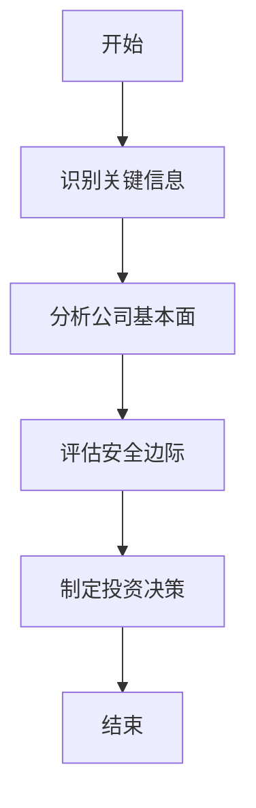
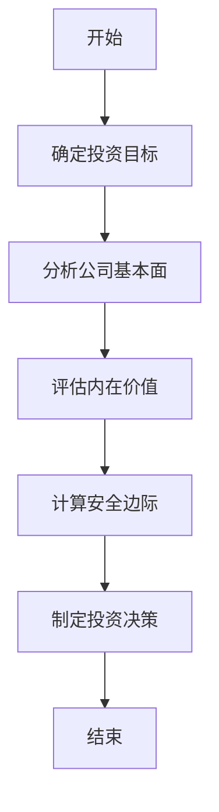
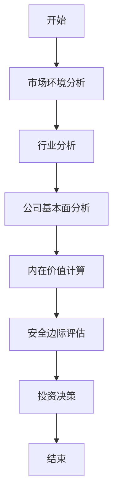
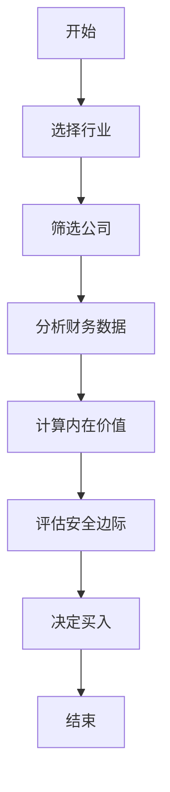
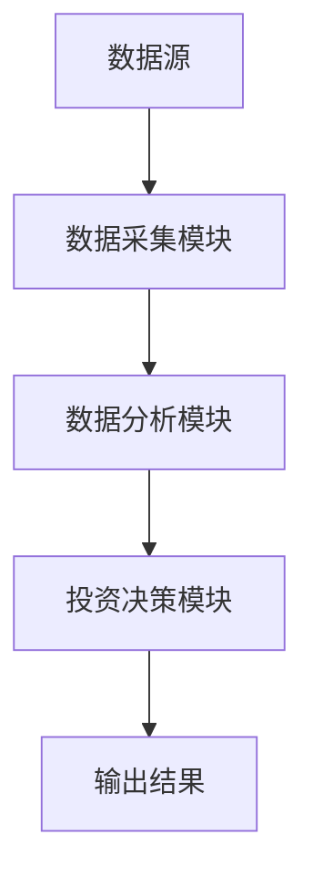
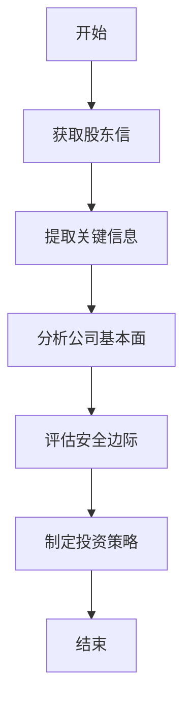

                 


# 巴菲特的股东信中的投资智慧

## 关键词：
- 价值投资
- 巴菲特
- 股东信
- 投资智慧
- 投资策略
- 安全边际
- 护城河

## 摘要：
本文深入分析了巴菲特在股东信中所阐述的投资智慧，探讨了其核心理念、方法和策略。通过结合技术语言和专业分析，文章详细解读了价值投资、安全边际、护城河等关键概念，并通过系统架构、数学模型和实际案例，展示了如何将这些投资智慧应用于实际投资决策中。文章结构清晰，内容详实，旨在为读者提供一个全面而深入的视角，理解巴菲特的投资哲学及其在现代投资中的重要意义。

---

# 第一部分：巴菲特投资智慧的背景与核心理念

## 第1章：巴菲特投资智慧的背景与演变

### 1.1 巴菲特投资理念的起源

#### 1.1.1 价值投资的起源与发展
价值投资是一种基于对公司内在价值评估的投资策略，起源于20世纪初。本杰明·格雷厄姆和戴维·多德是这一理念的奠基人。巴菲特早期的投资理念深受格雷厄姆影响，但后来发展出自己的独特方法。

- **核心概念**：价值投资强调以低于公司内在价值的价格买入股票。
- **发展历程**：从格雷厄姆的“烟屁股”投资法到巴菲特的长期价值投资。

#### 1.1.2 巴菲特的投资哲学与导师影响
巴菲特的投资哲学深受本杰明·格雷厄姆的影响，同时吸收了查理·芒格的多元思维模型。

- **投资哲学**：
  1. 买入并持有优质资产。
  2. 专注于企业的基本面，而非市场波动。
  3. 坚持安全边际，避免永久性本金损失。

- **导师影响**：
  - 格雷厄姆：教会巴菲特如何计算内在价值。
  - 芒格：提供跨学科的思维方式，强调理性与逻辑。

#### 1.1.3 股东信的背景与意义
巴菲特每年都会在伯克希尔·哈撒韦公司年报中撰写股东信，向股东分享公司经营情况和投资理念。

- **股东信的价值**：
  - 提供了巴菲特的投资思路和决策依据。
  - 展示了伯克希尔的长期投资策略和风险管理方法。
  - 为投资者提供了学习价值投资的宝贵材料。

### 1.2 巴菲特投资智慧的核心要素

#### 1.2.1 价值投资的核心概念
价值投资的核心在于寻找市场定价低于公司内在价值的股票。

- **内在价值公式**：
  $$ \text{内在价值} = \frac{\text{未来现金流}}{\text{折现率}} $$
- **安全边际**：
  买入价格低于内在价值，以确保即使出现误差，也能获得正收益。

#### 1.2.2 投资的三大核心原则
1. **价格合理**：买入价格低于内在价值。
2. **竞争优势**：投资具有宽护城河的企业。
3. **长期持有**：避免频繁交易，长期持有优质资产。

#### 1.2.3 股东信的信息与决策
股东信中包含丰富的信息，如公司财务数据、投资策略、市场观点等。

- **信息提取**：
  - 财务数据：收入、利润、现金流。
  - 投资策略：买入逻辑、卖出逻辑。
  - 风险管理：如何应对市场波动。

### 1.3 巴菲特投资智慧的现代意义

#### 1.3.1 价值投资的现代适应性
尽管市场环境变化，但价值投资的核心理念依然适用。

- **适应性分析**：
  - 在科技股占主导的市场中，依然可以找到被低估的优质企业。
  - 数字化工具可以帮助投资者更高效地分析公司基本面。

#### 1.3.2 对个人投资者的启示
- **理性决策**：避免情绪化交易。
- **长期视角**：关注企业的长期价值，而非短期波动。
- **持续学习**：通过股东信和其他渠道不断学习投资知识。

#### 1.3.3 股东信的长期影响
- **知识传承**：股东信为后来的投资者提供了宝贵的经验和教训。
- **投资教育**：许多投资者通过研究股东信自学成才。

### 1.4 本章小结
本章介绍了巴菲特投资智慧的背景与演变，揭示了其核心理念和股东信的重要性。通过分析价值投资的核心要素，我们理解了巴菲特投资方法的逻辑与实践。

---

## 第2章：巴菲特投资智慧的核心概念与联系

### 2.1 价值投资的核心原理

#### 2.1.1 价值投资的定义与核心要素
- **定义**：价值投资是一种基于对公司内在价值评估的投资方法。
- **核心要素**：
  1. 公司基本面：收入、利润、现金流。
  2. 市场价格：买入价格低于内在价值。
  3. 安全边际：买入价格与内在价值的差距。

#### 2.1.2 价值投资与成长投资的对比
| 对比维度 | 价值投资 | 成长投资 |
|----------|-----------|----------|
| 目标     | 买入低估资产 | 投资高增长企业 |
| 风险     | 低       | 高       |
| 持股时间 | 长       | 长       |

#### 2.1.3 价值投资的数学模型与公式
- **内在价值公式**：
  $$ \text{内在价值} = \sum_{t=1}^{n} \frac{\text{CF}_t}{(1+r)^t} $$
  其中，CF_t为第t年的现金流，r为折现率。

### 2.2 安全边际与护城河分析

#### 2.2.1 安全边际的定义与作用
- **定义**：买入价格低于内在价值，以确保即使估值有误，也能获得正收益。
- **作用**：降低投资风险，提供价格波动的缓冲区。

#### 2.2.2 护城河的五种类型与分析
- **五种类型**：
  1. **成本优势**：企业生产成本低于竞争对手。
  2. **品牌优势**：强大的品牌认知度。
  3. **网络效应**：用户越多，平台价值越高。
  4. **技术壁垒**：拥有独特的专利或技术。
  5. **政策壁垒**：行业监管或政策保护。

#### 2.2.3 安全边际与护城河的对比
| 对比维度 | 安全边际 | 护城河 |
|----------|----------|--------|
| 目的     | 避免估值错误 | 确保竞争优势 |
| 作用     | 降低价格风险 | 提高市场地位 |

### 2.3 股东信中的信息提取与分析

#### 2.3.1 股东信中的关键信息识别
- **关键信息**：
  - 公司财务数据。
  - 投资策略与逻辑。
  - 市场观点与风险提示。

#### 2.3.2 股东信信息的ER实体关系图
```mermaid
erDiagram
    customer[投资者] 
    company[企业]
    report[股东信]
    customer --> report : 获取信息
    company --> report : 提供信息
    report --> customer : 信息传递
```

#### 2.3.3 股东信信息的分析流程图


### 2.4 本章小结
本章详细分析了价值投资的核心原理、安全边际与护城河的概念，并展示了如何从股东信中提取信息进行分析。通过对比分析，我们理解了这些概念之间的联系及其在实际投资中的应用。

---

## 第3章：巴菲特投资智慧的算法原理与数学模型

### 3.1 价值投资的算法流程

#### 3.1.1 价值投资的步骤分解


#### 3.1.2 价值投资的决策树分析


#### 3.1.3 价值投资的流程图展示


### 3.2 股东信分析的数学模型

#### 3.2.1 企业估值的数学公式
- **内在价值公式**：
  $$ \text{内在价值} = \sum_{t=1}^{n} \frac{\text{CF}_t}{(1+r)^t} $$
  其中，CF_t为第t年的自由现金流，r为折现率。

#### 3.2.2 投资组合优化的数学模型
- **投资组合优化**：
  $$ \text{收益} = \sum_{i=1}^{n} w_i \times r_i $$
  $$ \text{风险} = \sum_{i=1}^{n} w_i^2 \times \sigma_i^2 $$
  其中，w_i为资产i的权重，r_i为资产i的预期收益，σ_i为资产i的风险。

#### 3.2.3 风险评估的数学公式
- **夏普比率**：
  $$ \text{夏普比率} = \frac{\text{收益} - \text{无风险利率}}{\text{标准差}} $$

### 3.3 算法原理的详细讲解

#### 3.3.1 价值投资的数学推导
- **内在价值计算**：
  假设一家公司未来5年的现金流分别为100、120、140、160、180，折现率为10%。
  $$ \text{内在价值} = \frac{100}{1.1} + \frac{120}{1.1^2} + \frac{140}{1.1^3} + \frac{160}{1.1^4} + \frac{180}{1.1^5} \approx 477.12 $$

#### 3.3.2 安全边际的计算方法
- **安全边际公式**：
  $$ \text{安全边际} = \text{内在价值} - \text{市场价格} $$
  如果市场价格为400，内在价值为477.12，则安全边际为77.12。

#### 3.3.3 投资组合优化的案例分析
- **案例**：
  投资组合包含股票A和债券B，权重分别为60%和40%。
  - 股票A的预期收益为12%，标准差为20%。
  - 债券B的预期收益为5%，标准差为8%。
  $$ \text{投资组合收益} = 0.6 \times 12\% + 0.4 \times 5\% = 9.2\% $$
  $$ \text{投资组合风险} = \sqrt{(0.6)^2 \times 20\%^2 + (0.4)^2 \times 8\%^2} \approx 12.64\% $$

### 3.4 本章小结
本章通过算法流程图和数学公式，详细讲解了价值投资的算法原理和数学模型。通过案例分析，我们理解了如何将这些理论应用于实际投资决策中。

---

## 第4章：巴菲特投资智慧的系统分析与架构设计

### 4.1 投资决策的系统架构

#### 4.1.1 投资决策的系统功能模块
- **功能模块**：
  1. 数据采集：获取公司财务数据。
  2. 数据分析：计算内在价值和安全边际。
  3. 投资决策：基于分析结果制定投资策略。

#### 4.1.2 投资决策的系统架构图


#### 4.1.3 系统功能模块的详细描述
- **数据采集模块**：
  - 从公司财报中提取收入、利润、现金流等数据。
- **数据分析模块**：
  - 计算内在价值和安全边际。
- **投资决策模块**：
  - 基于分析结果制定买入、卖出或持有策略。

### 4.2 股东信分析的系统设计

#### 4.2.1 股东信分析的流程设计


#### 4.2.2 股东信分析的接口设计
- **接口设计**：
  - 输入：股东信文本。
  - 输出：公司基本面分析、内在价值计算、投资建议。

#### 4.2.3 股东信分析的交互设计
- **交互流程**：
  1. 用户输入股东信文本。
  2. 系统提取关键信息并分析。
  3. 用户查看分析结果并制定投资策略。

### 4.3 本章小结
本章通过系统架构设计和流程图展示，详细讲解了如何将巴菲特的投资智慧应用于实际投资决策中。通过系统的功能模块和接口设计，我们理解了投资决策的系统化过程。

---

## 第5章：巴菲特投资智慧的项目实战

### 5.1 项目环境与工具安装

#### 5.1.1 项目环境的搭建
- **环境要求**：
  - 操作系统：Windows/Mac/Linux。
  - 软件工具：Python、Jupyter Notebook、文本编辑器。

#### 5.1.2 分析工具的安装与配置
- **工具安装**：
  - Python：安装Anaconda或Miniconda。
  - Jupyter Notebook：通过pip安装。
  - 文本处理工具：使用Python的nltk库或Gensim库。

#### 5.1.3 数据源的获取与处理
- **数据获取**：
  - 从伯克希尔·哈撒韦公司官网获取股东信。
  - 从公开财报中获取公司财务数据。

### 5.2 核心代码实现

#### 5.2.1 价值投资模型的代码实现
```python
def calculate_intrinsic_value(cash_flows, discount_rate):
    intrinsic_value = 0
    for t in range(len(cash_flows)):
        intrinsic_value += cash_flows[t] / (1 + discount_rate) ** t
    return intrinsic_value

# 示例
cash_flows = [100, 120, 140, 160, 180]
discount_rate = 0.1
iv = calculate_intrinsic_value(cash_flows, discount_rate)
print(f"内在价值：{iv}")
```

#### 5.2.2 股东信信息提取的代码实现
```python
from nltk.tokenize import word_tokenize
from collections import Counter

text = " Berkshire Hathaway's股东信内容..."
tokens = word_tokenize(text)
word_counts = Counter(tokens)
print(word_counts)
```

### 5.3 项目实战的案例分析

#### 5.3.1 案例选择
- **案例**：分析伯克希尔·哈撒韦的投资决策。
- **数据**：2020年的股东信和公司财报。

#### 5.3.2 投资决策的详细步骤
1. **提取关键信息**：收入、利润、现金流。
2. **计算内在价值**：使用现金流贴现模型。
3. **评估安全边际**：比较市场价格与内在价值。
4. **制定投资策略**：基于分析结果做出买入、卖出或持有的决策。

### 5.4 本章小结
本章通过项目实战，展示了如何将巴菲特的投资智慧应用于实际投资决策中。通过代码实现和案例分析，我们理解了价值投资在实际操作中的具体步骤和方法。

---

## 第6章：最佳实践与注意事项

### 6.1 最佳实践

#### 6.1.1 投资策略的注意事项
- **分散投资**：避免过度集中。
- **长期持有**：耐心持有优质资产。
- **持续学习**：不断提升自己的知识和能力。

#### 6.1.2 投资心态的调整
- **避免贪婪与恐惧**：保持理性和耐心。
- **坚持长期主义**：关注企业的长期价值。

#### 6.1.3 风险管理的技巧
- **设定止损**：避免重大损失。
- **定期复盘**：评估投资决策的正确性。

### 6.2 拓展阅读

#### 6.2.1 经典书籍推荐
- 《巴菲特致股东的信》
- 《价值投资实战策略》
- 《投资的艺术》

#### 6.2.2 在线资源推荐
- 巴菲特股东信的中文翻译与解读。
- 投资论坛和社区，如雪球、东方财富网。

### 6.3 本章小结
本章总结了巴菲特投资智慧的最佳实践和注意事项，并推荐了一些拓展阅读的资源。通过这些实践和注意事项，我们可以更好地应用巴菲特的投资智慧，做出更明智的投资决策。

---

## 第7章：总结与展望

### 7.1 本章总结
本文系统地分析了巴菲特在股东信中所阐述的投资智慧，从核心理念到实际应用，详细解读了价值投资、安全边际、护城河等关键概念。通过算法原理、数学模型和实际案例，我们理解了如何将这些智慧应用于现代投资决策中。

### 7.2 未来展望
随着市场的变化和技术的发展，价值投资的理念和方法也在不断进化。未来，我们可以通过人工智能和大数据技术，进一步优化投资决策过程，提升投资效率和准确性。

---

## 作者：AI天才研究院/AI Genius Institute & 禅与计算机程序设计艺术/Zen And The Art of Computer Programming

---

通过以上结构和内容，我们希望为读者提供一个全面而深入的视角，理解巴菲特的投资智慧及其在现代投资中的应用。

