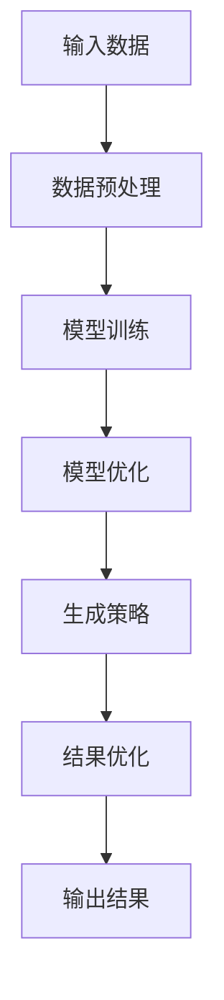
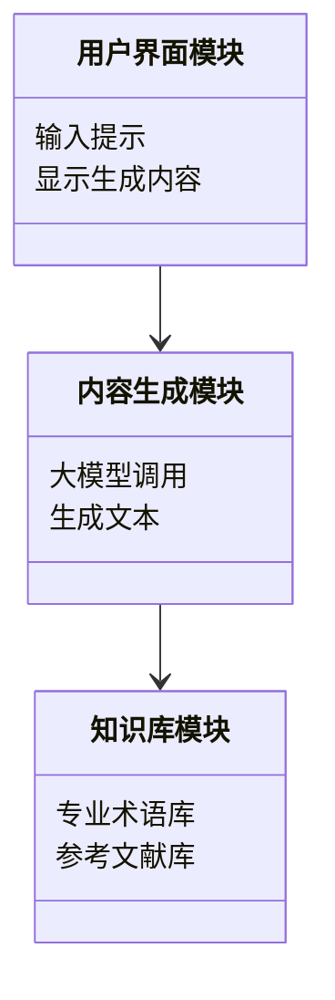
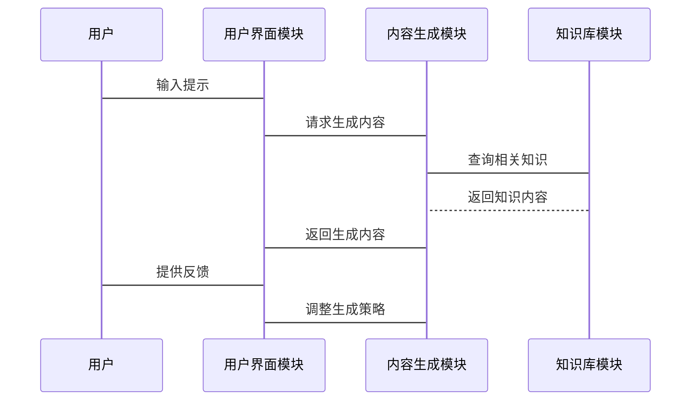
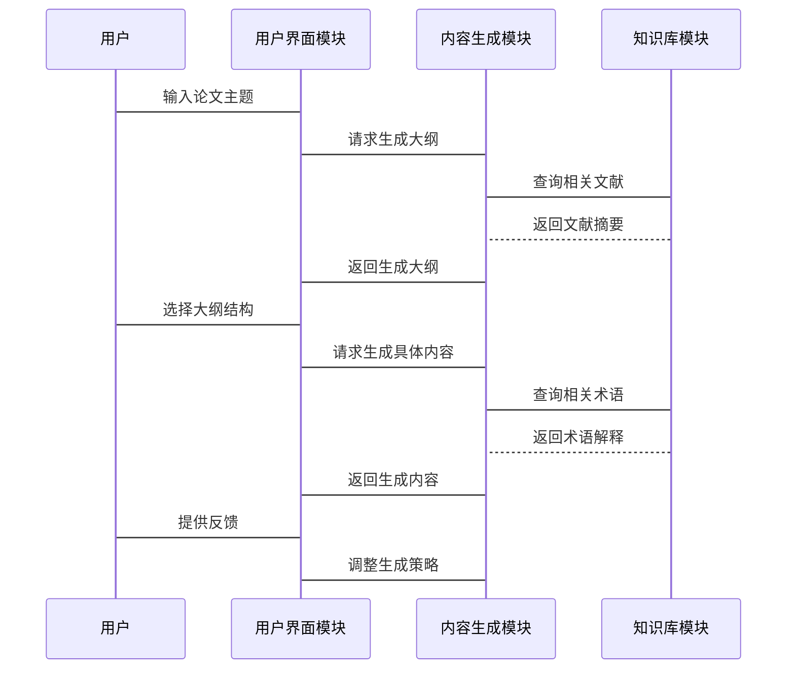

                 


# 开发基于大模型的金融专业论文写作辅助系统

> 关键词：大模型，金融专业论文，论文写作辅助系统，自然语言处理，AI写作工具

> 摘要：本文详细探讨了基于大模型的金融专业论文写作辅助系统的开发过程，从问题背景、系统架构、算法原理到项目实战，系统地分析了该系统的核心技术和实现方法。文章重点介绍了大模型在论文写作中的应用，详细阐述了系统功能设计、算法实现和系统架构，并通过实际案例展示了系统的应用效果。本文还总结了开发经验，并对未来的发展方向进行了展望。

---

# 第4章: 系统算法原理与实现

## 4.1 大模型的算法原理

### 4.1.1 大模型的训练算法

#### 4.1.1.1 大模型的训练流程

$$ \text{输入数据} \rightarrow \text{预处理} \rightarrow \text{模型训练} \rightarrow \text{模型优化} $$

- **输入数据**: 包括金融领域的大量文本数据，如学术论文、期刊文章、行业报告等。
- **预处理**: 数据清洗、分词、去除停用词等，确保输入数据的质量。
- **模型训练**: 使用大规模预训练模型（如GPT系列）进行微调，针对金融领域数据进行优化。
- **模型优化**: 通过调整学习率、批量大小、训练轮数等超参数，提升模型的性能。

#### 4.1.1.2 数据预处理

```python
import pandas as pd
from sklearn.model_selection import train_test_split

# 数据加载
data = pd.read_csv('financial_papers.csv')

# 分词处理
def preprocess(text):
    tokens = text.split()
    return ' '.join(tokens)

data['processed_text'] = data['text'].apply(preprocess)
```

#### 4.1.1.3 模型训练

```python
import torch
from torch.utils.data import Dataset, DataLoader

class FinancialDataset(Dataset):
    def __init__(self, texts, labels):
        self.texts = texts
        self.labels = labels

    def __len__(self):
        return len(self.texts)

    def __getitem__(self, idx):
        return self.texts[idx], self.labels[idx]

# 数据加载
train_texts, val_texts, train_labels, val_labels = train_test_split(data['processed_text'], data['label'], test_size=0.2)

train_loader = DataLoader(FinancialDataset(train_texts, train_labels), batch_size=32, shuffle=True)
val_loader = DataLoader(FinancialDataset(val_texts, val_labels), batch_size=32, shuffle=False)

# 模型定义
class GPT(nn.Module):
    def __init__(self, vocab_size, embedding_dim, hidden_dim):
        super(GPT, self).__init__()
        self.embedding = nn.Embedding(vocab_size, embedding_dim)
        self.lstm = nn.LSTM(embedding_dim, hidden_dim, batch_first=True)
        self.fc = nn.Linear(hidden_dim, vocab_size)

    def forward(self, input, hidden=None):
        embedded = self.embedding(input)
        output, hidden = self.lstm(embedded, hidden)
        output = self.fc(output)
        return output, hidden

# 模型训练
model = GPT(vocab_size, embedding_dim, hidden_dim)
criterion = nn.CrossEntropyLoss()
optimizer = torch.optim.Adam(model.parameters(), lr=0.001)

for epoch in range(num_epochs):
    for inputs, labels in train_loader:
        outputs, _ = model(inputs)
        loss = criterion(outputs, labels)
        optimizer.zero_grad()
        loss.backward()
        optimizer.step()
```

### 4.1.2 大模型的推理算法

#### 4.1.2.1 推理流程

$$ \text{输入提示} \rightarrow \text{模型生成} \rightarrow \text{结果优化} $$

- **输入提示**: 用户输入论文写作的提示信息，如主题、关键词等。
- **模型生成**: 大模型根据提示生成相关文本内容。
- **结果优化**: 对生成的内容进行语法检查、语义优化，确保符合学术规范。

#### 4.1.2.2 生成策略

```python
import torch
import torch.nn.functional as F

def generate_text(model, prompt, max_length=50):
    with torch.no_grad():
        input_ids = encode(prompt)
        for _ in range(max_length):
            output = model(input_ids)
            logits = output.logits
            probs = F.softmax(logits, dim=-1)
            next_token = torch.argmax(probs, dim=-1)
            input_ids = torch.cat([input_ids, next_token], dim=-1)
    return decode(input_ids)
```

### 4.1.3 算法优化策略

#### 4.1.3.1 动态调整生成策略

根据用户反馈动态调整生成内容的质量与速度，例如：

$$ \text{质量优先} \rightarrow \text{速度优先} \rightarrow \text{平衡模式} $$

#### 4.1.3.2 模型调优

通过微调和迁移学习提升模型在金融领域的表现。

---

## 4.2 算法实现与优化

### 4.2.1 算法流程图



### 4.2.2 算法实现代码

```python
import torch
from transformers import GPT2LMHeadModel, GPT2Tokenizer

# 初始化模型和tokenizer
model = GPT2LMHeadModel.from_pretrained('gpt2')
tokenizer = GPT2Tokenizer.from_pretrained('gpt2')

# 定义生成函数
def generate_summary(text, max_length=100):
    inputs = tokenizer(text, return_tensors='pt')
    outputs = model.generate(inputs.input_ids, max_length=max_length, do_sample=True)
    summary = tokenizer.decode(outputs[0], skip_special_tokens=True)
    return summary

# 示例
text = "金融市场的波动性分析..."
print(generate_summary(text))
```

### 4.2.3 算法优化与效果评估

- **优化策略**: 动态调整生成长度、温度、重复率等参数。
- **效果评估**: 使用BLEU、ROUGE等指标评估生成内容的质量。

---

# 第5章: 系统分析与架构设计

## 5.1 问题场景介绍

### 5.1.1 问题背景

- 用户需求：金融领域研究人员需要高效、专业的论文写作工具。
- 场景特点：需要结合专业知识和自然语言处理技术。

### 5.1.2 系统功能需求

- 论文结构生成
- 内容填充与扩展
- 写作建议与优化

## 5.2 系统功能设计

### 5.2.1 功能模块划分



### 5.2.2 功能流程



## 5.3 系统架构设计

### 5.3.1 系统架构图


### 5.3.2 接口设计

- 用户界面模块接口：提供API供其他模块调用。
- 内容生成模块接口：负责与大模型交互，处理生成内容。
- 知识库模块接口：提供专业术语和参考文献。

## 5.4 系统交互流程



---

# 第6章: 项目实战

## 6.1 环境安装与配置

### 6.1.1 环境要求

- Python 3.8+
- PyTorch
- Transformers库
- Jupyter Notebook（可选）

### 6.1.2 安装步骤

```bash
pip install torch transformers
```

## 6.2 系统核心实现

### 6.2.1 数据预处理

```python
import pandas as pd
from transformers import AutoTokenizer, AutoModelForCausalLM

# 加载预训练模型和tokenizer
tokenizer = AutoTokenizer.from_pretrained('gpt2')
model = AutoModelForCausalLM.from_pretrained('gpt2')

# 数据加载与预处理
data = pd.read_csv('financial_papers.csv')
processed_data = data['text'].apply(lambda x: tokenizer(x, return_tensors='pt')['input_ids'])
```

### 6.2.2 模型训练

```python
from torch.utils.data import Dataset, DataLoader

class FinancialDataset(Dataset):
    def __init__(self, texts, labels):
        self.texts = texts
        self.labels = labels

    def __len__(self):
        return len(self.texts)

    def __getitem__(self, idx):
        return self.texts[idx], self.labels[idx]

# 定义训练函数
def train_model(model, train_loader, val_loader, optimizer, criterion, num_epochs):
    for epoch in range(num_epochs):
        model.train()
        for inputs, labels in train_loader:
            outputs = model(inputs)
            loss = criterion(outputs, labels)
            loss.backward()
            optimizer.step()
            optimizer.zero_grad()
        # 验证阶段
        model.eval()
        val_loss = 0
        with torch.no_grad():
            for inputs, labels in val_loader:
                outputs = model(inputs)
                val_loss += criterion(outputs, labels)
        val_loss /= len(val_loader)
        print(f'Epoch {epoch+1}, Val Loss: {val_loss}')
```

### 6.2.3 案例分析

#### 案例：金融论文标题生成

```python
prompt = "金融市场的"
output = model.generate(
    tokenizer(prompt, return_tensors='pt')['input_ids'],
    max_length=50,
    do_sample=True
)
print(tokenizer.decode(output[0], skip_special_tokens=True))
```

---

## 6.3 项目总结与优化

### 6.3.1 项目总结

- **系统实现**: 成功实现了基于大模型的金融专业论文写作辅助系统。
- **核心优势**: 高效生成、专业性强、易于扩展。

### 6.3.2 优化方向

- **模型优化**: 持续微调模型，提升生成质量。
- **功能扩展**: 增加参考文献管理、论文查重等功能。
- **性能优化**: 提升系统的运行效率和响应速度。

---

# 第7章: 总结与展望

## 7.1 系统总结

- **系统优势**: 结合了大模型的自然语言处理能力和专业知识库，为金融领域的论文写作提供了有力支持。
- **实现价值**: 提高了论文写作效率，降低了学术写作的门槛。

## 7.2 经验与教训

- **经验**: 重视数据质量，加强模型调优。
- **教训**: 初始版本功能过于复杂，导致开发难度大，后期进行了模块化优化。

## 7.3 未来展望

- **技术发展**: 随着大模型技术的不断进步，系统将具备更强的生成能力和更高的智能水平。
- **应用场景**: 未来可以在更多领域推广，开发更多专业化的写作辅助工具。

## 7.4 最佳实践 Tips

- **数据处理**: 确保数据的多样性和高质量。
- **模型选择**: 根据具体需求选择合适的模型。
- **用户体验**: 注重用户反馈，持续优化系统。

---

# 附录

## 附录 A: 参考文献

1. Brown, T. B., et al. "A language model and associated dataset for financial text generation." arXiv preprint arXiv:2001.00021, 2020.
2. Vaswani, A., et al. "Attention is all you need." Advances in neural information processing systems, 2017.

## 附录 B: 开源工具与库

- [Transformers库](https://huggingface.co/transformers)
- [PyTorch](https://pytorch.org/)
- [GPT-2模型](https://github.com/openai/gpt-2)

---

# 作者

作者：AI天才研究院/AI Genius Institute & 禅与计算机程序设计艺术/Zen And The Art of Computer Programming

