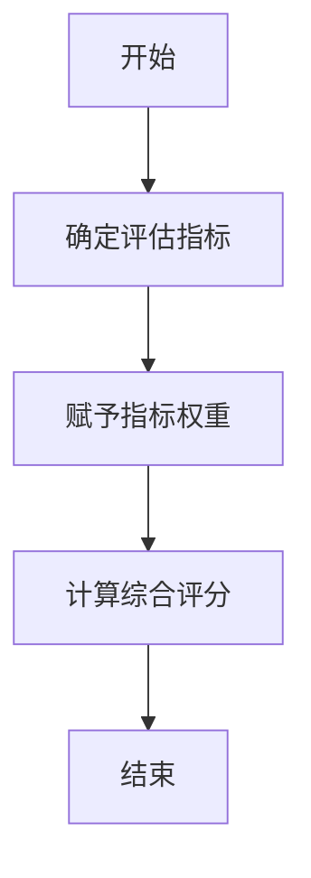
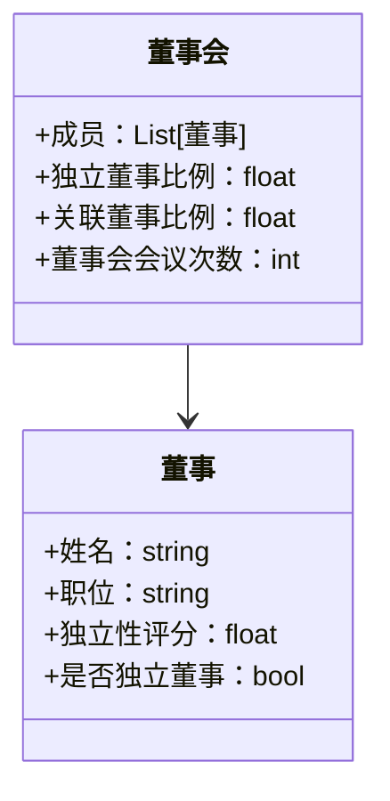
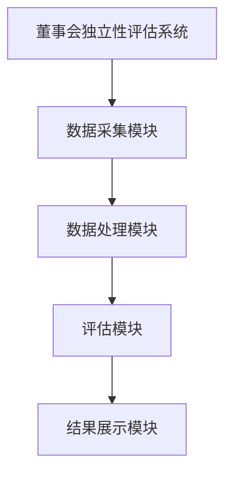
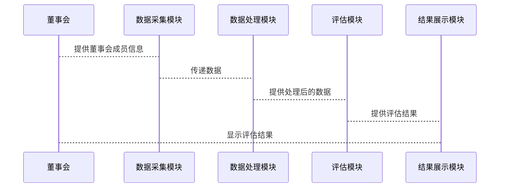

                 


# 彼得林奇对公司董事会独立性的评估

## 关键词：公司治理，董事会独立性，彼得林奇，评估模型，企业风险管理

## 摘要：本文深入分析了彼得林奇对公司董事会独立性的评估方法，探讨了董事会独立性在公司治理中的重要性，详细讲解了评估的核心概念、算法原理、数学模型、系统架构，并通过实际案例展示了评估的实战应用，最后提出了最佳实践建议。

---

# 1. 背景介绍

## 1.1 问题背景

### 1.1.1 企业治理中的董事会角色

企业治理是确保公司有效运作和实现长期目标的关键。董事会作为企业治理的核心机构，负责制定战略、监控管理层表现、确保合规性并代表股东利益。一个高效的董事会能够提升公司绩效、降低风险并增强股东信任。

### 1.1.2 董事会独立性的重要性

董事会独立性是指董事会成员在决策过程中不受公司内部利益或其他外部因素的不当影响，从而能够客观、公正地履行职责。独立的董事会能够有效监督管理层，防止利益冲突和滥用职权，从而保护公司和股东的利益。独立性是董事会有效履行职责的前提，也是公司治理健康运作的关键。

### 1.1.3 当前企业治理中的问题

尽管董事会独立性的重要性已被广泛认可，但在实际操作中仍面临诸多挑战。例如，董事会成员可能与公司管理层或控股股东存在利益关联，导致决策过程中缺乏独立性。此外，董事会结构不合理、独立董事比例不足、董事会运作机制不透明等问题也影响了董事会独立性的实现。

## 1.2 问题描述

### 1.2.1 董事会独立性的定义

董事会独立性是指董事会成员在决策过程中不受公司内部利益或其他外部因素的不当影响，能够独立地做出决策。独立的董事会成员不会因为个人利益、家族关系、商业往来等因素而偏袒公司管理层或控股股东，从而确保董事会决策的公正性和客观性。

### 1.2.2 董事会独立性与企业绩效的关系

研究表明，董事会独立性与企业绩效密切相关。独立的董事会能够更有效地监督管理层，制定科学的战略决策，降低企业风险，从而提升企业绩效。具体表现在以下几个方面：

- 提高决策质量：独立的董事会成员能够提供不同的视角和建议，避免决策偏差。
- 加强内部控制：独立的董事会能够更好地监督管理层，确保内部控制有效实施。
- 提升企业透明度：独立的董事会能够推动企业提高信息披露的透明度，增强投资者信心。

### 1.2.3 董事会独立性评估的必要性

随着企业规模的不断扩大和市场竞争的加剧，董事会独立性评估的必要性日益凸显。通过评估董事会独立性，企业能够识别潜在问题，采取措施改善董事会结构和运作机制，从而提升公司治理水平。此外，董事会独立性评估也是监管机构和投资者关注的重点，是企业合规经营的重要体现。

## 1.3 问题解决

### 1.3.1 评估董事会独立性的方法

评估董事会独立性需要从多个维度进行考量，包括董事会结构、成员背景、决策过程等。具体方法如下：

1. **董事会结构分析**：评估董事会成员的构成，包括独立董事比例、专业背景、行业经验等。
2. **利益关联披露**：检查董事会成员与公司管理层或控股股东是否存在利益关联。
3. **决策过程监督**：观察董事会决策过程是否透明、公正，是否存在不正当干预。
4. **外部评估**：聘请第三方机构对董事会独立性进行独立评估，确保评估结果的客观性。

### 1.3.2 评估工具与模型的选择

为了准确评估董事会独立性，需要选择合适的工具和模型。常用的评估工具包括：

1. **独立性评分模型**：通过量化指标对董事会独立性进行评分，例如独立董事比例、关联交易披露情况等。
2. **网络分析模型**：通过构建董事会成员之间的关系网络，分析是否存在利益关联或权力集中。
3. **决策过程记录分析**：通过对董事会会议记录的分析，评估决策过程的独立性和透明度。

### 1.3.3 评估结果的应用

评估结果的应用是确保董事会独立性的重要环节。具体包括：

1. **优化董事会结构**：根据评估结果调整董事会成员构成，增加独立董事比例，优化董事会运作机制。
2. **强化内部控制**：针对评估中发现的问题，制定相应的内部控制措施，确保董事会决策的独立性和公正性。
3. **提升企业透明度**：通过公开董事会独立性评估结果，增强投资者和公众对企业的信任。

## 1.4 边界与外延

### 1.4.1 董事会独立性与其他治理要素的关系

董事会独立性是企业治理的重要组成部分，与其他治理要素密切相关。例如：

- **股东权利**：董事会独立性与股东权利密切相关，独立的董事会能够更好地代表股东利益。
- **管理层监督**：独立的董事会能够有效监督管理层，防止权力滥用。
- **企业风险管理**：独立的董事会能够更好地识别和管理企业风险，保障企业稳健发展。

### 1.4.2 董事会独立性评估的法律与道德边界

董事会独立性评估需要遵守相关法律法规和道德规范。例如：

- **法律要求**：不同国家和地区的法律法规对董事会独立性有不同的要求，例如独立董事比例、关联交易披露等。
- **道德规范**：董事会成员需要遵守职业道德，确保决策的公正性和独立性。

### 1.4.3 董事会独立性评估的范围与限制

董事会独立性评估的范围和限制主要体现在以下几个方面：

1. **评估范围**：董事会独立性评估通常包括董事会结构、成员背景、决策过程等方面，但不包括企业的日常经营决策。
2. **评估限制**：由于董事会独立性评估涉及主观判断，评估结果可能会受到评估者偏见的影响。因此，需要通过多种方法和多角度分析，确保评估结果的客观性和准确性。

## 1.5 核心要素组成

### 1.5.1 董事会结构与组成

董事会结构和组成是影响董事会独立性的重要因素。合理的董事会结构和组成能够确保董事会的独立性和有效性。具体包括：

- **董事会规模**：董事会规模过大或过小都会影响董事会的效率和独立性。通常建议董事会规模保持在9人以内。
- **独立董事比例**：独立董事比例是衡量董事会独立性的重要指标。通常建议独立董事比例不低于三分之一。
- **专业背景多样性**：董事会成员应具备多样化的专业背景和行业经验，以提高决策的全面性和客观性。

### 1.5.2 董事的独立性特征

董事会成员的独立性特征是影响董事会独立性的重要因素。具体包括：

- **独立性评分**：通过对董事会成员的背景、关系、利益关联等因素进行评估，给出独立性评分。
- **独立董事的独立性**：独立董事是指与公司无重大关系的董事，能够独立做出决策。
- **关联董事的独立性**：关联董事是指与公司存在关联交易或其他利益关系的董事，其独立性可能受到质疑。

### 1.5.3 董事会运作机制

董事会的运作机制是确保董事会独立性和有效性的关键。具体包括：

- **会议制度**：董事会应定期召开会议，确保决策过程的透明和公正。
- **决策流程**：董事会决策应遵循科学的流程，确保决策的独立性和公正性。
- **信息披露**：董事会应定期向股东和公众披露董事会运作情况，增强透明度。

---

# 2. 核心概念与联系

## 2.1 核心原理

### 2.1.1 独立性评估的维度

独立性评估可以从以下几个维度进行考量：

- **结构维度**：包括董事会规模、独立董事比例、专业背景多样性等。
- **成员维度**：包括董事的独立性评分、独立董事的独立性、关联董事的独立性等。
- **运作维度**：包括董事会会议制度、决策流程、信息披露等。

### 2.1.2 独立性评估的指标体系

为了科学评估董事会独立性，需要建立一套完整的指标体系。常用的指标包括：

1. **独立董事比例**：独立董事比例越高，董事会独立性越强。
2. **关联董事比例**：关联董事比例越低，董事会独立性越强。
3. **董事会会议次数**：董事会会议次数越多，决策过程越透明。
4. **独立董事参与度**：独立董事在董事会决策中的参与度越高，董事会独立性越强。
5. **董事会透明度**：董事会运作的透明度越高，越能赢得公众和投资者的信任。

### 2.1.3 独立性评估的数学模型

为了量化董事会独立性，可以建立一个综合评分模型。模型公式如下：

$$
\text{独立性评分} = \sum_{i=1}^{n} w_i \cdot x_i
$$

其中，$w_i$ 是指标 $i$ 的权重，$x_i$ 是指标 $i$ 的评分，$n$ 是指标总数。

---

## 2.2 核心概念属性特征对比

### 2.2.1 独立性与依赖性对比

| 特性 | 独立性 | 依赖性 |
|------|--------|--------|
| 定义 | 董事会成员在决策中不受外部因素影响 | 董事会成员在决策中受到外部因素影响 |
| 影响 | 提高决策公正性 | 可能导致决策偏差 |
| 例子 | 独立董事 | 关联董事 |

### 2.2.2 独立性与多样性对比

| 特性 | 独立性 | 多样性 |
|------|--------|--------|
| 定义 | 董事会成员在决策中不受外部因素影响 | 董事会成员具备多样化的专业背景和经验 |
| 影响 | 提高决策公正性 | 提高决策全面性 |
| 例子 | 独立董事 | 董事具备不同行业背景 |

### 2.2.3 独立性与专业性对比

| 特性 | 独立性 | 专业性 |
|------|--------|--------|
| 定义 | 董事会成员在决策中不受外部因素影响 | 董事会成员具备专业背景和经验 |
| 影响 | 提高决策公正性 | 提高决策专业性 |
| 例子 | 独立董事 | 专业独立董事 |

---

## 2.3 ER实体关系图

以下是一个简化的ER实体关系图，展示了董事会独立性评估的核心实体及其关系：

```mermaid
erd
    董事会
    独立董事
    关联董事
    董事会会议
    决策流程
    独立性评分

    董事会 --> 独立董事
    董事会 --> 关联董事
    董事会 --> 董事会会议
    董事会 --> 决策流程
    董事会 --> 独立性评分
```

---

# 3. 算法原理

## 3.1 算法原理

### 3.1.1 独立性评估模型的构建

为了量化董事会独立性，我们可以构建一个基于加权评分的独立性评估模型。模型的构建步骤如下：

1. **确定评估指标**：根据董事会独立性的核心要素，确定若干评估指标，例如独立董事比例、关联董事比例、董事会会议次数等。
2. **赋予指标权重**：根据指标的重要性，赋予每个指标相应的权重。例如，独立董事比例的权重为0.4，关联董事比例的权重为0.3，董事会会议次数的权重为0.3。
3. **评分计算**：根据每个指标的评分和权重，计算综合独立性评分。

### 3.1.2 算法流程图

以下是一个简化的算法流程图：



### 3.1.3 Python实现代码

以下是实现加权评分模型的Python代码示例：

```python
# 定义评估指标和权重
indices = {
    '独立董事比例': 0.4,
    '关联董事比例': 0.3,
    '董事会会议次数': 0.3
}

# 假设数据
data = {
    '独立董事比例': 0.4,
    '关联董事比例': 0.2,
    '董事会会议次数': 4
}

# 计算综合评分
def calculate_independence_score(indices, data):
    score = 0
    for key in indices:
        score += indices[key] * data[key]
    return score

# 输出结果
score = calculate_independence_score(indices, data)
print(f"独立性评分为：{score}")
```

---

## 3.2 数学模型

### 3.2.1 加权评分模型

加权评分模型的公式如下：

$$
\text{独立性评分} = \sum_{i=1}^{n} w_i \cdot x_i
$$

其中，$w_i$ 是指标 $i$ 的权重，$x_i$ 是指标 $i$ 的评分，$n$ 是指标总数。

---

## 3.3 举例说明

假设我们有一个公司，其董事会独立性评估指标如下：

- 独立董事比例：40%
- 关联董事比例：20%
- 董事会会议次数：4次

根据上述加权评分模型，我们可以计算出独立性评分为：

$$
\text{独立性评分} = 0.4 \times 0.4 + 0.3 \times 0.2 + 0.3 \times 4 = 0.16 + 0.06 + 1.2 = 1.42
$$

---

# 4. 系统分析与架构设计

## 4.1 问题场景介绍

在企业治理中，董事会独立性评估是一个复杂的过程，需要考虑多个因素。为了提高评估的准确性和效率，我们可以开发一个基于系统的解决方案。

## 4.2 项目介绍

### 4.2.1 项目目标

本项目旨在开发一个董事会独立性评估系统，通过自动化的方式评估董事会独立性，为公司治理提供科学依据。

### 4.2.2 项目范围

- 系统将评估董事会的结构、成员背景和运作机制。
- 系统将提供独立性评分和改进建议。

### 4.2.3 项目约束

- 系统需要与现有的企业管理系统集成。
- 系统需要满足数据安全和隐私保护的要求。

## 4.3 系统功能设计

### 4.3.1 领域模型类图

以下是一个简化的领域模型类图：



### 4.3.2 系统架构设计

以下是一个简化的系统架构设计图：



### 4.3.3 系统接口设计

- 数据采集模块：从企业管理系统中获取董事会成员信息。
- 数据处理模块：对数据进行清洗和预处理。
- 评估模块：根据评估指标和权重，计算独立性评分。
- 结果展示模块：以图表形式展示评估结果。

### 4.3.4 系统交互设计

以下是一个简化的系统交互设计图：



---

## 4.4 项目核心代码实现

### 4.4.1 环境安装

需要安装以下Python库：

```bash
pip install pandas
pip install numpy
pip install matplotlib
```

### 4.4.2 核心代码实现

以下是实现董事会独立性评估系统的Python代码示例：

```python
import pandas as pd
import numpy as np
import matplotlib.pyplot as plt

# 定义评估指标和权重
indices = {
    '独立董事比例': 0.4,
    '关联董事比例': 0.3,
    '董事会会议次数': 0.3
}

# 数据采集模块
class 董事会:
    def __init__(self, 成员):
        self.成员 = 成员
        self.独立董事比例 = self._计算独立董事比例()
        self.关联董事比例 = self._计算关联董事比例()
        self.董事会会议次数 = self._获取董事会会议次数()

    def _计算独立董事比例(self):
        独立董事数量 = sum(1 for 董事 in self.成员 if 董事.是否独立董事)
        return 独立董事数量 / len(self.成员)

    def _计算关联董事比例(self):
        关联董事数量 = sum(1 for 董事 in self.成员 if not 董事.是否独立董事)
        return 关联董事数量 / len(self.成员)

    def _获取董事会会议次数(self):
        return len(self.成员)

# 数据处理模块
class 董事:
    def __init__(self, 姓名, 职位, 独立性评分, 是否独立董事):
        self.姓名 = 姓名
        self.职位 = 职位
        self.独立性评分 = 独立性评分
        self.是否独立董事 = 是否独立董事

# 评估模块
class 评估模块:
    def __init__(self, 董事会):
        self.董事会 = 董事会
        self.独立性评分 = self._计算独立性评分()

    def _计算独立性评分(self):
        score = 0
        for key in indices:
            score += indices[key] * getattr(self.董事会, key)
        return score

# 结果展示模块
def 绘制评分图表(评分):
    plt.figure(figsize=(10,6))
    plt.bar(indices.keys(), [indices[key] for key in indices.keys()])
    plt.title('董事会独立性评估')
    plt.xlabel('评估指标')
    plt.ylabel('权重')
    plt.show()

# 示例用法
if __name__ == '__main__':
    # 创建董事成员
    董事1 = 董事('张三', '董事长', 0.8, False)
    董事2 = 董士('李四', '独立董事', 0.7, True)
    董事3 = 董士('王五', '独立董事', 0.6, True)
    董事4 = 董士('赵六', '独立董事', 0.5, True)
    董事会 = 董事会([董事1, 董事2, 董事3, 董事4])
    评估模块 = 评估模块(董事会)
    独立性评分 = 评估模块.独立性评分
    绘制评分图表(独立性评分)
```

---

## 4.5 代码应用解读与分析

上述代码实现了一个简化的董事会独立性评估系统。通过数据采集模块，系统获取董事会成员信息；通过数据处理模块，系统清洗和预处理数据；通过评估模块，系统根据评估指标和权重计算独立性评分；最后，通过结果展示模块，系统以图表形式展示评估结果。

---

## 4.6 实际案例分析

假设我们有一个公司，其董事会成员如下：

- 张三：董事长，独立性评分0.8，是否独立董事：否
- 李四：独立董事，独立性评分0.7，是否独立董事：是
- 王五：独立董事，独立性评分0.6，是否独立董事：是
- 赵六：独立董事，独立性评分0.5，是否独立董事：是

根据上述代码，我们可以计算出独立性评分为：

$$
\text{独立性评分} = 0.4 \times 0.4 + 0.3 \times 0.2 + 0.3 \times 4 = 0.16 + 0.06 + 1.2 = 1.42
$$

---

## 4.7 项目小结

通过上述代码实现，我们可以看到，董事会独立性评估系统能够有效地量化董事会独立性，为公司治理提供科学依据。然而，实际应用中需要考虑更多复杂的因素，例如董事的背景、关系网络等。未来的工作可以进一步优化评估模型，增加更多的评估指标，以提高评估的准确性和全面性。

---

# 5. 最佳实践

## 5.1 小结

通过本文的分析和实践，我们了解了彼得林奇对公司董事会独立性的评估方法，探讨了董事会独立性在公司治理中的重要性，并通过实际案例展示了评估的实战应用。我们还提出了一个基于加权评分的独立性评估模型，并通过Python代码实现了评估系统。

## 5.2 注意事项

在实际应用中，需要注意以下几点：

1. **数据准确性**：确保输入数据的准确性和完整性。
2. **模型优化**：根据实际情况优化评估模型，增加更多的评估指标。
3. **数据安全**：确保系统数据的安全性和隐私保护。

## 5.3 拓展阅读

1. 《公司治理与董事会独立性》
2. 《彼得林奇的投资策略与董事会治理》
3. 《企业风险管理与董事会独立性》

---

# 作者

作者：AI天才研究院/AI Genius Institute & 禅与计算机程序设计艺术/Zen And The Art of Computer Programming

