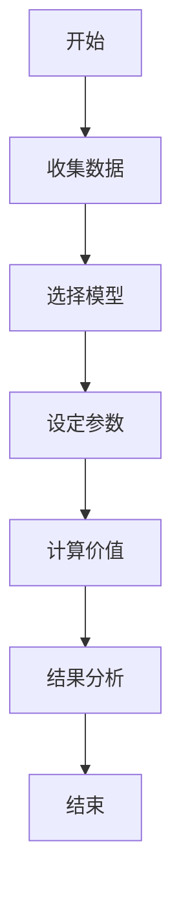
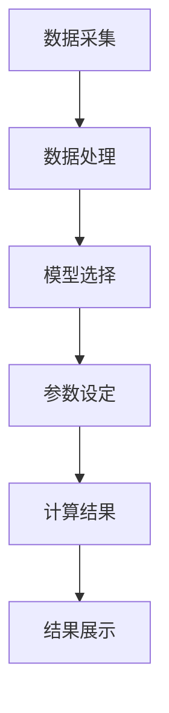

                 


# 彼得林奇的"长期价值创造"评估体系

> 关键词：彼得林奇，长期价值创造，投资评估体系，价值模型，投资策略

> 摘要：本文系统地介绍并分析了彼得林奇的长期价值创造评估体系，从核心概念到数学模型，从系统架构到项目实战，全面解析这一投资评估体系的理论基础和实践应用。文章深入探讨了长期价值创造的定义、评估指标、算法原理，并通过实际案例展示了如何将这一体系应用于投资决策中。

---

## 第1章: 长期价值创造的核心概念

### 1.1 长期价值创造的定义

长期价值创造是指通过持续的经营和管理，使企业或投资标的的价值随着时间的推移不断增长的过程。它关注的是企业内在价值的提升，而非短期市场波动的影响。

#### 1.1.1 价值创造的内涵

价值创造不仅仅是财务表现的提升，还包括企业在市场中的竞争力、创新能力和管理效率的优化。长期价值创造强调企业通过持续改进和创新，实现资产的保值和增值。

#### 1.1.2 长期价值创造的特征

长期价值创造具有以下几个特征：
1. **可持续性**：价值的增长是长期且稳定的，而非短期的波动。
2. **内生性**：价值来源于企业的内在因素，如技术创新、管理优化等。
3. **累积性**：随着时间的推移，价值不断积累，形成复利效应。

#### 1.1.3 长期价值创造与短期收益的关系

长期价值创造并不排斥短期收益，但更关注企业的长期发展潜力。短期收益是企业价值的体现，而长期价值创造则是企业持续发展的基础。通过关注长期价值，投资者可以在短期波动中保持战略定力，抓住长期增长的机会。

### 1.2 彼得林奇投资体系的背景

彼得·林奇是美国著名投资经理，以其长期价值投资理念闻名。他的投资策略强调对企业内在价值的深入分析，而非短期市场波动的预测。长期价值创造是其投资体系的核心，他认为企业价值的增长是投资收益的根本来源。

#### 1.2.1 彼得林奇及其投资理念

彼得·林奇在其职业生涯中管理着富达麦哲伦基金，取得了卓越的投资业绩。他的投资理念强调：
1. **深入研究企业基本面**：通过分析财务报表、行业地位和竞争优势，评估企业的内在价值。
2. **长期持有优质资产**：避免频繁交易，专注于那些具有长期增长潜力的企业。
3. **分散投资，降低风险**：通过投资于不同行业的优秀企业，分散投资风险。

#### 1.2.2 长期价值创造在投资中的重要性

在投资中，长期价值创造是实现超额收益的关键。通过识别那些能够持续创造价值的企业，投资者可以在市场波动中保持稳定的收益。彼得林奇的成功证明了长期价值创造策略的有效性。

#### 1.2.3 投资者与企业的长期价值创造

投资者与企业是长期价值创造的共同体。投资者通过支持优质企业，促进其实现价值增长；而企业通过不断提升自身竞争力，为投资者创造长期收益。这种双向互动是长期价值创造的核心。

---

## 第2章: 长期价值创造的评估体系

### 2.1 价值评估的基本原理

价值评估是长期价值创造的核心环节，通过量化企业的内在价值，为投资决策提供依据。

#### 2.1.1 价值评估的定义

价值评估是指通过对企业的财务状况、行业地位和竞争优势进行分析，估算其内在价值的过程。价值评估的结果为投资者判断企业的投资价值提供参考。

#### 2.1.2 价值评估的核心要素

价值评估的核心要素包括：
1. **财务数据**：收入、利润、现金流等财务指标。
2. **行业分析**：行业竞争格局、市场容量和增长潜力。
3. **竞争优势**：企业的核心竞争力和护城河。

#### 2.1.3 价值评估的数学模型

价值评估的数学模型是长期价值创造的关键工具。以下是常用的几种模型：

##### 现金流折现模型（DCF模型）

现金流折现模型是评估企业内在价值的常用方法，通过将未来现金流折现到现值，估算企业的公允价值。

$$ V = \sum_{t=1}^{n} \frac{CF_t}{(1 + r)^t} $$

其中：
- \( V \) 为企业的内在价值
- \( CF_t \) 为第 \( t \) 年的现金流
- \( r \) 为折现率
- \( n \) 为评估期限

##### 内在价值计算公式

内在价值是企业在未来自由现金流的现值，反映了企业的实际价值。

$$ V = \frac{FCF}{r - g} $$

其中：
- \( FCF \) 为自由现金流
- \( r \) 为折现率
- \( g \) 为现金流增长率

##### 市盈率与市净率分析

市盈率（P/E）和市净率（P/B）是常用的估值指标，分别反映了企业的盈利能力和发展潜力。

$$ P/E = \frac{P}{E} $$
$$ P/B = \frac{P}{B} $$

其中：
- \( P \) 为股票价格
- \( E \) 为每股收益
- \( B \) 为每股净资产

#### 2.1.4 价值评估的流程

价值评估的流程包括以下几个步骤：
1. **数据收集与整理**：收集企业的财务报表和行业数据。
2. **模型选择与假设**：根据企业特点选择合适的估值模型，并设定合理的假设参数。
3. **模型计算与验证**：通过计算得出企业的内在价值，并与市场价格进行对比。
4. **结果分析与调整**：根据市场反馈和企业变化调整估值模型。

### 2.2 长期价值创造的评估指标

长期价值创造的评估指标体系是衡量企业价值增长的重要工具，包括财务指标和非财务指标。

#### 2.2.1 财务指标

财务指标是评估企业价值的重要依据，主要包括以下几个方面：

##### 资产回报率（ROA）

资产回报率衡量了企业资产的使用效率。

$$ ROA = \frac{净利润}{平均总资产} $$

##### 净资产收益率（ROE）

净资产收益率反映了企业股东权益的回报能力。

$$ ROE = \frac{净利润}{平均净资产} $$

##### 自由现金流（FCF）

自由现金流是企业在偿还债务和再投资之后的剩余现金流。

$$ FCF = \text{净利润} + \text{非现金费用} - \text{资本支出} $$

#### 2.2.2 非财务指标

非财务指标关注企业的管理效率、创新能力和市场地位，主要包括：

##### 管理团队能力

管理团队的能力直接影响企业的战略执行和价值创造。

##### 创新能力

企业的创新能力决定了其在市场中的竞争力和持续发展能力。

##### 市场地位

市场地位反映了企业在行业中的竞争地位和品牌影响力。

#### 2.2.3 指标权重的确定方法

在长期价值创造的评估中，不同指标的权重需要根据企业的实际情况进行调整。常用的方法包括：

##### 等权重法

所有指标权重相同，适用于指标之间差异不大的情况。

##### 主观赋权法

根据专家判断赋予指标不同的权重。

##### 层次分析法（AHP）

通过构建层次分析模型，确定各指标的权重。

### 2.3 价值评估的流程

价值评估的流程是长期价值创造体系的重要组成部分，包括以下几个步骤：

#### 2.3.1 数据收集与处理

数据收集是价值评估的基础，包括企业的财务数据、行业数据和市场数据。

#### 2.3.2 评估模型的构建

根据企业的特点选择合适的评估模型，并设定合理的假设参数。

#### 2.3.3 结果分析与反馈

通过计算得出企业的内在价值，并与市场价格进行对比，为投资决策提供依据。

---

## 第3章: 长期价值创造的数学模型与算法

### 3.1 价值评估的数学模型

数学模型是长期价值创造评估体系的核心工具，以下是一些常用的模型：

#### 3.1.1 现金流折现模型（DCF模型）

现金流折现模型通过将未来现金流折现到现值，估算企业的公允价值。

$$ V = \sum_{t=1}^{n} \frac{CF_t}{(1 + r)^t} $$

其中：
- \( V \) 为企业的内在价值
- \( CF_t \) 为第 \( t \) 年的现金流
- \( r \) 为折现率
- \( n \) 为评估期限

#### 3.1.2 内在价值计算公式

内在价值是企业在未来自由现金流的现值，反映了企业的实际价值。

$$ V = \frac{FCF}{r - g} $$

其中：
- \( FCF \) 为自由现金流
- \( r \) 为折现率
- \( g \) 为现金流增长率

#### 3.1.3 市盈率与市净率分析

市盈率（P/E）和市净率（P/B）是常用的估值指标，分别反映了企业的盈利能力和发展潜力。

$$ P/E = \frac{P}{E} $$
$$ P/B = \frac{P}{B} $$

其中：
- \( P \) 为股票价格
- \( E \) 为每股收益
- \( B \) 为每股净资产

### 3.2 算法原理与流程图

#### 3.2.1 算法流程图

以下是价值评估的流程图：



#### 3.2.2 算法实现的代码示例

以下是现金流折现模型的Python代码示例：

```python
def discounted_cash_flow(CF, r, n):
    V = 0
    for t in range(1, n+1):
        V += CF / (1 + r) ** t
    return V

CF = [100, 120, 150, 180]  # 每年的现金流
r = 0.08  # 折现率
n = 4  # 评估期限

V = discounted_cash_flow(CF, r, n)
print("内在价值:", V)
```

#### 3.2.3 算法的优化与改进

算法的优化与改进包括参数调整、模型组合使用等方法，以提高评估的准确性和可靠性。

---

## 第4章: 系统分析与架构设计

### 4.1 问题场景介绍

长期价值创造的评估体系需要构建一个完整的系统，以实现对企业价值的全面评估。

#### 4.1.1 价值评估的复杂性

价值评估涉及多个因素，需要综合考虑财务、行业和市场等多方面的数据。

#### 4.1.2 系统的目标与范围

系统的目标是实现对企业内在价值的全面评估，帮助投资者做出科学的投资决策。

#### 4.1.3 系统的输入与输出

系统的输入包括企业的财务数据、行业数据和市场数据；输出是企业的内在价值评估结果。

### 4.2 系统功能设计

系统功能设计包括数据采集模块、评估计算模块和结果展示模块。

#### 4.2.1 数据采集模块

数据采集模块负责收集企业的财务报表和行业数据。

#### 4.2.2 评估计算模块

评估计算模块根据选择的模型进行计算，得出企业的内在价值。

#### 4.2.3 结果展示模块

结果展示模块以图形化的方式展示评估结果，便于投资者理解和决策。

### 4.3 系统架构设计

系统架构设计包括分层架构图和模块交互关系图。

#### 4.3.1 分层架构图

以下是系统的分层架构图：



#### 4.3.2 模块间的交互关系

模块间的交互关系如下：


#### 4.3.3 系统接口设计

系统接口设计包括数据接口和计算接口，确保系统的高效运行。

---

## 第5章: 项目实战

### 5.1 环境安装与配置

项目实战需要安装必要的开发环境和工具。

#### 5.1.1 开发环境的选择

推荐使用Python和Jupyter Notebook进行开发。

#### 5.1.2 必要工具的安装

安装必要的库，如pandas、numpy和matplotlib。

#### 5.1.3 数据源的准备

收集企业的财务数据和市场数据。

### 5.2 核心代码实现

核心代码实现包括数据处理、模型选择和结果计算。

#### 5.2.1 价值评估模型的实现

以下是现金流折现模型的Python代码：

```python
def discounted_cash_flow(CF, r, n):
    V = 0
    for t in range(1, n+1):
        V += CF / (1 + r) ** t
    return V

CF = [100, 120, 150, 180]
r = 0.08
n = 4

V = discounted_cash_flow(CF, r, n)
print("内在价值:", V)
```

#### 5.2.2 算法优化的代码

以下是算法优化的Python代码：

```python
def optimizedDCF(CF, r, n):
    V = 0
    for t in range(1, n+1):
        V += CF[t-1] / (1 + r) ** t
    return V

CF = [100, 120, 150, 180]
r = 0.08
n = 4

V = optimizedDCF(CF, r, n)
print("优化后的内在价值:", V)
```

#### 5.2.3 系统功能模块的实现

以下是系统功能模块的实现代码：

```python
def data_collection():
    # 数据采集逻辑
    pass

def model_selection():
    # 模型选择逻辑
    pass

def parameter_setting():
    # 参数设置逻辑
    pass

def result_display():
    # 结果展示逻辑
    pass
```

### 5.3 案例分析与解读

案例分析通过具体实例展示长期价值创造评估体系的应用。

#### 5.3.1 案例背景介绍

假设我们分析一家科技企业的长期价值创造能力。

#### 5.3.2 评估过程详细说明

1. **数据收集**：收集该企业的财务报表和行业数据。
2. **模型选择**：选择现金流折现模型进行评估。
3. **参数设定**：设定合理的折现率和现金流增长率。
4. **计算结果**：计算企业的内在价值。
5. **结果分析**：将内在价值与市场价格进行对比，判断投资价值。

#### 5.3.3 结果分析与总结

通过案例分析，验证长期价值创造评估体系的有效性和实用性。

---

## 第6章: 总结与展望

### 6.1 总结

长期价值创造是投资成功的关键，彼得林奇的评估体系为我们提供了科学的工具和方法。通过系统的分析和实践，我们可以更好地识别和投资于具有长期增长潜力的企业。

### 6.2 最佳实践

最佳实践包括深入研究企业基本面、分散投资、长期持有和持续学习。

### 6.3 小结

长期价值创造评估体系是一个复杂而系统的工程，需要投资者具备深厚的知识和实践经验。通过不断学习和实践，我们可以更好地应用这一体系，实现投资的成功。

### 6.4 注意事项

在应用长期价值创造评估体系时，需要注意数据的准确性、模型的合理性和假设的合理性。

### 6.5 拓展阅读

建议读者进一步阅读彼得林奇的原著和其他相关书籍，深入理解长期价值创造的真谛。

---

## 作者

作者：AI天才研究院/AI Genius Institute & 禅与计算机程序设计艺术 /Zen And The Art of Computer Programming

