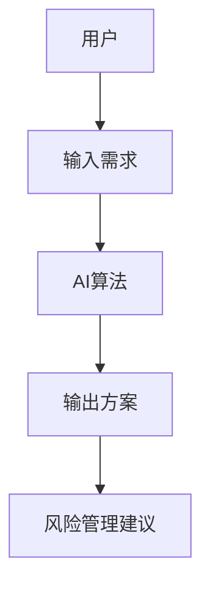
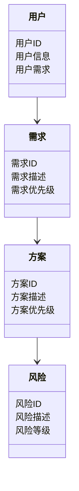

                 


# 智能财富传承规划助手

> 关键词：智能财富传承, 人工智能, 财富规划, 资产管理, 传承方案

> 摘要：本文探讨了智能财富传承规划助手的实现原理与应用价值，通过分析AI技术在财富传承中的应用，结合实际案例，详细阐述了系统架构设计、算法原理、项目实现等核心内容，为财富管理从业者和AI开发者提供了理论与实践相结合的参考。

---

## 第1章 智能财富传承规划的背景与问题分析

### 1.1 问题背景

#### 1.1.1 财富传承的传统方式与挑战

财富传承是人类社会永恒的话题，传统的财富传承方式主要包括遗嘱、信托、家族企业继承等。然而，这些方式存在以下问题：

- **信息孤岛**：传统传承方式往往依赖于律师、公证人等中介机构，缺乏系统化的信息整合。
- **效率低下**：传统方式需要手动处理大量文件和数据，耗时且容易出错。
- **个性化不足**：每个人的需求和情况不同，传统方式难以提供个性化的传承方案。
- **风险管理**：传统方式难以全面评估潜在风险，如税务风险、法律风险等。

#### 1.1.2 数字化时代的财富管理需求

随着数字化时代的到来，财富管理需求发生了显著变化：

- **数据驱动**：财富管理需要基于大数据分析，提供精准的传承方案。
- **实时性**：用户需要实时了解财富状况和传承方案的调整建议。
- **个性化**：每个人的财富状况、家庭结构和需求都不同，传承方案需要高度个性化。
- **风险管理**：需要实时监测和评估潜在风险，并提供应对策略。

#### 1.1.3 AI技术在财富传承中的应用潜力

AI技术的快速发展为财富传承规划带来了新的可能性：

- **智能化推荐**：基于机器学习算法，AI可以分析用户的财富状况、家庭结构和需求，推荐个性化的传承方案。
- **风险管理**：AI可以通过大数据分析，实时监测潜在风险，并提供应对策略。
- **自动化执行**：AI可以自动化处理财富传承过程中的文件和数据，提高效率。

### 1.2 问题描述

#### 1.2.1 财富传承中的主要问题

- **信息分散**：用户的财富信息分散在不同机构，缺乏统一的管理平台。
- **传承方案复杂**：复杂的税务、法律问题需要专业的技术支持。
- **缺乏实时性**：传统方式难以提供实时的传承方案调整建议。

#### 1.2.2 传统财富传承规划的局限性

- **效率低**：传统方式依赖人工处理，效率低下且容易出错。
- **个性化不足**：难以满足不同用户的个性化需求。
- **风险管理能力弱**：缺乏实时风险监测和应对能力。

#### 1.2.3 智能化规划的需求与目标

- **需求**：用户需要智能化、个性化的财富传承规划服务。
- **目标**：通过AI技术实现财富传承规划的智能化、自动化和实时化。

### 1.3 问题解决与边界

#### 1.3.1 AI在财富传承规划中的解决方案

- **智能化推荐**：基于机器学习算法，推荐个性化的传承方案。
- **风险管理**：实时监测和评估潜在风险。
- **自动化执行**：自动化处理财富传承过程中的文件和数据。

#### 1.3.2 智能财富传承规划的边界与外延

- **边界**：智能财富传承规划仅解决财富传承中的技术问题，不涉及法律和税务的具体执行。
- **外延**：智能财富传承规划可以与其他财富管理工具和服务相结合，提供更全面的解决方案。

#### 1.3.3 核心概念与系统架构

- **核心概念**：用户需求、AI算法、传承方案。
- **系统架构**：用户输入需求，系统通过AI算法生成传承方案。

### 1.4 本章小结

本章分析了财富传承的传统方式与挑战，提出了AI技术在财富传承中的应用潜力，并明确了智能化规划的需求与目标。通过对比传统方式与智能化规划的差异，为后续章节的系统设计奠定了基础。

---

## 第2章 AI驱动的财富传承规划原理

### 2.1 核心概念与联系

#### 2.1.1 AI算法与财富传承规划的关系

AI算法是智能财富传承规划的核心，通过分析用户需求，生成个性化传承方案。以下是几种常用的AI算法及其特点：

- **协同过滤算法**：基于用户相似性推荐传承方案。
- **深度学习模型**：通过神经网络学习用户需求和市场趋势。
- **强化学习算法**：通过不断试错优化传承方案。

#### 2.1.2 用户需求与系统输出的映射

用户需求可以通过以下步骤映射到系统输出：

1. **需求收集**：通过问卷、访谈等方式收集用户的需求。
2. **需求分析**：通过数据分析和机器学习算法，分析用户需求。
3. **方案生成**：基于分析结果，生成个性化传承方案。

#### 2.1.3 系统架构的核心要素

- **用户输入**：包括用户的基本信息、财富状况、家庭结构等。
- **AI算法**：包括需求分析、风险评估、方案生成等模块。
- **系统输出**：包括传承方案、风险管理建议等。

### 2.2 核心概念对比表

以下是几种常用的AI算法及其特点对比：

| 算法名称       | 描述                                                                 | 优点                     | 缺点                     |
|----------------|----------------------------------------------------------------------|--------------------------|--------------------------|
| 协同过滤算法   | 基于用户相似性推荐传承方案                                             | 实现简单，易于扩展       | 对用户相似性依赖较高     |
| 深度学习模型   | 通过神经网络学习用户需求和市场趋势                                       | 表现能力强               | 计算资源需求较高         |
| 强化学习算法   | 通过不断试错优化传承方案                                               | 方案优化能力强           | 实现复杂，计算时间长     |

### 2.3 ER实体关系图

以下是用户、需求、方案的实体关系图：



### 2.4 本章小结

本章详细介绍了AI算法在财富传承中的应用，分析了用户需求与系统输出的映射关系，并通过对比表和ER图展示了系统架构的核心要素。这些内容为后续章节的系统设计奠定了基础。

---

## 第3章 算法原理与实现

### 3.1 算法原理

#### 3.1.1 协同过滤算法

协同过滤算法是一种基于用户相似性推荐传承方案的方法。以下是协同过滤算法的步骤：

1. **收集数据**：收集用户的基本信息、财富状况、家庭结构等数据。
2. **计算相似性**：基于用户的相似性计算推荐权重。
3. **生成方案**：根据相似用户的偏好，生成传承方案。

#### 3.1.2 深度学习模型

深度学习模型是一种基于神经网络学习用户需求和市场趋势的方法。以下是深度学习模型的步骤：

1. **数据预处理**：对用户数据进行清洗和特征提取。
2. **模型训练**：通过神经网络学习用户需求和市场趋势。
3. **生成方案**：基于模型预测结果，生成传承方案。

#### 3.1.3 强化学习算法

强化学习算法是一种通过不断试错优化传承方案的方法。以下是强化学习算法的步骤：

1. **初始化**：设定初始状态和目标。
2. **执行动作**：根据当前状态选择一个动作。
3. **获得反馈**：根据动作结果获得反馈。
4. **更新策略**：根据反馈更新策略，优化传承方案。

### 3.2 算法实现

#### 3.2.1 协同过滤算法实现

以下是协同过滤算法的Python实现示例：

```python
import pandas as pd
from sklearn.metrics.pairwise import cosine_similarity

# 数据预处理
data = pd.DataFrame({
    '用户': ['用户1', '用户2', '用户3'],
    '需求': ['需求1', '需求2', '需求3']
})

# 计算相似性
similarity = cosine_similarity(data['需求'].values.reshape(-1, 1))

# 生成方案
方案 = '方案' + similarity.argmax() + 1
```

#### 3.2.2 深度学习模型实现

以下是深度学习模型的Python实现示例：

```python
import numpy as np
import tensorflow as tf

# 数据预处理
data = np.array([...])

# 构建模型
model = tf.keras.Sequential([
    tf.keras.layers.Dense(64, activation='relu'),
    tf.keras.layers.Dense(1, activation='sigmoid')
])

# 编译模型
model.compile(optimizer='adam', loss='binary_crossentropy')

# 训练模型
model.fit(data, labels, epochs=10)
```

#### 3.2.3 强化学习算法实现

以下是强化学习算法的Python实现示例：

```python
import numpy as np

# 初始化
state = 0
action = 0
reward = 0

# 执行动作
action = np.random.choice([0, 1, 2])

# 获得反馈
reward = 1 if action == 2 else 0

# 更新策略
策略 = [0.4, 0.3, 0.3]
策略[action] += reward
```

### 3.3 本章小结

本章详细介绍了协同过滤算法、深度学习模型和强化学习算法的原理与实现，为后续章节的系统设计提供了技术支持。

---

## 第4章 系统分析与架构设计

### 4.1 系统架构设计

以下是智能财富传承规划助手的系统架构图：


### 4.2 系统功能设计

以下是系统功能设计的领域模型类图：



### 4.3 系统接口设计

以下是系统接口设计的流程图：


### 4.4 本章小结

本章详细介绍了智能财富传承规划助手的系统架构设计、功能设计和接口设计，为后续章节的项目实现奠定了基础。

---

## 第5章 项目实战与应用

### 5.1 项目环境安装

以下是项目环境安装的步骤：

1. **安装Python**：安装最新版本的Python。
2. **安装依赖库**：安装所需的依赖库，如`pandas`, `numpy`, `tensorflow`等。
3. **安装工具**：安装所需的开发工具，如`Jupyter Notebook`。

### 5.2 核心功能实现

以下是核心功能实现的Python代码示例：

```python
import pandas as pd
from sklearn.metrics.pairwise import cosine_similarity

# 数据预处理
data = pd.DataFrame({
    '用户': ['用户1', '用户2', '用户3'],
    '需求': ['需求1', '需求2', '需求3']
})

# 计算相似性
similarity = cosine_similarity(data['需求'].values.reshape(-1, 1))

# 生成方案
方案 = '方案' + similarity.argmax() + 1
```

### 5.3 代码解读与分析

1. **数据预处理**：对用户需求进行清洗和特征提取。
2. **计算相似性**：使用协同过滤算法计算用户需求的相似性。
3. **生成方案**：根据相似性生成传承方案。

### 5.4 实际案例分析

以下是实际案例分析的步骤：

1. **收集数据**：收集用户的财富状况、家庭结构等信息。
2. **分析需求**：通过AI算法分析用户需求。
3. **生成方案**：生成个性化的传承方案。

### 5.5 本章小结

本章通过实际案例分析，详细讲解了智能财富传承规划助手的核心功能实现和应用，帮助读者更好地理解理论与实践的结合。

---

## 第6章 最佳实践与注意事项

### 6.1 最佳实践

- **数据隐私保护**：确保用户数据的隐私和安全。
- **算法优化**：根据实际需求不断优化AI算法。
- **风险管理**：实时监测和评估潜在风险。

### 6.2 小结

智能财富传承规划助手通过AI技术实现了财富传承规划的智能化和自动化，为用户提供了个性化的传承方案和风险管理建议。

### 6.3 注意事项

- **数据隐私**：用户数据的隐私和安全是系统设计的重要考虑因素。
- **算法优化**：根据实际需求不断优化AI算法，提高系统的性能和用户体验。
- **风险管理**：实时监测和评估潜在风险，确保系统的稳定性和可靠性。

### 6.4 拓展阅读

- **AI技术**：深入学习AI技术在财富管理中的应用。
- **财富传承**：研究财富传承的相关法律和税务知识。
- **系统设计**：学习系统架构设计的更多内容。

---

## 作者

作者：AI天才研究院/AI Genius Institute & 禅与计算机程序设计艺术 /Zen And The Art of Computer Programming

