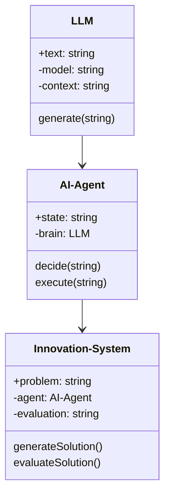
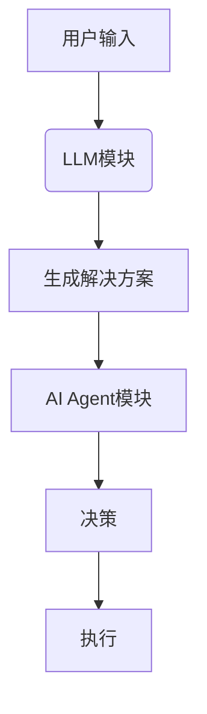
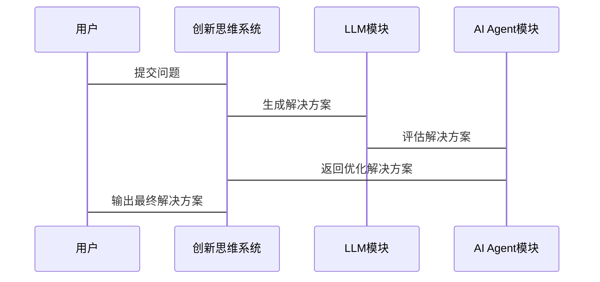

                 


# 构建LLM支持的AI Agent创新思维系统

## 关键词：LLM, AI Agent, 创新思维, 系统架构, 算法原理, 项目实战

## 摘要

随着人工智能技术的飞速发展，大语言模型（LLM）在AI Agent中的应用潜力日益凸显。本文旨在探讨如何构建一个基于LLM的AI Agent创新思维系统，结合理论分析和实践案例，系统地阐述该系统的构建过程、核心算法原理、系统架构设计以及实际应用案例。通过本文的分析，读者将能够全面理解并掌握构建此类系统的相关知识和技能。

---

# 第1章: 问题背景与系统目标

## 1.1 问题背景

### 1.1.1 当前AI技术的发展现状

人工智能（AI）技术近年来取得了显著进展，尤其是在大语言模型（LLM）领域。LLM如GPT-3、GPT-4等模型，具备强大的自然语言处理能力，能够生成高质量的文本内容、进行对话交互以及执行复杂任务。然而，当前AI技术在创新思维方面的应用仍存在诸多挑战。

### 1.1.2 LLM在AI Agent中的应用潜力

AI Agent（智能代理）是一种能够感知环境、执行任务并做出决策的智能系统。LLM的引入为AI Agent提供了强大的自然语言理解和生成能力，使其能够更好地理解用户需求、生成创新解决方案，并在复杂环境中做出决策。

### 1.1.3 创新思维系统的核心需求

创新思维是AI Agent在复杂问题解决中的关键能力。传统AI系统在处理创新性任务时往往依赖预定义规则，而基于LLM的AI Agent可以通过生成式方法，提供更具创造性的解决方案。

## 1.2 问题描述

### 1.2.1 AI Agent的定义与特点

AI Agent是一种能够感知环境、执行任务并自主决策的智能系统。其特点包括自主性、反应性、目标导向和学习能力。

### 1.2.2 创新思维在AI Agent中的重要性

创新思维是AI Agent在解决复杂问题时的核心能力。通过生成多种解决方案，AI Agent能够更好地应对不确定性和模糊性。

### 1.2.3 当前AI Agent在创新思维方面的不足

尽管AI Agent在某些任务上表现出色，但在创新思维方面，传统方法往往依赖规则和模板，缺乏灵活性和创造性。

## 1.3 问题解决与系统目标

### 1.3.1 LLM支持的创新思维系统的核心目标

本文的核心目标是构建一个基于LLM的AI Agent系统，使其具备强大的创新思维能力，能够生成多样化的解决方案。

### 1.3.2 系统设计的关键问题

如何结合LLM的自然语言处理能力，设计创新思维算法，实现灵活的解决方案生成。

### 1.3.3 系统实现的边界与外延

系统将专注于LLM与AI Agent的结合，涵盖创新思维的生成、评估和优化。

## 1.4 系统核心要素与组成

### 1.4.1 LLM的作用与功能

LLM为AI Agent提供强大的文本生成和理解能力，支持创新思维的实现。

### 1.4.2 AI Agent的结构与功能模块

AI Agent主要包括感知模块、决策模块、执行模块和学习模块。

### 1.4.3 创新思维系统的整体架构

创新思维系统通过LLM的支持，结合AI Agent的结构，实现创新解决方案的生成。

## 1.5 本章小结

本章从问题背景出发，分析了当前AI技术的发展现状，提出了构建LLM支持的AI Agent创新思维系统的目标和关键问题，为后续章节的展开奠定了基础。

---

# 第2章: LLM与AI Agent的核心概念

## 2.1 LLM的基本原理

### 2.1.1 大语言模型的定义与特点

LLM是一种基于深度学习的自然语言处理模型，具备强大的文本生成和理解能力。

### 2.1.2 LLM的训练过程与数学模型

LLM通过大量数据训练，使用变体器模型和注意力机制，优化模型参数。

### 2.1.3 LLM的应用场景与优势

LLM广泛应用于文本生成、对话交互等领域，具备灵活性和高效性。

## 2.2 AI Agent的基本原理

### 2.2.1 AI Agent的定义与分类

AI Agent是一种能够感知环境、自主决策的智能系统，分为简单反射式、基于模型和目标驱动式等类型。

### 2.2.2 AI Agent的核心功能与模块

AI Agent主要包括感知、决策、执行和学习模块，能够实现自主决策和任务执行。

### 2.2.3 AI Agent的决策机制与算法

AI Agent通过状态空间、动作空间和策略网络进行决策，结合强化学习优化决策策略。

## 2.3 LLM与AI Agent的关系

### 2.3.1 LLM作为AI Agent的核心驱动力

LLM为AI Agent提供自然语言理解和生成能力，支持创新思维的实现。

### 2.3.2 LLM对AI Agent创新思维的支撑

通过LLM的生成能力，AI Agent能够生成多样化的解决方案，提升创新思维能力。

### 2.3.3 LLM与AI Agent的协同工作模式

LLM与AI Agent协同工作，实现自然语言交互和创新思维生成。

## 2.4 核心概念对比分析

### 2.4.1 LLM与传统NLP模型的对比

LLM具备更强的生成能力和灵活性，而传统NLP模型更注重特定任务的优化。

### 2.4.2 AI Agent与传统AI系统的对比

AI Agent具备自主性和目标导向性，而传统AI系统更注重任务执行的效率和准确性。

### 2.4.3 创新思维系统的核心要素对比

创新思维系统结合了LLM和AI Agent的优势，具备更强的灵活性和创造性。

## 2.5 本章小结

本章详细介绍了LLM和AI Agent的核心概念及其关系，为后续章节的系统设计和实现奠定了理论基础。

---

# 第3章: 创新思维系统的算法原理

## 3.1 LLM的算法原理

### 3.1.1 变压器模型的基本结构

变体器模型由编码器和解码器组成，通过自注意力机制实现序列建模。

### 3.1.2 注意力机制的数学模型

注意力机制通过计算序列中各元素的相关性，确定每个元素的权重。

### 3.1.3 梯度下降与优化算法

使用Adam优化器进行模型训练，通过梯度下降优化模型参数。

## 3.2 AI Agent的算法原理

### 3.2.1 状态空间与动作空间的定义

状态空间是AI Agent所处环境的所有可能状态，动作空间是AI Agent可以执行的所有动作。

### 3.2.2 策略网络与价值网络的实现

策略网络用于生成动作，价值网络用于评估状态的价值。

### 3.2.3 强化学习的数学模型

强化学习通过奖励机制优化策略，实现最优决策。

## 3.3 创新思维系统的算法实现

### 3.3.1 创新思维的定义与度量

创新思维是生成多种解决方案的能力，可以通过多样性、新颖性和可行性进行度量。

### 3.3.2 创新思维的生成算法

结合LLM的生成能力和AI Agent的决策机制，生成多样化的创新解决方案。

### 3.3.3 创新思维的评估与优化

通过用户反馈和系统优化，提升创新思维系统的生成能力和质量。

## 3.4 算法原理的数学模型与公式

### 3.4.1 变压器模型的数学

变体器模型的自注意力机制如下：

$$
\text{Attention}(Q, K, V) = \text{softmax}\left( \frac{QK^T}{\sqrt{d_k}} \right)V
$$

其中，$Q$、$K$、$V$分别是查询、键和值向量，$d_k$是维度。

### 3.4.2 强化学习的数学模型

强化学习的目标是通过最大化累积奖励来优化策略：

$$
J(\theta) = \mathbb{E}_{\tau \sim \pi_\theta} \left[ R(\tau) \right]
$$

其中，$\tau$是轨迹，$R(\tau)$是轨迹的奖励。

## 3.5 本章小结

本章详细讲解了LLM和AI Agent的算法原理，结合数学公式和流程图，为后续的系统设计和实现提供了理论依据。

---

# 第4章: 系统分析与架构设计

## 4.1 问题场景介绍

### 4.1.1 系统背景

构建一个基于LLM的AI Agent创新思维系统，旨在提供多样化的解决方案。

### 4.1.2 系统目标

系统旨在实现创新思维能力，支持复杂问题的解决。

## 4.2 项目介绍

### 4.2.1 项目背景

本项目旨在利用LLM和AI Agent技术，构建创新思维系统。

### 4.2.2 项目目标

通过系统设计和实现，提升AI Agent的创新思维能力。

## 4.3 系统功能设计

### 4.3.1 领域模型类图



### 4.3.2 系统架构图



### 4.3.3 接口设计

系统提供API接口，支持文本输入、解决方案生成和评估。

## 4.4 系统交互设计

### 4.4.1 交互流程图



## 4.5 本章小结

本章通过系统分析和架构设计，明确了创新思维系统的整体结构和交互流程，为后续的实现奠定了基础。

---

# 第5章: 项目实战

## 5.1 环境安装

### 5.1.1 安装Python

安装Python 3.8或更高版本。

### 5.1.2 安装必要的库

安装transformers、numpy、tensorflow等库。

## 5.2 系统核心实现源代码

### 5.2.1 LLM模块

```python
from transformers import AutoModelForCausalLM, AutoTokenizer

class LLMModule:
    def __init__(self, model_name):
        self.tokenizer = AutoTokenizer.from_pretrained(model_name)
        self.model = AutoModelForCausalLM.from_pretrained(model_name)
        
    def generate(self, prompt):
        inputs = self.tokenizer(prompt, return_tensors="pt")
        outputs = self.model.generate(inputs.input_ids, max_length=500)
        return self.tokenizer.decode(outputs[0], skip_special_tokens=True)
```

### 5.2.2 AI Agent模块

```python
class AI_Agent:
    def __init__(self, llm):
        self.llm = llm
        self.state = ""
        
    def decide(self, problem):
        solution = self.llm.generate(problem)
        return solution
```

### 5.2.3 创新思维系统

```python
class Innovation_System:
    def __init__(self, agent):
        self.agent = agent
        self.evaluation = ""
        
    def generateSolution(self, problem):
        solution = self.agent.decide(problem)
        return solution
```

## 5.3 代码应用解读与分析

### 5.3.1 代码解读

LLM模块负责生成文本，AI Agent模块利用LLM生成解决方案，创新思维系统协调各模块实现创新思维生成。

### 5.3.2 系统实现的关键点

通过LLM模块实现文本生成，AI Agent模块实现决策，创新思维系统实现整体协调。

## 5.4 实际案例分析

### 5.4.1 案例描述

用户提出一个问题，系统生成多个解决方案。

### 5.4.2 案例实现与分析

通过代码实现，生成多样化的解决方案，展示系统的创新思维能力。

## 5.5 本章小结

本章通过项目实战，详细讲解了系统的实现过程，展示了创新思维系统的实际应用。

---

# 第6章: 系统优化与性能分析

## 6.1 系统优化

### 6.1.1 性能优化

优化LLM生成速度和AI Agent决策效率。

### 6.1.2 算法优化

改进创新思维生成算法，提升解决方案的质量。

## 6.2 性能分析

### 6.2.1 系统响应时间

分析系统在不同负载下的响应时间。

### 6.2.2 解决方案质量评估

评估生成解决方案的多样性和创新性。

## 6.3 优化建议

### 6.3.1 系统级优化

通过分布式计算提升系统性能。

### 6.3.2 算法级优化

改进创新思维生成算法，提升解决方案的质量。

## 6.4 本章小结

本章通过系统优化与性能分析，提出了提升创新思维系统性能和质量的建议。

---

# 第7章: 最佳实践与经验总结

## 7.1 最佳实践

### 7.1.1 系统设计

建议在系统设计阶段充分考虑扩展性和可维护性。

### 7.1.2 算法选择

选择适合任务的算法，避免过度复杂化。

## 7.2 经验总结

### 7.2.1 开发经验

在开发过程中，注重模块化设计和代码复用。

### 7.2.2 问题解决

通过不断测试和优化，提升系统性能和用户体验。

## 7.3 本章小结

本章总结了开发创新思维系统的最佳实践和经验，为后续开发提供了宝贵的参考。

---

# 作者

作者：AI天才研究院/AI Genius Institute  
& 禅与计算机程序设计艺术/Zen And The Art of Computer Programming

