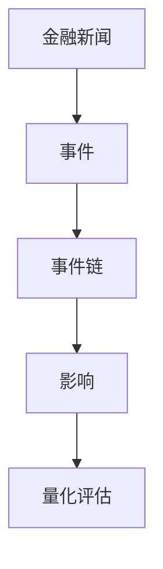
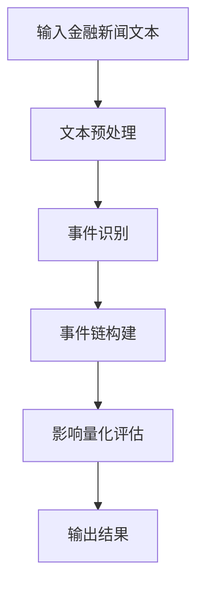
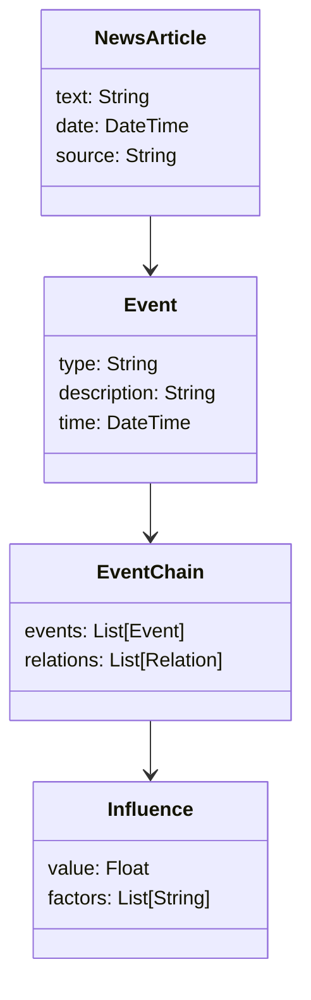
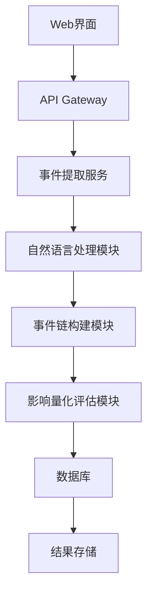
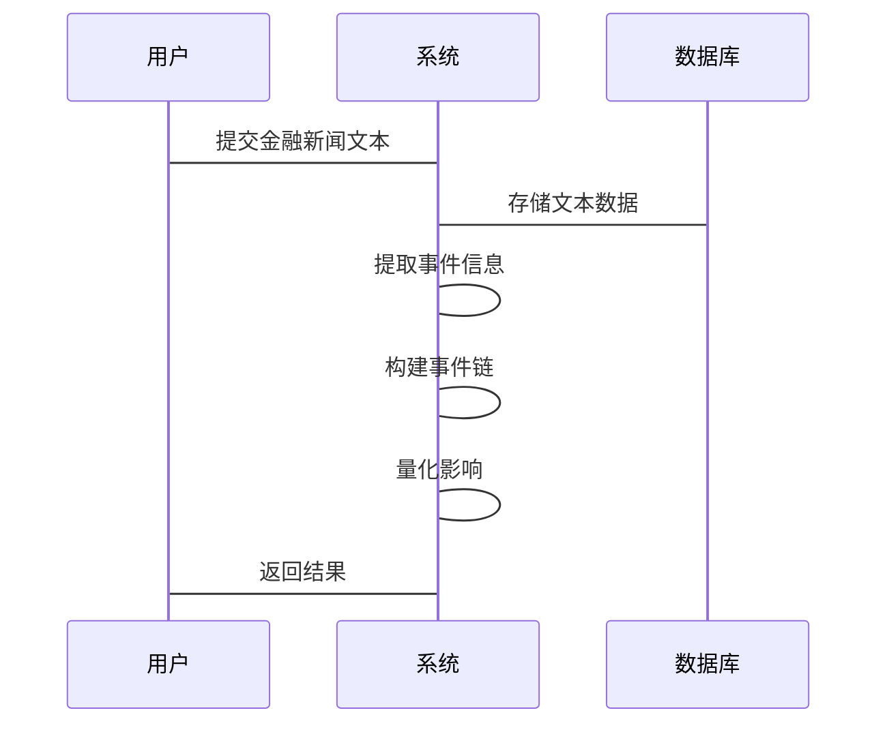

                 


# 《构建基于NLP的金融新闻事件链提取与影响量化评估系统》

> 关键词：NLP、金融新闻、事件链、影响量化、系统架构

> 摘要：本文旨在探讨如何利用自然语言处理技术构建一个能够自动提取金融新闻事件链并量化其影响的系统。文章从问题背景出发，详细分析了系统的核心概念、算法原理、系统架构，并通过实际案例展示了系统的实现与应用。本文适合对NLP和金融数据分析感兴趣的技术人员阅读。

---

# 第一部分: 问题背景与目标

## 第1章: 问题背景介绍

### 1.1 问题背景介绍

#### 1.1.1 金融新闻事件的重要性

在金融市场中，新闻事件对股价、市场情绪和交易策略有着重要影响。例如，一家公司发布重大公告可能会引发股价的剧烈波动，而市场对某一事件的反应可能会对整体经济产生连锁反应。因此，能够及时、准确地提取和分析金融新闻中的事件信息，对于投资者、金融机构以及市场监管机构都具有重要意义。

#### 1.1.2 当前金融事件分析的难点

传统的金融事件分析主要依赖人工阅读和判断，效率低且容易受到主观因素的影响。随着新闻数据的海量增长，这种方法已经无法满足实际需求。此外，金融事件之间往往存在复杂的因果关系和时间顺序，如何有效地提取和建模这些关系是一个技术挑战。

#### 1.1.3 NLP技术在金融领域的应用潜力

自然语言处理（NLP）技术在文本分析、信息提取和语义理解方面具有显著优势。通过NLP技术，可以自动化地从海量金融新闻中提取事件信息，构建事件链，并量化其对市场的影响力。这不仅可以提高效率，还能发现一些人类难以察觉的模式和趋势。

### 1.2 问题描述与目标

#### 1.2.1 金融新闻事件链的定义

金融新闻事件链是指一系列相互关联的金融事件，这些事件按照时间顺序和因果关系排列，形成一个完整的事件序列。例如，一家公司发布盈利报告（事件1）可能导致股价上涨（事件2），进而引发其他公司跟风发布类似报告（事件3），最终影响整个市场的表现。

#### 1.2.2 事件链提取的目标

事件链提取的目标是识别出金融新闻中相关事件的序列，并建立它们之间的因果关系和时间顺序。这需要对文本进行分词、实体识别、关系抽取等处理。

#### 1.2.3 影响量化评估的意义

影响量化评估是指对每个事件对市场或其他相关因素的影响程度进行量化。例如，某一事件可能对股价的影响程度为+0.5（上涨）或-0.3（下跌）。通过量化评估，可以更好地理解事件之间的相互作用，并为投资决策提供依据。

### 1.3 系统构建的边界与外延

#### 1.3.1 系统功能边界

本系统专注于从金融新闻中提取事件链并进行影响量化评估。其边界包括：

- **输入**：金融新闻文本数据。
- **输出**：事件链结构和影响量化结果。
- **功能**：
  - 文本预处理。
  - 事件识别与抽取。
  - 事件链构建。
  - 影响量化评估。

#### 1.3.2 系统的外延与扩展

虽然本系统专注于金融新闻，但其核心技术和方法可以扩展到其他领域，例如社交媒体分析、舆情监控等。

#### 1.3.3 系统与其他系统的接口关系

本系统可以通过API接口与其他系统（如交易系统、数据分析平台）进行交互，提供实时事件链和影响评估结果。

### 1.4 核心概念与组成要素

#### 1.4.1 核心概念对比表

以下是本文涉及的核心概念对比表：

| 概念 | 定义 | 属性 | 示例 |
|------|------|------|------|
| 事件链 | 一系列相关联的金融事件 | 时间顺序、因果关系 | 股价波动、公司公告、市场反应 |
| 影响量化 | 对事件的影响程度进行评估 | 数值化、多维度 | 市场情绪、股价波动、交易量变化 |

#### 1.4.2 ER实体关系图

以下是事件链的实体关系图：



### 1.5 本章小结

本章从问题背景出发，明确了系统的目标和核心概念。通过对比和实体关系图，帮助读者更好地理解事件链和影响量化评估的定义与关系。

---

# 第二部分: 核心概念与原理

## 第2章: 自然语言处理技术在金融新闻分析中的应用

### 2.1 NLP技术的核心原理

#### 2.1.1 词嵌入技术

词嵌入（Word Embedding）是一种将词语映射到高维连续向量空间的技术。常用的词嵌入方法包括Word2Vec、GloVe和FastText。这些技术能够捕捉词语的语义信息，为后续的事件识别和关系抽取提供基础。

#### 2.1.2 文本分类与聚类

文本分类用于将文本划分为不同的类别，例如将新闻分为“公司公告”、“市场动态”等。文本聚类则是将相似的文本聚集在一起，有助于发现同一事件的不同报道或相关事件。

#### 2.1.3 信息抽取与事件识别

信息抽取是指从文本中提取结构化信息，例如时间、地点、人物和事件。事件识别则是基于这些信息，识别出具体的金融事件。

### 2.2 事件链提取的算法原理

#### 2.2.1 基于时间序列的事件链构建

基于时间序列的事件链构建方法将事件按照时间顺序排列，并识别它们之间的因果关系。例如，公司发布盈利报告（事件1）导致股价上涨（事件2）。

#### 2.2.2 基于因果关系的事件链构建

基于因果关系的事件链构建方法侧重于识别事件之间的因果关系，例如政策变化（事件1）导致市场情绪变化（事件2）。

#### 2.2.3 基于相似度的事件链扩展

基于相似度的事件链扩展方法通过计算事件之间的相似度，将相似的事件聚集在一起，形成更长的事件链。

### 2.3 影响量化评估的数学模型

#### 2.3.1 事件影响的加权计算公式

事件影响的加权计算公式如下：

$$ I = \sum_{i=1}^{n} w_i \cdot e_i $$

其中，$I$ 表示总影响，$w_i$ 表示事件 $i$ 的权重，$e_i$ 表示事件 $i$ 的影响值。

#### 2.3.2 基于时间窗口的事件影响评估

基于时间窗口的事件影响评估公式如下：

$$ I(t) = \sum_{i=1}^{k} f(t_i, t) \cdot e_i $$

其中，$t$ 表示当前时间点，$t_i$ 表示事件 $i$ 的发生时间，$f(t_i, t)$ 表示时间衰减函数。

### 2.4 算法流程图

以下是事件链提取和影响量化评估的算法流程图：



### 2.5 本章小结

本章详细介绍了NLP技术的核心原理，并探讨了事件链提取和影响量化评估的算法原理。通过流程图和公式，读者可以更好地理解系统的实现过程。

---

# 第三部分: 系统架构与设计

## 第3章: 系统分析与架构设计

### 3.1 项目背景与目标

#### 3.1.1 项目背景

本项目旨在利用NLP技术构建一个能够自动提取金融新闻事件链并量化其影响的系统。该系统可以帮助投资者和金融机构更好地理解和应对市场变化。

#### 3.1.2 项目目标

系统的目标包括：

- 自动提取金融新闻中的事件信息。
- 构建事件链并量化其影响。
- 提供实时或批量处理功能。

### 3.2 系统功能设计

#### 3.2.1 领域模型类图

以下是系统的领域模型类图：



#### 3.2.2 系统架构设计

以下是系统的架构设计图：



#### 3.2.3 系统接口设计

系统的接口设计包括：

- **输入接口**：接收金融新闻文本数据。
- **输出接口**：返回事件链结构和影响量化结果。
- **API接口**：提供给其他系统调用。

#### 3.2.4 系统交互流程

以下是系统交互流程图：



### 3.3 本章小结

本章详细介绍了系统的架构设计，包括功能设计、架构图、接口设计和交互流程。通过这些设计，读者可以更好地理解系统的整体结构和工作流程。

---

# 第四部分: 项目实战与案例分析

## 第4章: 项目实战

### 4.1 环境安装与配置

#### 4.1.1 安装Python环境

使用Anaconda安装Python 3.8及以上版本。

#### 4.1.2 安装依赖库

安装以下依赖库：

```bash
pip install numpy
pip install pandas
pip install spacy
pip install scikit-learn
```

### 4.2 系统核心实现源代码

#### 4.2.1 文本预处理代码

```python
import spacy

nlp = spacy.load("en_core_web_sm")

def preprocess(text):
    doc = nlp(text)
    tokens = [token.text for token in doc]
    return tokens
```

#### 4.2.2 事件识别代码

```python
from spacy.matcher import Matcher

def extract_events(doc):
    matcher = Matcher(nlp.vocab)
    patterns = [
        {'LOWER': 'profit'},
        {'LOWER': 'revenue'},
        {'LOWER': 'loss'}
    ]
    matcher.add("FinancialEvents", patterns)
    matches = matcher(doc)
    events = []
    for start, end in matches:
        event = doc[start:end].text
        events.append(event)
    return events
```

#### 4.2.3 事件链构建代码

```python
from datetime import datetime

def build_event_chain(events):
    event_chain = []
    for i in range(len(events)):
        event = events[i]
        if i == 0:
            event_chain.append(event)
        else:
            # 假设简单线性关系
            event_chain.append(event)
    return event_chain
```

#### 4.2.4 影响量化评估代码

```python
def quantify_influence(event_chain):
    influence = 0
    for event in event_chain:
        # 简单示例，实际应根据具体事件类型计算
        if 'profit' in event.lower():
            influence += 0.5
        elif 'loss' in event.lower():
            influence -= 0.3
    return influence
```

### 4.3 案例分析

#### 4.3.1 实际案例

假设我们有以下新闻文本：

**"Company ABC reported a profit of $10 million in Q2, exceeding market expectations."**

预处理后得到：

`["Company", "ABC", "reported", "a", "profit", "of", "$10", "million", "in", "Q2", "exceeding", "market", "expectations"]`

事件识别得到：

`["profit"]`

事件链构建为：

`["profit"]`

影响量化评估结果为：

`0.5`

#### 4.3.2 结果分析

从案例分析可以看出，系统能够准确识别出“profit”事件，并将其影响量化为+0.5。这表明系统在简单情况下能够正常工作。

### 4.4 本章小结

本章通过实际案例展示了系统的实现过程，包括文本预处理、事件识别、事件链构建和影响量化评估。通过代码和案例分析，读者可以更好地理解系统的实际应用。

---

# 第五部分: 最佳实践与总结

## 第5章: 最佳实践

### 5.1 技术选型建议

- 使用预训练的NLP模型（如BERT、GPT）可以提高系统的准确率。
- 对于实时处理，建议使用分布式架构。
- 数据清洗和特征工程对系统性能有重要影响。

### 5.2 系统优化技巧

- 使用缓存技术减少重复计算。
- 对大规模数据进行分批次处理。
- 定期更新模型以适应市场变化。

### 5.3 模型调优建议

- 调整模型超参数以提高准确率。
- 使用交叉验证评估模型性能。
- 结合领域知识进行特征工程。

### 5.4 代码规范与维护

- 遵循Python代码规范（PEP 8）。
- 使用版本控制工具（如Git）管理代码。
- 定期进行代码审查和测试。

## 第6章: 总结与展望

### 6.1 本章总结

本文详细探讨了如何利用NLP技术构建基于金融新闻的事件链提取与影响量化评估系统。通过理论分析和实际案例，展示了系统的实现过程和应用价值。

### 6.2 未来展望

未来，随着NLP技术的不断发展，系统的性能和功能可以进一步提升。例如，可以引入更先进的模型（如Transformer）来提高事件识别和关系抽取的准确性。此外，系统的应用场景也可以扩展到更多领域，如社交媒体分析和舆情监控。

## 6.3 注意事项

在实际应用中，需要注意以下几点：

- 数据质量对系统性能有重要影响，需要进行数据清洗和预处理。
- 模型的可解释性对用户信任度至关重要，需要设计可解释的算法。
- 系统的安全性和稳定性需要得到保障，特别是在处理敏感数据时。

## 6.4 拓展阅读

- 《自然语言处理入门》
- 《金融时间序列分析》
- 《深度学习在NLP中的应用》

---

# 结语

本文详细探讨了基于NLP的金融新闻事件链提取与影响量化评估系统的构建过程。通过理论分析和实际案例，展示了系统的实现过程和应用价值。未来，随着NLP技术的不断发展，系统的性能和功能将得到进一步提升，应用范围也将更加广泛。

---

# 作者

**作者：AI天才研究院/AI Genius Institute & 禅与计算机程序设计艺术/Zen And The Art of Computer Programming**

