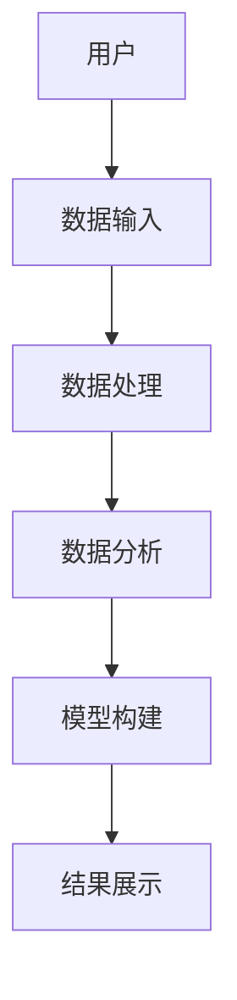
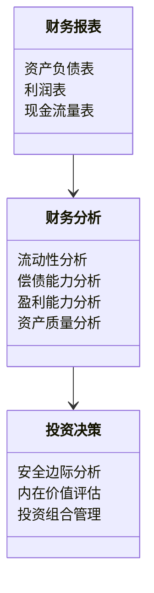

                 


# 格雷厄姆的财务报表分析：应对创新会计处理方法

> 关键词：财务报表分析，格雷厄姆，创新会计处理，价值投资，财务模型

> 摘要：本文系统地介绍了格雷厄姆的财务报表分析方法，重点探讨了如何应对创新的会计处理方法。通过详细分析财务报表的核心要素、格雷厄姆的十二条投资标准以及创新会计处理的识别与应对策略，本文为投资者提供了应对复杂财务报表分析挑战的实用指南。文章还结合实际案例，展示了如何构建财务模型和系统架构，帮助读者更好地理解和应用这些方法。

---

## 第一部分: 财务报表分析基础

### 第1章: 财务报表分析概述

#### 1.1 财务报表分析的基本概念

##### 1.1.1 财务报表分析的定义
财务报表分析是通过对企业的财务报表（包括资产负债表、利润表、现金流量表）进行研究，评估企业的财务状况、经营成果和现金流量，从而为投资决策提供依据的过程。

##### 1.1.2 财务报表分析的目的与意义
- **目的**：评估企业的偿债能力、盈利能力、营运能力和成长潜力。
- **意义**：帮助投资者、债权人和管理层做出更明智的决策。

##### 1.1.3 财务报表分析的核心要素
- **流动性**：企业偿还短期债务的能力。
- **偿债能力**：企业偿还长期债务的能力。
- **盈利能力**：企业创造利润的能力。
- **营运能力**：企业管理和运用资产的效率。

#### 1.2 财务报表的构成与勾稽关系

##### 1.2.1 资产负债表
资产负债表反映企业在某一特定日期的资产、负债和所有者权益的状况。

- **资产**：企业拥有的资源，包括流动资产（如现金、应收账款）和非流动资产（如固定资产）。
- **负债**：企业需要偿还的债务，包括流动负债（如应付账款）和非流动负债（如长期借款）。
- **所有者权益**：企业资产减去负债后的剩余部分。

##### 1.2.2 利润表
利润表反映企业在一定会计期间内的收入和费用情况，以及最终的净利润。

- **收入**：企业在销售商品或提供服务中获得的收入。
- **费用**：企业在经营过程中发生的各项支出。
- **净利润**：收入减去费用后的利润。

##### 1.2.3 现金流量表
现金流量表反映企业在一定会计期间内现金和现金等价物的流入和流出情况。

- **经营活动现金流**：企业日常经营活动中产生的现金流。
- **投资活动现金流**：企业投资活动产生的现金流。
- **筹资活动现金流**：企业筹资活动产生的现金流。

##### 1.2.4 三张报表的勾稽关系
- 资产负债表是财务状况的静态反映，而利润表和现金流量表是财务状况变化的动态反映。

#### 1.3 财务报表分析的常见方法

##### 1.3.1 比较分析法
通过比较不同期间或不同企业的财务数据，识别变化趋势。

##### 1.3.2 趋势分析法
分析财务数据在时间上的变化趋势，预测未来的发展。

##### 1.3.3 偏差分析法
分析实际数据与预期数据的偏差，找出问题所在。

##### 1.3.4 价值链分析法
从企业价值链的角度分析财务数据，识别关键环节。

---

### 第2章: 格雷厄姆的财务报表分析框架

#### 2.1 格雷厄姆的分析理念

##### 2.1.1 价值投资的核心思想
格雷厄姆认为，投资的本质是寻找具有内在价值的低估股票。

##### 2.1.2 财务报表分析在价值投资中的地位
财务报表分析是评估股票内在价值的核心工具。

##### 2.1.3 格雷厄姆的十二条投资标准
格雷厄姆提出了十二条投资标准，用于筛选具有安全边际的股票。

#### 2.2 格雷厄姆的十二条投资标准

##### 2.2.1 流动性分析
- **流动比率**：流动资产 / 流动负债。
- **速动比率**：（流动资产 - 存货）/ 流动负债。

##### 2.2.2 偿债能力分析
- **债务比率**：总负债 / 总资产。
- **利息保障倍数**：息税前利润 / 利息支出。

##### 2.2.3 资本结构分析
- **资产负债率**：总负债 / 总资产。
- **资本公积**：企业资本超过面值的部分。

##### 2.2.4 盈利能力分析
- **净利润率**：净利润 / 收入。
- **ROE（净资产收益率）**：净利润 / 所有者权益。

##### 2.2.5 股东权益分析
- **每股收益（EPS）**：净利润 / 平均股数。
- **股息率**：每股股息 / 当前股价。

##### 2.2.6 资产质量分析
- **存货周转率**：成本 of goods sold / 平均存货。
- **应收账款周转率**：收入 / 平均应收账款。

##### 2.2.7 财务杠杆分析
- **杠杆比率**：总负债 / 所有者权益。
- **净债务/EBITDA**：净债务 / 息税折旧及摊销前利润。

##### 2.2.8 管理层质量分析
- **管理层稳定性**：管理层是否稳定，是否有良好往绩。
- **管理层动机**：管理层是否追求短期利益还是长期价值。

##### 2.2.9 股票市场周期分析
- **市场周期**：识别市场的牛熊周期，避免在熊市中投资。
- **相对估值**：比较股票与行业平均估值的差异。

##### 2.2.10 安全边际分析
- **安全边际**：内在价值 - 市场价格。
- ** Margin of Safety（安全边际）**：通过买入价格低于内在价值的股票，降低投资风险。

##### 2.2.11 股票内在价值评估
- **DCF模型**：通过现金流折现法评估股票的内在价值。
- **PE（市盈率）**：股价 / 每股收益。
- **PB（市净率）**：股价 / 每股净资产。

##### 2.2.12 投资组合管理
- **分散投资**：避免过度集中，降低风险。
- **定期调整**：根据市场变化，定期调整投资组合。

---

### 第3章: 创新会计处理方法的挑战

#### 3.1 创新会计处理方法的背景

##### 3.1.1 会计准则的演变
- **国际会计准则（IAS）**：全球范围内统一的会计准则。
- **美国会计准则（GAAP）**：美国的会计准则。
- **IFRS（国际财务报告准则）**：进一步统一全球会计准则。

##### 3.1.2 创新会计处理的动机
- **提高企业估值**：通过创新会计处理，提高企业财务表现。
- **规避监管**：通过创新会计处理，规避监管机构的审查。
- **追求短期利益**：通过创新会计处理，实现短期财务目标。

##### 3.1.3 创新会计处理的常见形式
- **收入确认**：提前确认收入，虚增收入。
- **资产减值**：通过计提减值准备，掩盖资产质量问题。
- **合并财务报表**：通过合并财务报表，虚增资产和利润。
- **商誉处理**：通过商誉减值，掩盖资产贬值问题。
- **金融工具**：通过金融工具的创新，实现复杂的财务操作。

#### 3.2 创新会计处理方法的主要类型

##### 3.2.1 收入确认的创新
- **提前确认收入**：在收入实际收到之前确认收入。
- **延迟确认收入**：在收入实际收到之后确认收入。
- **收入虚增**：通过虚构交易，虚增收入。

##### 3.2.2 资产减值的创新
- **计提减值准备**：通过计提资产减值准备，掩盖资产贬值。
- **资产重分类**：通过改变资产类别，规避资产减值。
- **资产转移**：通过资产转移，实现资产贬值。

##### 3.2.3 合并财务报表的创新
- **虚增资产**：通过合并财务报表，虚增资产。
- **虚增利润**：通过合并财务报表，虚增利润。
- **关联交易**：通过关联交易，实现资产和利润的转移。

##### 3.2.4 商誉处理的创新
- **商誉减值**：通过商誉减值，掩盖资产贬值。
- **商誉转回**：通过商誉转回，虚增利润。
- **商誉重组**：通过商誉重组，实现资产贬值。

##### 3.2.5 金融工具的创新
- **衍生工具**：通过衍生工具，实现复杂的财务操作。
- **结构性金融工具**：通过结构性金融工具，实现特定的财务目标。
- **金融资产重分类**：通过金融资产重分类，改变财务报表的结构。

#### 3.3 创新会计处理方法的识别与应对

##### 3.3.1 创新会计处理的识别方法
- **财务数据异常**：识别财务数据中的异常变化。
- **财务比率分析**：通过财务比率分析，识别创新会计处理。
- **管理层动机**：分析管理层的动机，识别创新会计处理。

##### 3.3.2 创新会计处理的应对策略
- **加强审计**：通过独立审计，识别创新会计处理。
- **提高透明度**：要求企业提高财务报表的透明度。
- **加强监管**：通过加强监管，遏制创新会计处理。

##### 3.3.3 创新会计处理的案例分析
- **安然事件**：通过创新会计处理，虚增收入，最终导致公司破产。
- **世界通信**：通过创新会计处理，虚增利润，最终导致公司破产。
- **雷曼兄弟**：通过创新会计处理，虚增资产，最终导致公司破产。

---

### 第4章: 财务报表分析的系统化方法

#### 4.1 财务报表分析的系统架构

##### 4.1.1 数据收集与处理
- **数据来源**：收集企业的财务报表数据。
- **数据清洗**：对数据进行清洗，确保数据的准确性和完整性。

##### 4.1.2 数据分析与建模
- **数据分析**：通过数据分析，识别数据中的规律和趋势。
- **建模**：建立财务模型，评估企业的财务状况。

##### 4.1.3 数据可视化
- **图表展示**：通过图表展示分析结果。
- **仪表盘**：建立财务仪表盘，实时监控企业的财务状况。

#### 4.2 财务模型构建

##### 4.2.1 财务模型的核心要素
- **收入预测**：预测企业的未来收入。
- **成本预测**：预测企业的未来成本。
- **利润预测**：预测企业的未来利润。
- **现金流预测**：预测企业的未来现金流。

##### 4.2.2 财务模型的构建步骤
1. **数据收集**：收集企业的历史财务数据。
2. **数据清洗**：对数据进行清洗，确保数据的准确性和完整性。
3. **模型假设**：设定模型的假设条件，如增长率、利润率等。
4. **模型构建**：根据假设条件，构建财务模型。
5. **模型验证**：通过历史数据验证模型的准确性。
6. **模型应用**：将模型应用于未来的财务预测。

#### 4.3 系统架构设计

##### 4.3.1 系统功能设计
- **数据输入**：输入企业的财务数据。
- **数据分析**：对数据进行分析，生成财务报表。
- **模型构建**：构建财务模型，评估企业的财务状况。
- **结果展示**：展示分析结果，提供决策支持。

##### 4.3.2 系统架构图


##### 4.3.3 系统接口设计
- **数据接口**：与企业财务系统对接，获取财务数据。
- **用户界面**：提供友好的用户界面，方便用户操作。
- **输出接口**：输出分析结果，提供决策支持。

---

## 第五部分: 项目实战

### 第5章: 项目实战：格雷厄姆分析框架的应用

#### 5.1 项目背景

##### 5.1.1 项目介绍
- **项目目标**：通过格雷厄姆的分析框架，评估某企业的财务状况。
- **项目范围**：分析企业的财务报表，识别潜在的投资机会。
- **项目时间**：三个月。

#### 5.2 系统功能设计

##### 5.2.1 领域模型


#### 5.3 系统架构设计

##### 5.3.1 系统架构图


#### 5.4 系统实现

##### 5.4.1 环境安装
- **Python**：安装Python 3.9及以上版本。
- **Pandas**：安装Pandas库，用于数据处理。
- **Matplotlib**：安装Matplotlib库，用于数据可视化。
- **Plotly**：安装Plotly库，用于高级数据可视化。

##### 5.4.2 核心实现代码
```python
import pandas as pd
import matplotlib.pyplot as plt
import plotly.express as px

# 数据加载
df = pd.read_csv('financial_data.csv')

# 数据处理
df['profit_margin'] = df['净利润'] / df['收入']

# 数据可视化
plt.figure(figsize=(10,6))
plt.plot(df['年份'], df['profit_margin'], 'b-')
plt.title('盈利能力趋势')
plt.xlabel('年份')
plt.ylabel('利润率')
plt.show()

# 高级可视化
fig = px.line(df, x='年份', y='profit_margin', title='盈利能力趋势')
fig.show()
```

#### 5.5 案例分析

##### 5.5.1 案例背景
- **公司名称**：某互联网公司。
- **行业**：互联网行业。
- **财务数据**：过去五年的财务报表。

##### 5.5.2 分析过程
1. **数据加载与处理**：加载财务数据，计算关键财务指标。
2. **数据分析**：通过数据分析，识别公司的财务状况。
3. **模型构建**：构建财务模型，评估公司的内在价值。
4. **投资决策**：根据分析结果，做出投资决策。

#### 5.6 项目小结
- **项目成果**：成功构建了财务模型，评估了公司的内在价值。
- **经验总结**：格雷厄姆的分析框架在实际应用中非常有效，但需要结合具体情况进行调整。

---

## 第六部分: 最佳实践与小结

### 第6章: 最佳实践

#### 6.1 最佳实践 Tips
- **持续学习**：财务报表分析是一个不断学习的过程，需要关注会计准则的变化和市场的最新动态。
- **保持警惕**：对创新会计处理保持警惕，避免被误导。
- **结合实际**：结合企业的实际情况，灵活运用格雷厄姆的分析框架。

#### 6.2 小结
通过本文的系统讲解，读者可以掌握格雷厄姆的财务报表分析方法，并学会如何应对创新的会计处理方法。希望本文能为投资者提供有价值的参考，帮助他们在复杂多变的市场中做出明智的投资决策。

---

## 作者信息

作者：AI天才研究院/AI Genius Institute & 禅与计算机程序设计艺术/Zen And The Art of Computer Programming

---

**本文内容遵循CC BY-NC-SA 4.0协议，转载请注明出处。**

