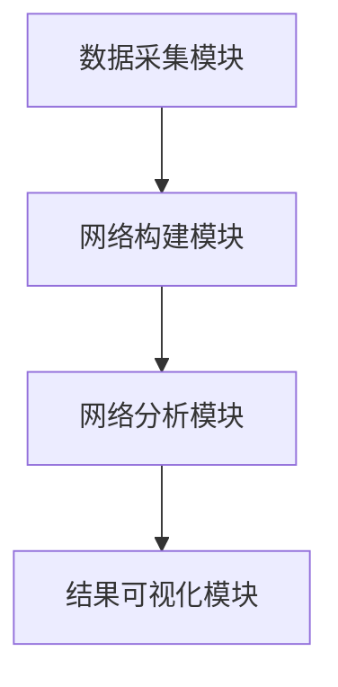

                 


# 特价股票投资中的全球创新网络分析方法

---

## 关键词：
- 特价股票投资
- 全球创新网络
- 网络分析方法
- 股票投资策略
- 系统架构设计

---

## 摘要：
本文探讨了如何利用全球创新网络分析方法优化特价股票投资策略。通过分析全球创新网络的结构特征，结合网络分析方法，提出了一种基于网络的股票筛选和风险评估模型。文章详细介绍了网络分析方法的原理、算法实现、数学模型，并通过实际案例展示了如何将全球创新网络分析方法应用于股票投资实战。最后，本文总结了全球创新网络分析方法的优势与不足，并提出了进一步研究的方向。

---

# 第1章: 特价股票投资与全球创新网络概述

## 1.1 特价股票投资的背景与特点
### 1.1.1 特价股票的定义与特点
特价股票是指价格低于市场平均水平的股票，通常具有较高的潜在回报率。其特点包括低估值、高成长潜力和较高的风险承受能力。  
**核心概念：**  
- **低估值：** 特价股票通常市场价格低于其内在价值。  
- **高成长潜力：** 特价股票往往属于成长型企业，具有较高的增长潜力。  
- **高风险：** 特价股票通常波动较大，投资风险较高。  

### 1.1.2 特价股票投资的潜在机会
- **市场低估：** 特价股票往往因市场波动或市场情绪被低估，存在较大的反弹空间。  
- **投资门槛低：** 特价股票的价格较低，适合中小投资者参与。  
- **高收益潜力：** 高成长潜力的企业通过股价上涨，能够为投资者带来超额收益。  

### 1.1.3 全球创新网络的基本概念
全球创新网络是指由全球范围内创新主体（如企业、研究机构、政府等）通过合作、竞争和知识共享形成的网络结构。其核心特征包括：  
- **知识共享：** 创新网络中的主体通过知识共享促进技术创新。  
- **合作与竞争：** 网络中的主体既合作又竞争，推动技术创新和产业升级。  
- **动态演化：** 全球创新网络随着技术进步和市场变化不断演化。  

## 1.2 全球创新网络的核心要素与结构
### 1.2.1 全球创新网络的定义
全球创新网络是通过全球范围内的创新主体之间的合作与竞争形成的网络结构，旨在推动技术创新和知识传播。

### 1.2.2 全球创新网络的核心要素
- **节点：** 创新网络中的主体，包括企业、研究机构、政府等。  
- **边：** 节点之间的连接，表示合作、竞争或知识共享关系。  
- **网络属性：** 包括网络密度、中心性、凝聚性等。  

### 1.2.3 全球创新网络的结构特征
- **中心性：** 网络中的某些节点（如龙头企业）具有较高的中心性，能够影响整个网络的结构。  
- **模块化：** 网络可以划分为多个模块，每个模块代表特定领域的创新活动。  
- **动态性：** 网络结构随时间和市场变化而不断调整。  

## 1.3 特价股票投资中的全球创新网络分析方法
### 1.3.1 全球创新网络分析方法的定义
全球创新网络分析方法是一种通过分析创新网络的结构特征，识别潜在投资机会的方法。

### 1.3.2 网络分析方法的特点
- **数据驱动：** 基于实际数据构建网络模型。  
- **可视化：** 通过网络图直观展示节点之间的关系。  
- **动态分析：** 能够捕捉网络结构的动态变化。  

### 1.3.3 全球创新网络分析方法的应用场景
- **股票筛选：** 通过网络分析识别具有高成长潜力的企业。  
- **风险评估：** 分析网络结构中的风险传播路径。  
- **趋势预测：** 基于网络结构预测股价走势。  

## 1.4 本章小结
本章介绍了特价股票投资的背景与特点，以及全球创新网络的基本概念和结构特征。通过网络分析方法，可以为特价股票投资提供新的视角和策略。

---

# 第2章: 全球创新网络的结构与分析方法

## 2.1 全球创新网络的节点与边
### 2.1.1 节点的定义与属性
- **节点：** 创新网络中的主体，如企业、研究机构等。  
- **属性：** 包括创新能力、市场地位、研发投入等。  

### 2.1.2 边的定义与属性
- **边：** 表示节点之间的关系，如合作关系、竞争关系。  
- **权重：** 表示关系的强度，可以通过数据进行量化。  

### 2.1.3 节点与边的关系
- **网络密度：** 表示网络中边的密度，反映网络的紧密程度。  
- **中心性：** 表示节点在网络中的重要程度，通常通过度数、接近中心性等指标衡量。  

## 2.2 全球创新网络的构建与分析
### 2.2.1 网络构建的基本步骤
1. **数据收集：** 收集创新主体之间的合作、竞争数据。  
2. **网络构建：** 基于数据构建网络模型。  
3. **网络分析：** 分析网络的结构特征。  

### 2.2.2 网络分析的主要方法
- **社会网络分析（SNA）：** 分析网络的中心性、凝聚性等特征。  
- **文本挖掘：** 从文献、专利等数据中提取关键词，构建网络。  

### 2.2.3 分析工具与技术
- **工具：** Gephi、NetworkX、igraph等。  
- **技术：** 社会网络分析、文本挖掘、聚类分析等。  

## 2.3 全球创新网络的特征提取
### 2.3.1 中心性分析
- **度数中心性：** 表示节点的直接连接数量。  
- **接近中心性：** 表示节点到其他节点的最短路径长度。  
- **中间中心性：** 表示节点作为桥梁的重要性。  

### 2.3.2 网络密度与凝聚性
- **网络密度：** 表示网络中边的密度，反映网络的紧密程度。  
- **凝聚性：** 表示网络中节点的聚类程度，通常通过聚类系数衡量。  

### 2.3.3 网络演化分析
- **网络演化：** 分析网络结构随时间的变化。  
- **节点变化：** 包括节点的加入、退出和属性变化。  

## 2.4 本章小结
本章详细介绍了全球创新网络的节点与边的定义，构建与分析方法，以及网络的特征提取。这些内容为后续的网络分析方法在股票投资中的应用奠定了基础。

---

# 第3章: 网络分析方法在股票投资中的应用

## 3.1 特价股票投资中的网络分析方法
### 3.1.1 网络分析方法的适用性
- **数据驱动：** 网络分析方法基于实际数据，具有较高的适用性。  
- **可视化：** 网络图能够直观展示股票之间的关系。  
- **动态分析：** 网络分析能够捕捉股票市场的动态变化。  

### 3.1.2 网络分析方法的优势
- **全局视角：** 网络分析能够从整体上把握市场的结构特征。  
- **风险预警：** 通过网络结构分析，可以提前发现潜在风险。  
- **投资机会识别：** 通过网络分析，可以发现具有高成长潜力的股票。  

### 3.1.3 网络分析方法的局限性
- **数据依赖性：** 网络分析依赖于高质量的数据支持。  
- **计算复杂性：** 大规模网络分析需要较高的计算资源。  

## 3.2 特价股票投资中的网络特征提取
### 3.2.1 股票网络的构建
- **数据来源：** 包括股票价格、交易数据、公司新闻等。  
- **网络构建：** 基于股票之间的关联性构建网络。  

### 3.2.2 股票网络的特征提取
- **中心性分析：** 识别网络中的核心股票。  
- **网络密度分析：** 分析股票市场的整体活跃程度。  
- **模块化分析：** 将股票市场划分为不同的板块。  

### 3.2.3 股票网络的分析与解读
- **核心股票：** 中心性较高的股票具有较高的投资价值。  
- **模块化分析：** 不同模块代表不同的市场板块，具有不同的投资策略。  

## 3.3 网络分析方法在股票投资中的实际应用
### 3.3.1 网络分析方法在股票筛选中的应用
- **基于中心性筛选：** 选择中心性较高的股票作为投资标的。  
- **基于模块化筛选：** 根据模块化分析结果，选择具有高成长潜力的板块。  

### 3.3.2 网络分析方法在股票风险评估中的应用
- **风险传播路径分析：** 通过网络结构分析风险的传播路径。  
- **风险节点识别：** 识别网络中的高风险节点，提前规避风险。  

### 3.3.3 网络分析方法在股票趋势预测中的应用
- **趋势预测模型：** 基于网络结构和历史数据，构建趋势预测模型。  
- **网络动态分析：** 分析网络结构的动态变化，预测股价走势。  

## 3.4 本章小结
本章详细介绍了网络分析方法在股票投资中的实际应用，包括股票筛选、风险评估和趋势预测等方面。

---

# 第4章: 特价股票投资中的全球创新网络分析方法

## 4.1 全球创新网络分析方法的原理
### 4.1.1 网络构建
- **数据来源：** 包括全球创新网络中的企业、研究机构等主体之间的合作、竞争数据。  
- **网络构建：** 基于数据构建全球创新网络模型。  

### 4.1.2 网络分析
- **中心性分析：** 识别全球创新网络中的核心主体。  
- **模块化分析：** 将全球创新网络划分为不同的创新领域。  
- **网络演化分析：** 分析全球创新网络的动态变化。  

## 4.2 特价股票投资中的全球创新网络分析方法
### 4.2.1 特价股票的网络特征
- **低估值：** 特价股票通常具有较高的中心性。  
- **高成长潜力：** 特价股票通常位于创新网络的核心区域。  

### 4.2.2 全球创新网络分析方法的应用
- **股票筛选：** 通过全球创新网络分析，识别具有高成长潜力的特价股票。  
- **风险评估：** 通过全球创新网络分析，评估特价股票的投资风险。  

## 4.3 本章小结
本章详细介绍了全球创新网络分析方法的原理及其在特价股票投资中的应用，为后续的项目实战奠定了基础。

---

# 第5章: 全球创新网络分析方法的数学模型与算法

## 5.1 网络分析方法的数学模型
### 5.1.1 中心性分析的数学模型
- **度数中心性：** \( C_d(i) = \frac{1}{N-1} \sum_{j} A_{ij} \)  
  其中，\( A_{ij} \) 表示节点 \( i \) 和节点 \( j \) 之间是否存在边，\( N \) 表示网络中的节点总数。  

- **接近中心性：** \( C_a(i) = \frac{1}{\sum_{j} d(i,j)} \)  
  其中，\( d(i,j) \) 表示节点 \( i \) 和节点 \( j \) 之间的最短路径长度。  

### 5.1.2 模块化分析的数学模型
- **模块化系数：** \( Q = \sum_{i} [e_i - \frac{a_i l_i}{2}] \)  
  其中，\( e_i \) 表示模块内边的数量，\( a_i \) 表示模块内节点的度数总和，\( l_i \) 表示模块内节点的期望边数。  

## 5.2 网络分析算法的实现
### 5.2.1 社会网络分析算法
- **度数中心性算法：** 使用 NetworkX 库中的 `degree centrality` 方法计算度数中心性。  
- **接近中心性算法：** 使用 NetworkX 库中的 `preference` 方法计算接近中心性。  

### 5.2.2 文本挖掘算法
- **关键词提取：** 使用 TF-IDF 方法提取文本中的关键词。  
- **主题建模：** 使用 LDA（Latent Dirichlet Allocation）方法进行主题建模。  

## 5.3 本章小结
本章详细介绍了网络分析方法的数学模型与算法实现，为后续的系统设计和项目实战奠定了基础。

---

# 第6章: 全球创新网络分析方法的系统架构设计

## 6.1 问题场景与需求分析
### 6.1.1 问题场景
- **数据来源：** 包括全球创新网络中的企业、研究机构等主体之间的合作、竞争数据。  
- **目标：** 构建一个基于全球创新网络分析方法的股票投资系统。  

### 6.1.2 系统需求
- **功能需求：** 包括数据采集、网络构建、网络分析、结果可视化等。  
- **性能需求：** 系统需要能够处理大规模数据，保证分析效率。  

## 6.2 系统功能设计
### 6.2.1 数据采集模块
- **功能描述：** 采集全球创新网络中的数据，包括企业、研究机构等主体之间的合作、竞争数据。  
- **关键技术：** 网络爬虫、数据清洗。  

### 6.2.2 网络构建模块
- **功能描述：** 基于采集的数据，构建全球创新网络模型。  
- **关键技术：** 图数据库、网络分析算法。  

### 6.2.3 网络分析模块
- **功能描述：** 分析网络的结构特征，包括中心性、模块化等。  
- **关键技术：** 社会网络分析、文本挖掘。  

### 6.2.4 结果可视化模块
- **功能描述：** 将分析结果可视化，包括网络图、中心性分布图等。  
- **关键技术：** 图形绘制库（如 Matplotlib、Gephi）。  

## 6.3 系统架构设计
### 6.3.1 系统架构图


### 6.3.2 系统接口设计
- **数据接口：** 数据采集模块与网络构建模块之间的接口。  
- **分析接口：** 网络分析模块与结果可视化模块之间的接口。  

## 6.4 本章小结
本章详细介绍了全球创新网络分析方法的系统架构设计，包括功能设计和架构图。这些内容为后续的项目实战奠定了基础。

---

# 第7章: 项目实战与案例分析

## 7.1 环境安装与配置
### 7.1.1 系统环境
- **操作系统：** Windows/Mac/Linux  
- **编程语言：** Python  
- **依赖库：** NetworkX、Matplotlib、Gephi  

### 7.1.2 安装步骤
```bash
pip install networkx matplotlib gephi
```

## 7.2 系统核心实现
### 7.2.1 数据采集与清洗
```python
import requests
from bs4 import BeautifulSoup

def fetch_data(url):
    response = requests.get(url)
    soup = BeautifulSoup(response.text, 'html.parser')
    # 数据清洗与提取
    data = []  # 提取的数据
    return data
```

### 7.2.2 网络构建与分析
```python
import networkx as nx

def build_network(data):
    G = nx.Graph()
    for edge in data:
        G.add_edge(edge[0], edge[1])
    return G
```

### 7.2.3 结果可视化
```python
import matplotlib.pyplot as plt

def visualize_network(G):
    nx.draw(G, node_size=500, node_color='blue', edge_color='red')
    plt.show()
```

## 7.3 案例分析与解读
### 7.3.1 数据来源与网络构建
- **数据来源：** 某个行业的全球创新网络数据。  
- **网络构建：** 基于数据构建网络模型。  

### 7.3.2 分析结果解读
- **中心性分析：** 识别网络中的核心主体。  
- **模块化分析：** 将网络划分为不同的模块。  

## 7.4 本章小结
本章通过项目实战展示了全球创新网络分析方法的实现过程，包括环境安装、系统核心实现、案例分析与解读。

---

# 第8章: 总结与展望

## 8.1 全文总结
本文详细介绍了全球创新网络分析方法在特价股票投资中的应用，包括网络分析方法的原理、算法实现、系统架构设计以及项目实战。通过网络分析方法，可以为特价股票投资提供新的视角和策略。

## 8.2 最佳实践 tips
- **数据质量：** 数据质量是网络分析的基础，需确保数据的准确性和完整性。  
- **算法选择：** 根据具体需求选择合适的网络分析算法。  
- **结果解读：** 网络分析结果需要结合具体业务背景进行解读。  

## 8.3 未来展望
- **算法优化：** 进一步优化网络分析算法，提高分析效率。  
- **应用场景扩展：** 将网络分析方法应用于更多领域，如金融、医疗等。  
- **数据源扩展：** 探索更多数据源，丰富网络分析的数据基础。  

## 8.4 本章小结
本章总结了全文内容，并对未来的研究方向进行了展望。

---

# 作者：AI天才研究院/AI Genius Institute & 禅与计算机程序设计艺术 /Zen And The Art of Computer Programming

