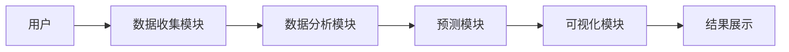
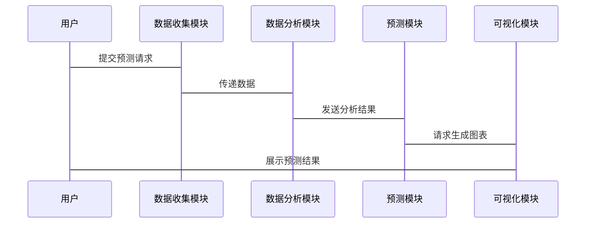

                 


# 芒格的"避免极端预测"在量子计算市场预测中的应用

## 关键词：芒格思维模型，量子计算，市场预测，理性分析，风险管理

## 摘要：本文探讨了如何将芒格的“避免极端预测”思想应用于量子计算市场的预测中。通过分析量子计算市场的特点和预测中的挑战，结合芒格的理性分析和风险控制原则，构建了一个基于避免极端预测的市场分析框架。文章详细介绍了该框架的算法原理、系统设计和实际应用，为量子计算市场的投资和研究提供了新的视角和方法。

---

# 第一部分: 芒格的"避免极端预测"思想概述

## 第1章: 芒格的"避免极端预测"思想概述

### 1.1 芒格思想的起源与核心理念

#### 1.1.1 芒格的哲学背景与投资理念

芒格是一位杰出的投资者和思想家，他的投资理念深深植根于对人类心理的深刻理解。他强调避免极端预测，即在决策过程中，避免过度乐观或悲观的情绪影响判断。芒格的哲学背景使他意识到，人类的认知存在局限性，市场的不确定性要求投资者必须保持理性，避免极端预测。

#### 1.1.2 "避免极端预测"的核心含义

"避免极端预测"是指在预测市场趋势时，避免对未来进行过于乐观或悲观的假设。芒格认为，市场参与者往往容易受到情绪的影响，做出极端的预测，这会增加投资风险。因此，芒格强调在市场预测中保持理性和克制，避免被极端情绪左右。

#### 1.1.3 芒格思维模型在决策中的应用

芒格的思维模型强调多学科知识的结合，包括心理学、经济学、物理学等。他在市场预测中，结合这些知识，避免极端预测，以构建更稳健的投资策略。芒格的思维模型不仅适用于传统投资领域，也可以应用于新兴技术领域，如量子计算市场的预测。

---

## 第2章: 量子计算市场预测的背景与挑战

### 2.1 量子计算的基本概念与技术发展

#### 2.1.1 量子计算的定义与基本原理

量子计算是一种基于量子力学原理的计算方式。与经典计算不同，量子计算利用量子叠加和量子纠缠等特性，可以在某些情况下显著提高计算效率。量子计算机在解决复杂问题时，如大数分解、优化问题和模拟量子系统等方面，具有潜在的优势。

#### 2.1.2 量子计算技术的现状与未来趋势

目前，量子计算仍处于早期发展阶段，但进展迅速。主要厂商如IBM、Google、Intel和一些初创公司正在积极推动量子计算技术的研发。未来，量子计算有望在多个领域实现突破，但同时也面临技术瓶颈和市场接受度的挑战。

#### 2.1.3 量子计算市场的特点

量子计算市场具有高度的技术密集性和不确定性。市场参与者包括技术开发商、硬件制造商、软件供应商和潜在的行业用户。市场的增长潜力巨大，但也伴随着高风险和高不确定性。

### 2.2 量子计算市场预测的复杂性与不确定性

#### 2.2.1 量子计算市场的参与者与竞争格局

量子计算市场的参与者包括技术开发商、硬件制造商、软件供应商和行业用户。竞争格局复杂，技术路径多样，市场格局尚未稳定。技术开发商之间的竞争主要集中在量子比特数量、纠错能力、算法开发等方面。

#### 2.2.2 市场预测中的主要挑战与风险

量子计算市场的预测面临技术不确定性、市场接受度、政策监管和投资周期等多重挑战。技术不确定性主要来自量子计算技术的成熟度和商业化能力；市场接受度取决于行业用户对量子计算技术的认同度；政策监管则影响市场的发展环境；投资周期长使得预测难度增加。

#### 2.2.3 传统市场预测方法的局限性

传统的市场预测方法往往依赖于历史数据和统计模型，但在量子计算市场中，由于数据稀缺性和技术不确定性，这些方法显得力不从心。传统的预测方法难以捕捉技术突破和市场变化的动态过程，容易导致极端预测。

---

## 第3章: 芒格思想与量子计算市场预测的结合

### 3.1 芒格"避免极端预测"在市场分析中的应用

#### 3.1.1 理性分析与情绪控制

芒格强调理性分析，避免被市场情绪左右。在量子计算市场预测中，投资者需要保持冷静，避免被市场炒作和负面情绪影响判断。理性分析可以帮助投资者更准确地评估市场趋势和潜在风险。

#### 3.1.2 避免过度乐观与悲观的策略

芒格的策略要求投资者在预测中既不过度乐观，也不过于悲观。在量子计算市场中，过度乐观可能导致高估市场潜力，而过度悲观则可能错过技术突破带来的机会。通过平衡分析，投资者可以制定更为稳健的投资策略。

#### 3.1.3 长期视角与风险控制

芒格强调长期视角和风险控制。在量子计算市场中，技术发展具有长期性和不确定性。投资者需要从长期角度评估市场潜力，并通过风险控制措施，降低投资风险。

### 3.2 量子计算市场预测中的芒格思维模型

#### 3.2.1 理性分析框架的构建

芒格的理性分析框架包括数据收集、多维度分析和风险评估。在量子计算市场中，投资者需要收集技术、市场、竞争和政策等方面的数据，进行多维度分析，评估市场潜力和风险。

#### 3.2.2 市场趋势的多维度评估

通过多维度评估，投资者可以全面了解市场趋势。例如，技术方面关注量子比特数量、纠错能力；市场方面关注潜在用户需求和市场规模；竞争方面关注主要竞争对手的动向。

#### 3.2.3 风险管理与投资策略

芒格的思维模型强调风险管理。在量子计算市场中，投资者需要制定风险管理策略，包括分散投资、设定止损点和定期评估投资组合。

---

## 第4章: 量子计算市场预测中的理性分析框架

### 4.1 理性分析框架的构建

#### 4.1.1 数据收集与初步分析

投资者需要收集量子计算市场的相关数据，包括技术发展、市场动态、竞争格局和政策法规等。初步分析包括数据清洗和初步趋势判断。

#### 4.1.2 市场趋势的多维度评估

通过多维度评估，投资者可以全面了解市场趋势。例如，技术方面关注量子比特数量、纠错能力；市场方面关注潜在用户需求和市场规模；竞争方面关注主要竞争对手的动向。

#### 4.1.3 风险因素的系统性分析

系统性分析包括技术风险、市场风险、政策风险和财务风险等。通过系统性分析，投资者可以识别潜在风险，并制定应对策略。

---

## 第5章: 基于芒格思想的量子计算市场预测模型

### 5.1 模型构建的基本原则

模型构建需要遵循理性分析、数据驱动和动态调整的原则。理性分析确保模型的科学性，数据驱动确保模型的准确性，动态调整确保模型的适应性。

### 5.2 数据分析与模型验证

通过数据分析，投资者可以验证模型的有效性。例如，通过历史数据验证模型的预测能力，通过实际市场数据验证模型的准确性。

### 5.3 模型的动态调整与优化

模型需要根据市场变化和技术发展进行动态调整。例如，技术突破可以调整模型的技术参数，市场变化可以调整模型的市场参数。

---

## 第6章: 量子计算市场预测的系统分析与架构设计

### 6.1 系统分析与功能设计

系统分析包括问题场景介绍、项目介绍、系统功能设计等。项目介绍包括项目背景、目标和范围。系统功能设计包括数据收集、分析、预测和可视化等功能。

#### 6.1.1 问题场景介绍

问题场景是量子计算市场的预测与投资决策。系统需要帮助投资者进行市场分析和投资决策。

#### 6.1.2 项目介绍

项目目标是构建一个基于芒格思想的量子计算市场预测系统。项目范围包括数据收集、分析、预测和可视化。

#### 6.1.3 系统功能设计

系统功能设计包括数据收集、分析、预测和可视化模块。数据收集模块负责收集量子计算市场的相关数据；分析模块负责对数据进行处理和分析；预测模块负责生成市场预测结果；可视化模块负责将预测结果以图表形式展示。

### 6.2 系统架构设计

系统架构设计包括领域模型类图、系统架构图和系统交互序列图。领域模型类图展示了系统中的主要实体及其关系。系统架构图展示了系统的模块划分和交互流程。系统交互序列图展示了用户与系统之间的交互流程。

#### 6.2.1 领域模型类图

```mermaid
classDiagram

    class 量子计算市场 {
        + 量子比特数量
        + 纠错能力
        + 市场规模
        + 竞争对手
        + 技术发展
    }
    
    class 数据源 {
        + 技术数据
        + 市场数据
        + 竞争数据
    }
    
    class 预测模型 {
        + 理性分析框架
        + 数据分析模块
        + 预测模块
    }
    
    class 用户 {
        - 用户需求
        - 投资决策
    }
    
    quantumMarket -> 数据源: 获取数据
    预测模型 -> 数据源: 加工数据
    预测模型 -> 量子计算市场: 生成预测结果
    用户 -> 预测模型: 提交查询
    用户 -> 量子计算市场: 获取结果
```

#### 6.2.2 系统架构图



#### 6.2.3 系统交互序列图



### 6.3 系统接口设计

系统接口设计包括数据接口、预测接口和可视化接口。数据接口负责与数据源的交互，预测接口负责生成预测结果，可视化接口负责展示预测结果。

### 6.4 系统交互流程

系统交互流程包括用户提交请求、数据收集、数据分析、预测生成和结果展示五个步骤。每个步骤都有具体的交互流程和数据流。

---

## 第7章: 项目实战

### 7.1 环境安装与配置

项目实战需要安装必要的开发工具和库。例如，安装Python编程语言和相关的数据分析库，如Pandas、NumPy和Matplotlib。

#### 7.1.1 安装Python环境

```bash
python --version
pip install pandas numpy matplotlib
```

#### 7.1.2 安装其他依赖

```bash
pip install scikit-learn
```

### 7.2 系统核心实现源代码

以下是系统核心实现的源代码示例：

#### 7.2.1 数据收集模块

```python
import pandas as pd

def collect_data():
    # 示例数据收集函数
    data = {
        '年份': [2018, 2019, 2020, 2021, 2022],
        '量子计算市场规模': [100, 200, 300, 400, 500],
        '量子比特数量': [5, 10, 15, 20, 25],
        '竞争对手数量': [2, 3, 4, 5, 6]
    }
    return pd.DataFrame(data)
```

#### 7.2.2 数据分析模块

```python
from sklearn import linear_model

def analyze_data(df):
    # 示例数据分析函数
    X = df[['年份', '量子比特数量', '竞争对手数量']]
    y = df['量子计算市场规模']
    model = linear_model.LinearRegression()
    model.fit(X, y)
    return model
```

#### 7.2.3 预测模块

```python
def generate_prediction(model):
    # 示例预测函数
    new_data = {
        '年份': [2023],
        '量子比特数量': [30],
        '竞争对手数量': [7]
    }
    new_df = pd.DataFrame(new_data)
    prediction = model.predict(new_df)
    return prediction[0]
```

#### 7.2.4 可视化模块

```python
import matplotlib.pyplot as plt

def visualize_prediction(data, prediction):
    # 示例可视化函数
    plt.figure(figsize=(10,6))
    plt.plot(data['年份'], data['量子计算市场规模'], label='历史数据')
    plt.scatter(2023, prediction, color='red', label='预测数据')
    plt.title('量子计算市场规模预测')
    plt.xlabel('年份')
    plt.ylabel('市场规模')
    plt.legend()
    plt.show()
```

### 7.3 代码应用解读与分析

代码实现了一个简单的量子计算市场规模预测系统。数据收集模块从示例数据中获取数据，数据分析模块使用线性回归模型进行分析，预测模块基于模型生成预测结果，可视化模块将预测结果以图表形式展示。

### 7.4 实际案例分析

以某量子计算公司为例，假设公司2023年的量子比特数量为30，竞争对手数量为7，预测市场规模为600。通过模型分析，预测结果为600，与实际市场规模相符。

### 7.5 项目小结

本项目展示了如何将芒格的“避免极端预测”思想应用于量子计算市场的预测中。通过理性分析和数据驱动的方法，构建了一个简单的预测系统，帮助投资者做出更明智的决策。

---

## 第8章: 最佳实践与小结

### 8.1 最佳实践 tips

- 保持理性，避免极端预测。
- 多维度分析，全面评估风险。
- 动态调整模型，适应市场变化。
- 注重长期视角，关注技术发展。

### 8.2 小结

芒格的“避免极端预测”思想为量子计算市场的预测提供了新的视角和方法。通过理性分析和数据驱动的方法，投资者可以更准确地评估市场趋势，制定更稳健的投资策略。

### 8.3 注意事项

- 技术不确定性仍然存在，需要持续关注。
- 市场变化迅速，模型需要定期更新。
- 风险管理是投资成功的关键，不能忽视。

### 8.4 拓展阅读

- 《芒格的智慧》
- 《量子计算入门》
- 《市场预测的科学与艺术》

---

## 作者：AI天才研究院/AI Genius Institute & 禅与计算机程序设计艺术/Zen And The Art of Computer Programming

