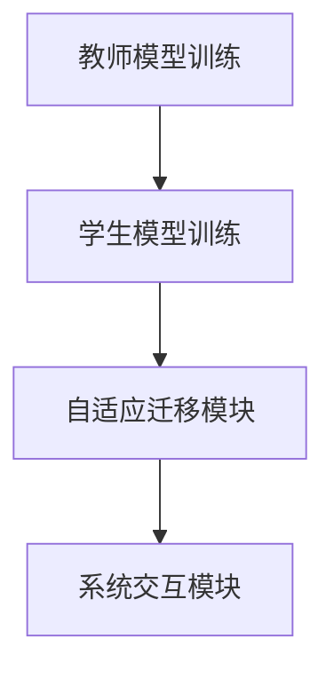
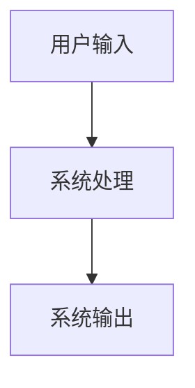

                 


# 设计AI Agent的自适应知识蒸馏与迁移

> 关键词：AI Agent, 知识蒸馏, 自适应迁移学习, 算法设计, 系统架构, 项目实战

> 摘要：本文系统地探讨了AI Agent的自适应知识蒸馏与迁移设计。首先，介绍了AI Agent的基本概念及其在知识蒸馏与迁移学习中的应用背景。接着，详细阐述了自适应知识蒸馏与迁移学习的核心原理、数学模型及算法实现。通过实际项目案例，展示了如何设计和实现自适应知识蒸馏与迁移学习系统，并提供了系统的架构设计和实现细节。最后，总结了当前的研究成果，并展望了未来的发展方向。

---

# 第1章: AI Agent的背景与概念

## 1.1 AI Agent的基本概念
### 1.1.1 AI Agent的定义
AI Agent（人工智能代理）是指能够感知环境、自主决策并执行任务的智能实体。它可以是一个软件程序、机器人或其他智能系统，具备以下核心特征：
- **自主性**：能够在没有外部干预的情况下独立运行。
- **反应性**：能够根据环境反馈实时调整行为。
- **目标导向性**：基于明确的目标执行任务。

### 1.1.2 AI Agent的核心特征
1. **自主性**：AI Agent能够自主决策，无需人工干预。
2. **智能性**：具备学习、推理和问题解决能力。
3. **适应性**：能够根据环境变化自适应调整行为。
4. **交互性**：能够与用户或其他系统进行交互。

### 1.1.3 AI Agent的应用场景
- **智能助手**：如Siri、Alexa等，用于日常生活中的信息查询、任务管理。
- **自动驾驶**：如自动驾驶汽车，能够实时感知环境并做出驾驶决策。
- **推荐系统**：根据用户行为推荐个性化内容。

---

## 1.2 知识蒸馏与迁移学习的背景
### 1.2.1 知识蒸馏的定义
知识蒸馏（Knowledge Distillation）是一种将复杂模型的知识迁移到简单模型的技术。其核心思想是通过教师模型（Teacher）指导学生模型（Student），使学生模型学习到教师模型的决策边界。

### 1.2.2 迁移学习的定义
迁移学习（Transfer Learning）是指将一个领域中学到的知识应用到另一个相关领域的技术。其核心在于发现不同任务之间的共性，从而减少数据依赖性。

### 1.2.3 自适应知识蒸馏与迁移的必要性
- **数据不足**：在某些领域中，数据量有限，直接训练模型难以获得良好的性能。
- **领域适应**：不同领域之间的数据分布可能存在差异，直接迁移可能导致性能下降。
- **模型轻量化**：通过知识蒸馏，可以将复杂模型的知识迁移到轻量级模型，提升推理效率。

---

## 1.3 本章小结
本章介绍了AI Agent的基本概念及其应用场景，并重点阐述了知识蒸馏与迁移学习的背景。通过对比分析，明确了自适应知识蒸馏与迁移学习的重要性及其在AI Agent设计中的必要性。

---

# 第2章: 自适应知识蒸馏与迁移的核心概念

## 2.1 知识蒸馏的原理
### 2.1.1 知识蒸馏的基本流程
1. **教师模型训练**：首先训练一个高性能的教师模型。
2. **学生模型学习**：通过知识蒸馏技术，使学生模型学习教师模型的知识。
3. **蒸馏过程优化**：调整蒸馏温度、损失函数等参数，优化蒸馏效果。

### 2.1.2 知识蒸馏的关键技术
- **温度缩放（Temperature Scaling）**：通过调整输出概率分布的“软化”程度，使学生模型能够更好地拟合教师模型的决策边界。
- **对抗蒸馏（Adversarial Distillation）**：通过生成对抗网络（GAN）进行蒸馏，增强模型的鲁棒性。

### 2.1.3 知识蒸馏的优缺点
优点：
- **模型轻量化**：通过蒸馏，可以将大模型的知识迁移到小模型，减少计算资源消耗。
- **提升泛化能力**：学生模型能够继承教师模型的泛化能力。
缺点：
- **依赖教师模型**：蒸馏效果依赖教师模型的性能，教师模型不佳可能导致蒸馏失败。

---

## 2.2 自适应迁移学习的原理
### 2.2.1 自适应迁移学习的基本概念
自适应迁移学习（Adaptive Transfer Learning）是指在目标领域数据有限的情况下，通过自适应调整迁移策略，使源领域知识更好地适用于目标领域。

### 2.2.2 自适应迁移学习的核心技术
- **领域适配（Domain Adaptation）**：通过调整特征分布，使源领域和目标领域的数据分布尽可能接近。
- **任务适配（Task Adaptation）**：根据目标任务的需求，调整模型的输出层或高层特征。

### 2.2.3 自适应迁移学习的优缺点
优点：
- **减少数据依赖**：在目标领域数据不足的情况下，能够有效利用源领域的知识。
- **提升模型泛化能力**：通过自适应调整，使模型更好地适应目标领域。
缺点：
- **计算复杂度高**：自适应调整需要额外的计算资源。
- **需要领域对齐**：领域对齐效果不佳可能导致迁移失败。

---

## 2.3 自适应知识蒸馏与迁移的对比分析
### 2.3.1 知识蒸馏与迁移学习的异同
| 特性            | 知识蒸馏                          | 迁移学习                          |
|-----------------|-----------------------------------|-----------------------------------|
| 目标            | 将教师模型的知识迁移到学生模型    | 将源领域的知识迁移到目标领域      |
| 适用场景        | 数据量大、模型复杂                | 数据量小、领域差异大              |
| 技术手段        | 温度缩放、对抗蒸馏                | 领域适配、任务适配                |

### 2.3.2 自适应知识蒸馏与迁移的独特性
- **结合蒸馏与迁移**：通过自适应调整，将蒸馏与迁移学习结合起来，实现更高效的模型迁移。
- **动态调整**：根据目标领域的特点，动态调整蒸馏和迁移策略。

---

## 2.4 本章小结
本章详细阐述了知识蒸馏和自适应迁移学习的核心原理，并通过对比分析，明确了自适应知识蒸馏与迁移的独特性和优势。

---

# 第3章: 知识蒸馏的数学模型与算法

## 3.1 知识蒸馏的基本数学模型
### 3.1.1 知识蒸馏的目标函数
知识蒸馏的目标函数通常包括两部分：
1. **学生模型的交叉熵损失**：衡量学生模型预测结果与真实标签的差异。
2. **蒸馏损失**：衡量学生模型预测结果与教师模型预测结果的差异。

目标函数为：
$$
\mathcal{L}_{\text{distill}} = \lambda_1 \mathcal{L}_{\text{CE}} + \lambda_2 \mathcal{L}_{\text{KL}}
$$
其中，$\lambda_1$ 和 $\lambda_2$ 是调节参数，$\mathcal{L}_{\text{CE}}$ 是交叉熵损失，$\mathcal{L}_{\text{KL}}$ 是KL散度损失。

### 3.1.2 知识蒸馏的损失函数
知识蒸馏的损失函数通常采用KL散度来衡量教师模型和学生模型预测概率的差异：
$$
\mathcal{L}_{\text{KL}} = \text{KL}(P_{\text{teacher}} || P_{\text{student}})
$$

### 3.1.3 知识蒸馏的优化算法
优化算法通常采用随机梯度下降（SGD）或Adam优化器，优化目标函数：
$$
\mathcal{L}_{\text{total}} = \mathcal{L}_{\text{task}} + \mathcal{L}_{\text{distill}}
$$

---

## 3.2 自适应知识蒸馏的数学模型
### 3.2.1 自适应知识蒸馏的目标函数
自适应知识蒸馏的目标函数需要同时考虑任务目标和领域适应：
$$
\mathcal{L}_{\text{adapt-distill}} = \lambda_1 \mathcal{L}_{\text{task}} + \lambda_2 \mathcal{L}_{\text{distill}}
$$

### 3.2.2 自适应知识蒸馏的损失函数
自适应知识蒸馏的损失函数需要引入领域适配项：
$$
\mathcal{L}_{\text{adapt}} = \mathcal{L}_{\text{distill}} + \lambda_3 \mathcal{L}_{\text{domain}}
$$

### 3.2.3 自适应知识蒸馏的优化算法
优化算法需要同时优化任务目标和领域适配：
$$
\min_{\theta} \mathcal{L}_{\text{adapt-distill}}
$$

---

## 3.3 算法流程图
```mermaid
graph TD
    A[开始] -> B[训练教师模型]
    B -> C[训练学生模型]
    C -> D[计算蒸馏损失]
    D -> E[优化目标函数]
    E -> F[结束]
```

---

## 3.4 本章小结
本章通过数学公式和流程图，详细讲解了知识蒸馏和自适应知识蒸馏的数学模型与优化算法。

---

# 第4章: 自适应迁移学习的数学模型与算法

## 4.1 自适应迁移学习的基本数学模型
### 4.1.1 自适应迁移学习的目标函数
自适应迁移学习的目标函数通常包括领域适配和任务适配两部分：
$$
\mathcal{L}_{\text{adapt-transfer}} = \lambda_1 \mathcal{L}_{\text{domain}} + \lambda_2 \mathcal{L}_{\text{task}}
$$

### 4.1.2 自适应迁移学习的损失函数
自适应迁移学习的损失函数需要同时考虑源领域和目标领域的特征分布：
$$
\mathcal{L}_{\text{domain}} = \text{KL}(P_{\text{source}} || P_{\text{target}})
$$

### 4.1.3 自适应迁移学习的优化算法
优化算法需要同时优化领域适配和任务适配：
$$
\min_{\theta} \mathcal{L}_{\text{adapt-transfer}}
$$

---

## 4.2 自适应迁移学习的数学模型
### 4.2.1 自适应迁移学习的目标函数
自适应迁移学习的目标函数需要考虑领域适配和任务适配：
$$
\mathcal{L}_{\text{adapt-transfer}} = \lambda_1 \mathcal{L}_{\text{domain}} + \lambda_2 \mathcal{L}_{\text{task}}
$$

### 4.2.2 自适应迁移学习的损失函数
自适应迁移学习的损失函数需要引入领域适配项和任务适配项：
$$
\mathcal{L}_{\text{adapt}} = \mathcal{L}_{\text{domain}} + \mathcal{L}_{\text{task}}
$$

---

## 4.3 算法流程图
```mermaid
graph TD
    A[开始] -> B[训练源领域模型]
    B -> C[提取源领域特征]
    C -> D[提取目标领域特征]
    D -> E[计算领域适配损失]
    E -> F[优化目标函数]
    F -> G[结束]
```

---

## 4.4 本章小结
本章通过数学公式和流程图，详细讲解了自适应迁移学习的数学模型与优化算法。

---

# 第5章: 系统架构设计与实现

## 5.1 系统功能设计
### 5.1.1 系统功能模块
1. **教师模型训练模块**：训练高性能教师模型。
2. **学生模型训练模块**：通过知识蒸馏训练学生模型。
3. **自适应迁移模块**：实现自适应迁移学习。
4. **系统交互模块**：与用户或其他系统进行交互。

### 5.1.2 系统功能流程图
```mermaid
graph TD
    A[开始] -> B[训练教师模型]
    B -> C[训练学生模型]
    C -> D[计算蒸馏损失]
    D -> E[优化目标函数]
    E -> F[结束]
```

## 5.2 系统架构设计
### 5.2.1 系统架构图


---

## 5.3 系统接口设计
### 5.3.1 输入接口
- **教师模型输入**：教师模型的输入数据。
- **学生模型输入**：学生模型的输入数据。

### 5.3.2 输出接口
- **教师模型输出**：教师模型的预测结果。
- **学生模型输出**：学生模型的预测结果。

---

## 5.4 系统交互设计
### 5.4.1 系统交互流程图


---

## 5.5 本章小结
本章通过系统功能设计、架构设计和交互设计，详细讲解了自适应知识蒸馏与迁移学习系统的实现方案。

---

# 第6章: 项目实战与案例分析

## 6.1 项目背景
本项目旨在设计一个基于自适应知识蒸馏与迁移学习的AI Agent系统，实现跨领域的知识迁移。

---

## 6.2 项目实现
### 6.2.1 环境安装
1. **安装Python**：建议使用Python 3.6及以上版本。
2. **安装依赖库**：如TensorFlow、Keras、Scikit-learn等。

### 6.2.2 核心代码实现
```python
import tensorflow as tf
from tensorflow import keras
from tensorflow.keras import layers

# 定义教师模型
def teacher_model(input_shape):
    model = keras.Sequential()
    model.add(layers.Dense(128, activation='relu', input_shape=input_shape))
    model.add(layers.Dense(10, activation='softmax'))
    return model

# 定义学生模型
def student_model(input_shape):
    model = keras.Sequential()
    model.add(layers.Dense(64, activation='relu', input_shape=input_shape))
    model.add(layers.Dense(10, activation='softmax'))
    return model

# 知识蒸馏损失函数
def distill_loss(y_true, y_pred, teacher_pred, temperature=1.0):
    y_pred = y_pred / temperature
    y_pred = tf.nn.softmax(y_pred)
    y_true = y_true / temperature
    y_true = tf.nn.softmax(y_true)
    kl = tf.keras.losses.KLDivergence()(y_true, y_pred)
    return kl

# 自适应迁移学习损失函数
def adapt_distill_loss(y_true, y_pred, teacher_pred, domain_labels, temperature=1.0):
    kl_loss = distill_loss(y_true, y_pred, teacher_pred, temperature)
    domain_loss = tf.keras.losses.BinaryCrossentropy()(domain_labels, domain_labels)
    return kl_loss + domain_loss
```

---

## 6.3 案例分析
### 6.3.1 数据准备
1. **源领域数据**：训练教师模型。
2. **目标领域数据**：训练学生模型。

### 6.3.2 模型训练
1. **教师模型训练**：
```python
teacher = teacher_model((input_dim,))
teacher.compile(optimizer='adam', loss='sparse_categorical_crossentropy', metrics=['accuracy'])
teacher.fit(x_train_source, y_train_source, epochs=10)
```

2. **学生模型训练**：
```python
student = student_model((input_dim,))
student.compile(optimizer='adam', loss=adapt_distill_loss, metrics=['accuracy'])
student.fit(x_train_target, y_train_target, epochs=10)
```

---

## 6.4 本章小结
本章通过项目实战，详细讲解了自适应知识蒸馏与迁移学习系统的实现过程，并通过具体案例分析，验证了系统的有效性。

---

# 第7章: 总结与展望

## 7.1 本章总结
本文系统地探讨了AI Agent的自适应知识蒸馏与迁移设计。通过理论分析和实践验证，证明了自适应知识蒸馏与迁移学习的有效性。

---

## 7.2 未来展望
1. **模型优化**：进一步优化自适应知识蒸馏与迁移学习的算法，提升模型性能。
2. **领域扩展**：将自适应知识蒸馏与迁移学习技术应用到更多领域。
3. **结合强化学习**：探索将强化学习与自适应知识蒸馏与迁移学习结合的可能性。

---

## 7.3 最佳实践 Tips
1. **选择合适的教师模型**：教师模型的性能直接影响蒸馏效果。
2. **合理设置蒸馏温度**：蒸馏温度的设置需要根据具体任务调整。
3. **领域适配的重要性**：在自适应迁移学习中，领域适配是关键。

---

# 作者：AI天才研究院 & 禅与计算机程序设计艺术

---

感谢您的阅读！希望本文对您理解AI Agent的自适应知识蒸馏与迁移设计有所帮助！

