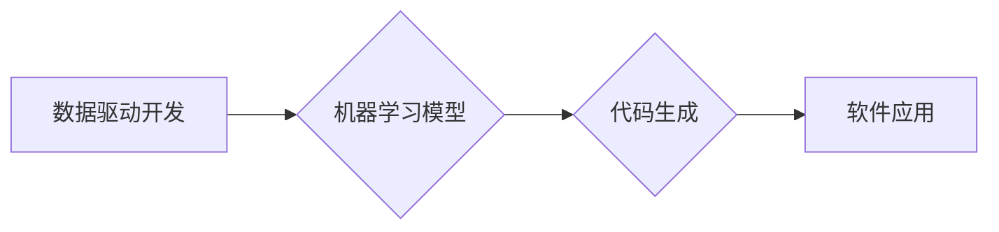

> 软件2.0, 数据驱动, 机器学习, 深度学习, 代码生成, 自动化开发, 数据集训练

## 1. 背景介绍

软件开发行业经历了数十年飞速发展，从最初的低级语言到如今的云原生架构，我们见证了技术的不断进步。然而，软件开发的核心问题依然存在：代码编写仍然是耗时、费力且容易出错的环节。随着人工智能技术的蓬勃发展，特别是深度学习的突破，我们看到了一个全新的软件开发模式的曙光：软件2.0。

软件2.0的核心思想是放弃传统的代码编写方式，转而利用机器学习模型训练庞大的数据集，让模型自动生成代码。这种模式将彻底改变软件开发的流程，提高开发效率，降低开发成本，并释放开发人员的创造力。

## 2. 核心概念与联系

**2.1 数据驱动开发**

数据驱动开发的核心是将数据作为软件开发的驱动因素。在软件2.0中，我们不再依赖于人工编写的代码规范和规则，而是通过大量的代码数据集来训练机器学习模型。这些数据集包含各种类型的代码，涵盖不同的编程语言、软件架构和应用场景。

**2.2 机器学习模型**

机器学习模型是软件2.0的核心引擎。通过对庞大的代码数据集进行训练，模型能够学习代码的语法、结构和逻辑，并能够根据输入的自然语言描述或需求自动生成相应的代码。常见的机器学习模型包括：

* **Transformer模型:** 这种模型擅长处理序列数据，例如代码，能够捕捉代码中的长距离依赖关系，生成更准确、更流畅的代码。
* **生成式对抗网络(GAN):** GAN由两个模型组成，一个是生成器，负责生成代码，另一个是鉴别器，负责判断生成的代码是否真实。通过相互竞争，生成器能够生成越来越逼真的代码。

**2.3 代码生成**

代码生成是软件2.0的核心功能。通过训练好的机器学习模型，我们可以输入自然语言描述或需求，模型能够自动生成相应的代码。例如，我们可以输入“创建一个函数，计算两个整数的和”，模型就能自动生成相应的代码。

**Mermaid 流程图**



## 3. 核心算法原理 & 具体操作步骤

**3.1 算法原理概述**

软件2.0的核心算法原理是基于深度学习的代码生成技术。这种技术利用 Transformer 模型或 GAN 等模型，通过训练大量的代码数据集，学习代码的语法、结构和逻辑，并能够根据输入的自然语言描述或需求自动生成相应的代码。

**3.2 算法步骤详解**

1. **数据收集和预处理:** 收集大量的代码数据集，并进行预处理，例如去除注释、空格等无关信息，并进行格式化处理。
2. **模型训练:** 使用深度学习框架，例如 TensorFlow 或 PyTorch，训练 Transformer 模型或 GAN 模型。训练过程中，模型会学习代码的语法、结构和逻辑，并能够根据输入的代码片段预测下一个代码元素。
3. **代码生成:** 将训练好的模型应用于新的代码生成任务。输入自然语言描述或需求，模型能够根据训练的知识自动生成相应的代码。

**3.3 算法优缺点**

**优点:**

* **提高开发效率:** 自动生成代码，减少人工编写代码的时间和精力。
* **降低开发成本:** 减少人工成本，提高开发效率。
* **提高代码质量:** 模型训练基于大量的代码数据集，能够生成更符合规范、更易于维护的代码。

**缺点:**

* **数据依赖:** 模型的性能取决于训练数据的质量和数量。
* **可解释性:** 深度学习模型的决策过程难以解释，难以理解模型生成的代码背后的逻辑。
* **安全风险:** 模型可能被恶意利用，生成恶意代码。

**3.4 算法应用领域**

* **Web 开发:** 自动生成网页代码、API 接口代码等。
* **移动应用开发:** 自动生成 Android 或 iOS 应用代码。
* **数据科学:** 自动生成数据处理、分析和可视化代码。
* **游戏开发:** 自动生成游戏场景、角色、道具等代码。

## 4. 数学模型和公式 & 详细讲解 & 举例说明

**4.1 数学模型构建**

在代码生成任务中，我们可以将代码视为一个序列，每个元素代表一个代码符号（例如字母、数字、符号等）。我们可以使用循环神经网络（RNN）或 Transformer 模型来建模代码序列。

**4.2 公式推导过程**

Transformer 模型的核心是注意力机制，它能够捕捉代码序列中的长距离依赖关系。注意力机制的计算公式如下：

$$
Attention(Q, K, V) = softmax(\frac{QK^T}{\sqrt{d_k}})V
$$

其中：

* $Q$：查询矩阵
* $K$：键矩阵
* $V$：值矩阵
* $d_k$：键向量的维度

**4.3 案例分析与讲解**

假设我们有一个代码序列：“print(hello world!)”，我们可以使用 Transformer 模型来预测下一个代码元素。模型会将该序列编码成一个向量表示，然后使用注意力机制来计算每个元素与其他元素之间的相关性。根据这些相关性，模型可以预测下一个代码元素是“”。

## 5. 项目实践：代码实例和详细解释说明

**5.1 开发环境搭建**

* Python 3.x
* TensorFlow 或 PyTorch 深度学习框架
* Git 版本控制系统

**5.2 源代码详细实现**

```python
# 使用 TensorFlow 实现简单的代码生成模型
import tensorflow as tf

# 定义模型结构
model = tf.keras.Sequential([
    tf.keras.layers.Embedding(input_dim=vocab_size, output_dim=embedding_dim),
    tf.keras.layers.LSTM(units=lstm_units),
    tf.keras.layers.Dense(units=vocab_size, activation='softmax')
])

# 编译模型
model.compile(optimizer='adam', loss='sparse_categorical_crossentropy', metrics=['accuracy'])

# 训练模型
model.fit(x_train, y_train, epochs=epochs)

# 代码生成
input_text = "print(hello"
generated_text = model.predict(input_text)
```

**5.3 代码解读与分析**

* 代码使用 TensorFlow 框架构建了一个简单的代码生成模型。
* 模型结构包括 Embedding 层、LSTM 层和 Dense 层。
* Embedding 层将代码符号映射到向量空间。
* LSTM 层能够捕捉代码序列中的长距离依赖关系。
* Dense 层将 LSTM 层的输出映射到每个代码符号的概率分布。
* 模型使用 Adam 优化器、稀疏类别交叉熵损失函数和准确率作为评估指标。

**5.4 运行结果展示**

模型训练完成后，我们可以输入一段代码片段，模型能够预测下一个代码元素。例如，输入“print(hello”，模型可能会预测下一个代码元素是“world!)”。

## 6. 实际应用场景

**6.1 自动化代码生成**

软件2.0可以自动生成各种类型的代码，例如网页代码、API 接口代码、数据处理代码等，提高开发效率，降低开发成本。

**6.2 代码修复和维护**

软件2.0可以分析代码中的错误和缺陷，并自动生成修复代码，提高代码质量，降低维护成本。

**6.3 代码翻译**

软件2.0可以将代码从一种编程语言翻译成另一种编程语言，方便代码复用和跨平台开发。

**6.4 代码定制化**

软件2.0可以根据用户的需求生成定制化的代码，满足个性化需求。

**6.5 未来应用展望**

软件2.0将彻底改变软件开发的模式，推动软件开发行业向自动化、智能化方向发展。未来，软件2.0将应用于更广泛的领域，例如：

* **人工智能开发:** 自动生成人工智能模型的代码。
* **区块链开发:** 自动生成区块链智能合约代码。
* **物联网开发:** 自动生成物联网设备的代码。

## 7. 工具和资源推荐

**7.1 学习资源推荐**

* **书籍:**
    * 《Deep Learning》 by Ian Goodfellow, Yoshua Bengio, and Aaron Courville
    * 《Hands-On Machine Learning with Scikit-Learn, Keras & TensorFlow》 by Aurélien Géron
* **在线课程:**
    * Coursera: Deep Learning Specialization
    * Udacity: Deep Learning Nanodegree
* **开源项目:**
    * TensorFlow: https://www.tensorflow.org/
    * PyTorch: https://pytorch.org/

**7.2 开发工具推荐**

* **代码编辑器:** VS Code, Sublime Text
* **深度学习框架:** TensorFlow, PyTorch
* **版本控制系统:** Git

**7.3 相关论文推荐**

* **Attention Is All You Need** (Vaswani et al., 2017)
* **BERT: Pre-training of Deep Bidirectional Transformers for Language Understanding** (Devlin et al., 2018)
* **CodeBERT: A Pre-trained Language Model for Code** (Hu et al., 2020)

## 8. 总结：未来发展趋势与挑战

**8.1 研究成果总结**

软件2.0技术取得了显著的进展，能够自动生成高质量的代码，提高开发效率，降低开发成本。

**8.2 未来发展趋势**

* **模型性能提升:** 随着深度学习技术的不断发展，代码生成模型的性能将进一步提升，能够生成更复杂的代码。
* **应用场景拓展:** 软件2.0将应用于更广泛的领域，例如人工智能开发、区块链开发、物联网开发等。
* **代码可解释性增强:** 研究人员将致力于提高代码生成模型的可解释性，使模型的决策过程更加透明。

**8.3 面临的挑战**

* **数据质量:** 模型的性能取决于训练数据的质量和数量。
* **安全风险:** 模型可能被恶意利用，生成恶意代码。
* **伦理问题:** 代码生成技术可能会导致失业问题，需要认真考虑伦理问题。

**8.4 研究展望**

未来，软件2.0技术将继续发展，推动软件开发行业向自动化、智能化方向发展。我们需要加强对代码生成技术的研究，解决技术难题，并制定相应的规范和政策，确保代码生成技术安全、可靠、可持续发展。

## 9. 附录：常见问题与解答

**9.1 如何选择合适的代码生成模型？**

选择合适的代码生成模型取决于具体的应用场景和需求。例如，对于简单的代码生成任务，可以使用 RNN 模型；对于复杂的代码生成任务，可以使用 Transformer 模型。

**9.2 如何提高代码生成模型的性能？**

提高代码生成模型的性能需要从以下几个方面入手：

* 提高训练数据的质量和数量。
* 优化模型结构和参数。
* 使用更先进的深度学习算法。

**9.3 代码生成技术会取代程序员吗？**

代码生成技术可以提高开发效率，但不会完全取代程序员。程序员仍然需要负责软件的设计、架构、测试和维护等工作。


作者：禅与计算机程序设计艺术 / Zen and the Art of Computer Programming 
<end_of_turn>