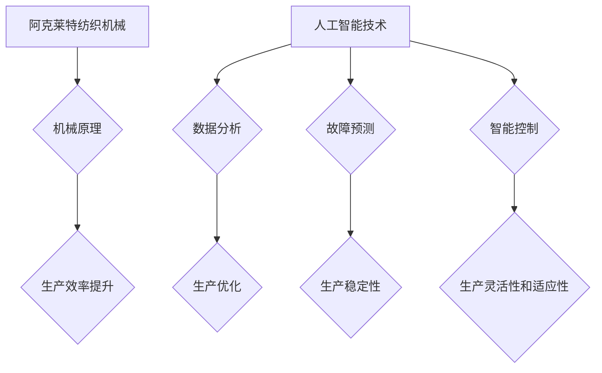

> 阿克莱特，纺织机械，人工智能，机器学习，深度学习，算法优化，数据结构，软件架构，创新

## 1. 背景介绍

在工业革命的浪潮中，纺织业作为重要的支柱产业，经历了从手工制作到机械化生产的巨大变革。阿克莱特，这位伟大的发明家，凭借其对纺织机械的深刻理解和对技术的不断探索，创造了无数改变世界的重要发明。他的纺织机械不仅提高了生产效率，也推动了社会经济的发展。

然而，在当今信息时代，纺织业面临着新的挑战和机遇。随着人工智能、机器学习和深度学习技术的快速发展，纺织机械也迎来了新的发展机遇。如何将这些先进技术与纺织机械相结合，创造出更加智能、高效、创新的纺织生产模式，成为一个重要的研究方向。

## 2. 核心概念与联系

阿克莱特的纺织机械创新，本质上是将机械原理、材料科学和生产工艺相结合，创造出高效、可靠的生产系统。而现代人工智能技术，则可以进一步提升纺织机械的智能化水平，实现自动化、智能化生产。

**核心概念：**

* **阿克莱特纺织机械：** 
    * 采用机械原理，实现纺织生产过程中的关键环节自动化。
    * 例如：梭织机、水经机、抽纱机等。
* **人工智能 (AI)：** 
    * 通过算法模拟人类智能，实现对复杂问题的分析、决策和控制。
    * 包括机器学习、深度学习等技术。

**联系：**

人工智能技术可以应用于纺织机械的各个环节，例如：

* **生产过程优化：** 利用机器学习算法分析生产数据，优化生产参数，提高生产效率和产品质量。
* **故障诊断与预测：** 通过深度学习算法识别纺织机械的异常状态，提前预测故障，减少停机时间。
* **智能控制：** 利用人工智能算法实现纺织机械的智能控制，根据生产需求自动调整生产参数，提高生产灵活性和适应性。

**Mermaid 流程图：**



## 3. 核心算法原理 & 具体操作步骤

### 3.1  算法原理概述

人工智能技术在纺织机械领域的应用，主要依赖于以下核心算法：

* **机器学习算法：** 
    * 通过训练模型，从数据中学习规律，实现对生产数据的分析和预测。
    * 常用算法包括：线性回归、逻辑回归、决策树、支持向量机、神经网络等。
* **深度学习算法：** 
    * 基于多层神经网络，能够学习更复杂的特征，实现更精准的预测和控制。
    * 常用算法包括：卷积神经网络 (CNN)、循环神经网络 (RNN)、长短期记忆网络 (LSTM) 等。

### 3.2  算法步骤详解

**机器学习算法应用步骤：**

1. **数据收集和预处理：** 收集纺织生产过程中的各种数据，例如：生产参数、设备状态、产品质量等，并进行清洗、转换、特征提取等预处理。
2. **模型选择和训练：** 根据具体应用场景选择合适的机器学习算法，并利用训练数据训练模型，使其能够学习数据中的规律。
3. **模型评估和优化：** 利用测试数据评估模型的性能，并根据评估结果调整模型参数，优化模型性能。
4. **模型部署和应用：** 将训练好的模型部署到生产环境中，用于对实时数据进行分析和预测，实现生产过程的优化和控制。

**深度学习算法应用步骤：**

1. **数据收集和预处理：** 与机器学习算法类似，需要收集和预处理纺织生产过程中的数据。
2. **网络结构设计：** 根据具体应用场景设计深度学习网络结构，例如：CNN用于图像识别，RNN用于序列数据分析。
3. **模型训练：** 利用训练数据训练深度学习模型，并根据训练过程中的损失函数进行参数更新。
4. **模型评估和优化：** 利用测试数据评估模型的性能，并根据评估结果调整网络结构和训练参数，优化模型性能。
5. **模型部署和应用：** 将训练好的模型部署到生产环境中，用于对实时数据进行分析和预测，实现生产过程的优化和控制。

### 3.3  算法优缺点

**机器学习算法：**

* **优点：** 
    * 算法相对简单，易于理解和实现。
    * 训练速度较快，适用于数据量较小的场景。
* **缺点：** 
    * 学习能力有限，难以学习复杂特征。
    * 对数据质量要求较高，容易受到噪声数据的影响。

**深度学习算法：**

* **优点：** 
    * 学习能力强，能够学习复杂特征。
    * 对数据质量要求相对较低。
* **缺点：** 
    * 算法复杂，需要大量的计算资源和数据进行训练。
    * 训练时间较长，难以进行实时预测。

### 3.4  算法应用领域

* **生产过程优化：** 利用机器学习算法分析生产数据，优化生产参数，提高生产效率和产品质量。
* **故障诊断与预测：** 通过深度学习算法识别纺织机械的异常状态，提前预测故障，减少停机时间。
* **智能控制：** 利用人工智能算法实现纺织机械的智能控制，根据生产需求自动调整生产参数，提高生产灵活性和适应性。
* **质量控制：** 利用机器视觉技术和深度学习算法对纺织产品进行质量检测，提高产品质量和一致性。

## 4. 数学模型和公式 & 详细讲解 & 举例说明

### 4.1  数学模型构建

**生产效率优化模型：**

假设纺织生产过程中的生产效率 $E$ 与生产参数 $x_1, x_2, ..., x_n$ 的关系可以用以下数学模型表示：

$$E = f(x_1, x_2, ..., x_n)$$

其中，$f$ 是一个复杂的非线性函数，需要通过机器学习算法进行学习和拟合。

**故障预测模型：**

假设纺织机械的故障概率 $P$ 与设备状态 $s_1, s_2, ..., s_m$ 的关系可以用以下数学模型表示：

$$P = g(s_1, s_2, ..., s_m)$$

其中，$g$ 是一个复杂的非线性函数，需要通过深度学习算法进行学习和拟合。

### 4.2  公式推导过程

**机器学习算法中的损失函数：**

机器学习算法的目标是找到一个能够最小化损失函数的参数值。常见的损失函数包括：

* **均方误差 (MSE)：**

$$MSE = \frac{1}{n} \sum_{i=1}^{n} (y_i - \hat{y}_i)^2$$

其中，$y_i$ 是真实值，$\hat{y}_i$ 是预测值，$n$ 是样本数量。

* **交叉熵损失 (Cross-Entropy Loss)：**

$$Cross-Entropy = - \sum_{i=1}^{n} y_i \log(\hat{y}_i) + (1-y_i) \log(1-\hat{y}_i)$$

其中，$y_i$ 是真实标签，$\hat{y}_i$ 是预测概率。

**深度学习算法中的反向传播算法：**

反向传播算法用于计算神经网络中每个参数的梯度，并根据梯度更新参数值。

### 4.3  案例分析与讲解

**生产效率优化案例：**

假设一家纺织厂想要提高梭织机的生产效率。可以通过收集梭织机的生产数据，例如：梭织速度、纱线张力、织物密度等，并利用机器学习算法训练一个生产效率优化模型。该模型可以根据实时数据预测最佳的生产参数，从而提高梭织机的生产效率。

**故障预测案例：**

假设一家纺织厂想要提前预测纺织机械的故障。可以通过收集纺织机械的运行数据，例如：温度、振动、电流等，并利用深度学习算法训练一个故障预测模型。该模型可以根据实时数据识别纺织机械的异常状态，并预测故障发生的可能性，从而帮助工厂提前进行维护，减少停机时间。

## 5. 项目实践：代码实例和详细解释说明

### 5.1  开发环境搭建

* **操作系统：** Ubuntu 20.04 LTS
* **编程语言：** Python 3.8
* **深度学习框架：** TensorFlow 2.0
* **数据处理库：** Pandas, NumPy
* **可视化库：** Matplotlib, Seaborn

### 5.2  源代码详细实现

```python
import tensorflow as tf
from tensorflow.keras.models import Sequential
from tensorflow.keras.layers import Dense, Dropout

# 构建生产效率优化模型
model = Sequential()
model.add(Dense(64, activation='relu', input_shape=(5,)))
model.add(Dropout(0.2))
model.add(Dense(32, activation='relu'))
model.add(Dropout(0.2))
model.add(Dense(1))

# 编译模型
model.compile(optimizer='adam', loss='mse')

# 训练模型
model.fit(X_train, y_train, epochs=100, batch_size=32)

# 预测生产效率
y_pred = model.predict(X_test)
```

### 5.3  代码解读与分析

* **模型构建：** 使用深度学习框架 TensorFlow 构建了一个多层感知机模型，用于预测纺织生产效率。
* **模型编译：** 使用 Adam 优化器和均方误差损失函数编译模型。
* **模型训练：** 使用训练数据训练模型，并设置训练轮数和批处理大小。
* **模型预测：** 使用测试数据预测生产效率。

### 5.4  运行结果展示

通过训练和测试模型，可以得到生产效率的预测结果，并进行评估，例如：使用均方误差 (MSE) 评估模型的预测精度。

## 6. 实际应用场景

### 6.1  智能纺织生产线

将人工智能技术应用于纺织生产线，可以实现智能化生产，例如：

* **自动控制：** 利用人工智能算法控制纺织机械的运行参数，实现生产过程的自动化。
* **质量检测：** 利用机器视觉技术和深度学习算法对纺织产品进行质量检测，提高产品质量和一致性。
* **故障诊断与预测：** 利用深度学习算法识别纺织机械的异常状态，提前预测故障，减少停机时间。

### 6.2  个性化定制纺织品

利用人工智能技术，可以实现个性化定制纺织品，例如：

* **设计生成：** 利用生成对抗网络 (GAN) 等算法生成个性化的纺织图案和设计。
* **材料选择：** 利用机器学习算法分析客户需求和材料特性，推荐合适的纺织材料。
* **生产定制：** 利用智能纺织设备根据客户定制需求进行生产，实现个性化纺织品定制。

### 6.4  未来应用展望

* **更智能的纺织生产系统：** 利用更先进的人工智能算法，实现纺织生产过程的更智能化控制和优化。
* **更个性化的纺织产品：** 利用人工智能技术，实现更个性化的纺织产品设计、生产和销售。
* **更可持续的纺织行业：** 利用人工智能技术，优化纺织生产过程，减少资源消耗和环境污染。

## 7. 工具和资源推荐

### 7.1  学习资源推荐

* **在线课程：** Coursera, edX, Udacity 等平台提供人工智能、机器学习和深度学习相关的在线课程。
* **书籍：** 《深度学习》、《