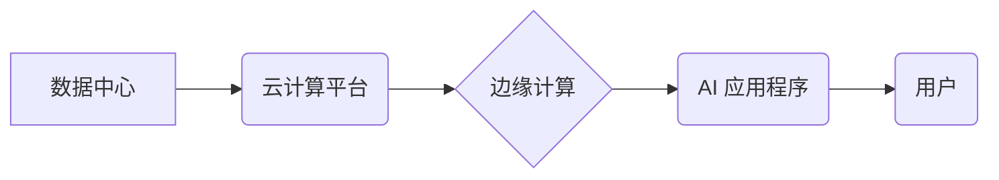

> AI 2.0, 基础设施, 伦理, 社会影响, 算法, 数据, 隐私, 透明度, 可解释性

## 1. 背景介绍

人工智能（AI）技术近年来发展迅速，从语音识别、图像识别到自然语言处理等领域取得了突破性进展。我们正处于人工智能 2.0 时代，其核心特征是更强大、更智能、更广泛的应用。AI 2.0 的基础设施建设将推动人工智能技术的进一步发展，但也带来了一系列社会影响和伦理挑战。

**1.1 AI 2.0 的特征**

AI 2.0 相比于之前的 AI 1.0，具有以下显著特征：

* **更强大的计算能力:** 随着芯片技术和云计算的发展，AI 2.0 拥有更强大的计算能力，能够处理更大规模、更复杂的数据。
* **更智能的算法:** 深度学习、强化学习等新兴算法的不断发展，使 AI 2.0 具备更强的学习能力和推理能力。
* **更广泛的应用场景:** AI 2.0 将应用于各个领域，包括医疗、教育、金融、交通等，深刻改变我们的生活方式。

**1.2 AI 2.0 基础设施建设**

AI 2.0 基础设施建设是指为支持 AI 2.0 技术发展和应用而构建的硬件、软件、数据和网络等基础设施。

* **硬件:** 高性能计算平台、GPU 芯片、专用 AI 芯片等。
* **软件:** 深度学习框架、机器学习平台、数据处理工具等。
* **数据:** 海量数据、标注数据、开放数据等。
* **网络:** 高速网络、边缘计算等。

## 2. 核心概念与联系

**2.1 核心概念**

* **数据中心:** AI 2.0 基础设施的核心，负责存储、处理和管理海量数据。
* **云计算:** 提供弹性、可扩展的计算资源，支持 AI 2.0 的大规模训练和部署。
* **边缘计算:** 将计算能力部署到靠近数据源的边缘设备，降低数据传输延迟，提高实时性。
* **联邦学习:** 在不共享原始数据的情况下，通过模型参数的迭代更新，实现模型训练和优化。

**2.2 架构图**



**2.3 联系**

数据中心是 AI 2.0 基础设施的核心，云计算平台提供弹性计算资源，边缘计算降低数据传输延迟，最终为 AI 应用程序提供支持，用户通过 AI 应用程序体验智能服务。

## 3. 核心算法原理 & 具体操作步骤

**3.1 算法原理概述**

深度学习是 AI 2.0 的核心算法之一，它通过多层神经网络模拟人类大脑的学习过程，能够自动从数据中提取特征，进行模式识别和预测。

**3.2 算法步骤详解**

1. **数据预处理:** 将原始数据清洗、转换、标准化，使其适合深度学习模型训练。
2. **网络结构设计:** 根据任务需求设计神经网络的层数、节点数、激活函数等参数。
3. **模型训练:** 使用训练数据训练神经网络模型，通过反向传播算法调整模型参数，使模型预测结果与真实值尽可能接近。
4. **模型评估:** 使用测试数据评估模型的性能，例如准确率、召回率、F1 值等。
5. **模型部署:** 将训练好的模型部署到实际应用场景中，用于预测和决策。

**3.3 算法优缺点**

* **优点:** 能够自动学习特征，性能优异，适用于各种类型的数据。
* **缺点:** 需要大量数据进行训练，训练时间长，模型解释性差。

**3.4 算法应用领域**

* **图像识别:** 人脸识别、物体检测、图像分类等。
* **自然语言处理:** 文本分类、机器翻译、语音识别等。
* **推荐系统:** 商品推荐、内容推荐等。
* **医疗诊断:** 病情预测、疾病诊断等。

## 4. 数学模型和公式 & 详细讲解 & 举例说明

**4.1 数学模型构建**

深度学习模型可以看作是一个复杂的数学模型，其核心是神经网络。神经网络由多个层组成，每层包含多个神经元。每个神经元接收来自上一层的输入信号，经过激活函数处理后，输出到下一层。

**4.2 公式推导过程**

神经网络的训练过程是通过优化模型参数来实现的。常用的优化算法是梯度下降法。梯度下降法的核心思想是通过计算模型参数的梯度，沿着梯度负方向更新参数，从而使模型的损失函数最小化。

**损失函数:** $L(w,b) = \frac{1}{N} \sum_{i=1}^{N} (y_i - \hat{y}_i)^2$

其中:

* $w$ 和 $b$ 是模型参数。
* $y_i$ 是真实值。
* $\hat{y}_i$ 是模型预测值。
* $N$ 是样本数量。

**梯度:** $\frac{\partial L}{\partial w}$

**参数更新:** $w = w - \eta \frac{\partial L}{\partial w}$

其中:

* $\eta$ 是学习率。

**4.3 案例分析与讲解**

假设我们训练一个简单的线性回归模型，用于预测房价。模型输入特征包括房屋面积和房间数量，输出目标是房价。

我们可以使用梯度下降法来训练模型参数。首先，我们需要定义损失函数，例如均方误差。然后，我们计算模型参数的梯度，并根据梯度更新参数。重复这个过程，直到模型的损失函数最小化。

## 5. 项目实践：代码实例和详细解释说明

**5.1 开发环境搭建**

* 操作系统: Ubuntu 20.04
* Python 版本: 3.8
* 深度学习框架: TensorFlow 2.0

**5.2 源代码详细实现**

```python
import tensorflow as tf

# 定义模型
model = tf.keras.models.Sequential([
    tf.keras.layers.Dense(64, activation='relu', input_shape=(2,)),
    tf.keras.layers.Dense(1)
])

# 定义损失函数和优化器
model.compile(loss='mse', optimizer='adam')

# 训练模型
model.fit(x_train, y_train, epochs=100)

# 评估模型
loss = model.evaluate(x_test, y_test)
print('Loss:', loss)

# 预测房价
new_house = [[100, 2]]
prediction = model.predict(new_house)
print('Prediction:', prediction)
```

**5.3 代码解读与分析**

* 我们使用 TensorFlow 框架构建了一个简单的线性回归模型。
* 模型包含两层全连接神经元，第一层有 64 个神经元，第二层有一个神经元，用于输出房价预测值。
* 我们使用均方误差作为损失函数，Adam 优化器进行模型训练。
* 训练模型 100 个 epochs，并使用测试数据评估模型性能。
* 最后，我们使用训练好的模型预测新房子的房价。

**5.4 运行结果展示**

训练完成后，我们可以查看模型的损失值和预测结果。

## 6. 实际应用场景

**6.1 医疗诊断**

AI 2.0 可以帮助医生更快、更准确地诊断疾病。例如，AI 算法可以分析患者的影像数据，识别肿瘤和其他异常情况。

**6.2 金融风险管理**

AI 2.0 可以帮助金融机构识别和管理风险。例如，AI 算法可以分析客户的交易数据，识别潜在的欺诈行为。

**6.3 自动驾驶**

AI 2.0 是自动驾驶汽车的关键技术。AI 算法可以帮助汽车感知周围环境，做出决策，并安全地行驶。

**6.4 未来应用展望**

AI 2.0 将在更多领域得到应用，例如个性化教育、智能家居、智慧城市等。

## 7. 工具和资源推荐

**7.1 学习资源推荐**

* **在线课程:** Coursera, edX, Udacity
* **书籍:** 深度学习，机器学习

**7.2 开发工具推荐**

* **深度学习框架:** TensorFlow, PyTorch, Keras
* **云计算平台:** AWS, Azure, Google Cloud

**7.3 相关论文推荐**

* **深度学习论文:** ImageNet Classification with Deep Convolutional Neural Networks
* **机器学习论文:** The Elements of Statistical Learning

## 8. 总结：未来发展趋势与挑战

**8.1 研究成果总结**

AI 2.0 基础设施建设取得了显著进展，为人工智能技术的进一步发展提供了坚实基础。

**8.2 未来发展趋势**

* **更强大的计算能力:** 量子计算、神经形态芯片等新兴技术将推动 AI 2.0 的发展。
* **更智能的算法:** 迁移学习、联邦学习等新兴算法将提高 AI 2.0 的效率和安全性。
* **更广泛的应用场景:** AI 2.0 将应用于更多领域，深刻改变我们的生活方式。

**8.3 面临的挑战**

* **数据安全和隐私保护:** AI 2.0 的发展依赖于海量数据，如何保障数据安全和隐私是关键挑战。
* **算法可解释性和透明度:** AI 2.0 的算法往往是复杂的，难以解释其决策过程，如何提高算法的可解释性和透明度是重要的研究方向。
* **伦理问题:** AI 2.0 的发展可能带来一些伦理问题，例如算法偏见、工作岗位替代等，需要认真思考和解决。

**8.4 研究展望**

未来，我们需要继续加强 AI 2.0 基础设施建设，同时关注其社会影响和伦理问题，推动 AI 2.0 的安全、可持续发展。

## 9. 附录：常见问题与解答

**9.1 如何选择合适的 AI 2.0 基础设施？**

选择合适的 AI 2.0 基础设施需要根据具体应用场景和需求进行评估。需要考虑计算资源、数据存储、网络带宽、成本等因素。

**9.2 如何保障 AI 2.0 数据安全和隐私？**

可以采用数据加密、访问控制、匿名化等技术来保障 AI 2.0 数据安全和隐私。

**9.3 如何提高 AI 2.0 算法的可解释性和透明度？**

可以采用可解释机器学习模型、注意力机制等技术来提高 AI 2.0 算法的可解释性和透明度。


作者：禅与计算机程序设计艺术 / Zen and the Art of Computer Programming 
<end_of_turn>