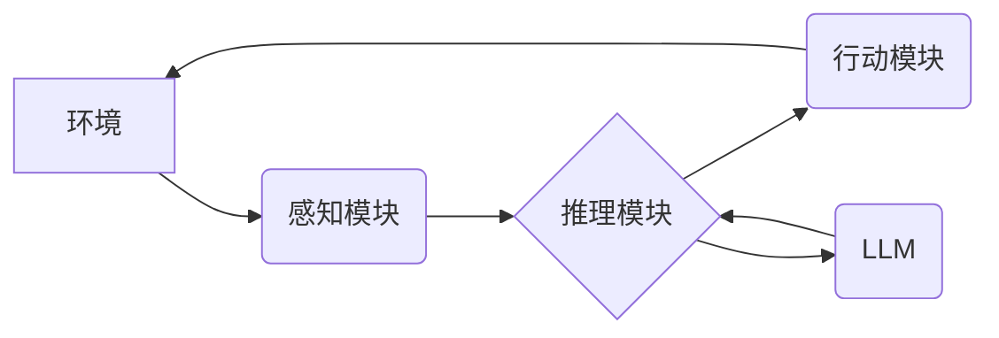

> AI Agent, 智能体, LLM, 大语言模型, 强化学习, 决策推理, 知识图谱, 应用场景

## 1. 背景介绍

人工智能（AI）技术近年来取得了飞速发展，特别是深度学习的突破，使得自然语言处理（NLP）、计算机视觉等领域取得了显著进展。其中，大型语言模型（LLM）作为AI领域的新宠，凭借其强大的文本生成、理解和翻译能力，在各个领域展现出巨大的应用潜力。然而，LLM本身缺乏自主学习和决策的能力，仅仅是强大的文本处理引擎。

为了赋予AI更强的自主性和适应性，AI智能体（AI Agent）应运而生。智能体是能够感知环境、做出决策并与环境交互的智能系统。它不仅能够理解和生成文本，还可以根据环境信息进行推理、规划和执行行动，从而实现更复杂的任务。

## 2. 核心概念与联系

**2.1 AI Agent**

AI Agent是一个能够感知环境、做出决策并与环境交互的智能系统。它通常由以下几个核心组件组成：

* **感知模块:** 收集环境信息，例如传感器数据、文本、图像等。
* **推理模块:** 对感知到的信息进行分析和理解，做出决策。
* **行动模块:** 根据决策执行相应的行动，例如控制机器人运动、生成文本、发送指令等。

**2.2 LLM**

LLM是一种基于深度学习的强大语言模型，能够理解和生成人类语言。它通常由 Transformer 架构构成，并通过海量文本数据进行训练。LLM 具备以下特点：

* **强大的文本处理能力:** 可以进行文本生成、翻译、摘要、问答等任务。
* **丰富的语义理解:** 可以理解文本中的上下文关系和隐含含义。
* **可扩展性强:** 可以通过增加训练数据和模型参数来提升性能。

**2.3 智能体与LLM的联系**

LLM可以作为AI Agent的重要组成部分，为其提供强大的文本处理能力。例如，LLM可以帮助智能体：

* **理解自然语言指令:** 将人类的自然语言指令转换为智能体可以理解的格式。
* **生成自然语言输出:** 将智能体的决策和行动转换为自然语言，方便人类理解。
* **进行知识检索和推理:** 利用其强大的语义理解能力，帮助智能体从知识库中检索信息并进行推理。

**2.4 架构图**



## 3. 核心算法原理 & 具体操作步骤

**3.1 算法原理概述**

智能体通常采用强化学习（RL）算法进行训练。强化学习是一种机器学习方法，通过奖励和惩罚机制，让智能体学习最优的策略。

在RL中，智能体与环境进行交互，根据环境的状态采取行动，并获得相应的奖励或惩罚。智能体通过不断尝试不同的策略，并根据奖励信号调整策略，最终学习到最优的策略，使得在与环境交互的过程中获得最大的总奖励。

**3.2 算法步骤详解**

1. **环境建模:** 建立一个模拟真实世界的环境模型，包括状态空间、动作空间和奖励函数。
2. **智能体初始化:** 初始化智能体的策略，例如随机策略或基于规则的策略。
3. **环境交互:** 智能体与环境进行交互，根据当前状态选择动作，并获得环境的反馈，包括下一个状态和奖励。
4. **策略更新:** 根据获得的奖励信号，更新智能体的策略，使得未来能够获得更高的奖励。
5. **重复步骤3-4:** 重复以上步骤，直到智能体学习到最优策略。

**3.3 算法优缺点**

* **优点:** 能够学习复杂的任务，并适应不断变化的环境。
* **缺点:** 训练过程可能需要大量的时间和资源，并且需要明确定义奖励函数。

**3.4 算法应用领域**

* **机器人控制:** 训练机器人完成复杂的任务，例如导航、抓取、组装等。
* **游戏AI:** 训练游戏中的AI对手，使其能够与人类玩家进行对抗。
* **推荐系统:** 训练推荐系统，根据用户的历史行为推荐感兴趣的内容。

## 4. 数学模型和公式 & 详细讲解 & 举例说明

**4.1 数学模型构建**

智能体与环境的交互过程可以用马尔可夫决策过程（MDP）模型来描述。MDP模型包含以下几个要素：

* **状态空间 (S):** 环境可能存在的各种状态。
* **动作空间 (A):** 智能体可以采取的各种动作。
* **转移概率 (P):** 从一个状态执行一个动作后，转移到下一个状态的概率。
* **奖励函数 (R):** 智能体在某个状态执行某个动作后获得的奖励。
* **策略 (π):** 智能体在每个状态选择动作的策略。

**4.2 公式推导过程**

智能体的目标是最大化其在所有时间步长的总奖励。可以使用动态规划算法或蒙特卡罗方法来求解最优策略。

**Bellman 方程:**

$$
V^*(s) = \max_a \sum_{s'} P(s'|s,a) [R(s,a,s') + \gamma V^*(s')]
$$

其中：

* $V^*(s)$ 是状态 $s$ 的最优价值函数。
* $a$ 是智能体在状态 $s$ 可以采取的动作。
* $s'$ 是状态 $s$ 执行动作 $a$ 后可能转移到的下一个状态。
* $R(s,a,s')$ 是智能体在状态 $s$ 执行动作 $a$ 后转移到状态 $s'$ 获得的奖励。
* $\gamma$ 是折扣因子，控制未来奖励的权重。

**4.3 案例分析与讲解**

例如，训练一个智能体玩游戏，智能体的状态空间是游戏中的所有游戏场景，动作空间是游戏中的所有可执行的操作，奖励函数是获得分数或完成任务的奖励。通过训练，智能体可以学习到最优的策略，从而在游戏中获得更高的分数或完成任务。

## 5. 项目实践：代码实例和详细解释说明

**5.1 开发环境搭建**

* Python 3.x
* TensorFlow 或 PyTorch
* OpenAI Gym

**5.2 源代码详细实现**

```python
import gym
import tensorflow as tf

# 定义智能体模型
class Agent(tf.keras.Model):
    def __init__(self):
        super(Agent, self).__init__()
        # 定义模型结构
        # ...

    def call(self, state):
        # 前向传播
        # ...
        return action_probs

# 创建智能体实例
agent = Agent()

# 创建环境实例
env = gym.make('CartPole-v1')

# 训练智能体
for episode in range(1000):
    state = env.reset()
    done = False
    while not done:
        # 选择动作
        action_probs = agent(state)
        action = tf.random.categorical(action_probs, num_samples=1)[0, 0]
        # 执行动作
        next_state, reward, done, _ = env.step(action)
        # 更新智能体模型
        # ...
        state = next_state

# 保存模型
agent.save_weights('agent_weights.h5')
```

**5.3 代码解读与分析**

* 智能体模型使用 TensorFlow 或 PyTorch 框架构建，并定义了前向传播过程。
* 智能体在每个时间步选择动作，并根据环境的反馈更新模型参数。
* 训练过程重复执行多个episode，直到智能体学习到最优策略。

**5.4 运行结果展示**

训练完成后，可以将训练好的智能体模型应用于实际环境中，例如在 OpenAI Gym 中测试智能体的性能。

## 6. 实际应用场景

**6.1 智能客服:**

LLM可以帮助智能客服理解用户的自然语言问题，并提供准确的答案。

**6.2 自动写作:**

LLM可以帮助自动生成新闻报道、产品描述、广告文案等文本内容。

**6.3 个性化推荐:**

LLM可以根据用户的兴趣爱好，推荐个性化的商品、服务或内容。

**6.4 教育辅助:**

LLM可以作为教育辅助工具，帮助学生学习新的知识，解答疑问。

**6.5 未来应用展望**

随着AI技术的发展，智能体将在更多领域得到应用，例如：

* **医疗保健:** 辅助医生诊断疾病、制定治疗方案。
* **金融服务:** 识别欺诈交易、提供个性化理财建议。
* **交通运输:** 自动驾驶汽车、智能交通管理。

## 7. 工具和资源推荐

**7.1 学习资源推荐**

* **书籍:**
    * Reinforcement Learning: An Introduction by Richard S. Sutton and Andrew G. Barto
    * Deep Learning by Ian Goodfellow, Yoshua Bengio, and Aaron Courville
* **在线课程:**
    * Coursera: Reinforcement Learning Specialization
    * Udacity: Deep Learning Nanodegree

**7.2 开发工具推荐**

* **TensorFlow:** https://www.tensorflow.org/
* **PyTorch:** https://pytorch.org/
* **OpenAI Gym:** https://gym.openai.com/

**7.3 相关论文推荐**

* Deep Reinforcement Learning with Double Q-learning
* Proximal Policy Optimization Algorithms
* Asynchronous Methods for Deep Reinforcement Learning

## 8. 总结：未来发展趋势与挑战

**8.1 研究成果总结**

近年来，AI智能体领域取得了显著进展，特别是强化学习算法的不断发展，使得智能体能够学习解决更复杂的任务。

**8.2 未来发展趋势**

* **更强大的模型:** 随着计算能力的提升，智能体模型将变得更加强大，能够处理更复杂的任务。
* **更有效的训练方法:** 研究人员将继续探索更有效的训练方法，例如迁移学习、联邦学习等，降低训练成本和时间。
* **更广泛的应用场景:** 智能体将在更多领域得到应用，例如医疗保健、金融服务、交通运输等。

**8.3 面临的挑战**

* **安全性和可靠性:** 智能体需要能够安全可靠地运行，避免出现意外情况。
* **可解释性和透明度:** 智能体的决策过程需要更加透明可解释，以便人类能够理解和信任其决策。
* **伦理问题:** 智能体的应用需要考虑伦理问题，例如公平性、隐私保护等。

**8.4 研究展望**

未来，AI智能体领域将继续朝着更智能、更安全、更可解释的方向发展。研究人员将继续探索新的算法、模型和应用场景，推动AI技术的发展和应用。

## 9. 附录：常见问题与解答

**9.1 如何选择合适的强化学习算法？**

选择合适的强化学习算法取决于具体的应用场景和任务特点。例如，对于离散动作空间的任务，可以使用 Q-learning 算法；对于连续动作空间的任务，可以使用策略梯度算法。

**9.2 如何评估智能体的性能？**

智能体的性能可以通过奖励函数、成功率、平均回报等指标进行评估。

**9.3 如何解决智能体过拟合的问题？**

可以使用正则化技术、数据增强、交叉验证等方法来解决智能体过拟合的问题。


作者：禅与计算机程序设计艺术 / Zen and the Art of Computer Programming 
<end_of_turn>