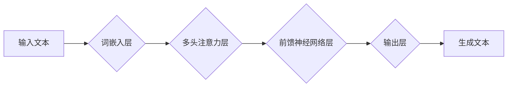

> AIGC, AI生成内容, 自然语言处理, 深度学习, Transformer, 代码生成, 文本生成, 图像生成

## 1. 背景介绍

在人工智能领域蓬勃发展的今天，AIGC（AI Generated Content，人工智能生成内容）已成为一个备受关注的热点话题。AIGC是指利用人工智能技术，自动生成各种形式的内容，例如文本、图像、音频、视频等。与传统的由人类创作的内容相比，AIGC具有以下优势：

* **效率提升:** AIGC可以自动化内容创作流程，大幅提高内容生产效率。
* **成本降低:** AIGC可以减少人工创作成本，降低内容生产成本。
* **个性化定制:** AIGC可以根据用户需求生成个性化的内容，满足不同用户的需求。
* **内容丰富:** AIGC可以生成各种形式的内容，丰富内容类型。

AIGC技术在各个领域都有着广泛的应用前景，例如：

* **内容创作:** 自动生成新闻报道、广告文案、小说、诗歌等。
* **教育培训:** 自动生成学习资料、习题、测试题等。
* **游戏开发:** 自动生成游戏场景、人物、剧情等。
* **客户服务:** 自动生成聊天机器人对话、邮件回复等。

## 2. 核心概念与联系

AIGC的核心技术是深度学习，特别是基于Transformer架构的语言模型。

**Mermaid 流程图:**



**核心概念解释:**

* **词嵌入层:** 将文本中的每个词转换为向量表示，捕捉词语的语义信息。
* **多头注意力层:** 学习文本中不同词语之间的关系，关注重要的信息。
* **前馈神经网络层:** 对注意力机制输出进行非线性变换，提取更深层次的语义特征。
* **输出层:** 生成预测的下一个词，并根据概率分布选择最合适的词。

## 3. 核心算法原理 & 具体操作步骤

### 3.1  算法原理概述

AIGC的核心算法是基于Transformer架构的语言模型，其原理是通过训练大量的文本数据，学习语言的语法规则和语义关系，从而能够生成流畅、自然的文本。

### 3.2  算法步骤详解

1. **数据预处理:** 将原始文本数据进行清洗、分词、标记等预处理操作，使其适合模型训练。
2. **词嵌入:** 将文本中的每个词转换为向量表示，可以使用预训练的词嵌入模型，例如Word2Vec或GloVe，也可以使用自训练的方式学习词嵌入。
3. **模型训练:** 使用Transformer架构的语言模型，训练模型参数，使其能够准确预测下一个词。训练过程中，使用交叉熵损失函数，优化模型参数。
4. **文本生成:** 将待生成的文本输入到训练好的模型中，模型会根据输入文本和训练数据，预测下一个词，并依次预测所有词，最终生成完整的文本。

### 3.3  算法优缺点

**优点:**

* 生成文本流畅自然，语法正确。
* 可以生成不同风格和类型的文本。
* 可以根据用户需求进行个性化定制。

**缺点:**

* 训练数据量大，训练成本高。
* 模型参数量大，部署成本高。
* 容易生成虚假信息或偏见内容。

### 3.4  算法应用领域

* **文本生成:** 自动生成新闻报道、广告文案、小说、诗歌等。
* **机器翻译:** 将一种语言翻译成另一种语言。
* **对话系统:** 开发聊天机器人、虚拟助手等。
* **文本摘要:** 自动生成文本的摘要。

## 4. 数学模型和公式 & 详细讲解 & 举例说明

### 4.1  数学模型构建

AIGC的核心数学模型是Transformer，其结构包含以下几个关键部分：

* **词嵌入层:** 将每个词转换为向量表示，可以使用词典映射或预训练的词嵌入模型。
* **多头注意力层:** 学习文本中不同词语之间的关系，并赋予每个词语不同的权重。
* **前馈神经网络层:** 对注意力机制输出进行非线性变换，提取更深层次的语义特征。

### 4.2  公式推导过程

**多头注意力机制公式:**

$$
Attention(Q, K, V) = softmax(\frac{QK^T}{\sqrt{d_k}})V
$$

其中：

* $Q$：查询矩阵
* $K$：键矩阵
* $V$：值矩阵
* $d_k$：键向量的维度
* $softmax$：softmax函数

**前馈神经网络层公式:**

$$
FFN(x) = \max(0, xW_1 + b_1)W_2 + b_2
$$

其中：

* $x$：输入向量
* $W_1$、$W_2$：权重矩阵
* $b_1$、$b_2$：偏置项

### 4.3  案例分析与讲解

**举例说明:**

假设我们有一个句子“The cat sat on the mat”，我们使用多头注意力机制来计算每个词语之间的关系。

* 查询矩阵 $Q$：每个词语的词嵌入向量。
* 键矩阵 $K$：每个词语的词嵌入向量。
* 值矩阵 $V$：每个词语的词嵌入向量。

通过计算 $QK^T$，我们可以得到每个词语对其他词语的注意力权重。例如，"cat" 对 "sat" 的注意力权重较高，因为它们在语义上相关。

## 5. 项目实践：代码实例和详细解释说明

### 5.1  开发环境搭建

* Python 3.7+
* TensorFlow 2.0+
* PyTorch 1.0+
* CUDA 10.0+ (可选)

### 5.2  源代码详细实现

```python
import tensorflow as tf

# 定义词嵌入层
embedding_layer = tf.keras.layers.Embedding(vocab_size, embedding_dim)

# 定义多头注意力层
attention_layer = tf.keras.layers.MultiHeadAttention(num_heads=8)

# 定义前馈神经网络层
ffn_layer = tf.keras.layers.Dense(units=hidden_dim, activation='relu')

# 定义Transformer模型
class Transformer(tf.keras.Model):
    def __init__(self, vocab_size, embedding_dim, hidden_dim, num_heads):
        super(Transformer, self).__init__()
        self.embedding_layer = embedding_layer
        self.attention_layer = attention_layer
        self.ffn_layer = ffn_layer

    def call(self, inputs):
        # 词嵌入
        embedded_inputs = self.embedding_layer(inputs)
        # 多头注意力
        attended_outputs = self.attention_layer(embedded_inputs, embedded_inputs, embedded_inputs)
        # 前馈神经网络
        output = self.ffn_layer(attended_outputs)
        return output

# 实例化模型
model = Transformer(vocab_size=10000, embedding_dim=128, hidden_dim=256, num_heads=8)

# 训练模型
model.compile(optimizer='adam', loss='mse')
model.fit(train_data, train_labels, epochs=10)
```

### 5.3  代码解读与分析

* **词嵌入层:** 将每个词语转换为向量表示，捕捉词语的语义信息。
* **多头注意力层:** 学习文本中不同词语之间的关系，并赋予每个词语不同的权重。
* **前馈神经网络层:** 对注意力机制输出进行非线性变换，提取更深层次的语义特征。
* **Transformer模型:** 将词嵌入层、多头注意力层和前馈神经网络层组合在一起，构成一个完整的Transformer模型。

### 5.4  运行结果展示

训练完成后，可以使用模型生成新的文本。例如，我们可以输入一个句子，模型会根据训练数据预测下一个词，并依次预测所有词，最终生成完整的文本。

## 6. 实际应用场景

### 6.1  新闻报道生成

AIGC可以自动生成新闻报道，例如天气预报、股市走势、体育赛事报道等。

### 6.2  广告文案创作

AIGC可以根据目标用户和产品特点，自动生成吸引人的广告文案。

### 6.3  小说创作

AIGC可以根据用户提供的主题、人物、情节等信息，自动生成小说故事。

### 6.4  未来应用展望

AIGC技术在未来将有更广泛的应用场景，例如：

* **个性化教育:** 根据学生的学习进度和需求，自动生成个性化的学习资料。
* **智能客服:** 开发更智能的聊天机器人，能够更准确地理解用户的需求，并提供更有效的帮助。
* **创意设计:** 帮助设计师生成新的创意，例如设计logo、海报、服装等。

## 7. 工具和资源推荐

### 7.1  学习资源推荐

* **书籍:**
    * 《深度学习》
    * 《自然语言处理》
* **在线课程:**
    * Coursera: 自然语言处理
    * edX: 深度学习
* **博客:**
    * The Gradient
    * Towards Data Science

### 7.2  开发工具推荐

* **TensorFlow:** 开源深度学习框架
* **PyTorch:** 开源深度学习框架
* **Hugging Face:** 提供预训练的语言模型和工具

### 7.3  相关论文推荐

* **Attention Is All You Need:** https://arxiv.org/abs/1706.03762
* **BERT: Pre-training of Deep Bidirectional Transformers for Language Understanding:** https://arxiv.org/abs/1810.04805

## 8. 总结：未来发展趋势与挑战

### 8.1  研究成果总结

AIGC技术取得了显著的进展，能够生成高质量的文本、图像、音频等内容。

### 8.2  未来发展趋势

* **更强大的模型:** 研究更强大的Transformer模型，提高生成内容的质量和多样性。
* **多模态生成:** 研究能够生成多种模态内容的模型，例如文本、图像、音频、视频等。
* **个性化定制:** 研究能够根据用户需求进行个性化定制的模型。

### 8.3  面临的挑战

* **数据安全:** AIGC模型需要大量的数据进行训练，如何保证数据的安全和隐私是一个挑战。
* **内容质量:** AIGC生成的內容可能存在虚假信息或偏见，如何提高内容质量是一个挑战。
* **伦理问题:** AIGC技术可能带来一些伦理问题，例如版权问题、就业问题等，需要进行深入的探讨和研究。

### 8.4  研究展望

未来，AIGC技术将继续发展，并在各个领域发挥越来越重要的作用。我们需要加强对AIGC技术的研究，解决其面临的挑战，并将其应用于更多领域，造福人类社会。

## 9. 附录：常见问题与解答

**Q1: AIGC技术与传统内容创作有什么区别？**

**A1:** AIGC技术利用人工智能自动生成内容，而传统内容创作则需要人类进行创作。AIGC可以提高内容生产效率，降低成本，但其生成的內容可能缺乏创意和情感。

**Q2: AIGC技术有哪些应用场景？**

**A2:** AIGC技术可以应用于新闻报道、广告文案创作、小说创作、教育培训、游戏开发等多个领域。

**Q3: AIGC技术有哪些伦理问题？**

**A3:** AIGC技术可能带来版权问题、就业问题、虚假信息传播等伦理问题，需要进行深入的探讨和