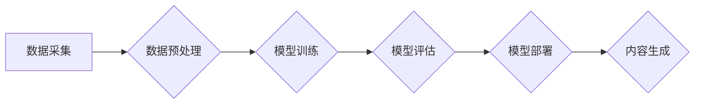

> AIGC, 人工智能, 生成式模型, 自然语言处理, 图像生成, 文本生成, 代码生成, 应用场景, 未来趋势

## 1. 背景介绍

近年来，人工智能（AI）技术取得了飞速发展，特别是生成式人工智能（AIGC）的兴起，为人们的生活和工作带来了革命性的改变。AIGC是指利用人工智能技术，从数据中学习并生成新的内容，例如文本、图像、音频、视频等。

AIGC技术的应用场景广泛，涵盖了各个领域，例如：

* **内容创作:** 自动生成新闻报道、广告文案、诗歌、小说等。
* **教育培训:** 个性化学习内容生成、智能答疑系统、虚拟教学助手等。
* **设计创意:** 自动生成设计稿、产品原型、音乐作品等。
* **软件开发:** 自动生成代码、测试用例、软件文档等。

AIGC技术的快速发展，为人类创造了无限的可能性，但也带来了新的挑战和伦理问题。

## 2. 核心概念与联系

AIGC的核心概念包括：

* **深度学习:** AIGC模型通常基于深度学习算法，例如Transformer、GAN等。
* **自然语言处理 (NLP):** 用于处理和理解人类语言，例如文本分类、机器翻译、文本摘要等。
* **计算机视觉 (CV):** 用于处理和理解图像和视频，例如图像识别、物体检测、图像生成等。

**AIGC架构流程图:**



## 3. 核心算法原理 & 具体操作步骤

### 3.1  算法原理概述

AIGC模型通常采用生成式对抗网络 (GAN) 或 Transformer 等深度学习算法。

* **GAN:** 由生成器和鉴别器两部分组成，生成器生成新的数据，鉴别器判断数据是否真实，两者相互竞争，最终生成器能够生成逼真的数据。
* **Transformer:** 基于注意力机制，能够捕捉文本中的长距离依赖关系，用于文本生成、机器翻译等任务。

### 3.2  算法步骤详解

**以文本生成为例，AIGC模型的具体操作步骤如下:**

1. **数据采集:** 收集大量文本数据，例如书籍、文章、对话等。
2. **数据预处理:** 对文本数据进行清洗、分词、词向量化等处理，使其能够被模型理解。
3. **模型训练:** 使用深度学习算法训练AIGC模型，例如使用GAN生成文本，或使用Transformer进行文本生成。
4. **模型评估:** 使用测试数据评估模型的生成效果，例如使用BLEU、ROUGE等指标进行评估。
5. **模型部署:** 将训练好的模型部署到服务器或云平台，供用户使用。
6. **内容生成:** 用户输入文本提示，模型根据提示生成新的文本内容。

### 3.3  算法优缺点

**优点:**

* **生成高质量内容:** AIGC模型能够生成逼真、流畅、富有创意的内容。
* **提高效率:** 自动化内容生成，节省人力成本和时间。
* **个性化定制:** 根据用户需求生成个性化的内容。

**缺点:**

* **数据依赖:** AIGC模型需要大量高质量数据进行训练。
* **伦理问题:** AIGC模型可能生成虚假信息、抄袭内容等问题。
* **技术复杂:** AIGC模型的开发和部署需要专业的技术人员。

### 3.4  算法应用领域

AIGC算法广泛应用于以下领域:

* **内容创作:** 自动生成新闻报道、广告文案、诗歌、小说等。
* **教育培训:** 个性化学习内容生成、智能答疑系统、虚拟教学助手等。
* **设计创意:** 自动生成设计稿、产品原型、音乐作品等。
* **软件开发:** 自动生成代码、测试用例、软件文档等。

## 4. 数学模型和公式 & 详细讲解 & 举例说明

### 4.1  数学模型构建

AIGC模型通常采用神经网络作为数学模型，例如Transformer模型。Transformer模型由多层编码器和解码器组成，每个层包含多项神经网络层，例如多头注意力层、前馈神经网络层等。

### 4.2  公式推导过程

Transformer模型的注意力机制公式如下:

$$
Attention(Q, K, V) = softmax(\frac{QK^T}{\sqrt{d_k}})V
$$

其中:

* $Q$：查询矩阵
* $K$：键矩阵
* $V$：值矩阵
* $d_k$：键向量的维度
* $softmax$：softmax函数

### 4.3  案例分析与讲解

例如，在机器翻译任务中，Transformer模型会将源语言句子编码为一个向量表示，然后使用注意力机制计算目标语言词语与源语言句子的相关性，最后根据相关性生成目标语言句子。

## 5. 项目实践：代码实例和详细解释说明

### 5.1  开发环境搭建

AIGC模型的开发环境通常包括：

* **操作系统:** Linux、macOS
* **编程语言:** Python
* **深度学习框架:** TensorFlow、PyTorch
* **硬件环境:** GPU

### 5.2  源代码详细实现

以下是一个使用PyTorch框架实现文本生成的简单代码示例:

```python
import torch
import torch.nn as nn

class TextGenerator(nn.Module):
    def __init__(self, vocab_size, embedding_dim, hidden_dim):
        super(TextGenerator, self).__init__()
        self.embedding = nn.Embedding(vocab_size, embedding_dim)
        self.lstm = nn.LSTM(embedding_dim, hidden_dim)
        self.fc = nn.Linear(hidden_dim, vocab_size)

    def forward(self, x):
        embedded = self.embedding(x)
        output, (hidden, cell) = self.lstm(embedded)
        output = self.fc(output[:, -1, :])
        return output

# ... 模型训练和使用代码 ...
```

### 5.3  代码解读与分析

* **embedding层:** 将单词转换为向量表示。
* **lstm层:** 使用长短期记忆网络处理文本序列。
* **fc层:** 将lstm输出映射到词汇表大小。

### 5.4  运行结果展示

训练好的模型可以用于生成新的文本内容。例如，输入一个单词，模型可以根据上下文预测下一个单词。

## 6. 实际应用场景

### 6.1  新闻报道生成

AIGC可以自动生成新闻报道，例如从数据中提取关键信息，自动撰写新闻标题和正文。

### 6.2  广告文案创作

AIGC可以根据目标用户和产品特点，自动生成吸引人的广告文案。

### 6.3  教育内容生成

AIGC可以根据学生的学习进度和需求，生成个性化的学习内容，例如习题、练习、讲解视频等。

### 6.4  未来应用展望

AIGC技术未来将应用于更广泛的领域，例如：

* **虚拟助手:** 更智能、更自然的虚拟助手，能够理解和响应用户的复杂指令。
* **个性化娱乐:** 根据用户的喜好生成个性化的音乐、电影、游戏等娱乐内容。
* **医疗诊断:** 辅助医生进行疾病诊断，提高诊断准确率。

## 7. 工具和资源推荐

### 7.1  学习资源推荐

* **书籍:**
    * 《深度学习》
    * 《自然语言处理》
* **在线课程:**
    * Coursera
    * edX
* **开源项目:**
    * TensorFlow
    * PyTorch

### 7.2  开发工具推荐

* **IDE:** PyCharm、VS Code
* **深度学习框架:** TensorFlow、PyTorch
* **云平台:** AWS、Azure、GCP

### 7.3  相关论文推荐

* 《Attention Is All You Need》
* 《Generative Adversarial Networks》

## 8. 总结：未来发展趋势与挑战

### 8.1  研究成果总结

AIGC技术取得了显著的进展，能够生成高质量、多样化的内容，并应用于多个领域。

### 8.2  未来发展趋势

* **模型能力提升:** 模型参数规模更大、训练数据更多，生成内容质量更高。
* **多模态生成:** 融合文本、图像、音频等多模态数据，生成更丰富的体验。
* **个性化定制:** 根据用户需求和偏好，生成个性化的内容。

### 8.3  面临的挑战

* **数据安全和隐私:** AIGC模型训练需要大量数据，如何保证数据安全和隐私是一个重要挑战。
* **伦理问题:** AIGC模型可能生成虚假信息、抄袭内容等问题，需要制定相应的伦理规范。
* **可解释性:** AIGC模型的决策过程难以理解，需要提高模型的可解释性。

### 8.4  研究展望

未来，AIGC技术将继续发展，并应用于更多领域，为人类社会带来更多便利和福祉。

## 9. 附录：常见问题与解答

**Q1: AIGC模型的训练需要多少数据？**

**A1:** AIGC模型的训练数据量取决于模型复杂度和任务类型，通常需要百万甚至数十亿条数据。

**Q2: 如何评估AIGC模型的生成效果？**

**A2:** 可以使用BLEU、ROUGE等指标评估文本生成效果，也可以使用人工评估等方式。

**Q3: AIGC模型会产生虚假信息吗？**

**A3:** AIGC模型可能会生成虚假信息，因为其训练数据可能包含错误信息。因此，需要对AIGC模型生成的文本进行仔细审核。


作者：禅与计算机程序设计艺术 / Zen and the Art of Computer Programming 
<end_of_turn>