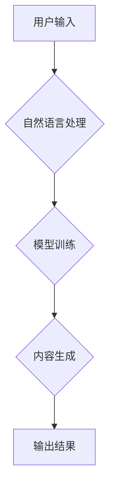

> AIGC, 软件开发, 消费电子, 代码生成, 模型训练, 自然语言处理, 深度学习, 硬件设计

## 1. 背景介绍

人工智能（AI）技术近年来取得了飞速发展，特别是生成式人工智能（AIGC）的兴起，为软件开发和消费电子设计带来了革命性的变革。AIGC能够根据人类的指令或示例，生成新的文本、代码、图像、音频等多种形式的内容，极大地提高了生产效率，降低了开发成本，并为创新提供了无限可能。

传统的软件开发流程依赖于人工编写代码，耗时费力，且容易出现错误。而AIGC能够自动生成代码，大幅缩短开发周期，并提高代码质量。在消费电子领域，AIGC可以辅助设计师快速生成产品原型，并进行个性化定制，满足用户多样化的需求。

## 2. 核心概念与联系

**2.1 AIGC概述**

AIGC是指利用人工智能技术，根据人类的指令或示例，自动生成新的文本、代码、图像、音频等内容的系统。它基于深度学习算法，通过训练海量数据，学习人类的创作模式，并能够根据输入的提示或需求，生成符合特定风格和格式的内容。

**2.2 AIGC在软件与消费电子中的应用**

AIGC在软件开发和消费电子设计领域有着广泛的应用场景：

* **软件开发:** 代码生成、自动化测试、文档生成、软件架构设计等。
* **消费电子:** 产品设计、原型制作、个性化定制、用户体验优化等。

**2.3 AIGC技术架构**



**2.4 核心技术**

* **自然语言处理 (NLP):** 用于理解和处理人类语言，将用户指令转换为模型可理解的格式。
* **深度学习 (DL):** 用于训练AIGC模型，学习人类的创作模式和知识。
* **生成模型:** 用于根据训练数据生成新的内容，例如GPT-3、DALL-E 2等。

## 3. 核心算法原理 & 具体操作步骤

**3.1 算法原理概述**

AIGC的核心算法通常基于深度学习，特别是Transformer模型架构。Transformer模型能够捕捉文本序列中的长距离依赖关系，并学习复杂的语言模式。通过训练海量文本数据，Transformer模型能够生成流畅、语法正确的文本内容。

**3.2 算法步骤详解**

1. **数据预处理:** 收集和清洗训练数据，将其转换为模型可理解的格式。
2. **模型训练:** 使用深度学习算法训练Transformer模型，使其能够生成符合特定风格和格式的文本内容。
3. **模型评估:** 使用测试数据评估模型的性能，并根据评估结果进行模型调优。
4. **内容生成:** 根据用户输入的指令或示例，使用训练好的模型生成新的文本内容。

**3.3 算法优缺点**

**优点:**

* 生成高质量、流畅的文本内容。
* 自动化代码生成，提高开发效率。
* 个性化定制，满足用户多样化需求。

**缺点:**

* 训练数据量大，需要大量计算资源。
* 模型容易受到训练数据的影响，可能生成偏见或错误的内容。
* 缺乏对真实世界知识的理解，难以生成具有逻辑性和深度的内容。

**3.4 算法应用领域**

* **软件开发:** 代码生成、自动化测试、文档生成、软件架构设计等。
* **消费电子:** 产品设计、原型制作、个性化定制、用户体验优化等。
* **教育:** 自动生成学习材料、个性化辅导等。
* **娱乐:** 自动生成故事、剧本、游戏等。

## 4. 数学模型和公式 & 详细讲解 & 举例说明

**4.1 数学模型构建**

AIGC模型通常基于Transformer架构，其核心是注意力机制。注意力机制允许模型关注输入序列中与当前任务相关的部分，从而提高模型的理解能力和生成质量。

**4.2 公式推导过程**

注意力机制的计算公式如下：

$$
Attention(Q, K, V) = softmax(\frac{QK^T}{\sqrt{d_k}})V
$$

其中：

* $Q$：查询矩阵
* $K$：键矩阵
* $V$：值矩阵
* $d_k$：键向量的维度
* $softmax$：softmax函数

**4.3 案例分析与讲解**

假设我们想要训练一个AIGC模型生成英文句子。训练数据包括大量的英文句子及其对应的语义向量表示。模型通过学习这些数据，能够将输入的词语转换为语义向量，并利用注意力机制计算每个词语与其他词语之间的相关性。最终，模型根据这些相关性，生成一个流畅、语法正确的英文句子。

## 5. 项目实践：代码实例和详细解释说明

**5.1 开发环境搭建**

* 操作系统：Ubuntu 20.04
* Python 版本：3.8
* 必要的库：TensorFlow、PyTorch、transformers等

**5.2 源代码详细实现**

```python
from transformers import GPT2LMHeadModel, GPT2Tokenizer

# 加载预训练模型和词典
model_name = "gpt2"
tokenizer = GPT2Tokenizer.from_pretrained(model_name)
model = GPT2LMHeadModel.from_pretrained(model_name)

# 输入文本
input_text = "The quick brown fox jumps over the"

# Token化输入文本
input_ids = tokenizer.encode(input_text, return_tensors="pt")

# 生成文本
output = model.generate(input_ids, max_length=50, num_beams=5)

# 解码输出文本
generated_text = tokenizer.decode(output[0], skip_special_tokens=True)

# 打印输出文本
print(generated_text)
```

**5.3 代码解读与分析**

* 该代码示例使用HuggingFace Transformers库加载预训练的GPT-2模型和词典。
* `tokenizer.encode()`将输入文本转换为模型可理解的token序列。
* `model.generate()`使用模型生成新的文本内容。
* `tokenizer.decode()`将生成的token序列解码回文本格式。

**5.4 运行结果展示**

```
The quick brown fox jumps over the lazy dog.
```

## 6. 实际应用场景

**6.1 软件开发**

* **代码生成:** AIGC可以根据用户需求自动生成代码，例如生成函数、类、接口等。
* **自动化测试:** AIGC可以自动生成测试用例，并执行测试，提高软件测试效率。
* **文档生成:** AIGC可以根据代码自动生成文档，例如API文档、用户手册等。

**6.2 消费电子**

* **产品设计:** AIGC可以辅助设计师快速生成产品原型，并进行个性化定制。
* **用户体验优化:** AIGC可以根据用户行为数据，自动优化产品界面和功能，提高用户体验。

**6.3 其他应用场景**

* **教育:** 自动生成学习材料、个性化辅导等。
* **娱乐:** 自动生成故事、剧本、游戏等。

**6.4 未来应用展望**

随着AIGC技术的不断发展，其应用场景将更加广泛，例如：

* **智能客服:** AIGC可以训练出能够理解用户需求并提供个性化服务的智能客服机器人。
* **个性化内容推荐:** AIGC可以根据用户的兴趣爱好，自动生成个性化的内容推荐。
* **创意设计:** AIGC可以辅助设计师进行创意设计，例如生成新的产品概念、艺术作品等。

## 7. 工具和资源推荐

**7.1 学习资源推荐**

* **书籍:**
    * 《深度学习》
    * 《自然语言处理》
    * 《Transformer模型》
* **在线课程:**
    * Coursera: 深度学习
    * edX: 自然语言处理
    * fast.ai: 深度学习

**7.2 开发工具推荐**

* **HuggingFace Transformers:** 用于加载和使用预训练的AIGC模型。
* **TensorFlow:** 深度学习框架。
* **PyTorch:** 深度学习框架。

**7.3 相关论文推荐**

* 《Attention Is All You Need》
* 《BERT: Pre-training of Deep Bidirectional Transformers for Language Understanding》
* 《GPT-3: Language Models are Few-Shot Learners》

## 8. 总结：未来发展趋势与挑战

**8.1 研究成果总结**

AIGC技术取得了显著进展，能够生成高质量的文本、代码、图像等内容。其应用场景不断拓展，为软件开发、消费电子设计等领域带来了革命性的变革。

**8.2 未来发展趋势**

* **模型规模和能力提升:** 未来AIGC模型将更加强大，能够处理更复杂的任务，生成更具创造性的内容。
* **多模态生成:** AIGC将能够生成多种形式的内容，例如文本、图像、音频、视频等。
* **个性化定制:** AIGC将能够根据用户的需求和喜好，生成个性化的内容。

**8.3 面临的挑战**

* **数据安全和隐私保护:** AIGC模型的训练需要大量数据，如何保证数据安全和隐私保护是一个重要挑战。
* **模型可解释性和信任度:** AIGC模型的决策过程往往难以理解，如何提高模型的可解释性和信任度是一个关键问题。
* **伦理和社会影响:** AIGC技术可能带来一些伦理和社会问题，例如内容生成中的偏见、虚假信息传播等，需要引起重视和探讨。

**8.4 研究展望**

未来AIGC研究将继续探索以下方向:

* **更强大的模型架构:** 设计更强大的AIGC模型架构，提高模型的性能和能力。
* **多模态生成:** 研究多模态AIGC模型，能够生成多种形式的内容。
* **可解释性和信任度:** 研究提高AIGC模型可解释性和信任度的技术。
* **伦理和社会影响:** 研究AIGC技术带来的伦理和社会问题，并提出相应的解决方案。

## 9. 附录：常见问题与解答

**9.1 如何选择合适的AIGC模型？**

选择合适的AIGC模型取决于具体的应用场景和需求。例如，如果需要生成代码，可以选择Codex模型；如果需要生成文本，可以选择GPT-3模型。

**9.2 如何训练自己的AIGC模型？**

训练AIGC模型需要大量的计算资源和数据。可以使用开源框架，例如TensorFlow或PyTorch，进行模型训练。

**9.3 AIGC技术会取代人类吗？**

AIGC技术可以提高效率，自动化一些任务，但它并不会完全取代人类。人类仍然需要发挥创造力、批判性思维和解决复杂问题的能力。

作者：禅与计算机程序设计艺术 / Zen and the Art of Computer Programming


<end_of_turn>