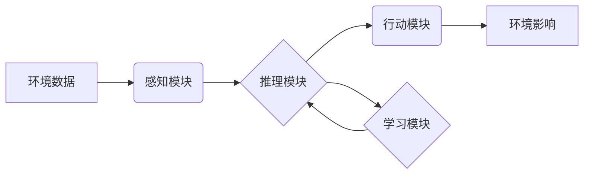

> AI人工智能,环保,Agent,机器学习,环境监测,数据分析,可持续发展

## 1. 背景介绍

全球气候变化和环境污染问题日益严峻，迫切需要创新技术和解决方案来应对这些挑战。人工智能（AI）作为一门新兴技术，凭借其强大的数据处理、分析和预测能力，在环保领域展现出巨大的潜力。

AI人工智能 Agent，是指能够感知环境、做出决策并执行行动的智能代理。在环保领域，AI Agent 可以被设计成监测环境数据、识别污染源、优化资源利用、预测环境风险等功能，为环境保护提供智能化支持。

## 2. 核心概念与联系

### 2.1 AI Agent

AI Agent 是一个能够自主学习、推理和决策的智能体。它通常由以下几个核心组件组成：

* **感知模块:** 收集环境信息，例如传感器数据、图像、文本等。
* **推理模块:** 对收集到的信息进行分析和理解，并做出决策。
* **行动模块:** 执行决策，例如控制设备、发出指令等。
* **学习模块:** 通过经验积累和数据分析，不断改进自己的决策能力。

### 2.2 环保领域应用

AI Agent 在环保领域可以应用于多个方面，例如：

* **环境监测:** 利用传感器数据和机器学习算法，实时监测空气质量、水质、土壤状况等环境指标。
* **污染源识别:** 分析环境数据和图像，识别污染源，并提供污染排放信息。
* **资源管理:** 优化资源利用，例如节约用水、减少能源消耗等。
* **环境风险预测:** 利用历史数据和机器学习模型，预测环境风险，例如洪水、火灾、污染事件等。

### 2.3 架构图



## 3. 核心算法原理 & 具体操作步骤

### 3.1 算法原理概述

在环保领域，常用的 AI 算法包括：

* **机器学习:** 利用数据训练模型，使模型能够自动学习和预测。
* **深度学习:** 一种更高级的机器学习方法，利用多层神经网络进行特征提取和模式识别。
* **强化学习:** 通过奖励和惩罚机制，训练智能体在环境中做出最优决策。

### 3.2 算法步骤详解

以环境监测为例，使用机器学习算法进行空气质量预测的步骤如下：

1. **数据收集:** 收集历史空气质量数据、天气数据、地理位置数据等。
2. **数据预处理:** 清洗、转换和格式化数据，使其适合模型训练。
3. **模型选择:** 选择合适的机器学习模型，例如线性回归、决策树、支持向量机等。
4. **模型训练:** 利用训练数据训练模型，调整模型参数，使其能够准确预测空气质量。
5. **模型评估:** 使用测试数据评估模型的预测精度，并进行模型调优。
6. **模型部署:** 将训练好的模型部署到实际环境中，实时预测空气质量。

### 3.3 算法优缺点

**优点:**

* 能够自动学习和预测，无需人工干预。
* 能够处理海量数据，发现隐藏的模式。
* 能够不断改进预测精度，随着数据积累而增强。

**缺点:**

* 需要大量的训练数据，否则模型精度会降低。
* 模型训练过程可能需要很长时间。
* 模型解释性较差，难以理解模型的决策过程。

### 3.4 算法应用领域

* **环境监测:** 预测空气质量、水质、土壤状况等。
* **污染源识别:** 识别污染源，并提供污染排放信息。
* **资源管理:** 优化资源利用，例如节约用水、减少能源消耗等。
* **环境风险预测:** 预测环境风险，例如洪水、火灾、污染事件等。

## 4. 数学模型和公式 & 详细讲解 & 举例说明

### 4.1 数学模型构建

在环境监测领域，可以使用线性回归模型来预测空气质量。假设空气质量 Y 与温度 X 之间存在线性关系，则模型可以表示为：

$$Y = aX + b$$

其中：

* Y 为空气质量
* X 为温度
* a 为斜率，表示温度每升高 1 度，空气质量的变化量
* b 为截距，表示当温度为 0 度时，空气质量的值

### 4.2 公式推导过程

可以使用最小二乘法来估计模型参数 a 和 b。最小二乘法旨在找到使模型预测值与实际值误差最小的一组参数。

### 4.3 案例分析与讲解

假设我们收集了以下数据：

| 温度 (X) | 空气质量 (Y) |
|---|---|
| 10 | 50 |
| 15 | 60 |
| 20 | 70 |
| 25 | 80 |

可以使用最小二乘法计算出模型参数 a 和 b，并得到预测模型：

$$Y = 2X + 30$$

### 4.4 预测

利用该模型，我们可以预测当温度为 30 度时，空气质量为：

$$Y = 2 * 30 + 30 = 90$$

## 5. 项目实践：代码实例和详细解释说明

### 5.1 开发环境搭建

* Python 3.x
* NumPy
* Pandas
* Scikit-learn

### 5.2 源代码详细实现

```python
import numpy as np
from sklearn.linear_model import LinearRegression

# 数据集
X = np.array([[10], [15], [20], [25]])
y = np.array([50, 60, 70, 80])

# 创建线性回归模型
model = LinearRegression()

# 训练模型
model.fit(X, y)

# 获取模型参数
a = model.coef_[0]
b = model.intercept_

# 预测模型
print(f"预测模型: Y = {a}X + {b}")

# 预测空气质量
temperature = 30
predicted_air_quality = a * temperature + b
print(f"当温度为 {temperature} 度时，预测空气质量为 {predicted_air_quality}")
```

### 5.3 代码解读与分析

* 首先，我们导入必要的库，并定义数据集 X 和 y。
* 然后，我们创建线性回归模型，并使用 fit() 方法训练模型。
* 训练完成后，我们可以使用 coef_ 和 intercept_ 属性获取模型参数 a 和 b。
* 最后，我们可以使用模型预测空气质量。

### 5.4 运行结果展示

```
预测模型: Y = 2X + 30
当温度为 30 度时，预测空气质量为 90
```

## 6. 实际应用场景

### 6.1 环境监测

AI Agent 可以被部署在环境监测站，实时监测空气质量、水质、土壤状况等环境指标。

### 6.2 污染源识别

AI Agent 可以分析环境数据和图像，识别污染源，并提供污染排放信息。

### 6.3 资源管理

AI Agent 可以优化资源利用，例如节约用水、减少能源消耗等。

### 6.4 未来应用展望

* **智能环保决策支持系统:** AI Agent 可以帮助政府和企业制定更有效的环保政策和措施。
* **个性化环保服务:** AI Agent 可以根据用户的需求提供个性化的环保建议和服务。
* **环境保护机器人:** AI Agent 可以被集成到机器人中，用于环境清洁、污染治理等任务。

## 7. 工具和资源推荐

### 7.1 学习资源推荐

* **在线课程:** Coursera, edX, Udacity
* **书籍:**
    * "Deep Learning" by Ian Goodfellow, Yoshua Bengio, and Aaron Courville
    * "Reinforcement Learning: An Introduction" by Richard S. Sutton and Andrew G. Barto
* **开源库:** TensorFlow, PyTorch, scikit-learn

### 7.2 开发工具推荐

* **Python:** 
* **Jupyter Notebook:** 用于代码编写和可视化
* **Git:** 用于代码版本控制

### 7.3 相关论文推荐

* "Deep Learning for Environmental Monitoring"
* "Reinforcement Learning for Resource Management"
* "AI-Powered Environmental Protection"

## 8. 总结：未来发展趋势与挑战

### 8.1 研究成果总结

AI Agent 在环保领域展现出巨大的潜力，能够有效解决环境监测、污染源识别、资源管理等问题。

### 8.2 未来发展趋势

* **模型精度提升:** 随着数据量的增加和算法的改进，AI Agent 的预测精度将不断提升。
* **应用场景拓展:** AI Agent 将应用于更多环保领域，例如气候变化预测、生物多样性保护等。
* **智能化程度提升:** AI Agent 将更加智能化，能够自主学习、决策和执行任务。

### 8.3 面临的挑战

* **数据获取和质量:** 环保领域的数据获取和质量仍然存在挑战，需要加强数据收集和处理。
* **模型解释性:** AI Agent 的决策过程难以解释，需要提高模型的透明度和可解释性。
* **伦理问题:** AI Agent 的应用可能带来伦理问题，需要制定相应的规范和政策。

### 8.4 研究展望

未来，需要加强 AI Agent 在环保领域的研发和应用，推动 AI 技术助力环境保护，实现可持续发展。

## 9. 附录：常见问题与解答

* **Q1: AI Agent 是否能够完全替代人工？**

A1: 目前，AI Agent 无法完全替代人工，但可以辅助人工完成许多任务，提高效率和准确性。

* **Q2: AI Agent 的应用是否会带来新的环境问题？**

A2: AI Agent 的应用可能会带来新的环境问题，例如数据中心能源消耗、电子垃圾处理等，需要加强相关研究和监管。


作者：禅与计算机程序设计艺术 / Zen and the Art of Computer Programming 
<end_of_turn>