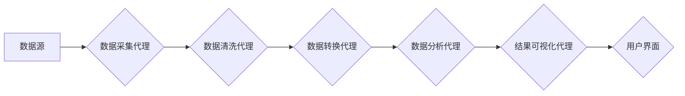

> AI代理，工作流，数据分析，自动化，机器学习，深度学习，自然语言处理

## 1. 背景介绍

在当今数据爆炸的时代，数据分析已成为各行各业不可或缺的环节。然而，传统的数据分析方法往往依赖于人工干预，效率低下，难以应对海量数据的处理需求。为了解决这一问题，人工智能代理工作流 (AI Agent WorkFlow) 应运而生。

AI代理工作流是一种基于人工智能技术的自动化数据分析方法，它通过设计一系列智能代理，自动完成数据采集、清洗、转换、分析和可视化等一系列工作流程。AI代理能够根据预设规则或学习到的知识，自主执行任务，并根据分析结果做出决策或建议，从而提高数据分析的效率和准确性。

## 2. 核心概念与联系

**2.1 AI代理 (AI Agent)**

AI代理是一种能够感知环境、做出决策并执行行动的智能体。它通常由以下几个核心组件组成：

* **感知模块:** 用于收集环境信息，例如数据、文本、图像等。
* **推理模块:** 用于分析环境信息，并根据预设规则或学习到的知识做出决策。
* **执行模块:** 用于执行决策，并与环境进行交互。

**2.2 工作流 (Workflow)**

工作流是一种描述一系列任务和它们之间依赖关系的流程图。它可以帮助我们将复杂的任务分解成多个简单易管理的子任务，并定义任务之间的执行顺序和数据流。

**2.3 AI代理工作流 (AI Agent WorkFlow)**

AI代理工作流将AI代理与工作流相结合，构建了一种自动化数据分析系统。它通过设计一系列智能代理，每个代理负责执行一个特定的任务，并通过工作流的控制机制协调各个代理的执行顺序和数据流。

**2.4 架构图**



## 3. 核心算法原理 & 具体操作步骤

**3.1 算法原理概述**

AI代理工作流的核心算法原理是基于机器学习和深度学习技术的智能代理设计和工作流管理。

* **智能代理设计:** 利用机器学习算法，训练代理能够识别数据模式、执行特定任务，并根据分析结果做出决策。
* **工作流管理:** 利用工作流引擎，定义代理之间的依赖关系和执行顺序，并实现数据流的协调和控制。

**3.2 算法步骤详解**

1. **数据采集:** 数据采集代理从数据源中收集数据，并将其存储在数据仓库中。
2. **数据清洗:** 数据清洗代理对收集到的数据进行清洗，例如去除重复数据、缺失值和错误数据。
3. **数据转换:** 数据转换代理将数据转换为分析所需的格式，例如将文本数据转换为数值数据。
4. **数据分析:** 数据分析代理利用机器学习算法对数据进行分析，例如进行分类、聚类、预测等。
5. **结果可视化:** 结果可视化代理将分析结果以图表、报告等形式展示给用户。

**3.3 算法优缺点**

**优点:**

* 自动化数据分析，提高效率和准确性。
* 可扩展性强，可以根据需要添加新的代理和任务。
* 灵活性高，可以根据不同的数据和分析需求进行定制。

**缺点:**

* 需要专业的技术人员进行设计和维护。
* 对数据质量要求较高，数据清洗和转换环节至关重要。
* 算法模型的训练需要大量的数据和计算资源。

**3.4 算法应用领域**

AI代理工作流在各个领域都有广泛的应用，例如：

* **金融领域:** 风险评估、欺诈检测、客户画像。
* **医疗领域:** 疾病诊断、药物研发、患者管理。
* **电商领域:** 商品推荐、用户画像、营销分析。
* **制造业:** 质量控制、设备维护、生产优化。

## 4. 数学模型和公式 & 详细讲解 & 举例说明

**4.1 数学模型构建**

AI代理工作流的数学模型可以基于图论和概率论构建。

* **图论:** 工作流可以表示为一个有向图，其中节点代表任务，边代表任务之间的依赖关系。
* **概率论:** 代理的决策可以基于贝叶斯定理和概率模型进行。

**4.2 公式推导过程**

* **贝叶斯定理:** 用于计算代理根据已知信息更新其对事件发生的概率。

$$P(A|B) = \frac{P(B|A)P(A)}{P(B)}$$

其中:

* $P(A|B)$ 是事件 A 在事件 B 发生条件下的概率。
* $P(B|A)$ 是事件 B 在事件 A 发生条件下的概率。
* $P(A)$ 是事件 A 的概率。
* $P(B)$ 是事件 B 的概率。

**4.3 案例分析与讲解**

假设有一个 AI 代理用于检测电子邮件中的垃圾邮件。

* **数据:** 训练数据包含大量已标记的垃圾邮件和正常邮件。
* **特征:** 代理会提取邮件内容、发送者、接收者等特征。
* **模型:** 代理可以使用支持向量机 (SVM) 或神经网络等机器学习算法训练。
* **决策:** 代理根据邮件特征和训练模型的预测结果，判断邮件是否为垃圾邮件。

## 5. 项目实践：代码实例和详细解释说明

**5.1 开发环境搭建**

* 操作系统: Ubuntu 20.04
* Python 版本: 3.8
* 必要的库: pandas, numpy, scikit-learn, TensorFlow

**5.2 源代码详细实现**

```python
# 数据加载
import pandas as pd
data = pd.read_csv('email_data.csv')

# 数据预处理
# ...

# 模型训练
from sklearn.linear_model import LogisticRegression
model = LogisticRegression()
model.fit(data[['feature1', 'feature2', ...]], data['label'])

# 模型预测
new_email = pd.DataFrame({'feature1': [value1], 'feature2': [value2], ...})
prediction = model.predict(new_email)

# 结果输出
if prediction[0] == 1:
    print('垃圾邮件')
else:
    print('正常邮件')
```

**5.3 代码解读与分析**

* 代码首先加载数据，然后进行数据预处理，例如特征工程和数据归一化。
* 然后使用 LogisticRegression 模型训练，并使用训练好的模型对新邮件进行预测。
* 最后根据预测结果输出垃圾邮件或正常邮件的判断。

**5.4 运行结果展示**

运行代码后，将输出新邮件是否为垃圾邮件的判断结果。

## 6. 实际应用场景

**6.1 金融领域**

* **欺诈检测:** AI代理可以分析交易数据，识别异常交易行为，并及时报警。
* **风险评估:** AI代理可以分析客户的信用记录、财务状况等信息，评估客户的信用风险。

**6.2 医疗领域**

* **疾病诊断:** AI代理可以分析患者的症状、检查结果等信息，辅助医生进行疾病诊断。
* **药物研发:** AI代理可以分析大量的生物数据，加速药物研发过程。

**6.3 电商领域**

* **商品推荐:** AI代理可以分析用户的购买历史、浏览记录等信息，推荐用户可能感兴趣的商品。
* **用户画像:** AI代理可以分析用户的行为数据，构建用户画像，帮助商家进行精准营销。

**6.4 未来应用展望**

随着人工智能技术的不断发展，AI代理工作流将在更多领域得到应用，例如自动驾驶、智能制造、智慧城市等。

## 7. 工具和资源推荐

**7.1 学习资源推荐**

* **书籍:**
    * 《人工智能：现代方法》
    * 《深度学习》
* **在线课程:**
    * Coursera: 人工智能
    * edX: 深度学习

**7.2 开发工具推荐**

* **工作流引擎:** Apache Airflow, Prefect
* **机器学习库:** scikit-learn, TensorFlow, PyTorch

**7.3 相关论文推荐**

* **论文:**
    * 《Reinforcement Learning: An Introduction》
    * 《Deep Learning》

## 8. 总结：未来发展趋势与挑战

**8.1 研究成果总结**

AI代理工作流在数据分析领域取得了显著的成果，提高了数据分析的效率和准确性。

**8.2 未来发展趋势**

* **更智能的代理:** 利用更先进的机器学习算法，训练更智能的代理，能够更好地理解和处理复杂数据。
* **更灵活的工作流:** 设计更灵活的工作流，能够根据不同的数据和分析需求进行定制。
* **更广泛的应用:** AI代理工作流将在更多领域得到应用，例如自动驾驶、智能制造、智慧城市等。

**8.3 面临的挑战**

* **数据质量:** AI代理工作流对数据质量要求较高，需要保证数据的准确性和完整性。
* **算法模型的训练:** 训练高质量的算法模型需要大量的训练数据和计算资源。
* **可解释性:** AI代理的工作机制往往难以解释，这可能会导致用户对结果的信任度降低。

**8.4 研究展望**

未来研究将重点关注以下几个方面:

* 开发更智能、更灵活的AI代理。
* 提高AI代理工作流的可解释性和透明度。
* 探索AI代理工作流在更多领域的新应用。

## 9. 附录：常见问题与解答

**9.1 如何选择合适的AI代理？**

选择合适的AI代理需要根据具体的应用场景和数据特点进行选择。例如，对于文本数据分析，可以使用自然语言处理 (NLP) 相关的AI代理。

**9.2 如何保证AI代理工作流的安全性？**

需要对AI代理的工作流程进行安全评估，并采取相应的安全措施，例如数据加密、身份验证等。

**9.3 如何评估AI代理工作流的性能？**

可以使用准确率、召回率、F1-score等指标来评估AI代理工作流的性能。

作者：禅与计算机程序设计艺术 / Zen and the Art of Computer Programming


<end_of_turn>