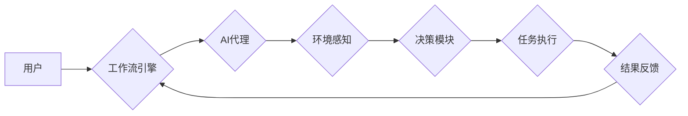

> AI代理，工作流，物流，供应链，自动化，智能决策，机器学习

## 1. 背景介绍

在当今数字化时代，物流和供应链管理面临着前所未有的挑战。随着全球化进程的加速、消费需求的多样化以及供应链网络的复杂化，传统物流和供应链管理模式已难以满足日益增长的效率和灵活性要求。

人工智能（AI）作为一种新兴技术，正在深刻地改变着物流和供应链管理的格局。AI代理作为AI技术的应用之一，凭借其强大的智能决策能力和自动化执行能力，为物流和供应链管理带来了新的机遇。

## 2. 核心概念与联系

**2.1 AI代理的概念**

AI代理是一种能够自主学习、感知环境、做出决策并执行任务的智能软件实体。它可以模拟人类的行为，并通过与环境交互来实现目标。

**2.2 工作流的概念**

工作流是一种描述业务流程的模型，它定义了任务的顺序、依赖关系和执行规则。工作流管理系统可以自动化执行工作流，提高效率和协作性。

**2.3 AI代理工作流的联系**

AI代理工作流将AI代理技术与工作流管理技术相结合，构建了一种智能化的业务流程执行系统。AI代理可以根据工作流定义，自动执行任务，并根据环境变化进行智能决策，从而提高工作流的效率、灵活性以及智能化程度。

**2.4 AI代理工作流架构**



**2.5 AI代理工作流的优势**

* **自动化执行:** AI代理可以自动执行工作流中的任务，减少人工干预，提高效率。
* **智能决策:** AI代理可以根据环境变化和数据分析，做出智能决策，优化工作流程。
* **灵活性:** AI代理工作流可以根据需求灵活调整，适应不断变化的业务环境。
* **可扩展性:** AI代理工作流可以轻松扩展，支持多个代理和工作流的并发执行。

## 3. 核心算法原理 & 具体操作步骤

**3.1 算法原理概述**

AI代理工作流的核心算法主要包括：

* **环境感知算法:** 用于收集和分析环境信息，例如库存水平、运输状况、客户需求等。
* **决策算法:** 用于根据环境信息和工作流规则，做出最佳的执行决策。
* **任务执行算法:** 用于执行决策结果，例如安排运输、更新库存等。

**3.2 算法步骤详解**

1. **环境感知:** AI代理首先通过传感器、API接口等方式收集环境信息，并将其转化为可理解的格式。
2. **状态评估:** AI代理根据收集到的环境信息，评估当前工作流的状态，例如任务完成度、资源可用性等。
3. **决策制定:** AI代理利用决策算法，根据状态评估结果和工作流规则，制定最佳的执行决策。
4. **任务执行:** AI代理根据决策结果，执行相应的任务，例如安排运输、更新库存等。
5. **结果反馈:** AI代理将任务执行结果反馈给工作流引擎，并更新环境信息。

**3.3 算法优缺点**

**优点:**

* **自动化:** 可以自动执行任务，提高效率。
* **智能化:** 可以根据环境变化做出智能决策，优化工作流程。
* **可扩展性:** 可以轻松扩展，支持多个代理和工作流的并发执行。

**缺点:**

* **算法复杂性:** AI代理工作流的算法比较复杂，需要专业的技术人员进行开发和维护。
* **数据依赖性:** AI代理的工作效率和决策质量依赖于环境信息的准确性和完整性。
* **伦理问题:** AI代理的决策可能会涉及伦理问题，需要进行充分的考虑和评估。

**3.4 算法应用领域**

AI代理工作流的应用领域非常广泛，例如：

* **物流运输:** 自动化运输路线规划、货物分拣、配送调度等。
* **供应链管理:** 库存管理、采购计划、生产调度等。
* **金融服务:** 贷款审批、风险评估、投资决策等。
* **医疗保健:** 病人诊断、药物推荐、手术计划等。

## 4. 数学模型和公式 & 详细讲解 & 举例说明

**4.1 数学模型构建**

AI代理工作流的数学模型可以基于马尔可夫决策过程（MDP）构建。MDP是一个用于描述智能体在环境中决策和行动的数学框架。

在MDP模型中，状态空间表示环境的所有可能状态，动作空间表示智能体可以执行的所有动作，奖励函数表示智能体在每个状态执行每个动作后的奖励。

**4.2 公式推导过程**

MDP模型的核心公式是Bellman方程，它描述了智能体在每个状态下选择最佳动作的价值函数。

$$
V^{\pi}(s) = \max_a \sum_{s'} P(s'|s,a) [r(s,a,s') + \gamma V^{\pi}(s')]
$$

其中：

* $V^{\pi}(s)$ 表示在状态 $s$ 下，遵循策略 $\pi$ 的价值函数。
* $a$ 表示智能体可以执行的动作。
* $s'$ 表示状态 $s$ 执行动作 $a$ 后可能到达的状态。
* $P(s'|s,a)$ 表示从状态 $s$ 执行动作 $a$ 到达状态 $s'$ 的概率。
* $r(s,a,s')$ 表示在状态 $s$ 执行动作 $a$ 后到达状态 $s'$ 的奖励。
* $\gamma$ 表示折扣因子，控制未来奖励的权重。

**4.3 案例分析与讲解**

假设一个AI代理需要在仓库中完成货物分拣的任务。仓库的状态可以表示为货物的位置和数量，动作可以表示为移动货物到指定位置。

通过收集环境信息，AI代理可以构建MDP模型，并利用Bellman方程计算每个状态下最佳的行动策略。

## 5. 项目实践：代码实例和详细解释说明

**5.1 开发环境搭建**

* Python 3.x
* TensorFlow 或 PyTorch
* ROS (Robot Operating System)

**5.2 源代码详细实现**

```python
# 环境感知模块
def perceive_environment():
    # 使用传感器获取环境信息，例如货物位置、数量等
    # ...

# 决策模块
def make_decision(state):
    # 使用决策算法，例如Q学习，根据状态选择最佳动作
    # ...

# 任务执行模块
def execute_task(action):
    # 根据动作执行相应的任务，例如移动货物
    # ...

# 主程序
if __name__ == "__main__":
    while True:
        state = perceive_environment()
        action = make_decision(state)
        execute_task(action)
```

**5.3 代码解读与分析**

* 环境感知模块负责收集环境信息，例如货物位置、数量等。
* 决策模块负责根据环境信息和工作流规则，做出最佳的执行决策。
* 任务执行模块负责执行决策结果，例如移动货物。
* 主程序循环执行环境感知、决策和任务执行的过程。

**5.4 运行结果展示**

AI代理可以根据代码实现，在模拟环境中完成货物分拣任务。

## 6. 实际应用场景

**6.1 物流运输**

AI代理可以用于优化运输路线规划、货物分拣、配送调度等环节，提高物流效率和降低成本。

**6.2 供应链管理**

AI代理可以用于库存管理、采购计划、生产调度等环节，优化供应链流程，提高供应链的弹性和响应能力。

**6.3 其他应用场景**

AI代理还可以应用于金融服务、医疗保健、制造业等领域，提高效率、降低成本、优化决策。

**6.4 未来应用展望**

随着AI技术的不断发展，AI代理工作流将在更多领域得到应用，例如：

* **个性化服务:** AI代理可以根据用户的需求和偏好，提供个性化的服务。
* **协作工作:** AI代理可以与人类协作完成复杂的任务。
* **自动驾驶:** AI代理可以用于自动驾驶汽车的决策和控制。

## 7. 工具和资源推荐

**7.1 学习资源推荐**

* **书籍:**
    * 《Reinforcement Learning: An Introduction》
    * 《Artificial Intelligence: A Modern Approach》
* **在线课程:**
    * Coursera: Reinforcement Learning Specialization
    * Udacity: AI Programming with Python

**7.2 开发工具推荐**

* **Python:** 广泛用于AI开发，拥有丰富的库和框架。
* **TensorFlow:** Google开发的深度学习框架。
* **PyTorch:** Facebook开发的深度学习框架。
* **ROS:** 用于机器人开发的开源框架。

**7.3 相关论文推荐**

* **AlphaGo:** DeepMind开发的围棋AI，利用深度学习技术战胜人类世界冠军。
* **GPT-3:** OpenAI开发的文本生成模型，能够生成高质量的文本内容。

## 8. 总结：未来发展趋势与挑战

**8.1 研究成果总结**

AI代理工作流技术取得了显著的进展，在物流、供应链管理等领域取得了成功应用。

**8.2 未来发展趋势**

* **更智能的决策:** 利用更先进的机器学习算法，提高AI代理的决策智能。
* **更强的适应性:** 使AI代理能够更好地适应动态变化的环境。
* **更广泛的应用:** 将AI代理工作流应用于更多领域，例如医疗保健、金融服务等。

**8.3 面临的挑战**

* **算法复杂性:** AI代理工作流的算法比较复杂，需要更深入的研究和开发。
* **数据安全:** AI代理需要访问大量数据，需要确保数据安全和隐私保护。
* **伦理问题:** AI代理的决策可能会涉及伦理问题，需要进行充分的考虑和评估。

**8.4 研究展望**

未来，AI代理工作流技术将继续发展，并为人类社会带来更多价值。


## 9. 附录：常见问题与解答

**9.1 Q: AI代理工作流的安全性如何保证？**

**A:** AI代理工作流的安全性可以通过以下措施保证：

* 使用安全的通信协议，防止数据被窃取。
* 对数据进行加密，防止数据被篡改。
* 对AI代理进行安全认证，防止恶意攻击。

**9.2 Q: AI代理工作流的成本如何控制？**

**A:** AI代理工作流的成本可以通过以下措施控制：

* 选择合适的硬件平台，降低硬件成本。
* 使用开源软件，降低软件成本。
* 优化算法，提高效率，降低运行成本。

**9.3 Q: AI代理工作流的伦理问题如何解决？**

**A:** AI代理工作流的伦理问题可以通过以下措施解决：

* 制定明确的伦理准则，指导AI代理的开发和应用。
* 建立伦理审查机制，对AI代理的决策进行评估。
* 加强公众教育，提高公众对AI伦理的认识。


作者：禅与计算机程序设计艺术 / Zen and the Art of Computer Programming 
<end_of_turn>