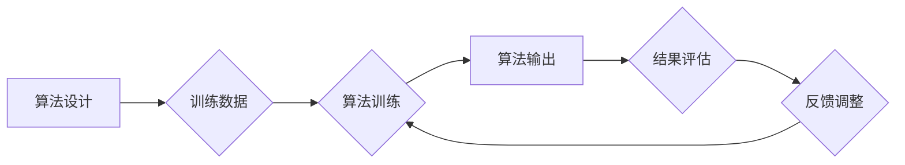

> AI伦理,算法公平性,偏见检测,公平算法,反歧视,机器学习,深度学习,代码实战

## 1. 背景介绍

人工智能（AI）技术近年来发展迅速，已广泛应用于各个领域，例如医疗、金融、教育等。然而，随着AI技术的应用越来越深入，其潜在的伦理问题也日益凸显。其中，算法公平性是AI伦理领域的一个重要议题。

算法公平性是指AI算法在处理不同群体数据时，能够提供公平、公正的结果，避免因算法设计或训练数据偏差而导致的歧视或不公平待遇。例如，在招聘领域，如果AI算法训练数据中存在性别偏见，那么该算法可能会倾向于选择男性候选人，从而导致女性在招聘过程中处于不利地位。

算法公平性问题不仅会损害个人的利益，还会加剧社会的不平等现象。因此，研究和解决算法公平性问题至关重要。

## 2. 核心概念与联系

**2.1 核心概念**

* **算法偏见:** 指算法在处理数据时，由于算法设计或训练数据偏差，而对某些群体产生不公平的对待。
* **公平性:** 指算法在处理不同群体数据时，能够提供公平、公正的结果，避免歧视或不公平待遇。
* **公平算法:** 指能够在处理不同群体数据时，提供公平、公正结果的算法。

**2.2 联系**

算法偏见是导致算法不公平性的主要原因。当算法训练数据存在偏见时，算法会学习并放大这些偏见，从而导致算法输出结果不公平。

**2.3 流程图**



## 3. 核心算法原理 & 具体操作步骤

**3.1 算法原理概述**

公平算法的设计目标是尽可能地消除算法中的偏见，并确保算法在处理不同群体数据时能够提供公平、公正的结果。

**3.2 算法步骤详解**

1. **数据收集和预处理:** 收集来自不同群体的真实数据，并进行清洗、转换和标准化处理，以确保数据质量和一致性。
2. **偏见检测:** 使用偏见检测算法识别训练数据中的潜在偏见，例如性别、种族、年龄等方面的偏见。
3. **偏见校正:** 使用偏见校正算法减轻或消除训练数据中的偏见，例如重新加权数据、使用对抗训练等方法。
4. **公平性评估:** 使用公平性评估指标评估算法在处理不同群体数据时的公平性，例如均等机会、不确定性等指标。
5. **算法优化:** 根据公平性评估结果，对算法进行优化，以提高算法的公平性。

**3.3 算法优缺点**

**优点:**

* 可以有效地减少算法中的偏见，提高算法的公平性。
* 可以帮助构建更加公正和包容的社会。

**缺点:**

* 算法设计和实现较为复杂，需要专业的技术人员进行开发和维护。
* 偏见检测和校正算法本身也可能存在局限性，无法完全消除算法中的偏见。

**3.4 算法应用领域**

* **招聘:** 避免算法在招聘过程中对某些群体产生歧视。
* **贷款:** 确保贷款审批过程公平公正，避免对某些群体进行歧视性贷款。
* **刑事司法:** 避免算法在判刑过程中对某些群体产生偏见。
* **医疗保健:** 确保医疗资源分配公平，避免对某些群体进行歧视性医疗服务。

## 4. 数学模型和公式 & 详细讲解 & 举例说明

**4.1 数学模型构建**

假设我们有一个分类算法，用于预测某个个体是否属于某个特定群体。我们可以使用以下数学模型来表示算法的预测结果：

$$
y = f(x)
$$

其中：

* $y$ 是算法的预测结果，取值为0或1，分别表示个体不属于或属于特定群体。
* $x$ 是个体的特征向量，包含个体相关的属性信息。
* $f$ 是算法的决策函数，用于根据个体的特征向量预测其所属群体。

**4.2 公式推导过程**

为了评估算法的公平性，我们可以使用以下公式计算算法对不同群体的预测准确率：

$$
Accuracy_i = \frac{TP_i + TN_i}{TP_i + TN_i + FP_i + FN_i}
$$

其中：

* $Accuracy_i$ 是算法对第 $i$ 个群体的预测准确率。
* $TP_i$ 是第 $i$ 个群体中被正确预测为正例的个体数量。
* $TN_i$ 是第 $i$ 个群体中被正确预测为负例的个体数量。
* $FP_i$ 是第 $i$ 个群体中被错误预测为正例的个体数量。
* $FN_i$ 是第 $i$ 个群体中被错误预测为负例的个体数量。

**4.3 案例分析与讲解**

假设我们有一个用于预测信用卡欺诈的算法，该算法训练数据中存在性别偏见，导致该算法对女性申请信用卡的欺诈风险预测偏高。

我们可以使用上述公式计算该算法对男性和女性申请信用卡的预测准确率，并发现女性申请信用卡的预测准确率明显低于男性申请信用卡的预测准确率。

这表明该算法存在性别偏见，需要进行偏见校正。

## 5. 项目实践：代码实例和详细解释说明

**5.1 开发环境搭建**

* Python 3.7+
* TensorFlow 2.0+
* scikit-learn 0.23+
* Jupyter Notebook

**5.2 源代码详细实现**

```python
import pandas as pd
from sklearn.model_selection import train_test_split
from sklearn.linear_model import LogisticRegression
from sklearn.metrics import accuracy_score

# 加载数据
data = pd.read_csv('creditcard.csv')

# 划分训练集和测试集
X_train, X_test, y_train, y_test = train_test_split(data.drop('Class', axis=1), data['Class'], test_size=0.2, random_state=42)

# 训练模型
model = LogisticRegression()
model.fit(X_train, y_train)

# 预测结果
y_pred = model.predict(X_test)

# 计算准确率
accuracy = accuracy_score(y_test, y_pred)
print(f'准确率: {accuracy}')

# 计算不同群体的准确率
# ...
```

**5.3 代码解读与分析**

* 该代码示例使用LogisticRegression模型进行信用卡欺诈预测。
* 数据集包含信用卡交易信息，以及是否为欺诈交易的标签。
* 代码首先将数据划分成训练集和测试集，然后训练LogisticRegression模型。
* 最后，使用测试集评估模型的准确率。

**5.4 运行结果展示**

运行结果将显示模型的准确率，以及不同群体的准确率。

## 6. 实际应用场景

**6.1 医疗保健**

* 预测患者的疾病风险，并提供个性化的医疗建议。
* 辅助医生进行诊断，提高诊断准确率。
* 优化医疗资源分配，提高医疗服务效率。

**6.2 金融服务**

* 评估客户的信用风险，为贷款审批提供参考。
* 识别欺诈交易，保护客户资产安全。
* 提供个性化的金融产品和服务。

**6.3 教育**

* 预测学生的学习成绩，为教学提供个性化指导。
* 识别学生学习困难，及时提供帮助。
* 优化教育资源分配，提高教育质量。

**6.4 未来应用展望**

随着AI技术的不断发展，算法公平性将成为AI应用领域越来越重要的议题。未来，我们将看到更多针对算法公平性的研究和应用，例如：

* 更先进的偏见检测和校正算法。
* 更注重公平性的AI算法设计原则。
* 更完善的算法公平性评估指标和标准。

## 7. 工具和资源推荐

**7.1 学习资源推荐**

* **书籍:**
    * "Fairness and Machine Learning" by  Sarah M. Bender, Timnit Gebru, Angelina McMillan-Major, and Margaret Mitchell
    * "Weapons of Math Destruction: How Big Data Increases Inequality and Threatens Democracy" by Cathy O'Neil
* **在线课程:**
    * Coursera: "Algorithms for Fairness"
    * edX: "Fairness in Machine Learning"

**7.2 开发工具推荐**

* **AIF360:** 一个开源工具包，用于评估和缓解机器学习模型中的公平性问题。
* **Fairlearn:** 一个Python库，用于公平性分析和校正。

**7.3 相关论文推荐**

* "On the Dangers of Stochastic Parrots: Can Language Models Be Too Big?" by Emily M. Bender, Timnit Gebru, Angelina McMillan-Major, and Margaret Mitchell
* "Algorithmic Fairness" by Solon Barocas and Andrew Selbst

## 8. 总结：未来发展趋势与挑战

**8.1 研究成果总结**

近年来，算法公平性研究取得了显著进展，涌现出许多新的算法和方法，能够有效地减少算法中的偏见。

**8.2 未来发展趋势**

未来，算法公平性研究将朝着以下几个方向发展：

* **更深入的理论研究:** 探索算法公平性的本质，建立更完善的理论框架。
* **更有效的算法设计:** 开发更先进的算法，能够更好地解决算法公平性问题。
* **更广泛的应用场景:** 将算法公平性应用到更多领域，例如医疗、金融、教育等。

**8.3 面临的挑战**

算法公平性研究仍然面临着许多挑战，例如：

* **数据偏差:** 训练数据中可能存在各种类型的偏差，难以完全消除。
* **定义公平性:** 对公平性的定义存在争议，不同领域对公平性的要求也不同。
* **可解释性:** 许多算法模型难以解释，难以理解算法是如何产生结果的。

**8.4 研究展望**

尽管面临着挑战，但算法公平性研究仍然是一个非常重要的课题。随着技术的进步和社会对公平性的重视程度不断提高，相信算法公平性研究将在未来取得更大的突破。

## 9. 附录：常见问题与解答

**9.1 如何检测算法中的偏见？**

可以使用偏见检测算法，例如：

* **差分隐私:** 保护敏感信息，同时进行数据分析。
* **对抗训练:** 通过对抗样本训练模型，提高模型对偏见的不敏感性。

**9.2 如何校正算法中的偏见？**

可以使用偏见校正算法，例如：

* **重新加权数据:** 给予少数群体数据更高的权重，减少其被忽略的可能性。
* **使用公平约束:** 在模型训练过程中加入公平性约束，例如确保不同群体之间的预测结果差异在可接受范围内。

**9.3 如何评估算法的公平性？**

可以使用公平性评估指标，例如：

* **均等机会:** 不同群体在算法预测结果上的机会是否平等。
* **不确定性:** 不同群体在算法预测结果上的不确定性是否平等。


作者：禅与计算机程序设计艺术 / Zen and the Art of Computer Programming 
<end_of_turn>