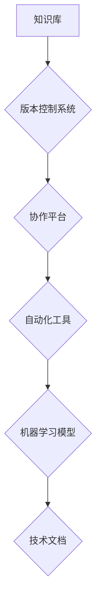

> AI创业公司,技术文档,知识管理,版本控制,协作平台,自动化,机器学习,文档生成

## 1. 背景介绍

在当今科技飞速发展的时代，人工智能（AI）创业公司如雨后春笋般涌现。这些公司致力于利用AI技术解决各种现实问题，并创造出具有颠覆性的创新产品和服务。然而，在快速迭代和不断创新的过程中，技术文档管理成为了AI创业公司面临的一项重要挑战。

传统的技术文档管理方式往往依赖于静态文档和人工维护，难以适应AI创业公司快速发展的节奏和需求。随着AI技术的不断发展，技术文档的复杂性和规模也在不断增长，传统的管理方式已经显得力不从心。

## 2. 核心概念与联系

技术文档管理的核心概念包括：

* **知识管理:**  AI创业公司需要建立一个完善的知识管理体系，以便将技术文档、代码、设计规范等知识资源进行有效地组织、存储和共享。
* **版本控制:**  技术文档需要进行版本控制，以便追踪文档的修改历史，并确保不同团队成员使用的是最新版本。
* **协作平台:**  AI创业公司需要提供一个协作平台，以便团队成员能够共同编辑、 review 和审批技术文档。
* **自动化:**  技术文档管理流程应尽可能自动化，例如自动生成文档、自动更新文档、自动发布文档等。
* **机器学习:**  机器学习可以应用于技术文档管理，例如自动分类文档、自动提取关键信息、自动生成文档摘要等。

**技术文档管理架构**



## 3. 核心算法原理 & 具体操作步骤

### 3.1  算法原理概述

技术文档管理的核心算法原理包括：

* **文本分析算法:** 用于分析技术文档中的文本内容，提取关键信息、识别主题、进行情感分析等。
* **机器学习算法:** 用于构建机器学习模型，例如用于自动分类文档、自动生成文档摘要等。
* **版本控制算法:** 用于管理技术文档的版本历史，确保不同团队成员使用的是最新版本。

### 3.2  算法步骤详解

**文本分析算法步骤:**

1. **预处理:** 对文本进行清洗、分词、词性标注等预处理操作。
2. **特征提取:** 从预处理后的文本中提取特征，例如词频、词向量、语法结构等。
3. **模型训练:** 使用机器学习算法对特征进行训练，构建文本分析模型。
4. **预测:** 将新的文本输入到训练好的模型中，进行预测分析。

**机器学习算法步骤:**

1. **数据收集:** 收集相关的技术文档数据，并进行清洗和预处理。
2. **数据标注:** 对数据进行标注，例如分类、摘要等。
3. **模型选择:** 选择合适的机器学习算法，例如支持向量机、深度学习等。
4. **模型训练:** 使用标注数据对模型进行训练。
5. **模型评估:** 使用测试数据对模型进行评估，并进行调参优化。

**版本控制算法步骤:**

1. **版本记录:** 记录每次对技术文档的修改操作，包括修改时间、修改内容、修改者等信息。
2. **版本分支:** 创建不同的版本分支，以便团队成员可以独立开发和测试。
3. **版本合并:** 将不同的版本分支合并到主分支，并进行冲突解决。
4. **版本发布:** 发布新的版本技术文档。

### 3.3  算法优缺点

**文本分析算法:**

* **优点:** 可以自动提取关键信息、识别主题、进行情感分析等，提高效率。
* **缺点:** 算法效果依赖于训练数据质量，对于复杂的技术文档可能难以准确分析。

**机器学习算法:**

* **优点:** 可以自动完成文档分类、摘要等任务，提高自动化程度。
* **缺点:** 需要大量的训练数据，训练过程复杂，模型效果需要不断优化。

**版本控制算法:**

* **优点:** 可以追踪文档修改历史，确保团队成员使用的是最新版本，避免版本冲突。
* **缺点:** 需要专业的版本控制工具，操作相对复杂。

### 3.4  算法应用领域

* **软件开发:** 自动生成代码文档、自动识别代码缺陷等。
* **医疗保健:** 自动分析病历、自动生成诊断报告等。
* **金融服务:** 自动分析财务报表、自动识别欺诈行为等。

## 4. 数学模型和公式 & 详细讲解 & 举例说明

### 4.1  数学模型构建

技术文档管理可以利用数学模型来描述文档之间的关系、文档的相似度、文档的主题分布等。例如，可以使用词袋模型来表示文档的词频分布，可以使用余弦相似度来计算文档之间的相似度。

### 4.2  公式推导过程

**词袋模型:**

假设文档 $d$ 包含 $n$ 个词，每个词的出现频率为 $f_i$，则文档 $d$ 的词袋模型表示为：

$$
\mathbf{d} = (f_1, f_2, ..., f_n)
$$

**余弦相似度:**

假设文档 $d_1$ 和 $d_2$ 的词袋模型分别为 $\mathbf{d_1}$ 和 $\mathbf{d_2}$，则文档 $d_1$ 和 $d_2$ 的余弦相似度为：

$$
\text{sim}(\mathbf{d_1}, \mathbf{d_2}) = \frac{\mathbf{d_1} \cdot \mathbf{d_2}}{||\mathbf{d_1}|| ||\mathbf{d_2}||}
$$

其中，$\cdot$ 表示点积，$||\mathbf{d}||$ 表示向量 $\mathbf{d}$ 的长度。

### 4.3  案例分析与讲解

假设有两个文档 $d_1$ 和 $d_2$，它们的词袋模型分别为：

$$
\mathbf{d_1} = (2, 3, 1, 0)
$$

$$
\mathbf{d_2} = (1, 0, 2, 3)
$$

则文档 $d_1$ 和 $d_2$ 的余弦相似度为：

$$
\text{sim}(\mathbf{d_1}, \mathbf{d_2}) = \frac{(2 \times 1) + (3 \times 0) + (1 \times 2) + (0 \times 3)}{\sqrt{2^2 + 3^2 + 1^2 + 0^2} \sqrt{1^2 + 0^2 + 2^2 + 3^2}} = \frac{4}{\sqrt{14} \sqrt{14}} = \frac{4}{14} = 0.29
$$

该结果表明，文档 $d_1$ 和 $d_2$ 的相似度较低。

## 5. 项目实践：代码实例和详细解释说明

### 5.1  开发环境搭建

* 操作系统: Ubuntu 20.04
* 编程语言: Python 3.8
* 开发工具: VS Code
* 库依赖:

```
pip install requests beautifulsoup4 numpy pandas scikit-learn
```

### 5.2  源代码详细实现

```python
import requests
from bs4 import BeautifulSoup
import numpy as np
from sklearn.feature_extraction.text import TfidfVectorizer
from sklearn.metrics.pairwise import cosine_similarity

def fetch_document(url):
    response = requests.get(url)
    response.raise_for_status()
    soup = BeautifulSoup(response.content, 'html.parser')
    text = soup.get_text(separator=' ')
    return text

def calculate_similarity(doc1, doc2):
    vectorizer = TfidfVectorizer()
    tfidf_matrix = vectorizer.fit_transform([doc1, doc2])
    similarity = cosine_similarity(tfidf_matrix[0], tfidf_matrix[1])[0][0]
    return similarity

# 获取文档内容
url1 = 'https://www.example.com/doc1'
url2 = 'https://www.example.com/doc2'
doc1 = fetch_document(url1)
doc2 = fetch_document(url2)

# 计算文档相似度
similarity = calculate_similarity(doc1, doc2)
print(f'文档相似度: {similarity}')
```

### 5.3  代码解读与分析

* `fetch_document()` 函数用于从给定的 URL 获取文档内容。
* `calculate_similarity()` 函数用于计算两个文档之间的相似度。
* 该代码使用 TF-IDF 向量化模型来表示文档，并使用余弦相似度来计算文档之间的相似度。

### 5.4  运行结果展示

运行该代码后，会输出两个文档之间的相似度值。

## 6. 实际应用场景

AI创业公司可以将技术文档管理应用于以下场景：

* **知识库建设:** 建立一个完善的知识库，存储公司技术文档、代码、设计规范等知识资源，方便团队成员查找和共享。
* **文档协作:** 提供一个协作平台，方便团队成员共同编辑、 review 和审批技术文档，提高文档质量和效率。
* **自动化文档生成:** 利用机器学习算法自动生成技术文档，例如自动生成代码文档、自动生成 API 文档等。
* **文档搜索:** 利用文本分析算法实现对技术文档的精准搜索，方便团队成员快速找到所需信息。

### 6.4  未来应用展望

未来，技术文档管理将更加智能化和自动化。例如，可以利用自然语言处理技术自动理解和分析技术文档，并根据用户需求自动生成个性化的文档摘要、文档翻译等。

## 7. 工具和资源推荐

### 7.1  学习资源推荐

* **书籍:**
    * 《The Pragmatic Programmer》
    * 《Clean Code》
    * 《Effective Java》
* **在线课程:**
    * Coursera: Machine Learning
    * Udacity: Artificial Intelligence Nanodegree
    * edX: Data Science MicroMasters Program

### 7.2  开发工具推荐

* **版本控制系统:** Git, SVN
* **协作平台:** GitHub, GitLab, Bitbucket
* **自动化工具:** Jenkins, Travis CI
* **机器学习库:** scikit-learn, TensorFlow, PyTorch

### 7.3  相关论文推荐

* **文本分析:**
    * "A Survey of Text Summarization Methods"
    * "Named Entity Recognition with Deep Learning"
* **机器学习:**
    * "Deep Learning"
    * "A Comprehensive Survey of Deep Learning"

## 8. 总结：未来发展趋势与挑战

### 8.1  研究成果总结

技术文档管理领域取得了显著的进展，例如文本分析算法、机器学习算法、版本控制算法等都取得了突破性进展。

### 8.2  未来发展趋势

未来，技术文档管理将更加智能化和自动化，例如：

* 利用自然语言处理技术自动理解和分析技术文档。
* 利用机器学习算法自动生成个性化的文档摘要、文档翻译等。
* 利用人工智能技术实现对技术文档的智能搜索和推荐。

### 8.3  面临的挑战

技术文档管理领域也面临着一些挑战，例如：

* 如何处理复杂的技术文档，例如代码、数学公式等。
* 如何保证技术文档的准确性和可靠性。
* 如何提高技术文档的易读性和可理解性。

### 8.4  研究展望

未来，我们将继续致力于技术文档管理领域的 research，探索新的算法和技术，以解决上述挑战，并为AI创业公司提供更智能、更便捷的技术文档管理解决方案。

## 9. 附录：常见问题与解答

* **Q1: 如何选择合适的版本控制系统？**

* **A1:** 选择版本控制系统需要根据公司的实际需求和规模进行选择。对于小型团队，可以使用 Git 或 SVN 等开源版本控制系统。对于大型团队，可以使用 GitLab 或 Bitbucket 等商业版本控制系统。

* **Q