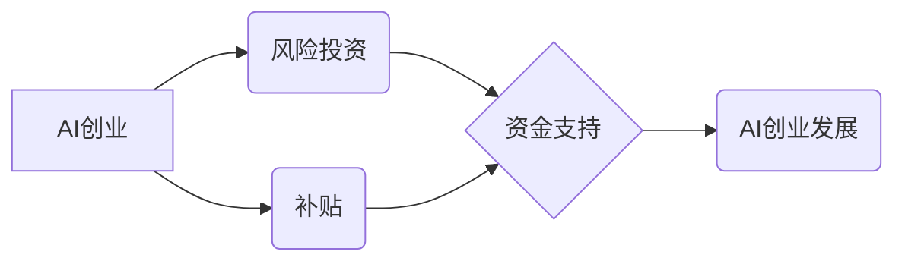

> AI创业, 风险投资, 补贴, 融资, 技术商业化,  人工智能,  创业生态

## 1. 背景介绍

人工智能（AI）技术近年来发展迅速，已渗透到各个领域，为创业者提供了广阔的机遇。AI创业是指利用人工智能技术开发新产品、新服务或新商业模式，并通过融资和商业化实现盈利。

然而，AI创业也面临着诸多挑战，其中风险投资和补贴是创业者需要了解的关键要素。本文将深入探讨AI创业的风险投资和补贴机制，帮助创业者更好地理解和应对这些挑战。

## 2. 核心概念与联系

**2.1 风险投资**

风险投资是指投资于具有高成长潜力的初创企业，并承担较高风险的投资行为。风险投资家通常会对投资的企业进行严格的筛选和评估，并提供资金、资源和指导，帮助企业快速成长。

**2.2 补贴**

补贴是指政府或其他机构为特定行业或企业提供资金支持，以促进其发展。补贴可以是直接的资金投入，也可以是税收优惠、政策扶持等形式。

**2.3 AI创业与风险投资/补贴的关系**

AI创业通常需要大量的资金投入，而风险投资和补贴可以为AI创业提供重要的资金支持。风险投资家看好AI技术的未来发展潜力，愿意为具有创新性和商业价值的AI创业项目提供资金支持。政府也通过补贴政策鼓励AI产业发展，为AI创业提供资金和政策扶持。

**2.4  核心概念关系流程图**



## 3. 核心算法原理 & 具体操作步骤

**3.1 算法原理概述**

AI创业中常用的算法包括机器学习、深度学习、自然语言处理等。这些算法可以帮助企业开发智能产品、服务和商业模式。

**3.2 算法步骤详解**

* **数据收集和预处理:** 首先需要收集大量相关数据，并进行清洗、转换和特征提取等预处理工作。
* **模型选择和训练:** 根据具体应用场景选择合适的算法模型，并利用训练数据训练模型参数。
* **模型评估和优化:** 对训练好的模型进行评估，并根据评估结果进行模型优化，提高模型性能。
* **模型部署和应用:** 将训练好的模型部署到实际应用场景中，并进行持续监控和维护。

**3.3 算法优缺点**

* **优点:** AI算法可以自动学习和发现数据中的模式，提高效率和准确性。
* **缺点:** AI算法需要大量数据进行训练，且训练过程可能耗时和耗能。

**3.4 算法应用领域**

* **智能客服:** 利用自然语言处理技术，开发智能客服系统，自动回复用户咨询。
* **个性化推荐:** 利用机器学习算法，分析用户行为数据，提供个性化产品和服务推荐。
* **图像识别:** 利用深度学习算法，识别图像中的物体和场景，应用于安防、医疗等领域。

## 4. 数学模型和公式 & 详细讲解 & 举例说明

**4.1 数学模型构建**

在AI创业中，数学模型可以用来描述算法的运作机制、预测模型性能、评估商业价值等。例如，在机器学习中，常用的数学模型包括线性回归、逻辑回归、支持向量机等。

**4.2 公式推导过程**

每个数学模型都有其对应的公式推导过程，这些公式描述了模型的输入、输出和参数之间的关系。例如，线性回归模型的公式如下：

$$y = \beta_0 + \beta_1x_1 + \beta_2x_2 + ... + \beta_nx_n + \epsilon$$

其中，$y$ 是预测值，$x_1, x_2, ..., x_n$ 是输入特征，$\beta_0, \beta_1, ..., \beta_n$ 是模型参数，$\epsilon$ 是误差项。

**4.3 案例分析与讲解**

假设我们想要预测房价，可以使用线性回归模型。我们可以收集房价和相关特征的数据，例如房屋面积、位置、楼层等，然后利用线性回归模型训练出一个预测房价的模型。

**4.4  举例说明**

假设我们训练了一个线性回归模型，预测房价的公式为：

$$y = 10000 + 500x_1 + 200x_2$$

其中，$y$ 是预测房价，$x_1$ 是房屋面积，$x_2$ 是房屋位置的编码。

如果我们有一个房屋面积为100平方米，位置编码为1的房屋，我们可以使用公式计算预测房价：

$$y = 10000 + 500 * 100 + 200 * 1 = 15200$$

因此，我们预测该房屋的房价为15200元。

## 5. 项目实践：代码实例和详细解释说明

**5.1 开发环境搭建**

AI创业项目通常需要使用Python语言和相关的机器学习库，例如TensorFlow、PyTorch等。

**5.2 源代码详细实现**

```python
import tensorflow as tf

# 定义模型
model = tf.keras.models.Sequential([
    tf.keras.layers.Dense(64, activation='relu', input_shape=(784,)),
    tf.keras.layers.Dense(10, activation='softmax')
])

# 编译模型
model.compile(optimizer='adam',
              loss='sparse_categorical_crossentropy',
              metrics=['accuracy'])

# 训练模型
model.fit(x_train, y_train, epochs=10)

# 评估模型
loss, accuracy = model.evaluate(x_test, y_test)
print('Loss:', loss)
print('Accuracy:', accuracy)
```

**5.3 代码解读与分析**

这段代码实现了简单的深度学习模型训练。首先定义了一个包含两层全连接层的模型，然后使用Adam优化器和交叉熵损失函数进行训练。最后评估模型在测试集上的性能。

**5.4 运行结果展示**

训练完成后，我们可以查看模型的损失值和准确率，评估模型的性能。

## 6. 实际应用场景

**6.1 智能客服**

AI创业可以开发智能客服系统，自动回复用户咨询，提高客户服务效率。

**6.2 个性化推荐**

AI创业可以开发个性化推荐系统，根据用户行为数据推荐产品和服务，提升用户体验。

**6.3 医疗诊断**

AI创业可以开发医疗诊断系统，辅助医生进行诊断，提高诊断准确率。

**6.4 未来应用展望**

AI技术将继续发展，为AI创业带来更多机遇。例如，在自动驾驶、机器人、虚拟现实等领域，AI创业将发挥越来越重要的作用。

## 7. 工具和资源推荐

**7.1 学习资源推荐**

* **在线课程:** Coursera、edX、Udacity等平台提供丰富的AI课程。
* **书籍:** 《深度学习》、《机器学习实战》等书籍是学习AI的基础教材。
* **开源项目:** TensorFlow、PyTorch等开源项目可以帮助开发者学习和实践AI技术。

**7.2 开发工具推荐**

* **Python:** Python是AI开发的主要编程语言。
* **TensorFlow:** TensorFlow是Google开发的开源深度学习框架。
* **PyTorch:** PyTorch是Facebook开发的开源深度学习框架。

**7.3 相关论文推荐**

* **《ImageNet Classification with Deep Convolutional Neural Networks》**
* **《Attention Is All You Need》**
* **《BERT: Pre-training of Deep Bidirectional Transformers for Language Understanding》**

## 8. 总结：未来发展趋势与挑战

**8.1 研究成果总结**

近年来，AI技术取得了长足的进步，在各个领域都有广泛的应用。AI创业也成为一个热门领域，涌现出许多创新型企业。

**8.2 未来发展趋势**

* **模型规模和复杂度提升:** 未来AI模型将更加庞大复杂，拥有更强的学习能力和推理能力。
* **边缘计算和分布式训练:** AI模型将更加注重边缘计算和分布式训练，提高计算效率和数据安全。
* **跨模态学习:** AI模型将更加擅长处理多模态数据，例如文本、图像、音频等，实现更智能的交互。

**8.3 面临的挑战**

* **数据安全和隐私保护:** AI模型训练需要大量数据，如何保证数据安全和隐私保护是一个重要挑战。
* **算法可解释性和公平性:** AI模型的决策过程往往难以解释，如何提高算法的可解释性和公平性是一个重要的研究方向。
* **伦理和社会影响:** AI技术的发展对社会和伦理带来挑战，需要加强伦理规范和社会治理。

**8.4 研究展望**

未来，AI研究将继续深入，探索更智能、更安全、更可解释的AI技术，为人类社会带来更多福祉。

## 9. 附录：常见问题与解答

**9.1 如何选择合适的AI算法？**

选择合适的AI算法需要根据具体应用场景和数据特点进行分析。例如，对于分类问题，可以考虑使用支持向量机、决策树等算法；对于回归问题，可以考虑使用线性回归、逻辑回归等算法。

**9.2 如何解决AI模型过拟合问题？**

过拟合是指AI模型在训练数据上表现很好，但在测试数据上表现较差。解决过拟合问题的方法包括：

* 增加训练数据量
* 使用正则化技术
* 使用交叉验证

**9.3 如何评估AI模型的性能？**

常用的AI模型性能评估指标包括准确率、召回率、F1-score等。选择合适的评估指标需要根据具体应用场景进行考虑。


作者：禅与计算机程序设计艺术 / Zen and the Art of Computer Programming 
<end_of_turn>