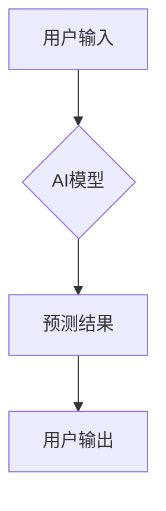

> 智能手机，人工智能，机器学习，深度学习，自然语言处理，计算机视觉，移动体验

## 1. 背景介绍

智能手机已成为人们生活中不可或缺的一部分，其功能不断扩展，应用场景日益广泛。随着人工智能（AI）技术的快速发展，AI技术开始渗透到智能手机的各个方面，为用户带来更加智能、便捷、个性化的移动体验。

智能手机的硬件性能不断提升，同时移动网络速度也越来越快，为AI算法的运行提供了充足的硬件和网络支持。此外，智能手机拥有丰富的传感器数据，例如摄像头、麦克风、加速度计等，这些数据为AI算法的训练和应用提供了宝贵的素材。

## 2. 核心概念与联系

**2.1 AI在智能手机中的应用场景**

AI技术在智能手机中的应用场景非常广泛，主要包括以下几个方面：

* **自然语言处理（NLP）：** 语音识别、语音合成、智能助手、机器翻译等。
* **计算机视觉（CV）：** 人脸识别、物体识别、场景理解、图像增强等。
* **个性化推荐：** 基于用户行为和偏好，推荐个性化的应用、内容、服务等。
* **安全保障：** 生物识别、行为识别、恶意软件检测等。
* **增强现实（AR）/虚拟现实（VR）：** 通过AI技术，增强现实和虚拟现实体验更加沉浸和交互。

**2.2 AI技术架构**

AI技术在智能手机中的应用通常采用以下架构：



* **用户输入:** 用户通过语音、文本、图像等方式输入数据。
* **AI模型:** AI模型负责对用户输入进行处理和分析，并生成预测结果。
* **预测结果:** AI模型生成的预测结果可以是文本、语音、图像等多种形式。
* **用户输出:** 用户接收并使用AI模型生成的预测结果。

## 3. 核心算法原理 & 具体操作步骤

**3.1 算法原理概述**

深度学习是AI技术的重要组成部分，在智能手机中的应用非常广泛。深度学习算法通过多层神经网络来模拟人类大脑的学习过程，能够从海量数据中学习到复杂的特征和模式。

**3.2 算法步骤详解**

深度学习算法的训练过程主要包括以下步骤：

1. **数据预处理:** 将原始数据进行清洗、转换、格式化等操作，使其适合深度学习模型的训练。
2. **模型构建:** 根据具体的应用场景，选择合适的深度学习模型架构，例如卷积神经网络（CNN）、循环神经网络（RNN）等。
3. **模型训练:** 使用训练数据对深度学习模型进行训练，调整模型参数，使其能够准确地预测目标输出。
4. **模型评估:** 使用测试数据对训练好的模型进行评估，评估模型的准确率、召回率、F1-score等指标。
5. **模型部署:** 将训练好的模型部署到智能手机上，使其能够实时处理用户输入的数据。

**3.3 算法优缺点**

**优点:**

* 能够学习到复杂的特征和模式。
* 性能优于传统机器学习算法。
* 能够处理海量数据。

**缺点:**

* 训练数据量大，训练时间长。
* 模型参数多，计算资源消耗大。
* 对数据质量要求高。

**3.4 算法应用领域**

深度学习算法在智能手机中的应用领域非常广泛，例如：

* **图像识别:** 人脸识别、物体识别、场景理解等。
* **语音识别:** 语音助手、语音输入等。
* **自然语言处理:** 机器翻译、文本摘要等。
* **个性化推荐:** 应用推荐、内容推荐等。

## 4. 数学模型和公式 & 详细讲解 & 举例说明

**4.1 数学模型构建**

深度学习模型通常采用多层神经网络结构，每个神经元都接收来自前一层神经元的输入，并对其进行加权求和和激活函数处理。

**4.2 公式推导过程**

深度学习模型的训练过程是通过反向传播算法来进行的。反向传播算法的核心思想是通过计算损失函数的梯度，来更新模型参数，使得模型的预测结果与真实值之间的误差最小化。

**损失函数:**

$$L = \frac{1}{N} \sum_{i=1}^{N} (y_i - \hat{y}_i)^2$$

其中：

* $L$ 是损失函数的值。
* $N$ 是样本数量。
* $y_i$ 是第 $i$ 个样本的真实值。
* $\hat{y}_i$ 是第 $i$ 个样本的预测值。

**梯度下降算法:**

$$\theta = \theta - \alpha \nabla L$$

其中：

* $\theta$ 是模型参数。
* $\alpha$ 是学习率。
* $\nabla L$ 是损失函数的梯度。

**4.3 案例分析与讲解**

例如，在图像识别任务中，深度学习模型可以学习到图像中不同物体特征的表示，并将其映射到相应的类别标签。训练过程中，模型会根据图像标签和预测结果的误差，更新模型参数，使得模型能够更加准确地识别图像中的物体。

## 5. 项目实践：代码实例和详细解释说明

**5.1 开发环境搭建**

* 操作系统：Android 或 iOS
* 开发工具：Android Studio 或 Xcode
* AI框架：TensorFlow Lite 或 PyTorch Mobile

**5.2 源代码详细实现**

```python
# 使用 TensorFlow Lite 训练一个图像分类模型
import tensorflow as tf

# 加载训练数据
(x_train, y_train), (x_test, y_test) = tf.keras.datasets.cifar10.load_data()

# 构建模型
model = tf.keras.models.Sequential([
    tf.keras.layers.Conv2D(32, (3, 3), activation='relu', input_shape=(32, 32, 3)),
    tf.keras.layers.MaxPooling2D((2, 2)),
    tf.keras.layers.Conv2D(64, (3, 3), activation='relu'),
    tf.keras.layers.MaxPooling2D((2, 2)),
    tf.keras.layers.Flatten(),
    tf.keras.layers.Dense(10, activation='softmax')
])

# 编译模型
model.compile(optimizer='adam',
              loss='sparse_categorical_crossentropy',
              metrics=['accuracy'])

# 训练模型
model.fit(x_train, y_train, epochs=10)

# 保存模型
converter = tf.lite.TFLiteConverter.from_keras_model(model)
tflite_model = converter.convert()

# 部署模型到智能手机
```

**5.3 代码解读与分析**

这段代码演示了如何使用 TensorFlow Lite 训练一个图像分类模型，并将其部署到智能手机。

* 首先，加载 CIFAR-10 数据集，这是一个包含 60000 张彩色图像的图像分类数据集。
* 然后，构建一个卷积神经网络模型，该模型包含卷积层、池化层和全连接层。
* 接着，编译模型，指定优化器、损失函数和评估指标。
* 接下来，训练模型，使用训练数据进行模型训练。
* 最后，将训练好的模型转换为 TensorFlow Lite 格式，并部署到智能手机上。

**5.4 运行结果展示**

部署到智能手机后，用户可以通过摄像头拍摄图像，并使用该模型进行图像分类。模型会识别出图像中的物体类别，并显示相应的标签。

## 6. 实际应用场景

**6.1 语音助手**

智能手机上的语音助手，例如 Siri、Google Assistant 和 Alexa，都利用了自然语言处理技术，能够理解用户的语音指令，并执行相应的操作。

**6.2 人脸识别**

人脸识别技术可以用于解锁智能手机、支付、身份验证等场景。

**6.3 物体识别**

物体识别技术可以用于识别图像中的物体，例如动物、植物、交通工具等。

**6.4 个性化推荐**

基于用户的行为和偏好，智能手机可以推荐个性化的应用、内容、服务等。

**6.5 安全保障**

生物识别技术，例如指纹识别、面部识别，可以用于增强智能手机的安全性。

## 7. 工具和资源推荐

**7.1 学习资源推荐**

* TensorFlow Lite: https://www.tensorflow.org/lite
* PyTorch Mobile: https://pytorch.org/mobile/
* 深度学习入门书籍: 《深度学习》

**7.2 开发工具推荐**

* Android Studio: https://developer.android.com/studio
* Xcode: https://developer.apple.com/xcode/

**7.3 相关论文推荐**

* 《ImageNet Classification with Deep Convolutional Neural Networks》
* 《Attention Is All You Need》

## 8. 总结：未来发展趋势与挑战

**8.1 研究成果总结**

AI技术在智能手机中的应用取得了显著的进展，为用户带来了更加智能、便捷、个性化的移动体验。

**8.2 未来发展趋势**

* **更强大的计算能力:** 随着芯片技术的进步，智能手机的计算能力将进一步提升，能够支持更复杂的AI算法。
* **更丰富的传感器数据:** 智能手机将配备更多传感器，例如传感器融合、环境感知等，为AI算法提供更丰富的输入数据。
* **更个性化的体验:** AI技术将更加深入地了解用户的需求和偏好，提供更加个性化的移动体验。

**8.3 面临的挑战**

* **数据隐私和安全:** AI算法的训练和应用需要大量的数据，如何保护用户数据隐私和安全是一个重要的挑战。
* **算法公平性和可解释性:** AI算法的决策过程可能存在偏差，如何确保算法的公平性和可解释性是一个重要的研究方向。
* **能源效率:** AI算法的计算量大，会消耗大量的电量，如何提高AI算法的能源效率是一个重要的挑战。

**8.4 研究展望**

未来，AI技术将在智能手机领域继续发挥重要作用，为用户带来更加智能、便捷、个性化的移动体验。


## 9. 附录：常见问题与解答

**9.1 如何选择合适的AI框架？**

选择合适的AI框架取决于具体的应用场景和开发环境。TensorFlow Lite和PyTorch Mobile是两种常用的AI框架，它们都支持在智能手机上部署模型。

**9.2 如何保护用户数据隐私和安全？**

在开发AI应用时，应遵循数据隐私和安全原则，例如数据最小化、数据加密、匿名化等。

**9.3 如何评估AI模型的性能？**

可以使用准确率、召回率、F1-score等指标来评估AI模型的性能。

**9.4 如何提高AI算法的能源效率？**

可以使用模型压缩、量化等技术来提高AI算法的能源效率。


作者：禅与计算机程序设计艺术 / Zen and the Art of Computer Programming 
<end_of_turn>